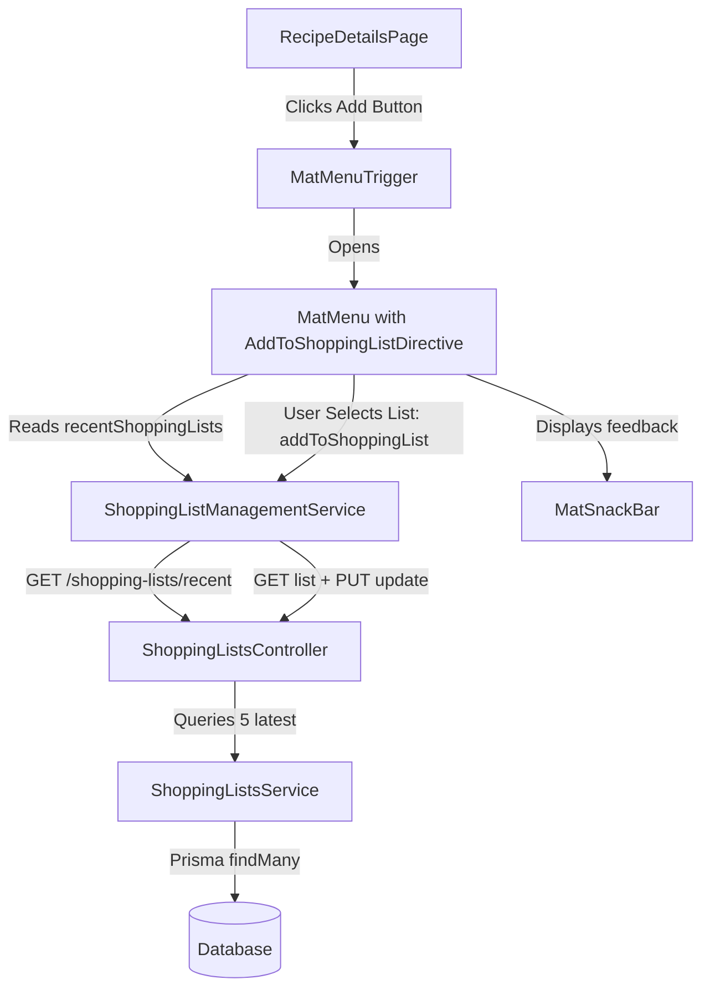

# Requirements

### Overview & Goals
Implement the ability for users to add recipe ingredients directly into their shopping lists from `RecipeDetailsPage`. When clicking the "Add to shopping list" button next to any ingredient, a menu opens showing the user's up to 5 most recent shopping lists. Selecting a shopping list adds the ingredient (with quantity 1) to that list and provides user feedback via snackbars.

### Scope
- **In Scope**:
  - **Backend API**: New endpoint `GET /shopping-lists/recent` returning up to 5 most recent non-deleted shopping lists.
  - **Frontend Service**: Add `recentShoppingLists$` reactive stream, `recentShoppingLists()` accessor, reload trigger integration in `reloadShoppingLists()`, and `addToShoppingList(id, name)` method in `ShoppingListManagementService`.
  - **Frontend Directive**: Create standalone `AddToShoppingListDirective` (selector `mat-menu[appAddToShoppingList]`) in `apps/web/src/shopping-lists/directives/add-to-shopping-list/` to populate `mat-menu` with recent shopping lists and dispatch addition actions with snackbar notifications.
  - **Recipe Details Integration**: Wire `RecipeDetailsPage` action buttons to open the shopping list menu for the clicked ingredient in both glance view and cooking stages view.
  - **Unit & Integration Tests**: Comprehensive tests for backend controller/service, frontend management service, directive, and page component.
- **Out of Scope**:
  - Custom quantity/unit selection dialog when adding ingredients (quantity is fixed at `1` as per spec).
  - Creating a new shopping list from the dropdown menu (only existing recent lists are displayed).

### User Stories
- **As a cook viewing recipe details**, I want to click "Add to shopping list" next to an ingredient and see a list of my recent shopping lists so that I can quickly add items I need to buy.
- **As a user**, I want immediate confirmation via a snackbar when an ingredient is successfully added to my shopping list so that I know my action succeeded.
- **As a user**, I want clear error feedback via a snackbar with an OK button if adding an ingredient fails so that I am aware of the issue and can retry.

### Functional Requirements
1. **Backend Endpoint**:
   - `GET /shopping-lists/recent` protected with `JwtAuthGuard`.
   - Returns array of up to 5 `ShoppingList` records where `deletedAt: null`, ordered by `createdAt: 'desc'`.
2. **ShoppingListManagementService**:
   - Maintains private `recentShoppingListsTrigger$ = new BehaviorSubject<boolean>(true)`.
   - Maintains private `recentShoppingLists$: Observable<ShoppingListItem[]>` fetching `GET /shopping-lists/recent` via `switchMap` with `catchError(() => of([]))`.
   - Exposes public `recentShoppingLists(): Observable<ShoppingListItem[]>`.
   - Updates `reloadShoppingLists()` to trigger both `filters$` and `recentShoppingListsTrigger$.next(true)`.
   - Exposes public `addToShoppingList(id: string, name: string): Observable<boolean>`:
     - Fetches current list details via `getShoppingListById(id)`.
     - Appends new item `{ name, quantity: 1, isBought: false, order: items.length }`.
     - Calls `update(id, { name, description, items: updatedItems })`.
     - Emits `true` on success and triggers `reloadShoppingLists()`.
     - Throws/re-throws error on failure.
   - All service methods declared as `readonly methodName = (...) => ...`.
3. **AddToShoppingList Directive**:
   - Standalone directive applicable to `mat-menu` elements (`mat-menu[appAddToShoppingList]`).
   - Receives target ingredient (`IngredientDetails | string | null`).
   - Populates the menu with items corresponding to `recentShoppingLists()`.
   - On menu item click, invokes `addToShoppingList(list.id, ingredientName)` and closes the menu.
   - On success: displays `MatSnackBar` with message (e.g. `'Added to shopping list'`) auto-dismissing after 5000ms.
   - On error: displays `MatSnackBar` with message (e.g. `'Failed to add to shopping list'`) and action `'OK'`, staying on screen for 5000ms or until dismissed.
4. **RecipeDetailsPage Integration**:
   - Binds `[matMenuTriggerFor]="addToShoppingListMenu"` and `(click)="onAddToShoppingList(ingredient)"` on ingredient "Add to shopping list" buttons.
   - Updates `selectedIngredient` state signal in `onAddToShoppingList(ingredient)`.

### Non-Functional Requirements
- **Performance**: Recent lists stream caches latest trigger and avoids redundant HTTP requests.
- **Maintainability**: Follows existing repository patterns (standalone Angular components, readonly arrow functions, OnPush change detection, signals).
- **Accessibility**: Menu buttons and snackbars maintain proper ARIA attributes and keyboard navigation.

# Technical Design

### Current Implementation
- `ShoppingListsController` (`apps/api/src/app/shopping-lists/shopping-lists.controller.ts`) currently supports paginated `GET /shopping-lists`, `GET /shopping-lists/:id`, `POST /shopping-lists`, `PUT /shopping-lists/:id`, and `DELETE /shopping-lists/:id`.
- `ShoppingListManagementService` (`apps/web/src/shopping-lists/services/shopping-list-management/shopping-list-management.service.ts`) manages `filters$` and `shoppingLists$`, but has no stream for recent lists and no `addToShoppingList` method.
- `RecipeDetailsPage` (`apps/web/src/recipes/pages/recipe-details/recipe-details.page.ts`) has a placeholder `onAddToShoppingList(ingredient: IngredientDetails): void` that is currently a no-op (`void ingredient;`).

### Key Decisions
- **Route Order**: Place `@Get('recent')` above `@Get(':id')` in `ShoppingListsController` so that NestJS routing resolves `/shopping-lists/recent` correctly instead of treating `'recent'` as an `:id` parameter.
- **Reactive Pattern for Recent Lists**: Use `recentShoppingListsTrigger$ = new BehaviorSubject<boolean>(true)` piped with `switchMap` into `HttpClient.get<ShoppingListItem[]>('/shopping-lists/recent')` with `catchError(() => of([]))`. This ensures automatic initial fetch upon subscription and allows declarative reloading via `reloadShoppingLists()`.
- **Method Declaration Style**: Declare all methods as `readonly methodName = (...) => ...` on services, directives, and components to adhere to workspace TypeScript standards and test assertions.
- **Directive Architecture**: Implement `AddToShoppingListDirective` on `mat-menu` that injects `MatMenu`, `ShoppingListManagementService`, and `MatSnackBar`. When rendered or triggered, it binds recent shopping lists dynamically into menu items and handles addition with appropriate snackbar configurations.

### Data Models / Contracts
```typescript
// Backend ShoppingList entity (Prisma model)
// id, name, description, createdAt, updatedAt, deletedAt

// Frontend: ShoppingListManagementService additions
export class ShoppingListManagementService {
  private readonly recentShoppingListsTrigger$ = new BehaviorSubject<boolean>(true);
  private readonly recentShoppingLists$: Observable<ShoppingListItem[]>;

  readonly recentShoppingLists = (): Observable<ShoppingListItem[]> => this.recentShoppingLists$;
  readonly addToShoppingList = (id: string, name: string): Observable<boolean> => ...;
}
```

### Components & File Structure
- `apps/api/src/app/shopping-lists/shopping-lists.controller.ts` (modified: add `@Get('recent')`)
- `apps/api/src/app/shopping-lists/shopping-lists.service.ts` (modified: add `getRecentShoppingLists()`)
- `apps/api/src/app/shopping-lists/shopping-lists.controller.spec.ts` (modified: add tests)
- `apps/api/src/app/shopping-lists/shopping-lists.service.spec.ts` (modified: add tests)
- `apps/web/src/shopping-lists/services/shopping-list-management/shopping-list-management.service.ts` (modified: add recent lists stream and `addToShoppingList`)
- `apps/web/src/shopping-lists/services/shopping-list-management/shopping-list-management.service.spec.ts` (modified: add tests)
- `apps/web/src/shopping-lists/directives/add-to-shopping-list/add-to-shopping-list.directive.ts` (new)
- `apps/web/src/shopping-lists/directives/add-to-shopping-list/add-to-shopping-list.directive.spec.ts` (new)
- `apps/web/src/recipes/pages/recipe-details/recipe-details.page.ts` (modified: import directive & MatMenuModule, manage `selectedIngredient`)
- `apps/web/src/recipes/pages/recipe-details/recipe-details.page.html` (modified: connect menu trigger & directive)
- `apps/web/src/recipes/pages/recipe-details/recipe-details.page.spec.ts` (modified: update tests)

### Architecture Diagram


### Risks & Mitigations
- **Route collision in NestJS**: Placing `@Get('recent')` after `@Get(':id')` would cause NestJS to interpret `'recent'` as an `:id` parameter. *Mitigation*: Explicitly place `@Get('recent')` before `@Get(':id')`.
- **Empty recent lists state**: When a user has no shopping lists, the menu could be empty. *Mitigation*: Handle empty list gracefully with an empty/disabled state or empty item indicator in the menu.
- **Race conditions or stale list data**: Adding an item modifies the shopping list items. *Mitigation*: `addToShoppingList` fetches fresh list details by ID before appending and saving, ensuring existing items are preserved.

# Testing

### Validation Approach
Verify each layer of the feature with unit tests and integration tests, ensuring correct backend querying, frontend state management, directive DOM manipulation, and page interaction.

### Key Scenarios
1. **Backend Recent Lists Query**:
   - `GET /shopping-lists/recent` returns up to 5 non-deleted shopping lists ordered by `createdAt: 'desc'`.
   - Soft-deleted shopping lists (`deletedAt !== null`) are excluded.
   - If fewer than 5 lists exist, all available non-deleted lists are returned.
2. **ShoppingListManagementService Recent Stream & Trigger**:
   - `recentShoppingLists()` emits initial list of recent shopping lists upon subscription.
   - Calling `reloadShoppingLists()` triggers re-fetching of both `shoppingLists$` and `recentShoppingLists$`.
   - Network errors in `recentShoppingLists$` are safely caught and emit `[]`.
3. **ShoppingListManagementService `addToShoppingList`**:
   - Successfully loads existing list details by ID, appends the new item with `quantity: 1`, `isBought: false`, and `order: items.length`, and calls `update()`.
   - Emits `true` and triggers `reloadShoppingLists()` on successful update.
   - Throws / emits error if fetching details or updating fails.
4. **AddToShoppingListDirective Menu Rendering & Action**:
   - Populates menu with list items from `recentShoppingLists()`.
   - Clicking a menu item calls `addToShoppingList(list.id, ingredientName)` and closes the menu.
   - On success: opens snackbar with 5000ms duration and no action button.
   - On failure: opens error snackbar with 5000ms duration and `'OK'` action button.
5. **RecipeDetailsPage Interaction**:
   - Clicking "Add to shopping list" button triggers `onAddToShoppingList` with the clicked ingredient and opens the menu.
   - Works in both glance view ingredients list and stage ingredients list.

### Test Changes
- `apps/api/src/app/shopping-lists/shopping-lists.controller.spec.ts`: Unit tests for `getRecentShoppingLists`.
- `apps/api/src/app/shopping-lists/shopping-lists.service.spec.ts`: Unit tests for `getRecentShoppingLists` ordering and limits.
- `apps/web/src/shopping-lists/services/shopping-list-management/shopping-list-management.service.spec.ts`: Unit tests for `recentShoppingLists`, `reloadShoppingLists`, and `addToShoppingList`.
- `apps/web/src/shopping-lists/directives/add-to-shopping-list/add-to-shopping-list.directive.spec.ts`: New comprehensive test suite for directive.
- `apps/web/src/recipes/pages/recipe-details/recipe-details.page.spec.ts`: Updated tests for `onAddToShoppingList` and menu trigger integration.

# Delivery Steps

### ✓ Step 1: Add recent shopping lists endpoint to backend API
The backend API exposes a GET endpoint returning up to 5 most recent shopping lists.

- Add `getRecentShoppingLists()` method to `ShoppingListsService` (`apps/api/src/app/shopping-lists/shopping-lists.service.ts`) querying non-deleted shopping lists ordered by `createdAt: 'desc'` with `take: 5`.
- Add `@Get('recent')` handler to `ShoppingListsController` (`apps/api/src/app/shopping-lists/shopping-lists.controller.ts`) placed before `@Get(':id')` to prevent route collision.
- Add unit tests in `shopping-lists.controller.spec.ts` and `shopping-lists.service.spec.ts` to verify query execution and controller delegation.
- Add e2e test cases in `shopping-lists.e2e.spec.ts` validating the `/api/shopping-lists/recent` endpoint.

### ✓ Step 2: Update ShoppingListManagementService with recent lists stream and addToShoppingList method
`ShoppingListManagementService` provides reactive access to recent shopping lists and a method to append items to existing lists.

- Add private `recentShoppingListsTrigger$ = new BehaviorSubject<boolean>(true)` and `recentShoppingLists$` observable stream in `ShoppingListManagementService` (`apps/web/src/shopping-lists/services/shopping-list-management/shopping-list-management.service.ts`).
- Expose public `readonly recentShoppingLists = (): Observable<ShoppingListItem[]> => this.recentShoppingLists$`.
- Update `reloadShoppingLists()` to emit `true` into `recentShoppingListsTrigger$` alongside `filters$` update.
- Implement `readonly addToShoppingList = (id: string, name: string): Observable<boolean>` that fetches list details via `getShoppingListById(id)`, appends a new item with `quantity: 1`, `isBought: false`, and `order: items.length`, saves via `update(id, dto)`, and returns `true` (or throws on failure).
- Update unit tests in `shopping-list-management.service.spec.ts` to cover stream initialization, reload triggers, and `addToShoppingList` success/failure flows.

### ✓ Step 3: Implement AddToShoppingListDirective for MatMenu with notifications
A reusable directive populates `mat-menu` with recent shopping lists and handles item selection with snackbar feedback.

- Create `AddToShoppingListDirective` in `apps/web/src/shopping-lists/directives/add-to-shopping-list/add-to-shopping-list.directive.ts` restricted to `mat-menu[appAddToShoppingList]`.
- Inject `MatMenu`, `ShoppingListManagementService`, and `MatSnackBar`.
- Accept `ingredient` input (`IngredientDetails | string | null`) and subscribe to `recentShoppingLists()` to dynamically render menu items inside the menu container.
- On menu item click, call `ShoppingListManagementService.addToShoppingList(list.id, ingredientName)` and close the menu.
- On success, display a snackbar notification with a 5-second automatic dismiss duration.
- On failure, display an error snackbar notification that lasts 5 seconds or until dismissed via the 'OK' action button.
- Add comprehensive unit tests in `add-to-shopping-list.directive.spec.ts` validating menu rendering, click delegation, menu dismissal, and snackbar behaviors.

### ✓ Step 4: Integrate shopping list menu into RecipeDetailsPage and update tests
`RecipeDetailsPage` allows users to add recipe ingredients directly to their chosen shopping list from the UI.

- Import `MatMenuModule` and `AddToShoppingListDirective` in `RecipeDetailsPage` (`apps/web/src/recipes/pages/recipe-details/recipe-details.page.ts`).
- Maintain `selectedIngredient` state signal and update `onAddToShoppingList(ingredient: IngredientDetails)` to set the current ingredient.
- Add `<mat-menu #addToShoppingListMenu="matMenu" [appAddToShoppingList]="selectedIngredient()"></mat-menu>` in `recipe-details.page.html`.
- Attach `[matMenuTriggerFor]="addToShoppingListMenu"` and `(click)="onAddToShoppingList(ingredient)"` to the ingredient action buttons in both glance mode and stage sections.
- Update unit tests in `recipe-details.page.spec.ts` to verify menu trigger integration, handler invocation, and ingredient selection.