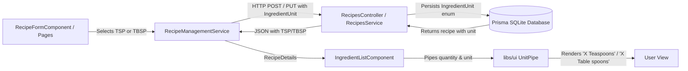

# Requirements

### Overview & Goals
Expand the supported ingredient measurement units in Top Nosh recipes by adding teaspoons (`TSP`) and table spoons (`TBSP`) across the API backend and Angular web frontend.

### Scope
#### In Scope
- **Database Schema**: Add `TSP` and `TBSP` to the `IngredientUnit` enum in `prisma/schema.prisma` and regenerate the Prisma Client.
- **Backend API (`apps/api`)**: Ensure `CreateRecipeDto`, `UpdateRecipeDto`, and `RecipesService` accept, persist, and return the new `TSP` and `TBSP` units.
- **Frontend Web Models (`apps/web`)**: Update `IngredientUnit` type in `apps/web/src/recipes/models/create-recipe.types.ts` to include `'TSP'` and `'TBSP'`.
- **Recipe Management Service**: Ensure `RecipeManagementService` sends and retrieves `TSP` and `TBSP` correctly without dropping or misinterpreting units.
- **Recipe Form & Pages**: Update `unitOptions` in `RecipeFormComponent` and `CreateRecipePage` with `TSP` displayed as `Teaspoons` and `TBSP` displayed as `Table spoons`.
- **Unit Display Formatting (`libs/ui`)**: Update `UnitPipe` to format `TSP` as `Teaspoons` (e.g. `2 Teaspoons`) and `TBSP` as `Table spoons` (e.g. `1 Table spoons`).

#### Out of Scope
- Unit conversion / unit transformation logic between metric and imperial.
- Fractional quantity representations (handled by existing quantity inputs).

### User Stories
- **As a home cook creating or editing a recipe**, I want to select "Teaspoons" or "Table spoons" from the unit dropdown for an ingredient so that my recipe reflects accurate volumetric measurements for spices, seasonings, and liquids.
- **As a cook viewing a recipe**, I want ingredient amounts to clearly display "Teaspoons" or "Table spoons" so that I can easily follow cooking instructions.

### Functional Requirements
1. **Prisma Schema & API Validation**:
   - `IngredientUnit` enum supports `GRAMS`, `ITEM_COUNT`, `TSP`, and `TBSP`.
   - API endpoints `POST /recipes` and `PUT /recipes/:id` validate and accept ingredients with `unit: 'TSP'` and `unit: 'TBSP'`.
2. **Web Recipe Form Dropdowns**:
   - `RecipeFormComponent` unit select includes:
     - `Grams (g)` (`GRAMS`)
     - `Item count (pcs)` (`ITEM_COUNT`)
     - `Teaspoons` (`TSP`)
     - `Table spoons` (`TBSP`)
3. **Recipe Display & Formatting**:
   - In recipe details (glance mode, cooking mode, ingredient list), ingredients with `TSP` render with unit `Teaspoons` (e.g., `2 Teaspoons salt`).
   - Ingredients with `TBSP` render with unit `Table spoons` (e.g., `1 Table spoons olive oil`).
4. **Data Persistence**:
   - `RecipeManagementService` seamlessly passes `TSP` and `TBSP` when creating and updating recipes, and deserializes them on recipe retrieval.

### Non-Functional Requirements
- **Consistency**: Maintain existing Angular signal and standalone component patterns.
- **Backwards Compatibility**: Existing recipes with `GRAMS` and `ITEM_COUNT` continue functioning without changes.

# Technical Design

### Current Implementation
- `prisma/schema.prisma` defines:
  ```prisma
  enum IngredientUnit {
    GRAMS
    ITEM_COUNT
  }
  ```
- Backend DTOs (`apps/api/src/app/recipes/dto/create-recipe.dto.ts` and `update-recipe.dto.ts`) use `@IsEnum(IngredientUnit)` from `@prisma/client`.
- Frontend types (`apps/web/src/recipes/models/create-recipe.types.ts`):
  `export type IngredientUnit = 'GRAMS' | 'ITEM_COUNT';`
- `RecipeFormComponent` and `CreateRecipePage` define:
  ```typescript
  readonly unitOptions: { value: IngredientUnit; label: string; }[] = [
    { value: 'GRAMS', label: 'Grams (g)' },
    { value: 'ITEM_COUNT', label: 'Item count (pcs)' }
  ];
  ```
- `UnitPipe` (`libs/ui/src/content/pipes/unit/unit.pipe.ts`) currently only handles `GRAMS` and `ITEM_COUNT`.

### Key Decisions
1. **Enum Extension in Prisma**:
   - *Decision*: Add `TSP` and `TBSP` directly to `enum IngredientUnit` in `prisma/schema.prisma`.
   - *Rationale*: Keeps type safety intact across Prisma Client and NestJS class-validator DTOs.
2. **Display Format for Teaspoons and Table spoons**:
   - *Decision*: In `UnitPipe`, return `' Teaspoons'` for `TSP` and `' Table spoons'` for `TBSP` with leading whitespace, producing `${quantity} Teaspoons` and `${quantity} Table spoons`.
   - *Rationale*: Matches the exact display specification while aligning with `UnitPipe`'s concatenation format (`${quantity}${this.getUnitName(quantity, unit)}`).
3. **Dropdown Label Formatting**:
   - *Decision*: Set `label: 'Teaspoons'` for `value: 'TSP'` and `label: 'Table spoons'` for `value: 'TBSP'` in `unitOptions`.
   - *Rationale*: Exactly matches the web app requirements.

### Architecture Diagram


### Data Models / Contracts
```typescript
// prisma/schema.prisma
enum IngredientUnit {
  GRAMS
  ITEM_COUNT
  TSP
  TBSP
}

// apps/web/src/recipes/models/create-recipe.types.ts
export type IngredientUnit = 'GRAMS' | 'ITEM_COUNT' | 'TSP' | 'TBSP';

// unit options constant in RecipeFormComponent
readonly unitOptions: { value: IngredientUnit; label: string; }[] = [
  { value: 'GRAMS', label: 'Grams (g)' },
  { value: 'ITEM_COUNT', label: 'Item count (pcs)' },
  { value: 'TSP', label: 'Teaspoons' },
  { value: 'TBSP', label: 'Table spoons' }
];
```

### Affected Files
- `prisma/schema.prisma`
- `apps/api/src/app/recipes/dto/create-recipe.dto.ts`
- `apps/api/src/app/recipes/dto/update-recipe.dto.ts`
- `apps/web/src/recipes/models/create-recipe.types.ts`
- `apps/web/src/recipes/components/recipe-form/recipe-form.component.ts`
- `apps/web/src/recipes/pages/create-recipe/create-recipe.page.ts`
- `libs/ui/src/content/pipes/unit/unit.pipe.ts`
- `apps/api/src/app/recipes/recipes.service.spec.ts`
- `apps/web/src/recipes/services/recipe-management/recipe-management.service.spec.ts`
- `apps/web/src/recipes/components/recipe-form/recipe-form.component.spec.ts`
- `apps/web/src/recipes/pages/create-recipe/create-recipe.page.spec.ts`
- `apps/web/src/recipes/pages/edit-recipe/edit-recipe.page.spec.ts`

# Testing

### Validation Approach
Verify that `TSP` and `TBSP` work across all layers: database enum validation, API request/response validation, frontend form dropdown selection and submission, and UI pipe formatting.

### Key Scenarios
1. **Recipe Creation with New Units**:
   - Create a recipe with ingredients using `TSP` and `TBSP`.
   - Verify request payload sent by `RecipeManagementService` contains `unit: 'TSP'` and `unit: 'TBSP'`.
   - Verify backend creates recipe in database without validation errors.
2. **Recipe Editing with New Units**:
   - Load recipe containing `TSP` and `TBSP` ingredients into edit form.
   - Verify form controls populate correctly with `TSP` and `TBSP`.
   - Update ingredient units to/from `TSP` and `TBSP` and save.
3. **Unit Display Formatting via UnitPipe**:
   - Quantity `2`, unit `'TSP'` -> renders `2 Teaspoons`.
   - Quantity `1`, unit `'TBSP'` -> renders `1 Table spoons`.
   - Existing units (`GRAMS` -> `200g`, `ITEM_COUNT` -> `1 item` / `2 items`) continue formatting as expected.

### Edge Cases
- Unknown unit string passed to `UnitPipe` falls back to the original unit string.
- DTO validation rejects invalid unit strings (e.g., `'KILOGRAMS'`, `'OUNCES'`).

### Test Changes
- **Backend API Tests**:
  - `apps/api/src/app/recipes/recipes.service.spec.ts`: Add test cases for creating and updating recipes with `IngredientUnit.TSP` and `IngredientUnit.TBSP`.
- **Frontend Unit Tests**:
  - `apps/web/src/recipes/components/recipe-form/recipe-form.component.spec.ts`: Test adding and editing ingredients with `TSP` and `TBSP`.
  - `apps/web/src/recipes/pages/create-recipe/create-recipe.page.spec.ts`: Test form creation and submission with new units.
  - `apps/web/src/recipes/pages/edit-recipe/edit-recipe.page.spec.ts`: Test updating recipes with new units.
  - `apps/web/src/recipes/services/recipe-management/recipe-management.service.spec.ts`: Test service payloads with `TSP` and `TBSP`.
  - `libs/ui/src/content/pipes/unit/unit.pipe.spec.ts`: Add comprehensive test suite covering `GRAMS`, `ITEM_COUNT`, `TSP`, and `TBSP`.

# Delivery Steps

### ✓ Step 1: Update backend database schema and API DTOs for new ingredient units
The API and Prisma database layer support TSP and TBSP ingredient units with validation.

- Update `enum IngredientUnit` in `prisma/schema.prisma` to include `TSP` and `TBSP`.
- Run Prisma Client generation (`npx prisma generate`) and database schema sync.
- Verify backend DTOs (`apps/api/src/app/recipes/dto/create-recipe.dto.ts` and `apps/api/src/app/recipes/dto/update-recipe.dto.ts`) accept `TSP` and `TBSP`.
- Update backend unit tests in `apps/api/src/app/recipes/recipes.service.spec.ts` with test cases covering `TSP` and `TBSP`.

### ✓ Step 2: Update web application models, unit options, and display formatting
The frontend models, dropdown options, and unit pipes support displaying and editing Teaspoons and Table spoons.

- Update `IngredientUnit` type in `apps/web/src/recipes/models/create-recipe.types.ts` to include `'TSP'` and `'TBSP'`.
- Update `unitOptions` in `RecipeFormComponent` (`apps/web/src/recipes/components/recipe-form/recipe-form.component.ts`) and `CreateRecipePage` (`apps/web/src/recipes/pages/create-recipe/create-recipe.page.ts`) to include labels `'Teaspoons'` for `TSP` and `'Table spoons'` for `TBSP`.
- Update `UnitPipe` in `libs/ui/src/content/pipes/unit/unit.pipe.ts` to handle `'TSP'` (returning `' Teaspoons'`) and `'TBSP'` (returning `' Table spoons'`).
- Verify `RecipeManagementService` in `apps/web/src/recipes/services/recipe-management/recipe-management.service.ts` preserves and transmits `TSP` and `TBSP` values on recipe create, update, and fetch operations.

### ✓ Step 3: Update automated tests and verify end-to-end unit handling
All automated unit and component test suites across API, UI, and web apps verify the new units end-to-end.

- Update unit tests in `apps/web/src/recipes/components/recipe-form/recipe-form.component.spec.ts`, `apps/web/src/recipes/pages/create-recipe/create-recipe.page.spec.ts`, and `apps/web/src/recipes/pages/edit-recipe/edit-recipe.page.spec.ts` with `TSP` and `TBSP` ingredients.
- Update tests in `apps/web/src/recipes/services/recipe-management/recipe-management.service.spec.ts` verifying API payloads containing new units.
- Add unit tests for `UnitPipe` verifying formatting for `TSP`, `TBSP`, `GRAMS`, and `ITEM_COUNT`.
- Execute test suites (`nx test api`, `nx test web`, `nx test ui`) to ensure no regressions.