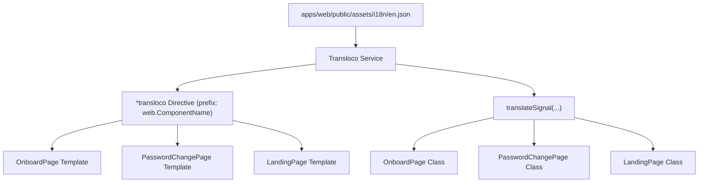

# Requirements

### Overview & Goals
Migrate hardcoded user-facing strings to internationalized translations using `@jsverse/transloco` across `auth` and `dashboard` pages in the `web` application. This is Part 1 of the localization effort, focusing on `OnboardPage`, `PasswordChangePage`, and `LandingPage`, matching the existing pattern established in `LoginPage`.

### Scope
- **In Scope**:
  - Update English translation dictionary `apps/web/public/assets/i18n/en.json` with new component keys under `web`.
  - Update `OnboardPage` (`apps/web/src/auth/pages/onboard/onboard.page.*`) to use `TranslocoDirective` and `translateSignal`.
  - Update `PasswordChangePage` (`apps/web/src/auth/pages/password-change/password-change.page.*`) to use `TranslocoDirective` and `translateSignal`.
  - Update `LandingPage` (`apps/web/src/dashboard/pages/landing/landing.page.*`) to use `TranslocoDirective` and `translateSignal`.
  - Update corresponding unit tests (`*.spec.ts`) where applicable.
- **Out of Scope**:
  - Adding or modifying non-English translations (e.g. `ru.json`).
  - Modifying pages or components outside `OnboardPage`, `PasswordChangePage`, and `LandingPage`.

### Functional Requirements
- **Template Localization**:
  - Wrap template content with `<ng-container *transloco="let t; prefix: 'web.<ComponentName>'">`.
  - Replace all hardcoded labels, titles, subtitles, placeholders, validation error messages, button labels, image alt attributes, and accessibility `aria-label` attributes with `t(...)` calls.
- **TypeScript Localization**:
  - Use `translateSignal` from `@jsverse/transloco` for messages defined in component code (e.g., snackbar success/failure messages, fallback strings in computed signals).
  - Use `ui.System.ok` for standard snackbar action labels.
- **Translation Keys Structure**:
  - Maintain hierarchical JSON structure under `"web"` in `en.json`:
    - `web.OnboardPage`
    - `web.PasswordChangePage`
    - `web.LandingPage`

# Technical Design

### Current Implementation
- `LoginPage` in `apps/web/src/auth/pages/login/` serves as the reference implementation:
  - In `login.page.ts`: imports `translateSignal` and `TranslocoDirective`, defines signals (`okMessage = translateSignal('ui.System.ok')`, `loginFailedMessage = translateSignal('web.LoginPage.loginFailed')`), and adds `TranslocoDirective` to the component `imports` array.
  - In `login.page.html`: wraps elements in `<ng-container *transloco="let t; prefix: 'web.LoginPage'">` and accesses keys via `t('key')`.
- Target components (`OnboardPage`, `PasswordChangePage`, `LandingPage`) currently contain hardcoded English strings in their templates and TypeScript files (e.g., snackbar error/success messages, button labels, `aria-label`s, and computed fallbacks).

### Key Decisions
- **Translation prefix hierarchy**: Use `web.<ComponentName>` prefix for each page in accordance with project standards.
- **Dynamic strings in TS**: Use `translateSignal` for signals and reactive bindings inside `.ts` classes.
- **Shared system keys**: Re-use existing `ui.System.ok` translation for snackbar actions across all forms.

### Data Models / Contracts (Translation Keys in `en.json`)

```json
{
  "ui": { ... },
  "web": {
    "LoginPage": { ... },
    "OnboardPage": {
      "title": "Welcome to Top Nosh!",
      "description": "Let's create your account.",
      "fullName": "Full Name",
      "fullNamePlaceholder": "Full Name",
      "fullNameRequired": "Full name is required",
      "email": "Email",
      "emailPlaceholder": "name@example.com",
      "emailRequired": "Email is required",
      "emailInvalid": "Please enter a valid email address",
      "password": "Password",
      "passwordPlaceholder": "Password",
      "passwordRequired": "Password is required",
      "passwordMinLength": "Password must be at least 12 characters long",
      "submit": "CREATE ACCOUNT",
      "loading": "Processing...",
      "success": "User onboarded successfully",
      "failure": "Onboarding failed. Please try again."
    },
    "PasswordChangePage": {
      "title": "Change Password",
      "description": "You have to change your password now, sorry.",
      "password": "New Password",
      "passwordPlaceholder": "New Password",
      "passwordRequired": "Password is required",
      "passwordMinLength": "Password must be at least 12 characters long",
      "confirmPassword": "Confirm Password",
      "confirmPasswordPlaceholder": "Confirm Password",
      "confirmPasswordRequired": "Confirm password is required",
      "passwordMismatch": "Passwords do not match",
      "submit": "CHANGE PASSWORD",
      "loading": "Saving...",
      "failure": "Password change failed. Please try again."
    },
    "LandingPage": {
      "title": "Welcome to Top Nosh!",
      "subtitle": "Your personal culinary assistant for recipes and shopping lists.",
      "recentRecipes": "Recent Recipes",
      "recentRecipesAlt": "Recent Recipes",
      "loadingRecipes": "Loading recent recipes",
      "loadError": "Failed to load dashboard data. Please try again later.",
      "noRecipes": "No recipes added yet",
      "viewRecipes": "VIEW RECIPES",
      "createRecipe": "CREATE RECIPE",
      "shoppingListsAlt": "Shopping Lists",
      "loadingShoppingList": "Loading shopping list items",
      "noShoppingListItems": "No shopping list items yet",
      "viewShoppingList": "VIEW SHOPPING LIST",
      "createShoppingList": "CREATE SHOPPING LIST",
      "defaultShoppingListTitle": "Shopping List"
    }
  }
}
```

### Components Affected
- `apps/web/public/assets/i18n/en.json`: Add keys under `web.OnboardPage`, `web.PasswordChangePage`, `web.LandingPage`.
- `apps/web/src/auth/pages/onboard/onboard.page.ts` & `onboard.page.html`
- `apps/web/src/auth/pages/password-change/password-change.page.ts` & `password-change.page.html`
- `apps/web/src/dashboard/pages/landing/landing.page.ts` & `landing.page.html`

### Architecture Diagram



# Testing

### Validation Approach
- Verify build compilation with `npx nx build web` to ensure all template bindings and imports are valid.
- Verify code styling and lint rules with `npm run lint`.
- Verify unit tests with `npx nx test web` for the affected pages (`onboard.page.spec.ts`, `password-change.page.spec.ts`, `landing.page.spec.ts`).

### Key Scenarios
- **OnboardPage**:
  - Template correctly resolves title, subtitle, field labels, placeholders, validation error messages, and button text when idle and loading.
  - Snackbar shows translated success message on successful registration and translated fallback error message on failure.
- **PasswordChangePage**:
  - Template resolves title, subtitle, password fields, validation errors (`required`, `minlength`, `passwordMismatch`), and submit button states.
  - Snackbar shows translated fallback error message on password change failure.
- **LandingPage**:
  - Header and subtitle render translated strings.
  - Recent recipes and shopping lists cards render translated card titles, alt texts, aria-labels for spinners, empty states, error states, and action buttons.
  - Computed `shoppingListTitle` falls back to translated default title when no named list is present.

# Delivery Steps

### ✓ Step 1: Migrate OnboardPage to Transloco translations
`en.json` contains all translation keys for `OnboardPage`, and `OnboardPage` uses Transloco directive and signals for all UI texts and snackbar messages.

- Update `apps/web/public/assets/i18n/en.json` to add the `web.OnboardPage` section containing keys for header texts (`title`, `description`), form field labels, placeholders, validation error messages, button labels (`submit`, `loading`), and snackbar notifications (`success`, `failure`).
- Update `apps/web/src/auth/pages/onboard/onboard.page.ts` to import `translateSignal` and `TranslocoDirective` from `@jsverse/transloco`, add `TranslocoDirective` to the component's `imports` list, and define `translateSignal` properties for snackbar action (`ui.System.ok`) and messages (`success`, `failure`).
- Update `apps/web/src/auth/pages/onboard/onboard.page.html` to wrap contents with `<ng-container *transloco="let t; prefix: 'web.OnboardPage'">` and replace all hardcoded text, placeholders, validation errors, and button labels with `t(...)`.
- Update `apps/web/src/auth/pages/onboard/onboard.page.spec.ts` if needed to ensure tests pass with the new translation signals and directive.

### ✓ Step 2: Migrate PasswordChangePage to Transloco translations
`en.json` contains all translation keys for `PasswordChangePage`, and `PasswordChangePage` uses Transloco directive and signals for all UI texts and error messages.

- Update `apps/web/public/assets/i18n/en.json` to add the `web.PasswordChangePage` section containing keys for card title and description, form field labels, placeholders, validation errors (`passwordRequired`, `passwordMinLength`, `confirmPasswordRequired`, `passwordMismatch`), button labels (`submit`, `loading`), and failure notification (`failure`).
- Update `apps/web/src/auth/pages/password-change/password-change.page.ts` to import `translateSignal` and `TranslocoDirective` from `@jsverse/transloco`, include `TranslocoDirective` in component `imports`, and replace hardcoded snackbar strings with `translateSignal('ui.System.ok')` and `translateSignal('web.PasswordChangePage.failure')`.
- Update `apps/web/src/auth/pages/password-change/password-change.page.html` to wrap template content with `<ng-container *transloco="let t; prefix: 'web.PasswordChangePage'">` and bind all text, placeholders, and error messages to `t(...)`.
- Update `apps/web/src/auth/pages/password-change/password-change.page.spec.ts` if needed to maintain test coverage.

### ✓ Step 3: Migrate LandingPage to Transloco translations
`en.json` contains all translation keys for `LandingPage`, and `LandingPage` uses Transloco directive and signals for all card headers, labels, accessibility attributes, and dynamic titles.

- Update `apps/web/public/assets/i18n/en.json` to add the `web.LandingPage` section with keys for welcome header (`title`, `subtitle`), card titles, image alt attributes, spinner `aria-label` attributes, empty state messages, error message (`loadError`), navigation and creation action buttons, and fallback shopping list title (`defaultShoppingListTitle`).
- Update `apps/web/src/dashboard/pages/landing/landing.page.ts` to import `translateSignal` and `TranslocoDirective` from `@jsverse/transloco`, add `TranslocoDirective` to `imports`, and replace the fallback string in `shoppingListTitle` computed signal with `translateSignal('web.LandingPage.defaultShoppingListTitle')`.
- Update `apps/web/src/dashboard/pages/landing/landing.page.html` to wrap the markup with `<ng-container *transloco="let t; prefix: 'web.LandingPage'">` and replace all static headers, alt texts, aria-labels, state messages, and action button labels with `t(...)`.
- Update `apps/web/src/dashboard/pages/landing/landing.page.spec.ts` if needed to verify all dashboard states.