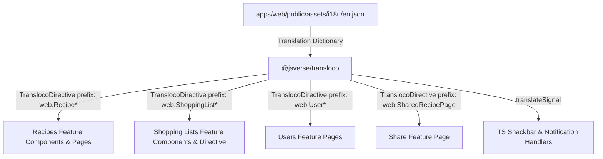

# Requirements

### Overview & Goals
Migrate hardcoded English strings across the `share`, `recipes`, `shopping-lists`, and `users` features in the `web` application to use the `@jsverse/transloco` internationalization framework. This builds upon Part 1 to expand translation coverage to all remaining core feature pages, forms, lists, and interactive UI components.

### Scope
#### In Scope
- Update `apps/web/public/assets/i18n/en.json` with keys under the `web` namespace for 18 specific components, pages, and directives.
- Refactor templates to wrap contents with `<ng-container *transloco="let t; prefix: 'web.<PageOrComponentName>'">` and replace hardcoded texts, labels, placeholders, aria-labels, and validation messages with `t('key')`.
- Import `TranslocoDirective` in the standalone component/directive imports array.
- Refactor TypeScript files containing UI messages (snackbars, notifications, dynamic titles) to use `translateSignal` from `@jsverse/transloco`.
- Target 18 specific items:
  1. `SharedRecipePage`
  2. `CookingModeComponent`
  3. `CookingStagesComponent`
  4. `GlanceComponent`
  5. `GlanceStagesComponent`
  6. `IngredientListComponent`
  7. `RecipeFormComponent`
  8. `CreateRecipePage`
  9. `EditRecipePage`
  10. `RecipeDetailsPage`
  11. `RecipeListPage`
  12. `AddToShoppingListDirective`
  13. `AddToShoppingListContentComponent`
  14. `ShoppingListPage`
  15. `ShoppingListDetailsPage`
  16. `CreateUserPage`
  17. `EditUserPage`
  18. `UserListPage`

#### Out of Scope
- Adding or modifying translations for languages other than English (`en.json`).
- Updating components or pages outside the specified 18 items (e.g. backend API, UI library components already migrated).
- Refactoring business logic or changing UI component styling/structure beyond the translation integration.

### User Stories
- **As a user**, I want all UI text across recipe management, shopping lists, user settings, and shared recipes to be served through the translation system so that future localization into other languages is seamless and complete.
- **As a developer**, I want consistent key naming conventions (`web.<ComponentName>.<key>`) and standard Transloco patterns (`*transloco` directive with prefix, `translateSignal` in TS) across all Angular components.

### Functional Requirements
- **Template Translations**: All static text, headings, button labels, input placeholders, aria labels, and form error messages must be bound using `t('key')` from the Transloco scoped prefix.
- **TypeScript Translations**: Any notification or alert displayed via `MatSnackBar` or dynamic string in TypeScript must use `translateSignal('web.<ComponentName>.<key>')` to resolve strings reactively.
- **Transloco Directive Imports**: Every standalone component whose template uses `*transloco` must import `TranslocoDirective`.
- **Translation File Structure**: All new keys must reside under `web.<ComponentName>` in `apps/web/public/assets/i18n/en.json`.
- **Interpolation / Formatting**: For dynamic messages requiring parameters (e.g., counts or names), Transloco parameters or structured keys must be maintained properly.

### Non-Functional Requirements
- **Maintainability**: Consistent camelCase key names matching the pattern established in `LoginPage` and `OnboardPage`.
- **Zero Visual Regression**: Rendered text on screen must match the original English copy exactly.
- **Build & Test Compatibility**: Angular compilation and test suites must pass without errors.

# Technical Design

### Current Implementation
The application uses Angular 22 standalone components with `@jsverse/transloco` (version 8.4.0).
Part 1 established the pattern in `apps/web/src/auth/pages/login/`:
- In templates: `<ng-container *transloco="let t; prefix: 'web.LoginPage'">` with `TranslocoDirective` in component `imports`.
- In TypeScript: `private readonly loginFailedMessage = translateSignal('web.LoginPage.loginFailed');` with `translateSignal` from `@jsverse/transloco`.
- In `apps/web/public/assets/i18n/en.json`: nested keys organized under `"web"` -> `"<PageOrComponentName>"` -> `"<key>"`.

### Key Decisions
- **Decision 1: Scoped Prefix per Component**: Use `prefix: 'web.<ComponentName>'` for each component to match the established convention and keep translation keys modular.
- **Decision 2: Signal-based TS Translations**: Use `translateSignal` from `@jsverse/transloco` in TypeScript files for reactive message resolution (e.g., snackbar alerts and feedback).
- **Decision 3: Grouping by Feature Domain**: Organize execution by feature domain (`recipes`, `shopping-lists`, `share` & `users`) to ensure cohesive changes and straightforward validation.

### Proposed Changes
#### 1. Translation Catalog (`apps/web/public/assets/i18n/en.json`)
Add structured translation entries for all 18 items:
- `SharedRecipePage`: title, header, ingredients, instructions, loading, error, notFound
- `CookingModeComponent`: steps, previous, next, exit, complete
- `CookingStagesComponent`: title, ingredients, instructions, timer
- `GlanceComponent`: glanceTitle, prepTime, cookTime, servings, difficulty
- `GlanceStagesComponent`: stageTitle, duration
- `IngredientListComponent`: title, quantity, unit, ingredient, noIngredients
- `RecipeFormComponent`: title, description, prepTime, cookTime, servings, difficulty, ingredientsSection, instructionsSection, submit, cancel, validation errors
- `CreateRecipePage`: pageTitle, pageDescription, successMessage, errorMessage
- `EditRecipePage`: pageTitle, pageDescription, successMessage, errorMessage, deleteConfirm
- `RecipeDetailsPage`: edit, delete, cook, share, print, back, errorLoading
- `RecipeListPage`: pageTitle, pageDescription, createRecipe, searchPlaceholder, emptyState, columns
- `AddToShoppingListDirective`: addedSuccess, addFailed
- `AddToShoppingListContentComponent`: createNewList, selectList
- `ShoppingListPage`: pageTitle, pageDescription, createList, emptyState, columns
- `ShoppingListDetailsPage`: pageTitleCreate, pageTitleEdit, listDetails, name, description, items, removeBought, completed, emptyActiveItems, loading, error, saving
- `CreateUserPage`: pageTitle, pageDescription, fullName, email, password, confirmPassword, submit, creating, success, error, validation errors
- `EditUserPage`: pageTitleEdit, pageTitleView, pageDescriptionEdit, pageDescriptionView, noticeOnlySelf, fullName, email, password, confirmPassword, submit, updating, success, error
- `UserListPage`: pageTitle, pageDescription, createUser, columns, emptyState, editUser

#### 2. Component Refactoring Pattern
```typescript
import { TranslocoDirective, translateSignal } from '@jsverse/transloco';

@Component({
  // ...
  imports: [
    // ...
    TranslocoDirective
  ],
  template: `
    <ng-container *transloco="let t; prefix: 'web.ComponentName'">
      <!-- component template with {{ t('key') }} -->
    </ng-container>
  `
})
export class ComponentName {
  private readonly successMsg = translateSignal('web.ComponentName.success');
  // ...
}
```

### Architecture Diagram


### File Structure & Changes
- `apps/web/public/assets/i18n/en.json` (modified: add new translation entries)
- `apps/web/src/share/pages/shared-recipe/shared-recipe.page.html` & `.ts` (modified)
- `apps/web/src/recipes/components/cooking-mode/cooking-mode.component.html` & `.ts` (modified)
- `apps/web/src/recipes/components/cooking-stages/cooking-stages.component.html` & `.ts` (modified)
- `apps/web/src/recipes/components/glance/glance.component.html` & `.ts` (modified)
- `apps/web/src/recipes/components/glance-stages/glance-stages.component.html` & `.ts` (modified)
- `apps/web/src/recipes/components/ingredient-list/ingredient-list.component.html` & `.ts` (modified)
- `apps/web/src/recipes/components/recipe-form/recipe-form.component.html` & `.ts` (modified)
- `apps/web/src/recipes/pages/create-recipe/create-recipe.page.html` & `.ts` (modified)
- `apps/web/src/recipes/pages/edit-recipe/edit-recipe.page.html` & `.ts` (modified)
- `apps/web/src/recipes/pages/recipe-details/recipe-details.page.html` & `.ts` (modified)
- `apps/web/src/recipes/pages/recipe-list/recipe-list.page.html` & `.ts` (modified)
- `apps/web/src/shopping-lists/directives/add-to-shopping-list/add-to-shopping-list.directive.ts` (modified)
- `apps/web/src/shopping-lists/pages/shopping-list/shopping-list.page.html` & `.ts` (modified)
- `apps/web/src/shopping-lists/pages/shopping-list-details/shopping-list-details.page.html` & `.ts` (modified)
- `apps/web/src/users/pages/create-user/create-user.page.html` & `.ts` (modified)
- `apps/web/src/users/pages/edit-user/edit-user.page.html` & `.ts` (modified)
- `apps/web/src/users/pages/user-list/user-list.page.html` & `.ts` (modified)

# Testing

### Validation Approach
Verify that all 18 components, pages, and directives compile cleanly, lint without errors, and display the expected English text identically to the original hardcoded strings.

### Key Scenarios
- **Recipe Flow**:
  - `RecipeListPage`: verify table headers, empty state message, and create recipe action.
  - `CreateRecipePage` & `EditRecipePage`: verify form field labels, placeholder texts, validation error messages, and save/cancel buttons.
  - `RecipeDetailsPage`: verify action buttons (edit, delete, cook, share, print) and recipe sections.
  - `CookingModeComponent`, `CookingStagesComponent`, `GlanceComponent`, `GlanceStagesComponent`, `IngredientListComponent`: verify sub-component headings, buttons, and metadata labels.
- **Shopping List Flow**:
  - `ShoppingListPage`: verify headers, create button, empty list state.
  - `ShoppingListDetailsPage`: verify list details inputs, active items, completed items headers, drag handle aria-labels, remove bought items button, and error states.
  - `AddToShoppingListDirective` & `AddToShoppingListContentComponent`: verify dropdown button text "Create new Shopping List" and snackbar alerts for success/failure.
- **User Management Flow**:
  - `UserListPage`: verify table column headers, empty state, and action buttons.
  - `CreateUserPage` & `EditUserPage`: verify field labels, password mismatch / minimum length validation messages, submit button states, notice messages, and snackbar notifications.
- **Share Recipe Flow**:
  - `SharedRecipePage`: verify shared view titles, ingredient/instruction section headers, and loading/error states.

### Edge Cases
- Dynamic snackbar notifications in TS triggering with correct translated strings via `translateSignal`.
- Form validation error messages dynamically showing when controls are touched or invalid.
- Singular/plural or conditional labels (e.g. "Edit User" vs "View User", "Edit Shopping List" vs "Create Shopping List").
- Clean JSON syntax in `en.json` without missing commas or duplicate keys.

### Test Changes
- Run `npm run lint` / `nx run-many --all --target=lint` to ensure all TypeScript and HTML files adhere to lint rules.
- Run `npm run test` to verify existing unit tests continue to pass with Transloco imports.

# Delivery Steps

### ✓ Step 1: Add English translation keys to en.json
Add all required translation keys and English strings to `apps/web/public/assets/i18n/en.json` under the `web` namespace for each of the 18 target components, pages, and directives.

- Add translation sections for `SharedRecipePage`.
- Add translation sections for recipes feature: `CookingModeComponent`, `CookingStagesComponent`, `GlanceComponent`, `GlanceStagesComponent`, `IngredientListComponent`, `RecipeFormComponent`, `CreateRecipePage`, `EditRecipePage`, `RecipeDetailsPage`, and `RecipeListPage`.
- Add translation sections for shopping lists feature: `AddToShoppingListDirective`, `AddToShoppingListContentComponent`, `ShoppingListPage`, and `ShoppingListDetailsPage`.
- Add translation sections for users feature: `CreateUserPage`, `EditUserPage`, and `UserListPage`.

### ✓ Step 2: Migrate recipe components and pages to Transloco
Update all recipe components and pages to consume translations via `TranslocoDirective` in templates and `translateSignal` in TypeScript classes.

- In `apps/web/src/recipes/components/cooking-mode/`: add `TranslocoDirective` import, wrap template with `prefix: 'web.CookingModeComponent'`, and replace static texts and labels.
- In `apps/web/src/recipes/components/cooking-stages/`: add `TranslocoDirective` import, wrap template with `prefix: 'web.CookingStagesComponent'`, and replace headers and button labels.
- In `apps/web/src/recipes/components/glance/` and `glance-stages/`: update templates with prefixes `web.GlanceComponent` and `web.GlanceStagesComponent`.
- In `apps/web/src/recipes/components/ingredient-list/`: update template with prefix `web.IngredientListComponent` for headers and button labels.
- In `apps/web/src/recipes/components/recipe-form/`: update template with prefix `web.RecipeFormComponent` for labels, placeholders, errors, and button texts.
- In `apps/web/src/recipes/pages/create-recipe/`, `edit-recipe/`, `recipe-details/`, and `recipe-list/`: add `TranslocoDirective`, wrap templates with respective component prefixes (`web.CreateRecipePage`, `web.EditRecipePage`, `web.RecipeDetailsPage`, `web.RecipeListPage`), and use `translateSignal` for snackbars and dynamic messages in TS code.

### ✓ Step 3: Migrate shopping list components and directives to Transloco
Migrate shopping list directives, components, and pages to use Transloco translations.

- In `apps/web/src/shopping-lists/directives/add-to-shopping-list/add-to-shopping-list.directive.ts`:
  - Wrap `AddToShoppingListContentComponent` template with `prefix: 'web.AddToShoppingListContentComponent'` and import `TranslocoDirective`.
  - Update `AddToShoppingListDirective` to use `translateSignal` with `web.AddToShoppingListDirective` keys for snackbar notifications.
- In `apps/web/src/shopping-lists/pages/shopping-list/`: wrap template with `prefix: 'web.ShoppingListPage'`, import `TranslocoDirective`, and translate table headers, empty states, and action labels.
- In `apps/web/src/shopping-lists/pages/shopping-list-details/`: wrap template with `prefix: 'web.ShoppingListDetailsPage'`, import `TranslocoDirective`, and translate form labels, drag-and-drop aria labels, buttons, headers, and status messages.

### ✓ Step 4: Migrate shared recipe and user management pages to Transloco
Migrate shared recipe and user management pages to use Transloco translations.

- In `apps/web/src/share/pages/shared-recipe/`: wrap template with `prefix: 'web.SharedRecipePage'`, import `TranslocoDirective`, and translate title, ingredients header, instructions header, and loading/error states.
- In `apps/web/src/users/pages/create-user/`: wrap template with `prefix: 'web.CreateUserPage'`, import `TranslocoDirective`, translate form inputs and validation errors, and use `translateSignal` for snackbar notifications in TS.
- In `apps/web/src/users/pages/edit-user/`: wrap template with `prefix: 'web.EditUserPage'`, import `TranslocoDirective`, translate form inputs, permission notices, and validation messages, and use `translateSignal` for snackbar messages.
- In `apps/web/src/users/pages/user-list/`: wrap template with `prefix: 'web.UserListPage'`, import `TranslocoDirective`, and translate table columns, empty state, and action labels.