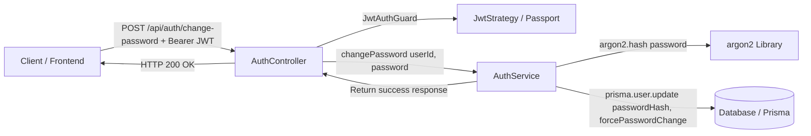

# Requirements

### Overview & Goals
The goal is to implement a secure, authenticated `POST /api/auth/change-password` endpoint within the `api` NestJS application. This endpoint allows an authenticated user to change their password, hashes the new password using `argon2`, updates the user record in the database via Prisma ORM, and clears the `forcePasswordChange` flag.

### Scope
#### In Scope
- **Request DTO & Validation**: Create `ChangePasswordDto` enforcing required string format and length constraints.
- **Service Logic**: Implement `changePassword` in `AuthService` to hash passwords using `argon2.hash` and update the database via `PrismaService`.
- **Protected Endpoint**: Expose `POST /api/auth/change-password` in `AuthController` guarded with `JwtAuthGuard` and returning HTTP 200 on success.
- **Error Handling**: Return appropriate HTTP error status codes (401 Unauthorized for unauthenticated requests, 400 Bad Request for validation errors, 404/500 for missing user or internal failure).
- **Unit & Integration Tests**: Comprehensive tests in `auth.controller.spec.ts`, `auth.service.spec.ts`, and `auth.e2e.spec.ts`.

#### Out of Scope
- Frontend UI components or route redirection (handled separately in `web` application).
- Email notifications upon password change.
- Password reset / forgot password workflows via email tokens.

### User Stories
- **As an authenticated user**, I want to submit a new password to `/api/auth/change-password` so that my password is securely updated in the system.
- **As an authenticated user required to change password**, I want my `forcePasswordChange` requirement to be satisfied once I update my password so that I can proceed to normal application usage.
- **As an unauthenticated actor**, I want unauthorized access attempts to `/api/auth/change-password` to be blocked with HTTP 401 Unauthorized.

### Functional Requirements
- **Endpoint Route**: `POST /api/auth/change-password`.
- **Authentication**: Accessible only to authenticated users presenting a valid Bearer JWT token (`JwtAuthGuard`).
- **Request Body**:
  ```json
  {
    "password": "NewSecurePassword123!"
  }
  ```
- **Validation**:
  - `password`: Required, string, minimum length of 12 characters.
  - Reject invalid payload with HTTP 400 Bad Request.
- **Password Hashing**:
  - Must hash the incoming plain text password with `argon2.hash()`.
- **Database Persistence**:
  - Locate user by `userId` extracted from the validated JWT payload (`req.user.userId`).
  - Update `passwordHash` with the new Argon2 hash.
  - Set `forcePasswordChange` to `false`.
- **Responses**:
  - **HTTP 200 OK**: `{ "message": "Password changed successfully" }` on success.
  - **HTTP 401 Unauthorized**: Missing, expired, or invalid JWT token.
  - **HTTP 400 Bad Request**: Invalid request body.
  - **HTTP 404 Not Found**: User not found in database.

### Non-Functional Requirements
- **Security**: Passwords must never be logged or stored in plain text. Argon2 hashing must be used.
- **Consistency**: Follow existing NestJS patterns established in `apps/api/src/app/auth/`.

# Technical Design

### Current Implementation
- `apps/api/src/app/auth/auth.controller.ts`: Defines `AuthController` with prefix `'auth'`, mounted under global prefix `'api'` (`/api/auth`).
- `apps/api/src/app/auth/auth.service.ts`: Handles user authentication and password verification using `argon2.verify` and Prisma.
- `apps/api/src/app/auth/guards/jwt-auth.guard.ts`: Provides `JwtAuthGuard` extending NestJS Passport `AuthGuard('jwt')`.
- `apps/api/src/app/auth/strategies/jwt.strategy.ts`: Validates JWT payload and attaches `{ userId: payload.sub, email: payload.email }` to `req.user`.
- `prisma/schema.prisma`: Contains `User` model with `id`, `fullName`, `email`, `passwordHash`, `forcePasswordChange`, `createdAt`, `updatedAt`.

### Key Decisions
- **Request Payload**: Accept `{ password: string }` via `ChangePasswordDto`. The user identity is securely obtained from the validated JWT token (`req.user.userId`), preventing users from changing other users' passwords.
- **Flag Reset**: Update `forcePasswordChange` to `false` when password is changed successfully.
- **Hashing**: Use `argon2.hash(password)` matching the existing `argon2` dependency used in `AuthService` and seed scripts.
- **Response Format**: Return `{ message: string }` (or `{ message: string; success: boolean }`) with HTTP 200 status code.

### Proposed Changes

#### 1. DTO Definition (`apps/api/src/app/auth/dto/change-password.dto.ts` or `dto/login.dto.ts`)
Create `ChangePasswordDto`:
```typescript
import { IsNotEmpty, IsString, MinLength } from 'class-validator';

export class ChangePasswordDto {
  @IsString()
  @IsNotEmpty()
  @MinLength(12)
  password!: string;
}

export interface ChangePasswordResponse {
  message: string;
}
```

#### 2. Auth Service (`apps/api/src/app/auth/auth.service.ts`)
Add `changePassword` method:
```typescript
async changePassword(userId: string, newPassword: string): Promise<ChangePasswordResponse> {
  const user = await this.prisma.user.findUnique({
    where: { id: userId }
  });

  if (!user) {
    throw new NotFoundException('User not found');
  }

  const passwordHash = await argon2.hash(newPassword);

  await this.prisma.user.update({
    where: { id: userId },
    data: {
      passwordHash,
      forcePasswordChange: false
    }
  });

  return { message: 'Password changed successfully' };
}
```

#### 3. Auth Controller (`apps/api/src/app/auth/auth.controller.ts`)
Add endpoint route:
```typescript
@UseGuards(JwtAuthGuard)
@Post('change-password')
@HttpCode(HttpStatus.OK)
async changePassword(
  @Req() req: { user: { userId: string; email: string } },
  @Body() changePasswordDto: ChangePasswordDto
): Promise<ChangePasswordResponse> {
  return this.authService.changePassword(req.user.userId, changePasswordDto.password);
}
```

### Data Models / Contracts
```typescript
// Request Body
interface ChangePasswordRequest {
  password: string; // minLength: 12
}

// Success Response (HTTP 200)
interface ChangePasswordResponse {
  message: string;
}
```

### Components
- `AuthController`: Handles HTTP routing, input validation binding, and guard protection for `/api/auth/change-password`.
- `AuthService`: Encapsulates user lookup, Argon2 password hashing, and database updates.
- `JwtAuthGuard`: Enforces Bearer JWT token presence and validity.
- `PrismaService`: Manages SQLite database operations for user entities.

### File Structure
```
apps/api/src/app/auth/
├── auth.controller.ts          # [Modified] Add change-password endpoint
├── auth.controller.spec.ts     # [Modified] Add controller unit tests
├── auth.service.ts             # [Modified] Add changePassword method
├── auth.service.spec.ts        # [Modified] Add service unit tests
├── auth.e2e.spec.ts            # [Modified] Add E2E tests for change-password
└── dto/
    ├── login.dto.ts            # [Existing] Login DTOs
    └── change-password.dto.ts  # [New] Change password DTO & response type
```

### Architecture Diagram


### Risks
- **Weak Password Inputs**: Mitigated by `class-validator` decorators (`@MinLength(12)`, `@IsString()`, `@IsNotEmpty()`).
- **Unauthorized Password Modification**: Mitigated by obtaining `userId` strictly from verified JWT token context rather than accepting arbitrary user identifiers in request body.

# Testing

### Validation Approach
Automated validation using Jest for unit tests and Supertest for NestJS integration (E2E) tests.

### Key Scenarios
1. **Successful Password Change**:
   - Authenticated user with valid JWT sends new valid password.
   - Response is HTTP 200 with `{ message: 'Password changed successfully' }`.
   - User can subsequently log in with the new password.
   - User cannot log in with the old password.
   - `forcePasswordChange` flag is reset to `false`.
2. **Unauthorized Access**:
   - Request to `POST /api/auth/change-password` without Authorization header returns HTTP 401 Unauthorized.
   - Request with invalid or expired JWT Bearer token returns HTTP 401 Unauthorized.
3. **Invalid Request Body**:
   - Missing `password` field returns HTTP 400 Bad Request.
   - `password` shorter than minimum length (e.g., < 12 characters) returns HTTP 400 Bad Request.
   - Non-string `password` returns HTTP 400 Bad Request.

### Edge Cases
- Non-existent user associated with valid JWT token (e.g. deleted user) returns HTTP 404 Not Found.
- Prisma database update failure triggers an appropriate error response.

### Test Changes
- `apps/api/src/app/auth/auth.service.spec.ts`: Unit tests verifying `changePassword` logic, password hashing, database update parameters, and error throwing.
- `apps/api/src/app/auth/auth.controller.spec.ts`: Unit tests verifying controller invocation of `authService.changePassword`.
- `apps/api/src/app/auth/auth.e2e.spec.ts`: End-to-end integration tests verifying HTTP endpoints, guards, validation pipes, and login verification with new credentials.

# Delivery Steps

### ✓ Step 1: Implement ChangePasswordDto and password change logic in AuthService
The DTO validates request payloads and `AuthService` hashes the new password with argon2 and updates the database.

- Create `ChangePasswordDto` in `apps/api/src/app/auth/dto/change-password.dto.ts` with `@IsString()`, `@IsNotEmpty()`, and `@MinLength(12)` decorators along with `ChangePasswordResponse` interface.
- Implement `changePassword(userId: string, newPassword: string)` method in `AuthService` (`apps/api/src/app/auth/auth.service.ts`).
- Query user by ID with `PrismaService` and throw `NotFoundException` if not found.
- Hash the new password with `argon2.hash()`.
- Update the user record via `prisma.user.update` with the new `passwordHash` and reset `forcePasswordChange: false`.
- Return a success response payload.

### ✓ Step 2: Expose protected POST /api/auth/change-password endpoint in AuthController
The `AuthController` exposes an authenticated `POST /api/auth/change-password` route.

- Import `JwtAuthGuard` and `ChangePasswordDto` into `AuthController` (`apps/api/src/app/auth/auth.controller.ts`).
- Add `@Post('change-password')` route handler decorated with `@UseGuards(JwtAuthGuard)` and `@HttpCode(HttpStatus.OK)`.
- Extract authenticated user (`req.user.userId`) from the request and pass it alongside `changePasswordDto.password` to `AuthService.changePassword()`.

### ✓ Step 3: Add unit and integration tests for change password endpoint
Unit and E2E integration test suites verify authorization, validation, password hashing, and database persistence.

- Update `apps/api/src/app/auth/auth.service.spec.ts` with unit tests for `changePassword` (success case, non-existent user handling, argon2 hashing verification, and database update).
- Update `apps/api/src/app/auth/auth.controller.spec.ts` with unit tests ensuring request delegation from controller to `AuthService`.
- Update `apps/api/src/app/auth/auth.e2e.spec.ts` with integration tests covering:
  - Successful password change with valid Bearer JWT token and logging in with the new password.
  - Rejection with HTTP 401 Unauthorized when Bearer token is missing or invalid.
  - Rejection with HTTP 400 Bad Request when request body is invalid (missing password or fails validation).
- Execute `npx nx test api` to verify all test suites pass.