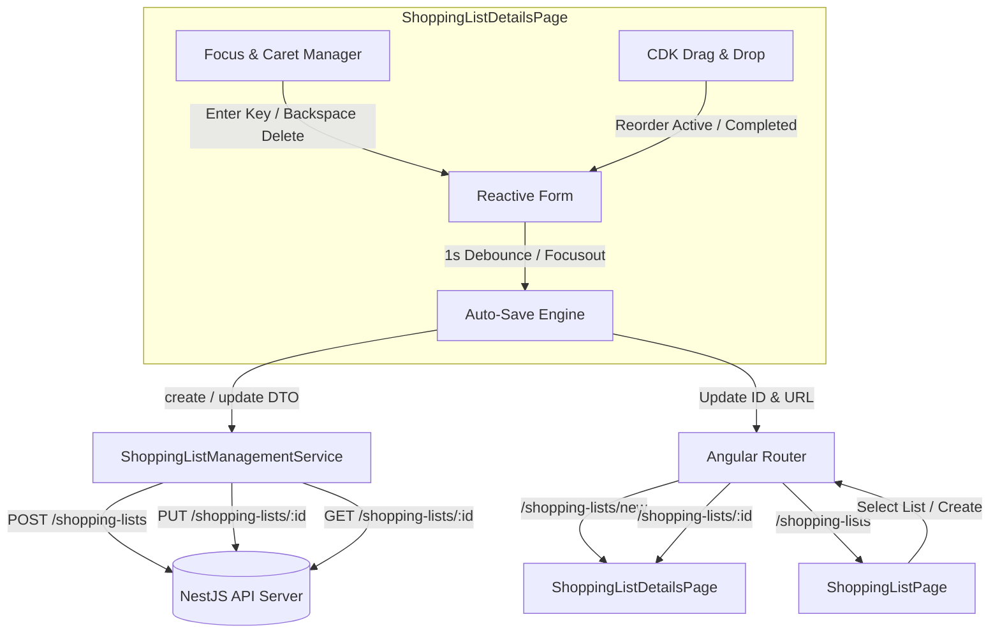

# Requirements

### Overview & Goals
The goal of this feature is to deliver a highly efficient, responsive hybrid create/edit page—`ShoppingListDetails`—within the `shopping-lists` feature in `apps/web`. To maximize user utility and minimize operational friction, the page provides inline editing with automatic background persistence (auto-save), fluid keyboard interactions for rapid list building, Material Design layout, and CDK drag-and-drop organization.

### Scope
#### In Scope
- **Hybrid Page**: A single `ShoppingListDetailsPage` component capable of creating a new shopping list or editing an existing one based on route parameters (`/shopping-lists/new` and `/shopping-lists/:id`).
- **Data Models & Service**: Extended TypeScript interfaces and `ShoppingListManagementService` methods (`create`, `update`, `getShoppingListById`, `reloadShoppingLists`).
- **Reactive Forms & Validation**: Form split into header (name, description) and items list, using `@top-nosh/ui` `WhenError` directive for validation feedback.
- **Auto-Save Engine**:
  - Debounced auto-save (1 second) on form changes.
  - Immediate auto-save on focus change for new shopping lists (preserving focus during API roundtrips).
  - Navigation-away auto-save ensuring no unsaved progress is lost.
  - Request sanitization (skipping empty item names, defaulting invalid quantities to 1, aborting save if list name is empty).
  - Transition from create mode to update mode upon initial save without resetting active UI state.
- **Items Management & Keyboard UX**:
  - Split list: active items and completed items (`Completed` section).
  - "Remove all bought items" button (disabled when no completed items exist).
  - CDK drag-and-drop ordering within each section (cross-section dragging restricted).
  - Automatic default empty item (`quantity: 1`, `isBought: false`) on initialization.
  - Enter key in item name input creates a new item below and moves focus.
  - Clearing an item's name removes it (unless it is the only remaining item) and places focus/caret at the end of the previous item.
- **Routing & Navigation**: Integrating routes in `shopping-lists.routes.ts` and wiring list navigation from `ShoppingListPage`.

#### Out of Scope
- Backend API modifications (the NestJS `ShoppingListsController` and `ShoppingListsService` already support full CRUD operations).
- Offline-only synchronization / IndexedDB persistence.

### User Stories
- **US1 - Fast List Creation**: As a user, I want to create a shopping list and quickly type items using the `Enter` key so that I can draft my groceries without taking my hands off the keyboard.
- **US2 - Seamless Auto-Save**: As a user, I want my edits to save automatically in the background so that I never have to worry about losing data or manually clicking save buttons.
- **US3 - Organized Shopping List**: As a user, I want to check off bought items into a distinct "Completed" section and reorder pending items by dragging so that shopping in-store is clear and structured.
- **US4 - Clean Item Editing**: As a user, I want blanked-out items to be removed and focus returned to the previous item, and empty item entries ignored on save, so that my shopping list stays tidy.

### Functional Requirements
- **FR1 (Save & Update Modes)**:
  - If loaded without an ID (or route `/shopping-lists/new`), the page operates in create mode.
  - When the list name is valid and save is triggered, call `POST /shopping-lists`, receive the newly generated list ID, and switch seamlessly to update mode (calling `PUT /shopping-lists/:id` for subsequent saves) while updating the route URL.
  - If loaded with `:id`, fetch existing details via `GET /shopping-lists/:id` and initialize form controls.
- **FR2 (Auto-Save Criteria & Sanitization)**:
  - Trigger auto-save 1000ms after user stops modifying form fields.
  - Trigger auto-save immediately on focus change (blur/focusin) when in create mode, provided list name is non-empty.
  - Trigger auto-save on page deactivation / navigation away.
  - Discard items with empty or whitespace-only names from save payload.
  - Clamp/default invalid or non-positive quantities to `1`.
  - Abort saving if the shopping list name is blank.
- **FR3 (Item List Organization & Actions)**:
  - Partition items into Pending (no title) and Completed (`Completed` title).
  - Provide a "Remove all bought items" button that clears all `isBought === true` items; disabled if 0 bought items.
  - Restrict CDK drag-and-drop re-ordering strictly within the item's current section.
- **FR4 (Keyboard Navigation & Focus Management)**:
  - Pressing `Enter` inside an item name adds an empty item below it and focuses its input.
  - Deleting all text in an item name removes the item (if list length > 1) and moves focus + caret to the end of the preceding item's name input.
  - Preserving active input focus across background HTTP save operations.
- **FR5 (Listing State Isolation)**:
  - Saving a shopping list must not automatically trigger a re-fetch of the main shopping lists table. The listing table reloads when the user navigates back to `ShoppingListPage`.

### Non-Functional Requirements
- **Productivity & Efficiency**: Fluid, zero-flicker UI updates during asynchronous persistence.
- **Reliability & Consistency**: Strictly adhere to Angular OnPush change detection, signals, and typed reactive forms.
- **Maintainability**: Full TypeScript adherence to project conventions (readonly arrow functions for class methods, strict typing, no `any`).

# Technical Design

### Current Implementation
- `apps/web/src/shopping-lists/services/shopping-list-management/shopping-list-management.service.ts`: Exposes paginated `shoppingLists$`, `filters$`, `setPage`, `resetFilters`. Lacks `create`, `update`, `getShoppingListById`, and `reloadShoppingLists`.
- `apps/web/src/shopping-lists/shopping-lists.routes.ts`: Only defines root route `''` mapping to `ShoppingListPage`.
- `apps/web/src/shopping-lists/pages/shopping-list/shopping-list.page.ts`: Renders table listing with placeholder `onCreateShoppingList` and non-navigating link tags.
- `apps/api/src/app/shopping-lists/`: Already implements `GET /shopping-lists`, `GET /shopping-lists/:id`, `POST /shopping-lists` (returns `{ id }`), `PUT /shopping-lists/:id` (returns `ShoppingListWithDetails`), and `DELETE /shopping-lists/:id`.

### Key Decisions
1. **Hybrid Page Architecture**: Implement a single standalone component `ShoppingListDetailsPage` handling both create and edit modes based on `ActivatedRoute.params` or route inputs. This prevents code duplication and enables seamless transition from creation to editing upon first auto-save.
2. **Auto-Save Pipeline**: Combine RxJS `valueChanges` with `debounceTime(1000)` and explicit immediate triggers on focus change (for new lists) and navigation deactivation (`canDeactivate`). Auto-save operates non-destructively in the background without resetting the entire `FormArray`, thereby preserving the user's focus and cursor position.
3. **Focus & Caret Handling**: Utilize Angular `ElementRef` / `ViewChildren` or direct DOM reference helpers to calculate the prior item index on deletion, set focus, and invoke `setSelectionRange(length, length)` to place the caret at the end of text.
4. **Isolated Section Drag-and-Drop**: Render two distinct `<div cdkDropList>` containers without linking (`cdkDropListConnectedTo`), guaranteeing that items cannot be dragged between active and completed sections.

### Data Models / Contracts
```typescript
export interface ShoppingListDetailsItem {
  id?: string;
  name: string;
  quantity: number;
  isBought: boolean;
  order?: number;
}

export interface ShoppingListDetails {
  id: string;
  name: string;
  description?: string | null;
  items: ShoppingListDetailsItem[];
  createdAt?: string | Date;
  updatedAt?: string | Date;
  deletedAt?: string | Date | null;
}

export interface CreateShoppingListDto {
  name: string;
  description: string;
  items: Array<{
    name: string;
    quantity: number;
    isBought?: boolean;
    order?: number;
  }>;
}

export interface UpdateShoppingListDto {
  name: string;
  description: string;
  items: Array<{
    id?: string;
    name: string;
    quantity: number;
    isBought: boolean;
    order?: number;
  }>;
}
```

### Components & Services
- **`ShoppingListManagementService`**:
  - `create = (dto: CreateShoppingListDto): Observable<ShoppingListDetails>` -> Calls `POST /shopping-lists`, then `GET /shopping-lists/:id` (or returns created data) without updating listing stream.
  - `update = (id: string, dto: UpdateShoppingListDto): Observable<ShoppingListDetails>` -> Calls `PUT /shopping-lists/${id}` without updating listing stream.
  - `getShoppingListById = (id: string): Observable<ShoppingListDetails>` -> Calls `GET /shopping-lists/${id}`.
  - `reloadShoppingLists = (): void` -> Forces re-emission of `filters$` to refresh list upon visiting `ShoppingListPage`.
- **`ShoppingListDetailsPage`**:
  - Standalone Angular component with `ReactiveFormsModule`, Material controls (`MatCardModule`, `MatFormFieldModule`, `MatInputModule`, `MatCheckboxModule`, `MatButtonModule`, `MatIconModule`), CDK Drag & Drop (`CdkDropList`, `CdkDrag`, `CdkDragHandle`), and `WhenError`.
  - Form structure:
    ```typescript
    FormGroup({
      id: FormControl<string | null>,
      name: FormControl<string> (Validators.required),
      description: FormControl<string>,
      items: FormArray<FormGroup<{
        id: FormControl<string | null>,
        name: FormControl<string>,
        quantity: FormControl<number>,
        isBought: FormControl<boolean>,
        order: FormControl<number>
      }>>
    })
    ```
  - Computes `activeItems` and `completedItems` for UI rendering and drag-drop reordering.

### File Structure
- `apps/web/src/shopping-lists/models/shopping-list.types.ts` (Modified)
- `apps/web/src/shopping-lists/services/shopping-list-management/shopping-list-management.service.ts` (Modified)
- `apps/web/src/shopping-lists/services/shopping-list-management/shopping-list-management.service.spec.ts` (Modified)
- `apps/web/src/shopping-lists/shopping-lists.routes.ts` (Modified)
- `apps/web/src/shopping-lists/shopping-lists.routes.spec.ts` (Modified)
- `apps/web/src/shopping-lists/pages/shopping-list/shopping-list.page.ts` (Modified)
- `apps/web/src/shopping-lists/pages/shopping-list/shopping-list.page.html` (Modified)
- `apps/web/src/shopping-lists/pages/shopping-list/shopping-list.page.spec.ts` (Modified)
- `apps/web/src/shopping-lists/pages/shopping-list-details/shopping-list-details.page.ts` (New)
- `apps/web/src/shopping-lists/pages/shopping-list-details/shopping-list-details.page.html` (New)
- `apps/web/src/shopping-lists/pages/shopping-list-details/shopping-list-details.page.scss` (New)
- `apps/web/src/shopping-lists/pages/shopping-list-details/shopping-list-details.page.spec.ts` (New)
- `apps/web/src/shopping-lists/guards/shopping-list-deactivate.guard.ts` (New, if isolated guard used)

### Architecture & Data Flow Diagram


### Risks & Mitigations
- **Risk**: Focus loss when switching from create mode to update mode or during auto-save responses.
  - *Mitigation*: Perform in-place updates of the internal ID control and browser history (`Location.replaceState` or `router.navigate` with `replaceUrl: true`) without rebuilding the `FormArray` from the API response.
- **Risk**: Multiple concurrent auto-save requests triggering race conditions.
  - *Mitigation*: Use RxJS `concatMap` / `exhaustMap` or an internal `isSaving` queue to serialize network requests and ensure latest values are persisted sequentially.

# Testing

### Validation Approach
Automated verification will be executed using Jest and Angular TestBed / ComponentFixture testing suites. Testing covers service contracts, routing configurations, component lifecycle, form validations, auto-save mechanisms, drag-and-drop operations, and keyboard navigation.

### Key Scenarios
1. **ShoppingListManagementService**:
   - `create`: Calls `POST /shopping-lists`, fetches or returns detailed model, throws on HTTP error, does not trigger listing refresh.
   - `update`: Calls `PUT /shopping-lists/:id`, returns updated details, throws on HTTP error.
   - `getShoppingListById`: Calls `GET /shopping-lists/:id` and emits data.
   - `reloadShoppingLists`: Triggers re-emission of listing subject.
2. **Page Initialization & Routing**:
   - Navigation to `/shopping-lists/new` renders blank form with 1 default item (`quantity: 1`, `isBought: false`).
   - Navigation to `/shopping-lists/:id` loads existing shopping list details from service into form.
   - Clicking list item in `ShoppingListPage` routes to `/shopping-lists/:id`.
3. **Form Validation & UX**:
   - List name required: displays `WhenError` error message when touched and empty; inhibits auto-save.
   - Completed items section renders only when items have `isBought === true`.
   - "Remove all bought items" button is enabled only when at least one bought item exists and clears all bought items on click.
4. **Keyboard & Focus Handling**:
   - Pressing Enter in an item name input inserts a new empty item immediately below and moves focus to it.
   - Clearing an item name removes the item (when more than 1 item exists) and shifts focus with caret positioned at the end of the previous item's input.
5. **Auto-Save Engine**:
   - Debounces form changes by 1000ms before calling save.
   - In create mode, shifting focus away from a field immediately triggers save if name is valid.
   - Preserves user input focus while API call executes.
   - Sanitizes payload: strips empty items and resets invalid quantities to `1`.
   - Switches internal state and URL to update mode upon successful creation.
   - Triggers pending save on navigation deactivation.

### Edge Cases
- Auto-save attempt with whitespace-only list name is skipped.
- Auto-save with mixed valid and blank item names filters out only the blank items.
- Item quantity entered as negative, zero, or non-numeric defaults to `1` in save payload.
- Deleting the last remaining item name does not remove the item, keeping 1 empty item present.
- Rapid successive edits debounce properly into a single update call.

### Test Changes
- **Update** `apps/web/src/shopping-lists/services/shopping-list-management/shopping-list-management.service.spec.ts`: Add test cases for `create`, `update`, `getShoppingListById`, and error propagation.
- **Update** `apps/web/src/shopping-lists/shopping-lists.routes.spec.ts`: Add test cases for `new` and `:id` routes.
- **Update** `apps/web/src/shopping-lists/pages/shopping-list/shopping-list.page.spec.ts`: Test navigation to details page and reload behavior.
- **Add** `apps/web/src/shopping-lists/pages/shopping-list-details/shopping-list-details.page.spec.ts`: Comprehensive test suite verifying all functional requirements.

# Delivery Steps

### ✓ Step 1: Implement Shopping List Data Models and Service Methods
The data models are extended and ShoppingListManagementService supports creating, updating, and retrieving shopping lists with error propagation and independent listing lifecycle.

- Update `apps/web/src/shopping-lists/models/shopping-list.types.ts` with DTOs and interfaces for `ShoppingListDetailsItem`, `ShoppingListDetails`, `CreateShoppingListDto`, and `UpdateShoppingListDto`.
- Extend `ShoppingListManagementService` in `apps/web/src/shopping-lists/services/shopping-list-management/` with `create`, `update`, `getShoppingListById`, and `reloadShoppingLists` methods using readonly arrow functions.
- Ensure `create` and `update` methods throw errors on API failure and do not automatically mutate the listing state.
- Add comprehensive unit tests in `shopping-list-management.service.spec.ts` covering create, update, retrieval, error handling, and listing isolation.

### ✓ Step 2: Create ShoppingListDetails Page Component, Form Layout, and Routing
The ShoppingListDetailsPage is registered in routes and provides a two-section reactive form with Material Design styling, validation, and mode handling.

- Create `ShoppingListDetailsPage` in `apps/web/src/shopping-lists/pages/shopping-list-details/` (`shopping-list-details.page.ts`, `.html`, `.scss`).
- Update `apps/web/src/shopping-lists/shopping-lists.routes.ts` with routes for `/shopping-lists/new` and `/shopping-lists/:id`, updating `shopping-lists.routes.spec.ts`.
- Update `ShoppingListPage` to link rows to `:id` and route the "Create Shopping List" button to `/shopping-lists/new`.
- Build the top section for Shopping List `name` and `description` with `WhenError` directive validation.
- Implement mode detection (create vs update mode based on route parameter `:id`), populating existing shopping list data when in edit mode.

### ✓ Step 3: Implement Items Management, Drag-and-Drop, and Keyboard Focus Interactions
Shopping list items support separate active/completed sections, CDK drag-and-drop ordering, automatic item insertion on Enter, and deletion on empty input with focus management.

- Split items into an active items list (no header) and a `Completed` section with checkboxes for `isBought`.
- Add a "Remove all bought items" action button, disabled when no items are marked as bought.
- Implement CDK drag-and-drop re-ordering within each section while preventing dragging between active and completed lists.
- Initialize new shopping lists with a default item (`quantity: 1`, `isBought: false`).
- Implement Enter key handling on item name input to automatically insert a new item directly after the active item and shift focus.
- Implement name deletion behavior to remove the item (unless it is the only item remaining) and shift focus with caret positioning to the end of the previous item's name.

### ✓ Step 4: Implement Auto-Save Engine, Focus Preservation, Navigation Guard, and Unit Tests
Form auto-saves with 1-second debounce, triggers immediate save on field focus change in create mode preserving active focus, saves on page leave, and is verified by unit tests.

- Implement auto-save pipeline using `valueChanges` with a 1-second debounce, validating required name and sanitizing empty item names and invalid quantities (defaulting to 1).
- Implement focus change auto-save handler for new shopping lists that immediately persists valid lists without debouncing while preserving current field focus.
- Switch to update mode seamlessly upon initial save response by updating internal state and browser URL without UI flicker.
- Implement navigation exit auto-save via `canDeactivate` guard or lifecycle hooks to save pending valid changes.
- Add comprehensive unit tests in `shopping-list-details.page.spec.ts` covering form initialization, validations, keyboard shortcuts, drag-and-drop, auto-save triggers, focus preservation, and edge cases.