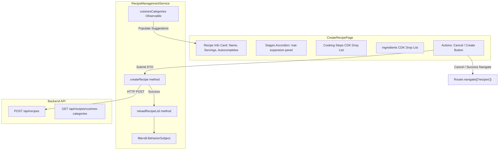

# Requirements

### Overview & Goals
Implement the "Create New Recipe" page within the `recipes` feature of the `web` Angular application based on the specification in `.junie/specs/create-new-recipe.md`. The page allows users to author comprehensive recipe definitions including basic recipe metadata, dynamic and reorderable cooking stages, step-by-step instructions, and ingredient measurements with unit selections.

### Scope
- **In Scope**:
  - `CreateRecipeDto`, `CreateRecipeStageDto`, `CreateCookingStepDto`, `CreateIngredientDto`, and `IngredientUnit` type definitions in `web`.
  - `RecipeManagementService` extensions:
    - `reloadRecipeList`: re-emits current filter state to refresh the recipes stream.
    - `createRecipe`: calls `POST /api/recipes`, reloads recipe list on success, and returns the created recipe ID.
  - `CreateRecipePage` standalone component:
    - Reactive forms with nested `FormArray` hierarchies for stages, cooking steps, and ingredients.
    - "Recipe Info" card with name, servings, description, and free-text `MatAutocomplete` suggestions for cuisine and category.
    - "Stages" accordion with `mat-expansion-panel` per stage and add/remove controls.
    - CDK drag-and-drop reordering (`@angular/cdk/drag-drop`) for stages, cooking steps, and ingredients.
    - Ingredients unit selector dropdown (`GRAMS`, `ITEM_COUNT`).
    - Cancel (navigates back to recipe list) and Create actions.
    - Submit button disabled when form is invalid or pending server response.
    - Success snackbar with 5-second auto-dismiss and navigation back to `/recipes`.
    - Error snackbar with persistent visibility until user dismisses via `OK` or retries submission.
  - Route registration for `/recipes/new` in `apps/web/src/recipes/recipes.routes.ts`.
  - Update `RecipeListPage`'s "Create Recipe" button to navigate to `/recipes/new`.
  - All component and service methods declared as `readonly` arrow function properties.
  - Full unit test coverage for service additions and page component.
- **Out of Scope**:
  - Recipe editing / updating page (covered in future specs).
  - Recipe deletion mutations from the UI.
  - Image upload / media attachment for recipes.

### User Stories
- **As a cook/user**, I want to create a new recipe with name, description, cuisine, category, and servings so that my recipe library is well-organized.
- **As a cook/user**, I want autocomplete suggestions for existing cuisines and categories while still being able to enter custom ones so that taxonomy remains consistent without restricting creativity.
- **As a cook/user**, I want to structure my recipe into distinct stages (e.g., Prep, Sauce, Assembly) with reorderable cooking steps and ingredient lists using drag-and-drop so that complex recipes are easy to read and prepare.
- **As a cook/user**, I want clear visual feedback via snackbars when creation succeeds or fails so that I know the outcome of my action.

### Functional Requirements
1. **Form Structure & Reactivity**:
   - Built using Angular Reactive Forms (`FormBuilder`, `FormGroup`, `FormArray`, `FormControl`).
   - Root Form contains `name`, `cuisine`, `category`, `description`, `servings`, and `stages` (`FormArray`).
   - Each stage contains `name`, `steps` (`FormArray`), and `ingredients` (`FormArray`).
   - Each step contains `name`, `description`.
   - Each ingredient contains `name`, `quantity`, `unit` (`GRAMS` | `ITEM_COUNT`).
2. **Validation Rules**:
   - `name`: Required, non-empty string.
   - `cuisine`: Required, non-empty string.
   - `category`: Required, non-empty string.
   - `description`: String.
   - `servings`: Required, integer, minimum value of 1.
   - Stage `name`: Required, non-empty string.
   - Step `name`: Required, non-empty string; step `description`: string.
   - Ingredient `name`: Required, non-empty string; `quantity`: Required, number >= 0; `unit`: Required `IngredientUnit`.
3. **CDK Drag and Drop Reordering**:
   - Drag-and-drop handles for reordering stages in the stages accordion.
   - Drag-and-drop handles for reordering steps within a stage panel.
   - Drag-and-drop handles for reordering ingredients within a stage panel.
   - Reordering updates underlying `FormArray` control order using CDK `moveItemInArray`.
4. **Autocomplete Suggestions**:
   - `cuisine` input offers autocomplete suggestions from `RecipeManagementService.cuisinesCategories()`.
   - `category` input offers autocomplete suggestions filtered by selected cuisine if present, or all known categories.
   - Inputs allow arbitrary free text if the user types a new cuisine/category not present in the options.
5. **Snackbars & Navigation**:
   - On submission success: Show snackbar message (e.g. "Recipe created successfully!"), auto-hide after 5 seconds (`duration: 5000`), and navigate to `/recipes`.
   - On submission failure: Show error snackbar with action label `OK` and no auto-dismiss timer.
   - Cancel button: Navigates to `/recipes` without submitting.

### Non-Functional Requirements
- **Design System**: Angular Material 3 (`@angular/material`) and Angular CDK (`@angular/cdk`).
- **Architecture & Style**: Standalone component, `ChangeDetectionStrategy.OnPush`, signal state management, and `readonly` arrow function class methods.

# Technical Design

### Current Implementation
- `RecipeManagementService` (`apps/web/src/recipes/services/recipe-management/recipe-management.service.ts`):
  - Manages `filters$` (`BehaviorSubject<RecipeListFilters>`), `cuisinesCategories$` (`BehaviorSubject<CuisinesCategoriesResponse>`), and derived `recipes$` stream.
  - Exposes `cuisinesCategories()` observable stream querying `GET /api/recipes/cuisines-categories`.
- `RecipesController` (`apps/api/src/app/recipes/recipes.controller.ts`):
  - `POST /api/recipes` accepts `CreateRecipeDto` and returns `{ id: string }` (`RecipeCreatedResponse`).
  - Validations enforced by `class-validator` decorators matching Prisma models `Recipe`, `RecipeStage`, `CookingStep`, and `Ingredient`.
- `RecipeListPage` (`apps/web/src/recipes/pages/recipe-list/recipe-list.page.ts`):
  - Contains `onCreateRecipe` stub method ready to be wired to Router.

### Key Decisions
- **Standalone Page Component**: `CreateRecipePage` placed under `apps/web/src/recipes/pages/create-recipe/create-recipe.page.ts` registered at route `/recipes/new`.
- **Typed Reactive Form Hierarchy**: Strong typing for `FormGroup` and `FormArray` controls with helper methods for adding, removing, and reordering elements cleanly.
- **CDK Drag-and-Drop Synchronization**: Reordering events (`CdkDragDrop`) reorder `FormArray.controls` in-place and assign sequential `order` index properties when assembling the payload.
- **Service-Driven API & Cache Invalidation**: `RecipeManagementService.createRecipe` posts to the backend and invokes `reloadRecipeList()` to ensure any cached or active recipe list subscriptions immediately receive updated records.

### Architecture Diagram


### Data Models / Contracts
```typescript
export type IngredientUnit = 'GRAMS' | 'ITEM_COUNT';

export interface CreateIngredientDto {
  name: string;
  quantity: number;
  unit: IngredientUnit;
  order?: number;
}

export interface CreateCookingStepDto {
  name: string;
  description: string;
  order?: number;
}

export interface CreateRecipeStageDto {
  name: string;
  order?: number;
  steps: CreateCookingStepDto[];
  ingredients: CreateIngredientDto[];
}

export interface CreateRecipeDto {
  name: string;
  cuisine: string;
  category: string;
  description: string;
  servings: number;
  stages: CreateRecipeStageDto[];
}
```

### Components
- **`CreateRecipePage`** (`apps/web/src/recipes/pages/create-recipe/create-recipe.page.ts`):
  - Form state, stage/step/ingredient modification handlers, CDK drag-drop handlers, autocomplete filters, and submit/cancel triggers.
- **`RecipeListPage`** (`apps/web/src/recipes/pages/recipe-list/recipe-list.page.ts`):
  - Injects `Router` and implements `onCreateRecipe = (): void => { this.router.navigate(['/recipes/new']); }`.
- **`RecipeManagementService`** (`apps/web/src/recipes/services/recipe-management/recipe-management.service.ts`):
  - Adds `reloadRecipeList` and `createRecipe` methods.

### File Structure
- `apps/web/src/recipes/models/create-recipe.types.ts` (new)
- `apps/web/src/recipes/pages/create-recipe/create-recipe.page.ts` (new)
- `apps/web/src/recipes/pages/create-recipe/create-recipe.page.html` (new)
- `apps/web/src/recipes/pages/create-recipe/create-recipe.page.scss` (new)
- `apps/web/src/recipes/pages/create-recipe/create-recipe.page.spec.ts` (new)
- `apps/web/src/recipes/recipes.routes.ts` (modified)
- `apps/web/src/recipes/pages/recipe-list/recipe-list.page.ts` (modified)
- `apps/web/src/recipes/services/recipe-management/recipe-management.service.ts` (modified)
- `apps/web/src/recipes/services/recipe-management/recipe-management.service.spec.ts` (modified)

### Risks
- **CDK Drag & FormArray Sync**: If `FormArray` controls are reordered without updating form state, validation and serialization order could desync. *Mitigation*: Use `moveItemInArray(this.getStagesArray().controls, event.previousIndex, event.currentIndex)` and properly update value and validity.
- **Expansion Panel Event Bubbling**: Clicking the stage remove button inside `mat-expansion-panel-header` could toggle panel expansion. *Mitigation*: Call `$event.stopPropagation()` on the remove stage button click handler.

# Testing

### Validation Approach
Verify the complete recipe creation flow through unit testing with Jest and `TestBed`, testing component DOM harnesses, form validation states, CDK drag-drop handlers, service interactions, and navigation side effects.

### Key Scenarios
- **Form Initialization & Validation**:
  - Form initializes with empty required fields and invalid validity status (`createButton.disabled === true`).
  - Adding valid recipe info, stage, steps, and ingredients makes the form valid and enables the Create button.
- **Stage, Step & Ingredient Management**:
  - "Add Stage" adds a new stage panel to the accordion.
  - Removing a stage removes the panel and updates the form value.
  - Adding and removing steps and ingredients updates their respective `FormArray`s.
  - Drag-and-drop reorder handlers reorder the corresponding `FormArray` elements accurately.
- **Autocomplete Suggestions**:
  - Typing in cuisine and category inputs filters options from `cuisinesCategories` observable stream.
  - Custom text input values not present in suggestions remain valid and retained in form value.
- **Submission & Snackbar Handling**:
  - On successful submit: `RecipeManagementService.createRecipe` is invoked, `reloadRecipeList` is triggered, success snackbar opens with 5000ms duration, and router navigates to `/recipes`.
  - On submit failure: Error snackbar opens with action `OK` and no automatic dismiss timer; submission loading state is cleared.
- **Cancel Action**:
  - Clicking Cancel navigates directly to `/recipes` without emitting API calls.
- **RecipeListPage Integration**:
  - Clicking "Create Recipe" in `RecipeListPage` triggers router navigation to `/recipes/new`.

### Test Changes
- Update `apps/web/src/recipes/services/recipe-management/recipe-management.service.spec.ts`:
  - Test `reloadRecipeList()` re-emits `filters$` and triggers a new API request.
  - Test `createRecipe(dto)` sends `POST /api/recipes` with correct payload, triggers `reloadRecipeList()`, and returns recipe ID.
  - Test `createRecipe(dto)` throws on HTTP error.
- Create `apps/web/src/recipes/pages/create-recipe/create-recipe.page.spec.ts`:
  - Test initial form structure and default controls.
  - Test dynamic additions, removals, and drag-and-drop reordering for stages, steps, and ingredients.
  - Test autocomplete filtering for cuisines and categories.
  - Test successful creation flow, snackbar display, and router navigation.
  - Test error handling during creation and persistent snackbar display.
  - Test arrow function property definitions on class instance.
- Update `apps/web/src/recipes/pages/recipe-list/recipe-list.page.spec.ts`:
  - Test `onCreateRecipe` navigates to `/recipes/new`.

# Delivery Steps

### ✓ Step 1: Implement Recipe Models and Service Methods
`RecipeManagementService` provides reactive methods to create new recipes and trigger list reloads, backed by strongly-typed DTO models and verified unit tests.

- Define TypeScript interfaces and types in `apps/web/src/recipes/models/create-recipe.types.ts` matching backend DTO contracts (`CreateRecipeDto`, `CreateRecipeStageDto`, `CreateCookingStepDto`, `CreateIngredientDto`, `IngredientUnit`).
- Add `reloadRecipeList` readonly arrow function method to `RecipeManagementService` that re-emits the current `filters$` state to trigger a refreshed fetch.
- Add `createRecipe` readonly arrow function method to `RecipeManagementService` that executes `POST /api/recipes`, reloads the recipe list on success, and returns the new recipe ID (or throws on error).
- Expand `apps/web/src/recipes/services/recipe-management/recipe-management.service.spec.ts` to test `reloadRecipeList` and `createRecipe` success/error flows.

### ✓ Step 2: Build Create Recipe Page Component and Reactive Form UI
The new recipe creation page provides a multi-section reactive form with Material Design styling, dynamic autocompletes, and CDK drag-and-drop reordering for stages, steps, and ingredients.

- Scaffold `CreateRecipePage` standalone component in `apps/web/src/recipes/pages/create-recipe/create-recipe.page.ts` with OnPush change detection and readonly arrow function methods.
- Build hierarchical `FormGroup` with `FormArray` structures for stages, cooking steps, and ingredients with comprehensive validation rules (required fields, numeric constraints, min 1 serving, non-negative quantities).
- Implement "Recipe Info" section with `mat-card`, name, servings, description, and free-text cuisine/category inputs with `MatAutocomplete` suggestions loaded from `RecipeManagementService.cuisinesCategories()`.
- Implement "Stages" section with `mat-accordion` and `mat-expansion-panel` per stage, supporting addition, removal, and CDK drag-and-drop reordering of stages.
- Implement sub-sections for Cooking Steps and Ingredients inside each stage with CDK drag-and-drop list reordering, unit selection (`GRAMS`, `ITEM_COUNT`), and row addition/removal.

### ✓ Step 3: Wire Routing, Navigation, Snackbars, and Unit Tests
The recipe creation page is wired to Angular routing, `RecipeListPage` navigation, Material snackbars for feedback, and validated with comprehensive unit tests.

- Register `/recipes/new` route in `apps/web/src/recipes/recipes.routes.ts` pointing to `CreateRecipePage`.
- Update `onCreateRecipe` in `apps/web/src/recipes/pages/recipe-list/recipe-list.page.ts` to navigate to `/recipes/new`.
- Integrate `MatSnackBar` in `CreateRecipePage` to display a 5-second auto-dismissing success message on recipe creation and a persistent error snackbar with an `OK` action on failure.
- Implement Cancel action navigating back to `/recipes` and disable Create button during submission and form invalidity.
- Add comprehensive unit test suite in `apps/web/src/recipes/pages/create-recipe/create-recipe.page.spec.ts` covering form validation, drag-and-drop reordering, autocomplete filtering, snackbar notifications, and submission lifecycle.