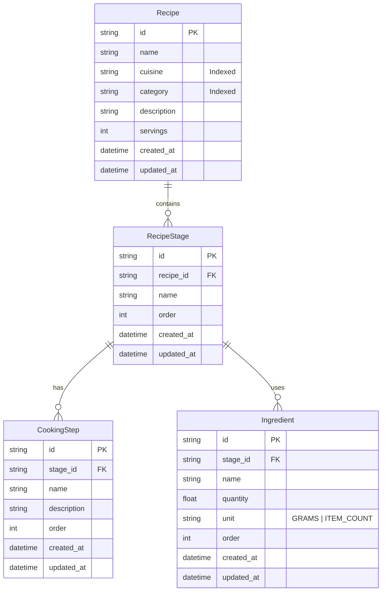

# Requirements

### Overview & Goals
The goal of this task is to design and create the database schema for storing cooking recipes in the `api` NestJS backend application using Prisma ORM with SQLite. The schema must support recipes with metadata (cuisine, category, servings, description), hierarchical breakdowns into cooking stages (e.g., preparation, sauce, garnish), sequential cooking steps, and ingredient lists with quantified units (grams or item count).

### Scope

#### In Scope
- **Prisma Schema Definition**: Define data models for `Recipe`, `RecipeStage`, `CookingStep`, and `Ingredient`, alongside the `IngredientUnit` enum.
- **Database Indexing**: Add database indexes on `cuisine` and `category` fields to support fast filtering and aggregation queries across recipe collections.
- **Relational Integrity**: Define foreign keys with cascade deletion (`onDelete: Cascade`) between recipes, stages, steps, and ingredients.
- **Database Migration**: Generate and apply a Prisma migration creating the SQLite tables, indexes, and constraints.
- **Prisma Client Generation**: Generate updated Prisma Client types for `@top-nosh/data-access` and the `api` application.

#### Out of Scope
- Creating REST endpoints, controllers, or services for recipe CRUD operations.
- Frontend UI components or pages for displaying recipes.
- User ownership / recipe author relations (kept decoupled for future authorization tasks).
- Unit conversion logic (specified to be handled on the frontend/client layer).

### User Stories
- **As an API developer**, I want a structured recipe data model with stages, steps, and ingredients so that I can store detailed multi-step recipes.
- **As an API consumer / frontend application**, I want recipes to be categorized by cuisine and category with indexed database fields so that recipes can be filtered and aggregated efficiently.
- **As a database administrator / developer**, I want cascading foreign key constraints so that deleting a recipe automatically cleans up its associated stages, steps, and ingredients.

### Functional Requirements
- **Recipe Model (`Recipe` / `recipes` table)**:
  - `id`: Unique identifier (UUID string).
  - `name`: String representing recipe title.
  - `cuisine`: String (e.g., "Italian", "Mexican", "Japanese").
  - `category`: String (e.g., "Main Course", "Dessert", "Appetizer").
  - `description`: String detailing the recipe summary.
  - `servings`: Integer specifying the number of portions.
  - `createdAt` & `updatedAt`: Automatic timestamps.
  - `stages`: One-to-many relationship with `RecipeStage`.
- **Recipe Stage Model (`RecipeStage` / `recipe_stages` table)**:
  - `id`: Unique identifier (UUID string).
  - `recipeId`: Foreign key reference to `Recipe.id`.
  - `name`: String representing the stage name (e.g., "Meat preparation", "Sauce", "Garnish").
  - `order`: Integer indicating the sequential order of the stage within the recipe.
  - `steps`: One-to-many relationship with `CookingStep`.
  - `ingredients`: One-to-many relationship with `Ingredient`.
  - `createdAt` & `updatedAt`: Automatic timestamps.
- **Cooking Step Model (`CookingStep` / `cooking_steps` table)**:
  - `id`: Unique identifier (UUID string).
  - `stageId`: Foreign key reference to `RecipeStage.id`.
  - `name`: String representing the step summary / heading.
  - `description`: String describing the detailed cooking step instructions.
  - `order`: Integer indicating step sequence order within the stage.
  - `createdAt` & `updatedAt`: Automatic timestamps.
- **Ingredient Model (`Ingredient` / `ingredients` table)**:
  - `id`: Unique identifier (UUID string).
  - `stageId`: Foreign key reference to `RecipeStage.id`.
  - `name`: String representing ingredient name.
  - `quantity`: Float number representing ingredient amount.
  - `unit`: `IngredientUnit` enum or string constrained to `GRAMS` and `ITEM_COUNT`.
  - `order`: Integer indicating ingredient sequence order within the stage.
  - `createdAt` & `updatedAt`: Automatic timestamps.
- **Indexes & Aggregations**:
  - Index on `cuisine` and `category` in `recipes` table to support efficient filtering and distinct aggregations.
  - Foreign key indexes on `recipe_id` in `recipe_stages`, and `stage_id` in `cooking_steps` and `ingredients`.

### Non-Functional Requirements
- **Data Integrity**: Referential integrity with cascade deletes ensuring no orphaned stages, steps, or ingredients remain upon recipe deletion.
- **Consistency**: Follow existing database conventions (UUID primary keys, `@map` for snake_case column names, `@@map` for snake_case table names).
- **Extensibility**: Support fractional quantities (`Float`) for ingredient amounts.

# Technical Design

### Current Implementation
- **Prisma Configuration**: The application uses Prisma 7 configured via `prisma7.config.ts` and `prisma/schema.prisma` with an SQLite database datasource (`DATABASE_URL="file:./dev.db"`).
- **Existing Models**: `prisma/schema.prisma` currently contains the `User` model with UUID primary keys and snake_case column mappings (`@@map("users")`).
- **Data Access Layer**: `libs/data-access` exposes `PrismaService` extending `PrismaClient` using `@prisma/adapter-better-sqlite3`.

### Key Decisions
- **Hierarchical Stage-Centric Design**:
  - *Decision*: Associate `CookingStep` and `Ingredient` directly with `RecipeStage` rather than flatly under `Recipe`.
  - *Rationale*: Directly meets the specification where recipes are organized into distinct stages (e.g., meat preparation, sauce, garnish), each containing its own steps and ingredient list.
- **Ingredient Unit Modeling**:
  - *Decision*: Define an `enum IngredientUnit { GRAMS ITEM_COUNT }` mapped to database column `unit`.
  - *Rationale*: Enforces database and client-level type safety for units supported by the back-end while keeping unit conversion on the client side.
- **Sequence Ordering**:
  - *Decision*: Add an `order` integer field to `RecipeStage`, `CookingStep`, and `Ingredient`.
  - *Rationale*: Preserves the exact ordering of stages, steps, and ingredient lists across queries and updates.
- **Indexing Strategy**:
  - *Decision*: Add single-column indexes on `cuisine` and `category`, as well as a composite index `@@index([cuisine, category])`.
  - *Rationale*: Provides optimal query performance for filtering recipes by individual criteria and aggregated distinct queries.

### Proposed Changes

#### 1. Prisma Schema (`prisma/schema.prisma`)
Add `IngredientUnit` enum, `Recipe`, `RecipeStage`, `CookingStep`, and `Ingredient` models:

```prisma
enum IngredientUnit {
  GRAMS
  ITEM_COUNT
}

model Recipe {
  id          String        @id @default(uuid())
  name        String
  cuisine     String
  category    String
  description String
  servings    Int
  stages      RecipeStage[]
  createdAt   DateTime      @default(now()) @map("created_at")
  updatedAt   DateTime      @updatedAt @map("updated_at")

  @@index([cuisine])
  @@index([category])
  @@index([cuisine, category])
  @@map("recipes")
}

model RecipeStage {
  id          String        @id @default(uuid())
  recipeId    String        @map("recipe_id")
  name        String
  order       Int           @default(0)
  recipe      Recipe        @relation(fields: [recipeId], references: [id], onDelete: Cascade)
  steps       CookingStep[]
  ingredients Ingredient[]
  createdAt   DateTime      @default(now()) @map("created_at")
  updatedAt   DateTime      @updatedAt @map("updated_at")

  @@index([recipeId])
  @@map("recipe_stages")
}

model CookingStep {
  id          String      @id @default(uuid())
  stageId     String      @map("stage_id")
  name        String
  description String
  order       Int         @default(0)
  stage       RecipeStage @relation(fields: [stageId], references: [id], onDelete: Cascade)
  createdAt   DateTime    @default(now()) @map("created_at")
  updatedAt   DateTime    @updatedAt @map("updated_at")

  @@index([stageId])
  @@map("cooking_steps")
}

model Ingredient {
  id        String         @id @default(uuid())
  stageId   String         @map("stage_id")
  name      String
  quantity  Float
  unit      IngredientUnit
  order     Int            @default(0)
  stage     RecipeStage    @relation(fields: [stageId], references: [id], onDelete: Cascade)
  createdAt DateTime       @default(now()) @map("created_at")
  updatedAt DateTime       @updatedAt @map("updated_at")

  @@index([stageId])
  @@map("ingredients")
}
```

#### 2. Migrations
- Generate and apply migration:
  `npx prisma migrate dev --name create_recipe_tables`

#### 3. Client Generation
- Regenerate Prisma client:
  `npx prisma generate`

### Components
- **Prisma Schema (`prisma/schema.prisma`)**: Defines domain entities and relations.
- **Prisma Migrations (`prisma/migrations/*`)**: Contains SQL migration script creating SQLite tables and indexes.
- **Data Access Library (`libs/data-access`)**: Consumes newly generated Prisma Client types.

### File Structure
- `prisma/schema.prisma` (modified) — Add Recipe domain models.
- `prisma/migrations/<timestamp>_create_recipe_tables/migration.sql` (added) — SQLite DDL migration script.

### Architecture Diagram


### Risks
- **SQLite Enum Handling**: SQLite does not have native enum types; Prisma handles this through schema-level validation and text storage.
  - *Mitigation*: The `IngredientUnit` enum provides full TypeScript type safety in Prisma Client queries while storing clean string values in SQLite.
- **Cascade Deletions**: Missing foreign key constraints or cascade settings could lead to orphan stage/step/ingredient rows.
  - *Mitigation*: Explicit `@relation(fields: [...], references: [id], onDelete: Cascade)` configured on all child relations.

# Testing

### Validation Approach
Verify the schema changes through Prisma validation, migration execution, and type checking in the data-access library.

### Key Scenarios
- **Schema Validation**: Run `npx prisma validate` to ensure `prisma/schema.prisma` syntax and relations are valid.
- **Migration Execution**: Execute `npx prisma migrate dev` to verify that SQLite tables, foreign keys, and indexes are generated without errors.
- **Model Relationship Verification**: Validate that `Recipe -> RecipeStage -> CookingStep / Ingredient` relationships are correctly typed in the generated client.
- **Data Access Compilation**: Verify that `libs/data-access` compiles successfully with `nx build data-access` or `nx test data-access`.

### Edge Cases
- Fractional ingredient quantities (e.g., 0.5 item count or 250.75 grams) stored accurately via `Float`.
- Deleting a parent recipe cascading cleanly to all associated stages, steps, and ingredients.
- Recipes with multiple stages containing varying numbers of steps and ingredients.

### Test Changes
- Run `npm run format:check` to ensure repository code formatting rules are met.
- Run existing project tests to confirm zero regressions in existing authentication and data-access modules.

# Delivery Steps

### ✓ Step 1: Define Recipe data models in Prisma schema
The Prisma schema in `prisma/schema.prisma` defines models for recipes, stages, steps, ingredients, and supporting indexes.

- Define `IngredientUnit` enum containing `GRAMS` and `ITEM_COUNT` values.
- Define `Recipe` model containing `id` (UUID), `name`, `cuisine`, `category`, `description`, `servings` (Int), and timestamp fields.
- Add indexing attributes `@@index([cuisine])`, `@@index([category])`, and `@@index([cuisine, category])` to optimize category/cuisine filtering and aggregation.
- Define `RecipeStage` model containing `id`, `recipeId`, `name`, `order` (Int), and cascade delete relation back to `Recipe`.
- Define `CookingStep` model containing `id`, `stageId`, `name`, `description`, `order` (Int), and cascade delete relation back to `RecipeStage`.
- Define `Ingredient` model containing `id`, `stageId`, `name`, `quantity` (Float), `unit` (`IngredientUnit`), `order` (Int), and cascade delete relation back to `RecipeStage`.
- Apply consistent snake_case table mappings (`@@map`) and column mappings (`@map`) matching project conventions.

### ✓ Step 2: Generate and execute database migration
A new SQLite migration is generated under `prisma/migrations` and applied to the database.

- Run `prisma migrate dev --name create_recipe_tables` to generate and apply the migration script.
- Verify migration SQL generation including `recipes`, `recipe_stages`, `cooking_steps`, and `ingredients` tables with proper foreign key cascades and indexes.
- Verify migration metadata integrity in `prisma/migrations/migration_lock.toml`.

### ✓ Step 3: Regenerate Prisma Client and verify data access layer integration
The Prisma Client types and models are regenerated and validated against the database access layer.

- Run `prisma generate` to update Prisma Client typings and query API in the project.
- Validate that `libs/data-access` builds and compiles with the updated `PrismaClient` and `PrismaService`.
- Run schema validation using `npx prisma validate` and code formatting checks with `npm run format:check`.