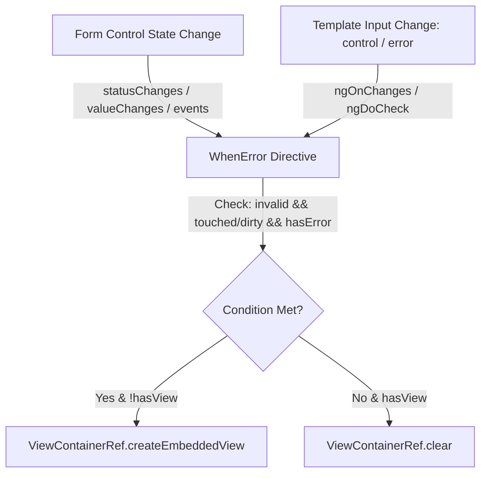

# Requirements

### Overview & Goals
The goal is to implement an Angular structural directive named `WhenError` in the `control` feature of the `@top-nosh/ui` library. This directive streamlines the display of validation error messages (such as `<mat-error>`) across forms in the application by encapsulating the standard visibility criteria (`invalid && (touched || dirty) && hasError(errorName)`).

### Scope
- **In Scope**:
  - Implementation of standalone structural directive `WhenError` with selector `[whenError]`.
  - Input properties: `control` (`AbstractControl`) and `error` (`string`).
  - Reactive view container management (showing/hiding embedded template based on control validity, touch/dirty state, and matching error key).
  - Public export from `@top-nosh/ui` (`libs/ui/src/index.ts`).
  - Unit tests in `libs/ui` covering all status and touch/dirty combinations.
- **Out of Scope**:
  - Refactoring existing forms in `apps/web` (can be adopted incrementally in subsequent tasks).
  - Custom styling or modification to Angular Material styles.

### User Stories
- **As an Angular developer**, I want to attach `*whenError="let err; control: form.controls.email; error: 'required'"` or `[whenError] [control]="form.controls.email" [error]="'required'"` to an error element so that I don't have to duplicate nested `@if` checks for touched, dirty, invalid, and error keys.

### Functional Requirements
- **FR-1**: Directive must accept `control` of type `AbstractControl` (e.g. `FormControl`, `FormGroup`, `FormArray`).
- **FR-2**: Directive must accept `error` of type `string` representing the error key (e.g. `'required'`, `'email'`).
- **FR-3**: When `control.invalid` is `true`, `(control.touched || control.dirty)` is `true`, and `control.hasError(error)` is `true`, the directive must render the embedded template into the view container.
- **FR-4**: When `control.valid` is `true` OR `control.hasError(error)` is `false` OR `(!control.touched && !control.dirty)`, the directive must clear the view container.
- **FR-5**: The directive must reactively re-evaluate visibility when the control emits changes (`statusChanges`, `valueChanges`, or `events` such as touch/pristine updates) and when input bindings change.

### Non-Functional Requirements
- **Performance**: Subscriptions must be properly cleaned up using `DestroyRef` / `takeUntilDestroyed` to prevent memory leaks.
- **Compatibility**: Works seamlessly with Angular 22 standalone components and `@angular/forms` `AbstractControl`.

# Technical Design

### Current Implementation
In `apps/web/src/auth/pages/login/login.page.html` and `password-change.page.html`, error message visibility is handled via repetitive nested template control flow:
```html
@if (form.controls.email.invalid && (form.controls.email.touched || form.controls.email.dirty)) {
  @if (form.controls.email.hasError('required')) {
    <mat-error>Email is required</mat-error>
  }
}
```
Currently, `libs/ui` contains basic setup files and routes in `libs/ui/src/control/control.routes.ts`, with its entry point at `libs/ui/src/index.ts`.

### Key Decisions
- **Decision 1: Standalone Directive with Structural View Management**: Use `ViewContainerRef` and `TemplateRef` in a standalone `@Directive` with selector `[whenError]`.
- **Decision 2: Reactive State Tracking**: Subscribe to `control.events` (or `merge(control.statusChanges, control.valueChanges)`) combined with `ngDoCheck` / `ngOnChanges` to catch both asynchronous event emissions and synchronous mark-as-touched/dirty operations.
- **Decision 3: Location within UI Library**: Place the directive in `libs/ui/src/control/directives/when-error/when-error.directive.ts` and export it in `libs/ui/src/index.ts`.

### Proposed Changes
- Create `libs/ui/src/control/directives/when-error/when-error.directive.ts`:
  - Selector: `[whenError]`
  - Inputs: `@Input({ required: true }) control!: AbstractControl;` and `@Input({ required: true }) error!: string;`
  - Internal state: `private hasView = false;`
  - Methods: `private updateView(): void` to evaluate condition and manage view container.
- Export `WhenError` from `libs/ui/src/index.ts`.

### Data Models / Contracts
```typescript
import { Directive, Input, TemplateRef, ViewContainerRef, inject, DestroyRef, OnInit, OnChanges, DoCheck } from '@angular/core';
import { AbstractControl } from '@angular/forms';

@Directive({
  selector: '[whenError]',
  standalone: true
})
export class WhenError implements OnInit, OnChanges, DoCheck {
  @Input({ required: true }) control!: AbstractControl | null | undefined;
  @Input({ required: true }) error!: string;

  private readonly templateRef = inject(TemplateRef<unknown>);
  private readonly viewContainer = inject(ViewContainerRef);
  private readonly destroyRef = inject(DestroyRef);

  // Evaluates visibility: control.invalid && (control.touched || control.dirty) && control.hasError(error)
}
```

### Components & File Structure
```
libs/ui/
├── src/
│   ├── control/
│   │   ├── control.routes.ts
│   │   └── directives/
│   │       └── when-error/
│   │           ├── when-error.directive.ts
│   │           └── when-error.directive.spec.ts
│   ├── lib/
│   │   └── ui/
│   └── index.ts
```

### Architecture Diagram


### Risks & Mitigations
- **Risk**: `AbstractControl.markAsTouched()` or `markAsDirty()` does not always trigger `statusChanges` in older Angular patterns.
  - **Mitigation**: Implement `ngDoCheck` alongside `control.events` / `statusChanges` / `valueChanges` subscription to guarantee synchronous change detection updates.

# Testing

### Validation Approach
Verify the directive behavior using Angular TestBed unit tests with Jest executing via `npx nx test ui`.

### Key Scenarios
1. **Initial Untouched State**: When control is invalid but untouched and pristine, error element is not rendered in DOM.
2. **Control Marked Touched & Invalid**: When invalid control is marked touched (`control.markAsTouched()`), error element is rendered.
3. **Control Marked Dirty & Invalid**: When invalid control value changes or is marked dirty (`control.markAsDirty()`), error element is rendered.
4. **Control Becomes Valid**: When control value changes to valid state, error element is removed from DOM.
5. **Specific Error Key Matching**: When control has `'required'` error, only directive configured with `error="required"` shows; directive configured with `error="email"` remains hidden.
6. **Dynamic Input Changes**: Updating the `error` or `control` input dynamically updates the displayed status.

### Edge Cases
- Null or undefined passed as `control`.
- Dynamic replacement of the `control` instance (unsubscribing from old control, subscribing to new control).
- Destruction of the host component / directive cleans up all subscriptions without memory leaks.

### Test Changes
- Add `libs/ui/src/control/directives/when-error/when-error.directive.spec.ts` testing host component integration with various `FormControl` scenarios.

# Delivery Steps

### ✓ Step 1: Implement WhenError structural directive in ui library
The `WhenError` structural directive is implemented in the `control` feature of the `ui` library with input bindings for `control` and `error`, and reactive view management logic.

- Create `WhenError` structural directive in `libs/ui/src/control/directives/when-error/when-error.directive.ts` (selector `[whenError]`).
- Inject `TemplateRef<unknown>`, `ViewContainerRef`, `ChangeDetectorRef`, and `DestroyRef`.
- Define `@Input({ required: true }) control!: AbstractControl` and `@Input({ required: true }) error!: string`.
- Implement dynamic subscriptions to `control.events` / `control.statusChanges` / `control.valueChanges` and lifecycle hooks (`ngOnChanges`, `ngDoCheck`) to monitor validation, dirty, and touched state changes.
- Implement conditional view creation/clearing using `ViewContainerRef.createEmbeddedView` and `ViewContainerRef.clear`.
- Export `WhenError` directive in `libs/ui/src/index.ts`.

### ✓ Step 2: Add unit tests and export directive in public API
Comprehensive unit test suites in `libs/ui` verify all state transitions, error matching, and edge cases for the `WhenError` directive.

- Create `when-error.directive.spec.ts` inside `libs/ui/src/control/directives/when-error/`.
- Test that error element is hidden when control is pristine and untouched even if invalid.
- Test that error element displays when control is invalid, dirty or touched, and has the specified error key.
- Test that error element hides when control becomes valid or error key no longer matches.
- Test behavior when control or error inputs are dynamically updated.
- Verify execution of Jest unit tests via `npx nx test ui`.