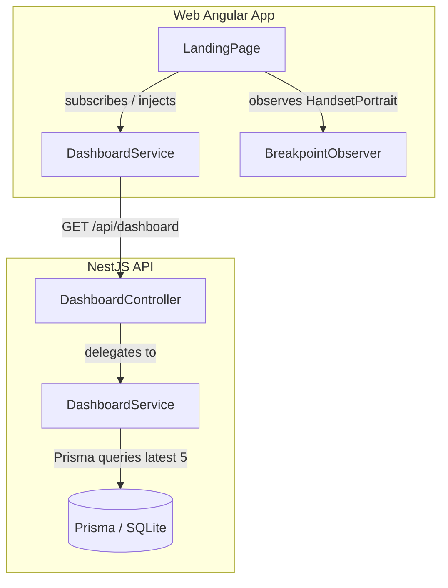

# Requirements

### Overview & Goals
Implement a fully functional Dashboard Landing Page in the `web` application and supporting backend endpoint in the `api` service. The dashboard greets the user, displays the five most recent recipes, and shows top items from the latest shopping list with seamless navigation, loading spinners, error fallback, and responsive layout across mobile and desktop.

### Scope
- **In Scope**:
  - API: New authenticated `/dashboard` endpoint returning up to 5 most recent recipes and up to 5 items from the most recent shopping list (with list ID and name).
  - Web: New `DashboardService` for calling the API endpoint.
  - Web: Updated `LandingPage` component rendering a welcome message and two Angular Material cards.
  - Web: Loading spinner and error state handling for the dashboard cards.
  - Web: Mobile column layout matching `CDK HandsetPortrait` (`(max-width: 599.98px) and (orientation: portrait)`) and side-by-side layout on larger viewports.
  - Web: Navigation to recipe details (`/recipes/:id`), recipe list (`/recipes`), create recipe (`/recipes/new`), shopping list details (`/shopping-lists/:id`), and create shopping list (`/shopping-lists/new`).
- **Out of Scope**:
  - Direct modification of existing `/recipes` or `/shopping-lists` API endpoints.
  - User profile customization or settings on the dashboard.

### User Stories
- As an authenticated user, I want to see a welcoming dashboard landing page when I log in so that I can quickly access my latest culinary content.
- As a user, I want to see my five most recent recipes with direct links so that I can easily view their details or jump to the recipes catalog.
- As a user, I want to see items from my latest shopping list so that I can check what I need to buy or navigate directly to the list.
- As a user with no recipes or shopping lists yet, I want helpful empty-state cards with create actions so that I can quickly start adding content.
- As a mobile user, I want the dashboard cards to stack vertically on portrait screens and sit side-by-side on larger screens for optimal readability.

### Functional Requirements
1. **API Dashboard Endpoint**:
   - Route: `GET /dashboard` (under `/api` prefix, i.e. `/api/dashboard`).
   - Authentication: Protected by `JwtAuthGuard` (returns 401 if unauthenticated or invalid token).
   - Data payload:
     - `recipes`: Array of up to 5 most recent non-deleted recipes (`id`, `name`, `cuisine`, `category`, `createdAt`).
     - `shoppingList`: Object containing `id`, `name`, and `items` (up to 5 items: `id`, `name`, `checked`, `quantity`, `unit`), or `null`/empty representation if no shopping list exists.
   - Handles empty states gracefully without failing.
2. **Web Dashboard Service**:
   - `DashboardService` provided in root / feature, exposing a method returning `Observable<DashboardData>`.
3. **Landing Page UI & Interactions**:
   - Welcome message displayed at top of page.
   - Two `mat-card` containers:
     - **Recipes Card**:
       - Image `/images/recipes.avif`.
       - Title: "Recent Recipes".
       - Loading spinner (`<mat-spinner>`) while loading.
       - Generic error message if fetching fails.
       - Populated list of up to 5 recipes with clickable links navigating to `/recipes/:id`.
       - Action button navigating to `/recipes`.
       - Empty state message (e.g. "No recipes added yet") + action button to navigate to `/recipes/new`.
     - **Shopping List Card**:
       - Image `/images/shopping-lists.avif`.
       - Title: Name of the latest shopping list (or default title if no list).
       - Loading spinner (`<mat-spinner>`) while loading.
       - Generic error message if fetching fails.
       - Plain text list of up to 5 item names.
       - Action button navigating to `/shopping-lists/:id`.
       - Empty state message (e.g. "No shopping list items yet") + action button to navigate to `/shopping-lists/new`.
4. **Responsive Layout**:
   - CDK `Breakpoints.HandsetPortrait` / `(max-width: 599.98px) and (orientation: portrait)` breakpoint observed.
   - Mobile: Cards displayed in a vertical single-column layout.
   - Tablet / Desktop: Cards displayed side by side in a multi-column grid layout.

# Technical Design

### Current Implementation
- `apps/api/src/app/app.module.ts`: NestJS root module importing `AuthModule`, `RecipesModule`, `ShoppingListsModule`, `PrismaModule`.
- `apps/web/src/dashboard/pages/landing/landing.page.ts`: Standalone Angular component with placeholder template `<p>LANDING</p>`.
- Assets: `/images/recipes.avif` and `/images/shopping-lists.avif` are already present in `apps/web/public/images/`.

### Key Decisions
1. **API Module Separation**:
   - Create a standalone `DashboardModule` (`apps/api/src/app/dashboard`) with `DashboardController` and `DashboardService` rather than mixing dashboard queries into `RecipesService` or `ShoppingListsService`. This maintains clean bounded contexts and keeps dashboard-specific aggregations isolated.
2. **State & Reactivity Management on Frontend**:
   - Use Angular Signals (`toSignal` / RxJS stream state or `catchError`) to cleanly manage `loading`, `error`, and `data` states.
   - Use `BreakpointObserver` from `@angular/cdk/layout` with `Breakpoints.HandsetPortrait` to adapt layout dynamically alongside CSS Grid/Flexbox media queries.
3. **Data Contracts**:
   - `DashboardResponseDto`:
     ```typescript
     export interface DashboardRecipeDto {
       id: string;
       name: string;
     }

     export interface DashboardShoppingListItemDto {
       id: string;
       name: string;
     }

     export interface DashboardShoppingListDto {
       id: string;
       name: string;
       items: DashboardShoppingListItemDto[];
     }

     export interface DashboardResponseDto {
       recipes: DashboardRecipeDto[];
       shoppingList: DashboardShoppingListDto | null;
     }
     ```

### Architecture Diagram


### File Structure & Changes
- `apps/api/src/app/dashboard/`
  - `dto/dashboard-response.dto.ts` (New)
  - `dashboard.controller.ts` (New)
  - `dashboard.controller.spec.ts` (New)
  - `dashboard.service.ts` (New)
  - `dashboard.service.spec.ts` (New)
  - `dashboard.module.ts` (New)
  - `dashboard.e2e.spec.ts` (New)
- `apps/api/src/app/app.module.ts` (Modified: add `DashboardModule`)
- `apps/web/src/dashboard/`
  - `services/dashboard/dashboard.service.ts` (New)
  - `services/dashboard/dashboard.service.spec.ts` (New)
  - `services/dashboard/dashboard.service.types.ts` (New)
  - `pages/landing/landing.page.ts` (Modified: inject service, Material components, breakpoint observer)
  - `pages/landing/landing.page.html` (Modified: welcome message, cards, spinners, error & empty states)
  - `pages/landing/landing.page.scss` (Modified: layout grid, cards styling, mobile breakpoint adjustments)
  - `pages/landing/landing.page.spec.ts` (Modified: unit tests for all states)

# Testing

### Validation Approach
Verify the implementation through backend automated integration tests (Supertest), NestJS unit tests, Angular component and service unit tests (Vitest / Jest), and responsive UI checks.

### Key Scenarios
1. **Backend Authentication & Authorization**:
   - `GET /api/dashboard` without token returns `401 Unauthorized`.
   - `GET /api/dashboard` with valid Bearer token returns `200 OK` with recipes and shopping list structure.
2. **Backend Data Fetching**:
   - When database has > 5 recipes, only 5 most recent non-deleted recipes are returned ordered by `createdAt` desc.
   - When database has > 5 items in latest shopping list, only top 5 items are returned.
   - When database is empty, returns `{ recipes: [], shoppingList: null }` (or empty items).
3. **Frontend Dashboard Service**:
   - Successfully issues `GET /dashboard` request and parses response.
   - Emits errors when API returns 500 / network failure.
4. **Landing Page UI States**:
   - **Loading State**: Displays `mat-spinner` in each card while data is being fetched.
   - **Success State (Populated)**:
     - Recipes card shows list of recipe names linking to `/recipes/:id`.
     - Action button navigates to `/recipes`.
     - Shopping list card displays the shopping list name in title and plain text items.
     - Action button navigates to `/shopping-lists/:id`.
   - **Empty State**:
     - When recipes are empty, card displays "No recipes added yet" and "Create Recipe" action navigating to `/recipes/new`.
     - When shopping list is empty/null, card displays "No shopping list items yet" and "Create Shopping List" action navigating to `/shopping-lists/new`.
   - **Error State**:
     - When API call fails, cards display generic error message.
5. **Responsive Layout**:
   - Matches CDK `HandsetPortrait` breakpoint (`(max-width: 599.98px) and (orientation: portrait)`), switching between single-column and multi-column grid layouts.

# Delivery Steps

### ✓ Step 1: Implement API Dashboard Module and Endpoint
The API exposes an authenticated endpoint returning the 5 most recent recipes and the top 5 items from the most recent shopping list.

- Create `apps/api/src/app/dashboard/dto/dashboard-response.dto.ts` defining `DashboardResponseDto`, `DashboardRecipeDto`, and `DashboardShoppingListDto`.
- Implement `DashboardService` in `apps/api/src/app/dashboard/dashboard.service.ts` querying Prisma for the latest 5 non-deleted recipes and the most recent non-deleted shopping list with its top 5 items.
- Implement `DashboardController` in `apps/api/src/app/dashboard/dashboard.controller.ts` with `@UseGuards(JwtAuthGuard)` and `@Get()` on route `/dashboard`.
- Create `DashboardModule` in `apps/api/src/app/dashboard/dashboard.module.ts` and import it into `AppModule`.
- Add unit tests (`dashboard.controller.spec.ts`, `dashboard.service.spec.ts`) and e2e integration tests (`dashboard.e2e.spec.ts`) validating authentication and data responses.

### ✓ Step 2: Create Web Dashboard Service
The Angular web app has a dedicated dashboard service and types for fetching dashboard data from `/dashboard`.

- Create `apps/web/src/dashboard/services/dashboard/dashboard.service.types.ts` defining client-side interfaces (`DashboardData`, `DashboardRecipeItem`, `DashboardShoppingListSummary`).
- Implement `DashboardService` in `apps/web/src/dashboard/services/dashboard/dashboard.service.ts` with a `getDashboardData()` method using `HttpClient`.
- Add unit tests in `dashboard.service.spec.ts` covering successful data retrieval and error handling.

### ✓ Step 3: Implement Dashboard Landing Page UI and Behavior
The LandingPage displays a welcome message and two responsive Material cards for recent recipes and shopping list items with loading, error, and empty states.

- Update `LandingPage` component in `apps/web/src/dashboard/pages/landing/landing.page.ts` using `inject(DashboardService)` and `BreakpointObserver` with CDK `HandsetPortrait` breakpoint (`(max-width: 599.98px) and (orientation: portrait)`).
- Implement template in `landing.page.html` with:
  - Header with welcome message.
  - Responsive cards grid (column on HandsetPortrait, side-by-side on larger screens).
  - Most Recent Recipes card with `/images/recipes.avif`, loading spinner, error state, list of recipe links to `/recipes/:id`, navigation action to `/recipes`, and empty state with action to `/recipes/new`.
  - Shopping Items card with `/images/shopping-lists.avif`, shopping list title, loading spinner, error state, plain text item names, navigation action to `/shopping-lists/:id`, and empty state with action to `/shopping-lists/new`.
- Style the cards and layout in `landing.page.scss` using Angular Material design tokens and responsive breakpoints.
- Update unit tests in `landing.page.spec.ts` covering loading, success, error, and empty states.