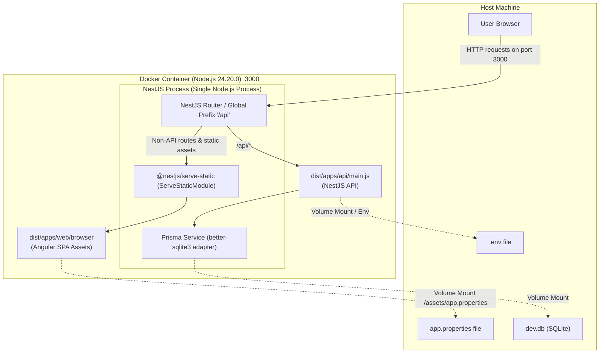

# Requirements

### Overview & Goals
Containerize the TopNosh application using a Single-Container Architecture. The container runs a single Node.js process where the NestJS API application (`apps/api`) serves both the REST API endpoints and the static Angular frontend application (`apps/web`). Data persistence (SQLite database) and configuration (`.env` for API, `app.properties` for Angular frontend) are maintained outside the container via volume mounts and environment configuration.

### Scope
- **In Scope**:
  - Integrate `@nestjs/serve-static` in `apps/api/src/app/app.module.ts` to serve Angular static assets (`dist/apps/web/browser`).
  - Create a multi-stage `Dockerfile` using Node.js version `24.20.0` (matching `mise.toml`) with build and production stages exposing port 3000.
  - Create `.dockerignore` for minimal Docker build context.
  - Enable mounting external SQLite database file (e.g., `dev.db`), external `.env` file, and external `app.properties` configuration file.
  - Update `README.md` with complete instructions for building, rebuilding, configuring, and running the Docker container.
- **Out of Scope**:
  - Splitting frontend and backend into multi-container setups (e.g. separate Nginx reverse proxy container).
  - Modifying business logic, authentication flow, or database schema.
  - Setting up external CI/CD container registry publishing pipelines.

### User Stories
- **As a Developer / DevOps Engineer**, I want to build a self-contained Docker image for TopNosh using Node.js 24.20.0 so that I can deploy the entire application in a consistent environment with a single command.
- **As a System Administrator**, I want to provide external configuration files (`.env`, `app.properties`) and mount an external SQLite database file so that configuration changes and recipe data persist across container updates and restarts.
- **As an End User**, I want to access the TopNosh web application and API on a single port (3000) with seamless SPA client-side routing.

### Functional Requirements
1. **Single Node.js Process & Port**:
   - NestJS API serves HTTP requests on port 3000.
   - REST API routes are hosted under the `/api` prefix (e.g., `/api/auth`, `/api/recipes`).
   - Angular frontend SPA is served from the root path (`/`) with client-side route fallback to `index.html`.
2. **Configuration from Host**:
   - NestJS API reads environment variables from an external `.env` file or environment variables passed to the container.
   - Angular frontend reads runtime properties (`API_URL`, `PRODUCTION`) from an external `app.properties` file mounted to the static assets directory (`dist/apps/web/browser/assets/app.properties`).
3. **Data Persistence**:
   - SQLite database file (`dev.db` or configured `DATABASE_URL`) is located outside the container and mounted as a persistent volume.
4. **Multi-stage Dockerfile**:
   - Build stage compiles both `api` and `web` projects via Nx.
   - Production stage contains minimal runtime dependencies and compiled output, exposing port 3000.
5. **Documentation**:
   - `README.md` includes clear steps to build, rebuild, configure, run, and verify the container.

### Non-Functional Requirements
- **Reproducibility**: Docker image uses fixed Node.js version `24.20.0` matching workspace `mise.toml`.
- **Image Optimization**: Multi-stage build isolates build tooling from the final production runtime image.
- **Reliability**: Native dependencies (`better-sqlite3`, `argon2`) compile and execute cleanly in the container runtime.

# Technical Design

### Current Implementation
- **API (`apps/api`)**: NestJS v11 application built via `@nx/webpack` to `dist/apps/api/main.js`. Uses `DATABASE_URL` via `@prisma/adapter-better-sqlite3` and `dotenv/config`. Port defaults to 3000 with global prefix `/api`.
- **Web (`apps/web`)**: Angular v22 application built via `@angular/build:application` to `dist/apps/web/browser`. Uses `@elemental-concept/env-bakery` to load `/assets/app.properties` at runtime during startup.
- **Dependencies**: `@nestjs/serve-static` (v5.0.5) is already present in `package.json`.
- **Runtime Environment**: `mise.toml` specifies Node.js `24.20.0`.

### Key Decisions
1. **Static Serving via `@nestjs/serve-static`**:
   - Configure `ServeStaticModule.forRoot` in `apps/api/src/app/app.module.ts`.
   - Point `rootPath` to `join(__dirname, '..', 'web', 'browser')` (resolving `dist/apps/web/browser` relative to `dist/apps/api`).
   - Set `exclude: ['/api/(.*)']` so that all API requests bypass static file resolution.
2. **Multi-Stage Dockerfile Strategy**:
   - **Base Image**: `node:24.20.0-bookworm-slim` (or standard `node:24.20.0`) provides standard Debian glibc compatibility required by native addons `better-sqlite3` and `argon2`.
   - **Build Stage**: Installs all dependencies (`npm ci`), runs `npx prisma generate`, and builds both projects (`npx nx run-many --target=build --projects=api,web`).
   - **Production Stage**: Copies package manifests, installs production dependencies (`npm ci --omit=dev`), runs `prisma generate`, copies `dist/apps/api` and `dist/apps/web`, and exposes port 3000.
3. **External Configuration & Persistence Pattern**:
   - **Database**: Host file `dev.db` mounted into the container at `/app/dev.db` (or custom path matching `DATABASE_URL="file:/app/dev.db"`).
   - **API Config**: Host `.env` mounted into container at `/app/.env` or passed via `--env-file .env`.
   - **Web Config**: Host `app.properties` mounted into container at `/app/dist/apps/web/browser/assets/app.properties`.

### Architecture Diagram


### Proposed Changes

#### 1. API Static File Serving (`apps/api/src/app/app.module.ts`)
```ts
import { Module } from '@nestjs/common';
import { ServeStaticModule } from '@nestjs/serve-static';
import { join } from 'path';
import { PrismaModule } from '@top-nosh/data-access';
import { AppController } from './app.controller';
import { AppService } from './app.service';
import { AuthModule } from './auth/auth.module';
import { RecipesModule } from './recipes/recipes.module';

@Module({
  imports: [
    ServeStaticModule.forRoot({
      rootPath: join(__dirname, '..', 'web', 'browser'),
      exclude: ['/api/(.*)'],
    }),
    PrismaModule,
    AuthModule,
    RecipesModule,
  ],
  controllers: [AppController],
  providers: [AppService],
})
export class AppModule {}
```

#### 2. `.dockerignore`
Ignore non-essential build artifacts and local development files:
```dockerignore
node_modules
dist
tmp
coverage
.git
.nx
*.db
*.db-journal
.env
app.properties
.vscode
.idea
```

#### 3. `Dockerfile`
```dockerfile
# Stage 1: Build
FROM node:24.20.0-bookworm-slim AS builder

WORKDIR /app

# Install build tools for native addons
RUN apt-get update && apt-get install -y python3 make g++ && rm -rf /var/lib/apt/lists/*

COPY package*.json ./
COPY prisma ./prisma/
COPY prisma7.config.ts ./

RUN npm ci

COPY . .

RUN npx prisma generate
RUN npx nx run-many --target=build --projects=api,web --configuration=production

# Stage 2: Production Runtime
FROM node:24.20.0-bookworm-slim AS runner

WORKDIR /app

RUN apt-get update && apt-get install -y python3 make g++ && rm -rf /var/lib/apt/lists/*

COPY package*.json ./
COPY prisma ./prisma/
COPY prisma7.config.ts ./

RUN npm ci --omit=dev && npm cache clean --force
RUN npx prisma generate

COPY --from=builder /app/dist ./dist

ENV PORT=3000
ENV NODE_ENV=production

EXPOSE 3000

CMD ["node", "dist/apps/api/main.js"]
```

#### 4. `README.md`
Add comprehensive documentation detailing:
- Setup instructions for `.env` and `app.properties`.
- Database initialization (`npx prisma migrate deploy`).
- Docker build and rebuild commands (`docker build -t top-nosh .`, `docker build --no-cache -t top-nosh .`).
- Docker run command with volume mounts:
  ```bash
  docker run -d \
    --name top-nosh \
    -p 3000:3000 \
    -v "$(pwd)/dev.db:/app/dev.db" \
    -v "$(pwd)/.env:/app/.env" \
    -v "$(pwd)/app.properties:/app/dist/apps/web/browser/assets/app.properties" \
    top-nosh
  ```

### File Structure
```
top-nosh/
├── .dockerignore                            # Added: Docker build ignore rules
├── Dockerfile                               # Added: Multi-stage Docker build file
├── README.md                                # Modified: Docker instructions added
├── apps/
│   ├── api/src/app/app.module.ts            # Modified: Added ServeStaticModule
│   └── web/public/assets/app.properties.example # Existing reference for config
└── ...
```

### Risks & Mitigations
- **Native Addon Compilation**: `better-sqlite3` and `argon2` require build dependencies (`python3`, `make`, `g++`) or prebuilt binaries. Using standard Debian-based Node `24.20.0-bookworm-slim` with build dependencies installed ensures stable native builds.
- **Static Assets Path Discrepancy**: If `ServeStaticModule` path does not match Angular's `outputPath`, 404s can occur on frontend assets. Path is explicitly matched to `dist/apps/web/browser`.
- **SPA Routing Collisions**: Single-page application routes must not swallow `/api/*` endpoints. Mitigated by setting `exclude: ['/api/(.*)']` in `ServeStaticModule`.

# Testing

### Validation Approach
Verification will cover unit test validation, build artifact generation, Docker image compilation, container startup, static asset delivery, API routing, and external file persistence.

### Key Scenarios
1. **Local Angular & NestJS Build**:
   - Run `npx nx build web` and `npx nx build api`.
   - Verify that `dist/apps/web/browser/index.html` and `dist/apps/api/main.js` are created.
2. **Existing Test Suite**:
   - Run `npm run test` or `npx nx run-many --all --target=test` to ensure no regressions in existing API and Web unit tests.
3. **Docker Image Build**:
   - Execute `docker build -t top-nosh:test .` to ensure the multi-stage build completes without error on Node.js 24.20.0.
4. **Static Frontend and API Verification**:
   - Start container and make request to `http://localhost:3000/` -> returns Angular `index.html`.
   - Request `http://localhost:3000/assets/app.properties` -> returns contents from mounted `app.properties`.
   - Request `http://localhost:3000/api` -> returns API response (`{"message":"Hello API"}`).
5. **Database Persistence**:
   - Verify that data created through the API writes to the mounted host SQLite `dev.db` file and survives container restarts.

### Edge Cases
- **Non-existent static path during local development**: Ensure `ServeStaticModule` does not crash NestJS if running in development mode prior to first web build.
- **Deep SPA routes**: Direct navigation to Angular routes (e.g., `/auth/login`, `/recipes`) returns `index.html` and loads client-side router without 404 errors.
- **API 404 responses**: Invalid endpoints under `/api/nonexistent` return standard JSON 404s rather than falling back to `index.html`.

# Delivery Steps

### ✓ Step 1: Configure NestJS static file serving for Angular frontend
NestJS API application is configured to serve Angular frontend assets from `dist/apps/web/browser` without interfering with API endpoints.

- Import `ServeStaticModule` from `@nestjs/serve-static` into `apps/api/src/app/app.module.ts`.
- Configure `ServeStaticModule.forRoot` with `rootPath` set to `join(__dirname, '..', 'web', 'browser')` and exclude prefix `['/api/(.*)']` to preserve all API routes.
- Ensure static asset paths (such as `/assets/app.properties`, favicon, and bundle chunks) are accessible from root.
- Validate local build output paths and verify that NestJS serves the frontend SPA alongside the API.

### ✓ Step 2: Create multi-stage Dockerfile and Docker ignore configuration
A multi-stage Dockerfile and `.dockerignore` file build both applications and run the unified container with Node.js 24.20.0.

- Create `.dockerignore` to exclude `node_modules`, `dist`, `.nx`, `.git`, `.env`, `dev.db`, `*.db`, `coverage`, and local temp directories from Docker context.
- Create multi-stage `Dockerfile` using the Node.js version specified in `mise.toml` (`24.20.0`):
  - **Build stage (`builder`)**: installs workspace dependencies (`npm ci`), generates Prisma client (`npx prisma generate`), and builds both `web` and `api` projects (`npx nx run-many --target=build --projects=api,web`).
  - **Production stage (`runner`)**: installs production dependencies required for runtime execution (including native binary support for `better-sqlite3` and `argon2`), copies compiled build outputs (`dist/apps/api` and `dist/apps/web`), copies Prisma client artifacts, exposes port `3000`, and sets the start command to `node dist/apps/api/main.js`.

### ✓ Step 3: Update README with Docker build, run, and volume mounting instructions
`README.md` is updated with complete setup, build, re-build, volume mounting, and runtime instructions.

- Update `README.md` with a dedicated Docker Deployment section.
- Document configuration file preparation from templates (`.env.example` -> `.env` and `apps/web/public/assets/app.properties.example` -> `app.properties`).
- Document commands to build (`docker build -t top-nosh .`) and rebuild without cache (`docker build --no-cache -t top-nosh .`).
- Document `docker run` command specifying port mapping (`-p 3000:3000`), `.env` configuration, SQLite database persistence volume mount, and `app.properties` asset volume mount.
- Add verification guidelines for checking API endpoints (`http://localhost:3000/api`) and the web interface (`http://localhost:3000`).