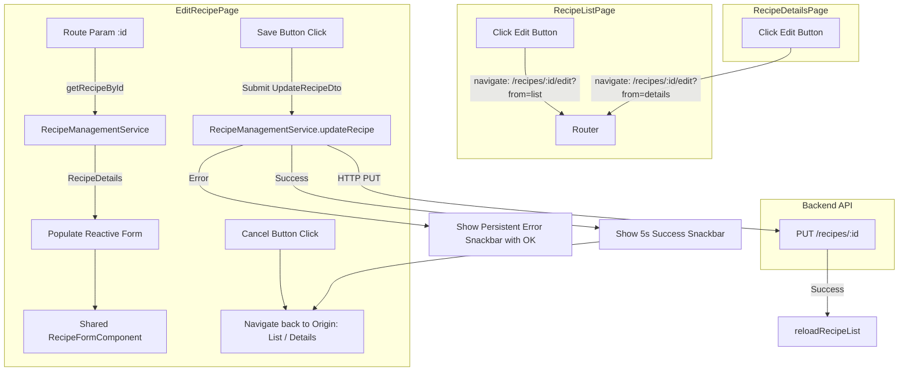

# Requirements

### Overview & Goals
Implement the "Edit Recipe Page" feature within the `recipes` module of the `web` Angular application as specified in `.junie/specs/edit-recipe-page.md`. The feature allows users to load an existing recipe by its ID, view and modify its metadata (name, cuisine, category, description, servings), and edit, add, remove, and reorder its cooking stages, steps, and ingredients using drag-and-drop. Common parts of the recipe form between create and edit pages will be extracted into shared components to ensure maintainability and UI consistency.

### Scope
- **In Scope**:
  - `UpdateRecipeDto` and related stage/step/ingredient DTO types in `apps/web/src/recipes/models/update-recipe.types.ts`.
  - `RecipeManagementService` extension with `updateRecipe(id, recipe)` method that calls `PUT /recipes/${id}`, triggers `reloadRecipeList()`, and returns the updated `RecipeDetails`.
  - Extraction of common form components and business logic (`Recipe Info Card` and `Stages Section`) shared between `CreateRecipePage` and `EditRecipePage`.
  - `EditRecipePage` standalone component:
    - Loading recipe details by route param `id` via `RecipeManagementService.getRecipeById(id)`.
    - Loading and error states during initial recipe retrieval.
    - Form pre-population with existing metadata, stages, steps, and ingredients.
    - All validation rules based on API specifications.
    - Save button disabled when form is invalid or server request is pending.
    - Success snackbar with 5-second auto-dismiss and navigation back to either recipe list or recipe details page based on origin.
    - Error snackbar with persistent visibility and `OK` button on update failure.
    - Cancel button navigating back to origin page without modifying data.
  - Route configuration for `/recipes/:id/edit` in `apps/web/src/recipes/recipes.routes.ts`.
  - Update `RecipeListPage` to navigate to `/recipes/:id/edit` on clicking the edit action.
  - Update `RecipeDetailsPage` to navigate to `/recipes/:id/edit` on clicking the edit action.
  - Unit tests for service, shared form components, `EditRecipePage`, `RecipeListPage`, and `RecipeDetailsPage`.

- **Out of Scope**:
  - Backend API changes (the NestJS `PUT /recipes/:id` endpoint and `UpdateRecipeDto` are already implemented in `apps/api`).
  - Image upload or media management for recipes.
  - Deletion of recipes inside the edit page (already handled by dedicated dialog in list/details pages).

### User Stories
- **As a cook/user**, I want to edit an existing recipe's metadata (name, cuisine, category, servings, description) so that I can keep recipe details accurate and up to date.
- **As a cook/user**, I want to modify, add, remove, and reorder cooking stages, steps, and ingredients in an intuitive drag-and-drop form so that I can refine recipes over time.
- **As a cook/user**, I want the edit page to navigate me back to where I came from (recipe list or recipe details) after saving or canceling, so that my workflow remains seamless.
- **As a cook/user**, I want clear snackbar feedback when my update succeeds or fails so that I know the status of my changes.

### Functional Requirements
1. **RecipeManagementService**:
   - Add `updateRecipe(id: string, recipe: UpdateRecipeDto): Observable<RecipeDetails>` method.
   - Send HTTP `PUT /recipes/${id}` with `UpdateRecipeDto` body.
   - Call `reloadRecipeList()` on success to keep cached/subscribed lists up to date.
   - Return updated `RecipeDetails` observable and propagate errors on failure.
2. **Component Extraction & Reuse**:
   - Extract common form structures and business logic for `Recipe Info Card` and `Stages Section` into reusable components in `apps/web/src/recipes/components/`.
   - Refactor `CreateRecipePage` to consume the extracted component without regression.
   - Use the shared component in `EditRecipePage`.
3. **Edit Recipe Page Component**:
   - Registered at route `/recipes/:id/edit`.
   - Reads `id` from route parameters and fetches recipe data using `RecipeManagementService.getRecipeById(id)`.
   - Handles loading state with a spinner/skeleton and error state if recipe cannot be loaded.
   - Populates form with existing values, including nested stages, steps, and ingredients.
   - Validates all form inputs:
     - `name`: Required, non-empty.
     - `cuisine`: Required, non-empty.
     - `category`: Required, non-empty.
     - `servings`: Required, integer >= 1.
     - `description`: Optional string.
     - Stage `name`: Required, non-empty.
     - Step `name`: Required, non-empty; `description`: string.
     - Ingredient `name`: Required, non-empty; `quantity`: Required >= 0; `unit`: Required `IngredientUnit`.
   - Save button disabled when form is invalid or `isSubmitting()`.
   - Cancel button navigates back to the previous page (origin: recipe list or recipe details).
4. **Snackbars & Navigation Flow**:
   - On successful update: Show snackbar message (e.g., `"Recipe updated successfully!"`) that automatically closes after 5 seconds (`duration: 5000`), and navigate back to either `/recipes` or `/recipes/:id` depending on where the user navigated from.
   - On update failure: Show snackbar with error message (e.g., `"Failed to update recipe. Please check your input and try again."`) and an `'OK'` button that stays open until dismissed or resubmitted.
5. **Origin Tracking**:
   - From `RecipeListPage`: Navigate with state/query parameter (`from: 'list'`) to `/recipes/:id/edit`.
   - From `RecipeDetailsPage`: Navigate with state/query parameter (`from: 'details'`) to `/recipes/:id/edit`.
   - `EditRecipePage` reads the origin parameter (defaulting to `/recipes/:id` if not specified) to determine return destination.

### Non-Functional Requirements
- **Design System**: Angular Material 3 (`@angular/material`) and Angular CDK (`@angular/cdk`).
- **Architecture**: Standalone components, `ChangeDetectionStrategy.OnPush`, Signal-based component state, and `readonly` arrow function methods adhering to codebase conventions.

# Technical Design

### Current Implementation
- **Backend API** (`apps/api/src/app/recipes/recipes.controller.ts`):
  - `PUT /recipes/:id` accepts `UpdateRecipeDto` and returns `RecipeWithDetails`.
  - Validation rules defined via `class-validator` in `apps/api/src/app/recipes/dto/update-recipe.dto.ts`.
- **Frontend Service** (`apps/web/src/recipes/services/recipe-management/recipe-management.service.ts`):
  - Provides `getRecipeById(id: string): Observable<RecipeDetails>` (`GET /recipes/${id}`).
  - Provides `reloadRecipeList()` to refresh `filters$` and `recipes$` streams.
  - Currently lacks `updateRecipe` method.
- **Frontend Pages**:
  - `CreateRecipePage` (`apps/web/src/recipes/pages/create-recipe/create-recipe.page.ts`): contains inline form construction, autocompletes, and drag-and-drop stages/steps/ingredients accordion.
  - `RecipeListPage` (`apps/web/src/recipes/pages/recipe-list/recipe-list.page.ts`): contains placeholder `onEditRecipe(recipe)` method.
  - `RecipeDetailsPage` (`apps/web/src/recipes/pages/recipe-details/recipe-details.page.ts`): contains placeholder `onEditRecipe()` method.
- **Routing** (`apps/web/src/recipes/recipes.routes.ts`):
  - Defines routes `''` (`RecipeListPage`), `'new'` (`CreateRecipePage`), and `':id'` (`RecipeDetailsPage`).

### Key Decisions
- **Shared Form Component Extraction**: Extract `RecipeFormComponent` (incorporating `Recipe Info Card` and `Stages Section` with drag-and-drop operations, autocompletes, and form control helpers) under `apps/web/src/recipes/components/recipe-form/`. Both `CreateRecipePage` and `EditRecipePage` wrap this component with page-specific headers, submission endpoints, and navigation logic.
- **Origin-Aware Navigation**: Pass navigation context (e.g. `queryParams: { returnTo: 'list' | 'details' }` or router state) when navigating to `/recipes/:id/edit` from `RecipeListPage` and `RecipeDetailsPage`. If direct navigation occurs or state is absent, default back navigation to the recipe details page `/recipes/:id`.
- **Form Initialization & Hydration**: Build helper utilities to map `RecipeDetails` into `FormGroup` / `FormArray` structures, setting initial values and preserving stage/step/ingredient ordering.
- **Readonly Arrow Functions & OnPush**: Implement all component and service methods as `readonly` arrow function properties with `ChangeDetectionStrategy.OnPush` matching existing project conventions.

### Proposed Changes
1. **Types (`apps/web/src/recipes/models/update-recipe.types.ts`)**:
   - Define `UpdateRecipeDto`, `UpdateRecipeStageDto`, `UpdateCookingStepDto`, `UpdateIngredientDto`.
2. **RecipeManagementService (`apps/web/src/recipes/services/recipe-management/recipe-management.service.ts`)**:
   - Add `readonly updateRecipe = (id: string, recipe: UpdateRecipeDto): Observable<RecipeDetails> => ...`.
   - Call `PUT /recipes/${id}` and invoke `reloadRecipeList()` via `tap()`.
3. **Common Recipe Form Component (`apps/web/src/recipes/components/recipe-form/recipe-form.component.ts`)**:
   - Encapsulates "Recipe Info Card" with autocompletes for cuisine/category.
   - Encapsulates "Stages Section" with drag-and-drop reordering, step & ingredient managers.
   - Exposes inputs for form group / initial data and output events if needed, or operates on a provided reactive `FormGroup`.
4. **CreateRecipePage (`apps/web/src/recipes/pages/create-recipe/create-recipe.page.ts`)**:
   - Refactored to use the extracted `RecipeFormComponent`.
5. **EditRecipePage (`apps/web/src/recipes/pages/edit-recipe/edit-recipe.page.ts`)**:
   - Loads recipe by ID on init.
   - Displays loading / error / form states.
   - Calls `RecipeManagementService.updateRecipe` on submit.
   - Shows 5-second auto-closing success snackbar and persistent error snackbar with `OK` button.
   - Navigates back based on origin.
6. **Routes & Existing Pages**:
   - Register `{ path: ':id/edit', component: EditRecipePage }` in `recipes.routes.ts`.
   - Implement `onEditRecipe` in `RecipeListPage` and `RecipeDetailsPage`.

### Architecture Diagram


### Data Models / Contracts
```typescript
import { IngredientUnit } from './create-recipe.types';

export interface UpdateIngredientDto {
  id?: string;
  name: string;
  quantity: number;
  unit: IngredientUnit;
  order?: number;
}

export interface UpdateCookingStepDto {
  id?: string;
  name: string;
  description: string;
  order?: number;
}

export interface UpdateRecipeStageDto {
  id?: string;
  name: string;
  order?: number;
  steps: UpdateCookingStepDto[];
  ingredients: UpdateIngredientDto[];
}

export interface UpdateRecipeDto {
  name: string;
  cuisine: string;
  category: string;
  description: string;
  servings: number;
  stages: UpdateRecipeStageDto[];
}
```

### Components
- **`RecipeFormComponent`** (`apps/web/src/recipes/components/recipe-form/recipe-form.component.ts`):
  - Shared reactive form UI for recipe metadata, stages accordion, steps, ingredients, autocompletes, and drag-and-drop reordering.
- **`CreateRecipePage`** (`apps/web/src/recipes/pages/create-recipe/create-recipe.page.ts`):
  - Consumes `RecipeFormComponent` for recipe creation.
- **`EditRecipePage`** (`apps/web/src/recipes/pages/edit-recipe/edit-recipe.page.ts`):
  - Loads recipe by ID, feeds data into `RecipeFormComponent`, manages update submission, snackbars, and origin navigation.
- **`RecipeListPage`** (`apps/web/src/recipes/pages/recipe-list/recipe-list.page.ts`):
  - Navigates to edit route on edit button click.
- **`RecipeDetailsPage`** (`apps/web/src/recipes/pages/recipe-details/recipe-details.page.ts`):
  - Navigates to edit route on edit button click.

### File Structure
- `apps/web/src/recipes/models/update-recipe.types.ts` (new)
- `apps/web/src/recipes/components/recipe-form/recipe-form.component.ts` (new)
- `apps/web/src/recipes/components/recipe-form/recipe-form.component.html` (new)
- `apps/web/src/recipes/components/recipe-form/recipe-form.component.scss` (new)
- `apps/web/src/recipes/components/recipe-form/recipe-form.component.spec.ts` (new)
- `apps/web/src/recipes/pages/edit-recipe/edit-recipe.page.ts` (new)
- `apps/web/src/recipes/pages/edit-recipe/edit-recipe.page.html` (new)
- `apps/web/src/recipes/pages/edit-recipe/edit-recipe.page.scss` (new)
- `apps/web/src/recipes/pages/edit-recipe/edit-recipe.page.spec.ts` (new)
- `apps/web/src/recipes/pages/create-recipe/create-recipe.page.ts` (modified - refactored to use shared component)
- `apps/web/src/recipes/pages/create-recipe/create-recipe.page.html` (modified)
- `apps/web/src/recipes/pages/recipe-list/recipe-list.page.ts` (modified)
- `apps/web/src/recipes/pages/recipe-list/recipe-list.page.spec.ts` (modified)
- `apps/web/src/recipes/pages/recipe-details/recipe-details.page.ts` (modified)
- `apps/web/src/recipes/pages/recipe-details/recipe-details.page.spec.ts` (modified)
- `apps/web/src/recipes/services/recipe-management/recipe-management.service.ts` (modified)
- `apps/web/src/recipes/services/recipe-management/recipe-management.service.spec.ts` (modified)
- `apps/web/src/recipes/recipes.routes.ts` (modified)

### Risks
- **Route Segment Collision in Angular Router**: `:id/edit` must be declared before `:id` or properly configured in `recipes.routes.ts` so that `:id` does not greedily swallow `:id/edit`. *Mitigation*: Register `{ path: ':id/edit', component: EditRecipePage }` prior to `{ path: ':id', component: RecipeDetailsPage }`.
- **FormArray Desynchronization during Pre-population**: Pre-populating nested `FormArray`s with stages, steps, and ingredients must preserve array instances and order index. *Mitigation*: Create dedicated builder functions to instantiate and populate `FormGroup` items iteratively with exact order values.
- **Origin Lost on Page Refresh**: If the user refreshes `/recipes/:id/edit`, router history state may be lost. *Mitigation*: Fall back gracefully to `/recipes/:id` or `/recipes` when origin state is undefined.

# Testing

### Validation Approach
Verify all unit components, service methods, routing, and form interactions using Jest and Angular `TestBed`. Ensure both isolated component unit tests and interaction workflows (form manipulation, CDK drag-and-drop, HTTP calls, snackbars, and navigation) are comprehensively tested.

### Key Scenarios
1. **RecipeManagementService.updateRecipe**:
   - Sends `PUT /recipes/${id}` with exact `UpdateRecipeDto` body.
   - Invokes `reloadRecipeList()` on success and emits updated `RecipeDetails`.
   - Propagates HTTP error if API call fails without calling `reloadRecipeList()`.
2. **EditRecipePage Initialization & Data Loading**:
   - Displays loading indicator while fetching recipe details.
   - Fetches recipe by ID from route parameters.
   - Populates form fields (name, cuisine, category, description, servings, stages, steps, ingredients) matching fetched data.
   - Displays error message/state if recipe fails to load.
3. **Form Validation & Save State**:
   - Save button is enabled when populated with valid recipe data and disabled when any required field is empty/invalid.
   - Save button is disabled while `isSubmitting()` is true.
4. **Submission, Snackbars & Return Navigation**:
   - Submitting a valid update calls `updateRecipe(id, payload)`.
   - On success: shows 5-second auto-closing snackbar and navigates to originating page (`/recipes` if from list, `/recipes/:id` if from details).
   - On error: shows persistent error snackbar with `OK` button; stays visible until user clicks `OK` or resubmits.
   - Clicking Cancel navigates back to origin without submitting.
5. **Navigation Handlers in List and Details**:
   - `RecipeListPage.onEditRecipe` navigates to `['/recipes', recipe.id, 'edit']` with origin context.
   - `RecipeDetailsPage.onEditRecipe` navigates to `['/recipes', currentRecipe.id, 'edit']` with origin context.
6. **Refactored CreateRecipePage**:
   - Verify all existing `CreateRecipePage` test scenarios continue to pass seamlessly with the extracted component.

### Edge Cases
- Recipe ID does not exist (404 error during load) -> Show user-friendly error state with option to navigate back.
- No stages or empty steps/ingredients during edit -> Ensure user can add/remove stages dynamically.
- Origin state missing (e.g., direct navigation via URL) -> Default navigation targets recipe details page `/recipes/:id`.

### Test Changes
- `apps/web/src/recipes/services/recipe-management/recipe-management.service.spec.ts`: Add tests for `updateRecipe`.
- `apps/web/src/recipes/pages/edit-recipe/edit-recipe.page.spec.ts`: Add test suite for `EditRecipePage` covering loading, pre-population, validation, submit/cancel, snackbars, and navigation.
- `apps/web/src/recipes/components/recipe-form/recipe-form.component.spec.ts`: Add test suite for the extracted shared form component.
- `apps/web/src/recipes/pages/recipe-list/recipe-list.page.spec.ts`: Update tests to verify `onEditRecipe` navigates to edit page.
- `apps/web/src/recipes/pages/recipe-details/recipe-details.page.spec.ts`: Update tests to verify `onEditRecipe` navigates to edit page.

# Delivery Steps

### ✓ Step 1: Add updateRecipe method and DTO models in RecipeManagementService
RecipeManagementService exposes updateRecipe for persisting recipe modifications, supported by strongly-typed update DTOs and verified unit tests.

- Define `UpdateRecipeDto`, `UpdateRecipeStageDto`, `UpdateCookingStepDto`, `UpdateIngredientDto` interfaces in `apps/web/src/recipes/models/update-recipe.types.ts` matching the backend API contracts.
- Add `updateRecipe = (id: string, recipe: UpdateRecipeDto): Observable<RecipeDetails>` method as a readonly arrow function property in `RecipeManagementService` (`apps/web/src/recipes/services/recipe-management/recipe-management.service.ts`).
- Ensure `updateRecipe` issues `PUT /recipes/${id}`, reloads recipe list on success via `this.reloadRecipeList()`, returns the updated `RecipeDetails`, and propagates any HTTP errors.
- Add comprehensive unit tests in `apps/web/src/recipes/services/recipe-management/recipe-management.service.spec.ts` testing HTTP PUT call structure, payload serialization, list reload invocation, and error handling.

### ✓ Step 2: Extract common recipe form and stages components
Common UI and drag-and-drop logic for Recipe Info and Stages are extracted into reusable components, simplifying both creation and edit flows.

- Create `RecipeFormComponent` (or `RecipeInfoCardComponent` and `RecipeStagesSectionComponent`) under `apps/web/src/recipes/components/` to encapsulate:
  - "Recipe Info Card": name, servings, cuisine and category with autocompletes, description.
  - "Stages Section": expansion panel accordion, stage name inputs, CDK drag-and-drop handles and list reordering for stages, cooking steps, and ingredients, unit selectors (`GRAMS`, `ITEM_COUNT`), and add/remove buttons.
  - Helper logic for constructing and managing stage/step/ingredient `FormGroup` and `FormArray` instances.
- Refactor `CreateRecipePage` (`apps/web/src/recipes/pages/create-recipe/create-recipe.page.ts` and `.html`) to consume the extracted common component(s) without altering its external behavior or test contracts.
- Ensure all component tests in `apps/web/src/recipes/pages/create-recipe/create-recipe.page.spec.ts` continue to pass.

### ✓ Step 3: Implement EditRecipePage component and route
The Edit Recipe page loads recipe data by ID, presents pre-populated editable form fields, and handles save/cancel actions.

- Create `EditRecipePage` standalone component in `apps/web/src/recipes/pages/edit-recipe/` (`edit-recipe.page.ts`, `.html`, `.scss`, `.spec.ts`) with `ChangeDetectionStrategy.OnPush` and readonly arrow function methods.
- Retrieve the recipe ID from route params (`/recipes/:id/edit`) and fetch data using `RecipeManagementService.getRecipeById(id)`.
- Implement loading spinner and error states for fetching recipe details.
- Populate reactive form controls and nested stages/steps/ingredients arrays upon successful fetch.
- Add form action buttons: Save (disabled when form is invalid or `isSubmitting()`) and Cancel.
- Configure route `{ path: ':id/edit', component: EditRecipePage }` in `apps/web/src/recipes/recipes.routes.ts`.

### ✓ Step 4: Wire navigation, notifications, origin-based return, and unit tests
Edit navigation is connected across list/details pages, snackbars provide feedback, and origin-based return routing is verified by tests.

- Update `onEditRecipe(recipe: RecipeListItem)` in `apps/web/src/recipes/pages/recipe-list/recipe-list.page.ts` to navigate to `['/recipes', recipe.id, 'edit']` with query params or state indicating navigation origin (`from: 'list'`).
- Update `onEditRecipe()` in `apps/web/src/recipes/pages/recipe-details/recipe-details.page.ts` to navigate to `['/recipes', currentRecipe.id, 'edit']` with query params or state indicating navigation origin (`from: 'details'`).
- In `EditRecipePage`, handle save submission:
  - On success: Show snackbar message with 5-second auto-dismiss (`{ duration: 5000 }`) and navigate back to either recipe list (`/recipes`) or recipe details (`/recipes/:id`) based on origin.
  - On error: Show snackbar with error message and persistent `OK` action button that stays visible until dismissed or re-submitted.
  - On Cancel: Navigate back to the originating page.
- Add unit tests in `apps/web/src/recipes/pages/edit-recipe/edit-recipe.page.spec.ts`, `apps/web/src/recipes/pages/recipe-list/recipe-list.page.spec.ts`, and `apps/web/src/recipes/pages/recipe-details/recipe-details.page.spec.ts`.