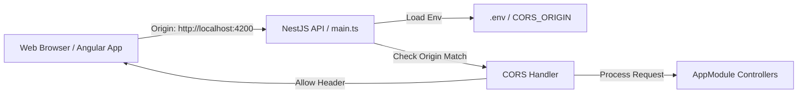

# Requirements

### Overview & Goals
The `api` NestJS application currently does not enable Cross-Origin Resource Sharing (CORS), preventing web frontends running on different origins (such as the Angular frontend at `http://localhost:4200`) from communicating with the API.

The goal is to configure CORS in `apps/api` such that:
1. CORS is enabled and accepts requests from a domain specified via `.env`.
2. The allowed domain defaults to `http://localhost:4200/` when no environment variable is provided.
3. Common discrepancies like trailing slashes in configured domain URLs do not break browser CORS origin checks.

### Scope
- **In Scope**:
  - Load environment variables in `apps/api/src/main.ts` via `dotenv/config`.
  - Enable CORS in NestJS using `app.enableCors(...)` with configurable origin and support for the default `http://localhost:4200/`.
  - Support origin normalization to match both `http://localhost:4200/` and `http://localhost:4200`.
  - Update `.env.example` to document `CORS_ORIGIN`.
  - Add E2E tests to validate CORS headers for preflight and standard requests with allowed and disallowed origins.
- **Out of Scope**:
  - Modifying Angular frontend code in `apps/web`.
  - Modifying authentication or database persistence logic in `libs/data-access` or `apps/api/src/app/auth`.

### User Stories
- **As a frontend developer**, I want the NestJS API to accept cross-origin requests from `http://localhost:4200` so that the web application can authenticate and interact with backend APIs without browser CORS errors.
- **As a DevOps / deployment engineer**, I want to configure the allowed CORS domain using the `.env` file so that different environments (local dev, staging, production) can restrict API access to their respective frontends.

### Functional Requirements
- **FR-1**: The API must read the allowed origin from `process.env['CORS_ORIGIN']`.
- **FR-2**: If `process.env['CORS_ORIGIN']` is not defined or empty, the API must default to `http://localhost:4200/`.
- **FR-3**: Origin comparison must normalize trailing slashes (browsers send `Origin: http://localhost:4200` without a trailing slash, whereas configuration may provide `http://localhost:4200/`).
- **FR-4**: The API must support HTTP preflight requests (`OPTIONS`) and return standard CORS headers (`Access-Control-Allow-Origin`, `Access-Control-Allow-Methods`, `Access-Control-Allow-Headers`, `Access-Control-Allow-Credentials`).
- **FR-5**: Requests originating from unconfigured domains must not receive `Access-Control-Allow-Origin` allowing their origin.

### Non-Functional Requirements
- **Security**: Prevent unrestricted wildcard (`*`) access when credentials or authenticated sessions are in use; restrict access strictly to the configured domain.
- **Maintainability**: Clear documentation of the new environment variable in `.env.example`.

# Technical Design

### Current Implementation
- `apps/api/src/main.ts` initializes the NestJS app with `NestFactory.create(AppModule)`, sets a global prefix `api`, enables `ValidationPipe`, and listens on `process.env.PORT || 3000`. No CORS configuration (`app.enableCors`) is currently applied.
- `.env.example` defines `DATABASE_URL`, `JWT_SECRET`, and `JWT_EXPIRES_IN`, but does not declare a CORS origin variable.

### Key Decisions
- **Decision 1: Environment Variable Name**: Use `CORS_ORIGIN` with default value `'http://localhost:4200/'`.
  - *Rationale*: Intuitive, standard naming convention in NestJS/Node.js ecosystems.
- **Decision 2: Origin Normalization**: Strip trailing slashes from the configured origin and the incoming `Origin` header during validation.
  - *Rationale*: Browsers send the `Origin` header without trailing slash (`http://localhost:4200`), while user configuration often includes it (`http://localhost:4200/`). Normalization guarantees compatibility without forcing rigid formatting.
- **Decision 3: Dotenv Loading in `main.ts`**: Add `import 'dotenv/config';` in `apps/api/src/main.ts`.
  - *Rationale*: Aligns with `prisma7.config.ts` and `prisma/seed.ts`, ensuring `.env` variables are accessible in all execution contexts.

### Proposed Changes
1. **`apps/api/src/main.ts`**:
   - Import `dotenv/config`.
   - Read `const corsOrigin = process.env['CORS_ORIGIN'] || 'http://localhost:4200/';`.
   - Normalize origin by removing trailing slashes: `const normalizedOrigin = corsOrigin.replace(/\/+$/, '');`.
   - Configure `app.enableCors({ origin: (origin, callback) => { ... }, credentials: true, methods: 'GET,HEAD,PUT,PATCH,POST,DELETE,OPTIONS', allowedHeaders: 'Content-Type,Authorization,Accept' })`.
2. **`.env.example`**:
   - Add `CORS_ORIGIN="http://localhost:4200/"`.
3. **`apps/api/src/app/cors.e2e.spec.ts`**:
   - Add integration tests verifying preflight `OPTIONS` and standard endpoints with various `Origin` headers.

### Architecture Diagram

### File Structure
- `apps/api/src/main.ts` (modified)
- `.env.example` (modified)
- `apps/api/src/app/cors.e2e.spec.ts` (added)

### Risks & Mitigations
- **Risk**: Trailing slash mismatch between `.env` and browser header causes requests to be rejected.
  - **Mitigation**: Implement origin trimming helper `replace(/\/+$/, '')` for comparison.
- **Risk**: Requests with no `Origin` header (e.g. mobile apps, server-to-server, curl) get blocked.
  - **Mitigation**: In the CORS origin callback, allow requests where `!origin` is true.

# Testing

### Validation Approach
Validate CORS functionality via automated integration tests in `apps/api` using `supertest` and NestJS `TestingModule`, covering preflight and standard requests against allowed, default, and unauthorized origins.

### Key Scenarios
1. **Default Allowed Origin**:
   - Send request with `Origin: http://localhost:4200`.
   - Expect `Access-Control-Allow-Origin: http://localhost:4200` in response headers.
2. **Preflight OPTIONS Request**:
   - Send `OPTIONS` request to `/api/auth/login` with `Origin: http://localhost:4200`, `Access-Control-Request-Method: POST`, `Access-Control-Request-Headers: Content-Type`.
   - Expect 200 or 204 status with matching `Access-Control-Allow-Origin`, `Access-Control-Allow-Methods`, and `Access-Control-Allow-Headers`.
3. **Custom Configured Origin**:
   - Set `process.env['CORS_ORIGIN'] = 'https://app.example.com/'`.
   - Send request with `Origin: https://app.example.com`.
   - Expect `Access-Control-Allow-Origin: https://app.example.com`.
4. **Disallowed Origin**:
   - Send request with `Origin: http://unauthorized-domain.com`.
   - Expect request to either fail CORS or not include `Access-Control-Allow-Origin: http://unauthorized-domain.com`.
5. **No Origin Header**:
   - Send direct request without `Origin` header.
   - Expect normal 200 response without CORS failure.

### Test Changes
- Create `apps/api/src/app/cors.e2e.spec.ts` to test all scenarios programmatically using Jest and Supertest.

# Delivery Steps

### ✓ Step 1: Configure CORS environment variables and documentation
Environment configuration and documentation are in place for API CORS settings.

- Add `CORS_ORIGIN="http://localhost:4200/"` to `.env.example` to document the environment variable.
- Ensure `import 'dotenv/config';` is present at the top of `apps/api/src/main.ts` so environment variables from `.env` are loaded during local execution.

### ✓ Step 2: Implement CORS configuration and origin normalization in API bootstrap
The NestJS API application has CORS enabled with robust origin validation and fallback handling.

- Add origin normalization logic in `apps/api/src/main.ts` to support origins configured with or without trailing slashes (e.g., converting `http://localhost:4200/` to match `http://localhost:4200`).
- Configure `app.enableCors(...)` in `apps/api/src/main.ts` with `origin`, `credentials: true`, allowed methods (`GET,HEAD,PUT,PATCH,POST,DELETE,OPTIONS`), and allowed headers (`Content-Type,Authorization,Accept`).
- Default to `http://localhost:4200/` when `process.env['CORS_ORIGIN']` is not set.

### ✓ Step 3: Add E2E and integration tests for CORS validation
Automated integration and E2E tests verify CORS behavior across allowed, default, and unauthorized origins.

- Create `apps/api/src/app/cors.e2e.spec.ts` using Supertest to test preflight `OPTIONS` requests and regular HTTP requests.
- Verify that requests from `http://localhost:4200` receive proper `Access-Control-Allow-Origin` and `Access-Control-Allow-Credentials` headers.
- Verify that requests from unauthorized origins do not receive CORS allow headers.
- Verify that custom origins configured via environment variables are respected.