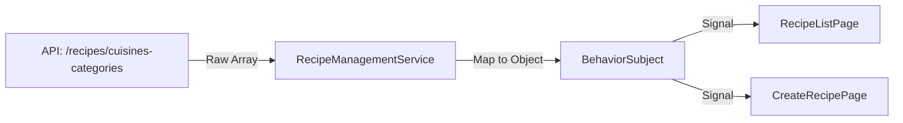

# Requirements

### Overview & Goals
The objective is to fix a bug where cuisine and category select boxes on `RecipeListPage` and `CreateRecipePage` are empty despite a functional API. The root cause is a mismatch between the API's response format (an array of objects) and the frontend's expected format (a single object with lookup maps).

### Scope
- **In Scope**:
    - Updating data models to include the API response structure.
    - Modifying `RecipeManagementService` to map the API response.
    - Updating unit tests to reflect the API contract.
- **Out of Scope**:
    - Backend changes to the API response format.
    - UI changes to the select boxes or filters beyond data binding fixes.

### User Stories
- As a user, I want to filter recipes by cuisine and category so that I can find specific dishes more easily.
- As a user, I want to see available categories for a selected cuisine when creating a recipe so that I can categorize it correctly.

# Technical Design

### Current Implementation
- `RecipeManagementService` fetches `/recipes/cuisines-categories` using `http.get<CuisinesCategoriesResponse>`.
- `CuisinesCategoriesResponse` expects `{ cuisines: string[], categories: Record<string, string[]> }`.
- The API actually returns `Array<{ cuisine: string, categories: string[] }>`.

### Proposed Changes
1. **Model Update**: Introduce `RawCuisinesCategoriesItem` interface in `recipe-list.types.ts`.
2. **Service Mapping**:
    - Update `RecipeManagementService.reloadCuisinesCategories` to use `http.get<RawCuisinesCategoriesItem[]>`.
    - Use RxJS `map` operator to transform the array into the expected `CuisinesCategoriesResponse` structure.
3. **Test Alignment**: Update `recipe-management.service.spec.ts` to provide mock data in the raw API format.

### Architecture Diagram
The following diagram shows the data flow from the API through the service mapping to the UI components.

### File Structure
- `apps/web/src/recipes/models/recipe-list.types.ts`: Update interfaces.
- `apps/web/src/recipes/services/recipe-management/recipe-management.service.ts`: Update fetch and mapping logic.
- `apps/web/src/recipes/services/recipe-management/recipe-management.service.spec.ts`: Update mock data and tests.

# Testing

### Validation Approach
Verification will be performed through unit tests to ensure the mapping logic works correctly and the components receive the expected data format.

### Key Scenarios
- **Data Loading**: Ensure that calling `reloadCuisinesCategories` results in the `cuisinesCategories$` subject emitting the correctly mapped object.
- **Component Binding**: Verify that `RecipeListPage` and `CreateRecipePage` successfully populate their select boxes with data from the service.

### Edge Cases
- **Empty Response**: Handle cases where the API returns an empty array.
- **Error Handling**: Ensure the service gracefully handles API errors without breaking the UI state.

# Delivery Steps

### ✓ Step 1: Update data models for cuisine and category data
The data models are updated to include the raw API response structure while maintaining the internal application state representation.

- Add `RawCuisinesCategoriesItem` interface to `apps/web/src/recipes/models/recipe-list.types.ts`.
- Ensure it matches the API format: `Array<{ cuisine: string, categories: string[] }>`.

### ✓ Step 2: Update RecipeManagementService to map API response
The service now correctly handles the API response format and maps it to the internal format used by components.

- Modify `reloadCuisinesCategories` in `RecipeManagementService` to fetch data as `RawCuisinesCategoriesItem[]`.
- Implement a mapping function to transform the raw array into the `CuisinesCategoriesResponse` object expected by the UI.
- Update the initial value of `cuisinesCategories$` BehaviorSubject if necessary.

### ✓ Step 3: Update service tests and verify components
The unit tests are updated to reflect the new API contract while ensuring existing functionality remains intact.

- Update `RecipeManagementService` unit tests in `recipe-management.service.spec.ts`.
- Change mock data and HTTP expectations to use the raw API format for `flush` operations.
- Verify that the service still emits data in the internal `CuisinesCategoriesResponse` format to the subscribers.
- Run all related tests for `RecipeListPage` and `CreateRecipePage` to ensure full end-to-end compatibility.