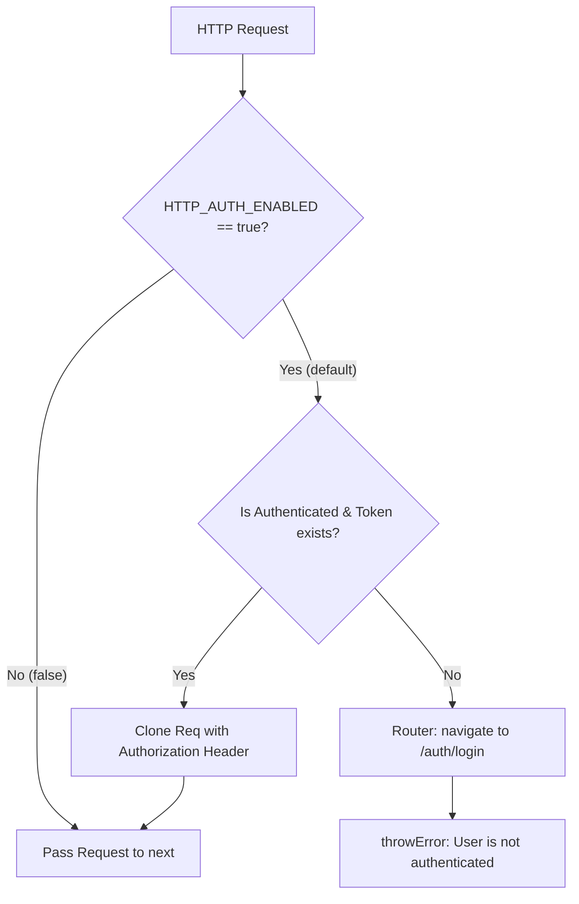

# Requirements

### Overview & Goals
Introduce a functional HTTP interceptor (`authInterceptor`) in the `auth` feature of the `web` application to centralize JWT authorization header injection and unauthorized request handling. Configure HTTP requests across the application to automatically attach bearer tokens by default, while allowing public endpoints (such as `/auth/login`) to opt out using an HTTP context token (`HTTP_AUTH_ENABLED`) placed in a dedicated types file to decouple services from the interceptor implementation.

### Scope
- **In Scope**:
  - `HTTP_AUTH_ENABLED`: `HttpContextToken<boolean>` with default value `true` in `apps/web/src/auth/interceptors/auth/auth.interceptor.types.ts`.
  - `authInterceptor`: Functional interceptor (`HttpInterceptorFn`) in `apps/web/src/auth/interceptors/auth/auth.interceptor.ts`.
  - Application configuration update in `apps/web/src/app/app.config.ts` to register `withInterceptors([ authInterceptor ])`.
  - `AuthenticationService` updates:
    - Pass `HTTP_AUTH_ENABLED = false` in `login()` request context, imported from `auth.interceptor.types.ts`.
    - Remove manual `Authorization` header creation in `changePassword()`.
  - Comprehensive unit test suite for `authInterceptor` and updated unit tests for `AuthenticationService`.
- **Out of Scope**:
  - Token refresh/rotation flows (not currently part of API or frontend specs).
  - Backend API changes (backend JWT authentication is already implemented).

### User Stories
- As an authenticated user, I want my HTTP requests to automatically include my JWT token so that I can access protected endpoints without individual services manually attaching headers.
- As an unauthenticated user attempting to make a protected request, I want to be redirected to the login page and have the request fail securely.
- As a developer, I want public HTTP requests (like login) to easily bypass authorization header injection using standard Angular `HttpContextToken` without importing the full interceptor implementation into services.

### Functional Requirements
- **HTTP Context Token**:
  - Define `HTTP_AUTH_ENABLED` using `HttpContextToken<boolean>` with a default factory returning `true` in `apps/web/src/auth/interceptors/auth/auth.interceptor.types.ts`.
- **Interception Logic**:
  - Read `req.context.get(HTTP_AUTH_ENABLED)`.
  - If `false`: Forward request unchanged via `next(req)`.
  - If `true`:
    - Retrieve authentication state from `AuthenticationService`.
    - If `state.isAuthenticated === false` or `state.token === null`:
      - Programmatically redirect user to `/auth/login` using `Router.navigate(['/auth', 'login'])`.
      - Return an error observable (`throwError(() => new Error('User is not authenticated'))`).
    - If authenticated with a valid token:
      - Clone the request adding `Authorization: 'Bearer ' + token` header.
      - Forward the cloned request to `next(clonedReq)`.
- **Authentication Service Updates**:
  - In `login(email, password)`: Pass `{ context: new HttpContext().set(HTTP_AUTH_ENABLED, false) }` in `HttpClient.post`.
  - In `changePassword(password)`: Remove manual `{ headers: { Authorization: ... } }` parameter.
- **Application Configuration**:
  - Update `appConfig` in `apps/web/src/app/app.config.ts` to configure `provideHttpClient(withFetch(), withInterceptors([ authInterceptor ]))`.

### Non-Functional Requirements
- **Framework Compatibility**: Use Angular 22 standalone functional interceptor patterns (`HttpInterceptorFn`, `withInterceptors`, `HttpContextToken`).
- **Clean Architecture & Code Style**: Isolate context tokens in separate `.types.ts` files to prevent circular dependencies and unnecessary module loading. Follow formatting standards enforced by `dprint`.

# Technical Design

### Current Implementation
- `apps/web/src/app/app.config.ts`: Configures `provideHttpClient(withFetch())` without interceptors.
- `apps/web/src/auth/services/authentication/authentication.service.ts`:
  - `state$` holds `BehaviorSubject<AuthState>`.
  - `login()` performs POST without context options.
  - `changePassword()` reads `this.state$.value.token` and manually constructs `{ headers: { Authorization: ... } }`.
- `apps/web/src/system/guards/auth-guard/auth.guard.ts`: Uses `AuthenticationService.state()` to guard protected routes and redirect unauthenticated users to `['/auth', 'login']`.

### Key Decisions
- **Decoupled Token Definition in `auth.interceptor.types.ts`**: Placing `HTTP_AUTH_ENABLED` in a separate `auth.interceptor.types.ts` file avoids circular dependencies (`AuthenticationService` <-> `authInterceptor`) and prevents services from loading the full interceptor logic just to reference the context token.
- **Functional Interceptor (`HttpInterceptorFn`)**: Angular 15+ functional interceptors provide direct dependency injection with `inject()` and integrate seamlessly with `provideHttpClient(withInterceptors([...]))`.
- **Request Context via `HttpContextToken`**: Standard Angular pattern for per-request configuration flags. `HTTP_AUTH_ENABLED` defaults to `true` so all existing and future requests automatically attach authentication headers unless explicitly disabled.
- **RxJS Pipeline for Auth State**: Inspect `authenticationService.state()` using `take(1)` and `switchMap` to synchronously and safely read the latest auth state and determine whether to attach the header or trigger redirection and error propagation.

### Architecture Diagram



### Proposed Changes

#### 1. Auth Context Token (`apps/web/src/auth/interceptors/auth/auth.interceptor.types.ts`)
```ts
import { HttpContextToken } from '@angular/common/http';

export const HTTP_AUTH_ENABLED = new HttpContextToken<boolean>(() => true);
```

#### 2. Auth Interceptor (`apps/web/src/auth/interceptors/auth/auth.interceptor.ts`)
```ts
import { HttpInterceptorFn } from '@angular/common/http';
import { inject } from '@angular/core';
import { Router } from '@angular/router';
import { switchMap, take, throwError } from 'rxjs';
import { AuthenticationService } from '../../services/authentication/authentication.service';
import { HTTP_AUTH_ENABLED } from './auth.interceptor.types';

export const authInterceptor: HttpInterceptorFn = (req, next) => {
  const isAuthEnabled = req.context.get(HTTP_AUTH_ENABLED);

  if (!isAuthEnabled) {
    return next(req);
  }

  const authenticationService = inject(AuthenticationService);
  const router = inject(Router);

  return authenticationService.state().pipe(
    take(1),
    switchMap(state => {
      if (!state.isAuthenticated || !state.token) {
        router.navigate([ '/auth', 'login' ]);
        return throwError(() => new Error('User is not authenticated'));
      }

      const authReq = req.clone({
        setHeaders: {
          Authorization: `Bearer ${state.token}`
        }
      });

      return next(authReq);
    })
  );
};
```

#### 3. Application Config (`apps/web/src/app/app.config.ts`)
```ts
import { provideHttpClient, withFetch, withInterceptors } from '@angular/common/http';
import { ApplicationConfig, provideBrowserGlobalErrorListeners } from '@angular/core';
import { provideAnimationsAsync } from '@angular/platform-browser/animations/async';
import { provideRouter } from '@angular/router';
import { authInterceptor } from '../auth/interceptors/auth/auth.interceptor';
import { appRoutes } from './app.routes';

export const appConfig: ApplicationConfig = {
  providers: [
    provideBrowserGlobalErrorListeners(),
    provideRouter(appRoutes),
    provideHttpClient(withFetch(), withInterceptors([ authInterceptor ])),
    provideAnimationsAsync()
  ]
};
```

#### 4. Authentication Service (`apps/web/src/auth/services/authentication/authentication.service.ts`)
- Import `HttpContext` from `@angular/common/http` and `HTTP_AUTH_ENABLED` from `../../interceptors/auth/auth.interceptor.types`.
- In `login`:
  ```ts
  readonly login = (email: string, password: string): Observable<{ forcePasswordChange: boolean; }> => {
    const url = `${environment.apiUrl}/auth/login`;

    return this.http
      .post<{ token: string; forcePasswordChange: boolean; }>(
        url,
        { email, password },
        { context: new HttpContext().set(HTTP_AUTH_ENABLED, false) }
      )
      .pipe(
        map(response => {
          this.updateState({ isAuthenticated: true, token: response.token });

          return { forcePasswordChange: response.forcePasswordChange };
        }),
        catchError(error => throwError(() => error))
      );
  };
  ```
- In `changePassword`:
  ```ts
  readonly changePassword = (password: string): Observable<boolean> => {
    const url = `${environment.apiUrl}/auth/change-password`;

    return this.http
      .post<{ message: string; }>(url, { password })
      .pipe(
        map(() => true),
        catchError(error => throwError(() => error))
      );
  };
  ```

### File Structure
- Added: `apps/web/src/auth/interceptors/auth/auth.interceptor.types.ts`
- Added: `apps/web/src/auth/interceptors/auth/auth.interceptor.ts`
- Added: `apps/web/src/auth/interceptors/auth/auth.interceptor.spec.ts`
- Modified: `apps/web/src/app/app.config.ts`
- Modified: `apps/web/src/auth/services/authentication/authentication.service.ts`
- Modified: `apps/web/src/auth/services/authentication/authentication.service.spec.ts`

# Testing

### Validation Approach
Automated unit tests using Jest and Angular's `HttpTestingController` / `provideHttpClientTesting()` to validate all interceptor behaviors and verify `AuthenticationService` adjustments.

### Key Scenarios
- **Default Protected Request (Authenticated)**:
  - When user is logged in with token `'test-token'` and an HTTP request is made without explicit context, verify request received by `HttpTestingController` has `Authorization: Bearer test-token`.
- **Public Request (HTTP_AUTH_ENABLED = false)**:
  - When a request is made with `context: new HttpContext().set(HTTP_AUTH_ENABLED, false)`, verify request passes through without `Authorization` header even if a token is present in auth state.
- **Protected Request (Unauthenticated / Null Token)**:
  - When user is not authenticated or token is null and a protected request is initiated:
    - Verify `Router.navigate` is invoked with `['/auth', 'login']`.
    - Verify observable emits an error with message `'User is not authenticated'`.
    - Verify request is not forwarded to backend.
- **Login Endpoint**:
  - Verify `AuthenticationService.login()` sends request with `HTTP_AUTH_ENABLED` set to `false` in `req.request.context`.
- **Change Password Endpoint**:
  - Verify `AuthenticationService.changePassword()` sends request without manual headers.

### Test Changes
- `apps/web/src/auth/interceptors/auth/auth.interceptor.spec.ts`:
  - Unit tests testing `authInterceptor` with `TestBed`, `provideHttpClient(withInterceptors([authInterceptor]))`, and `provideHttpClientTesting()`.
- `apps/web/src/auth/services/authentication/authentication.service.spec.ts`:
  - Update `login` test to assert `req.request.context.get(HTTP_AUTH_ENABLED) === false` importing `HTTP_AUTH_ENABLED` from `auth.interceptor.types`.
  - Update `changePassword` test to remove assertion on manual header construction.

# Delivery Steps

### ✓ Step 1: Define HTTP_AUTH_ENABLED token in auth.interceptor.types.ts and implement authInterceptor
`HTTP_AUTH_ENABLED` token and `authInterceptor` are defined in separate files and ready for integration.

- Create `HTTP_AUTH_ENABLED` injection token as an `HttpContextToken<boolean>` with a default value of `true` in `apps/web/src/auth/interceptors/auth/auth.interceptor.types.ts`.
- Implement `authInterceptor` as an `HttpInterceptorFn` in `apps/web/src/auth/interceptors/auth/auth.interceptor.ts`:
  - Import `HTTP_AUTH_ENABLED` from `./auth.interceptor.types`.
  - Inspect `req.context.get(HTTP_AUTH_ENABLED)`. If `false`, pass the request through without modification via `next(req)`.
  - If `true`, retrieve the current authentication state from `AuthenticationService`.
  - If unauthenticated or token is `null`, navigate to `/auth/login` via `Router` and emit an error observable via `throwError`.
  - If authenticated with a valid token, clone the request with `Authorization: Bearer <token>` and forward to `next(authReq)`.

### ✓ Step 2: Configure app.config.ts and update AuthenticationService
The web application registers `authInterceptor` in its HTTP client configuration and `AuthenticationService` leverages the context token from `auth.interceptor.types.ts`.

- In `apps/web/src/app/app.config.ts`, add `withInterceptors([ authInterceptor ])` to the `provideHttpClient(...)` configuration.
- In `apps/web/src/auth/services/authentication/authentication.service.ts`:
  - Import `HTTP_AUTH_ENABLED` from `../../interceptors/auth/auth.interceptor.types`.
  - Update `login` method to supply `{ context: new HttpContext().set(HTTP_AUTH_ENABLED, false) }` in the POST request options.
  - Update `changePassword` method to remove manual `Authorization` header creation, relying on the default `HTTP_AUTH_ENABLED` behavior.

### ✓ Step 3: Add unit tests for authInterceptor and update AuthenticationService tests
The test suite verifies all interceptor scenarios and confirms `AuthenticationService` behavior with interceptor-driven headers.

- Create `apps/web/src/auth/interceptors/auth/auth.interceptor.spec.ts` with comprehensive unit tests:
  - Default request attaches `Authorization: Bearer <token>` when user is authenticated.
  - Request with `HTTP_AUTH_ENABLED = false` passes through unmodified with no authorization headers attached.
  - Request with `HTTP_AUTH_ENABLED = true` when user is unauthenticated or token is `null` redirects to `/auth/login` and emits an error.
- Update `apps/web/src/auth/services/authentication/authentication.service.spec.ts`:
  - Verify `login()` sends requests with `HTTP_AUTH_ENABLED` set to `false` in request context.
  - Verify `changePassword()` sends requests without manual headers.
- Run `npm run test` and `npm run lint` across the workspace to ensure all tests pass and code style is clean.