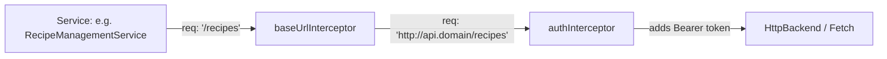

# Requirements

### Overview & Goals
The `web` application currently has services (`AuthenticationService` and `RecipeManagementService`) that manually prepend `environment().apiUrl` to endpoint paths when constructing HTTP requests. This manual URL building is error-prone, violates DRY principles, and makes endpoint refactoring harder.

The goal is to implement an Angular functional HTTP interceptor (`baseUrlInterceptor`) within the `system` feature that automatically prepends `environment().apiUrl` to all relative HTTP requests while preserving absolute URLs, and refactor existing services to use relative endpoint paths.

### Scope
- **In Scope**:
  - Implement `baseUrlInterceptor` (functional HTTP interceptor) in `apps/web/src/system/interceptors/base-url/base-url.interceptor.ts`.
  - Absolute URL detection (avoiding rewriting URLs like `http://`, `https://`, protocol-relative `//`).
  - Trailing and leading slash normalization to prevent duplicate `/` characters.
  - Register `baseUrlInterceptor` in `appConfig` (`apps/web/src/app/app.config.ts`) before any other interceptors (specifically before `authInterceptor`).
  - Refactor `AuthenticationService` and `RecipeManagementService` to use relative request paths.
  - Update corresponding unit tests for services and add unit tests for `baseUrlInterceptor`.
- **Out of Scope**:
  - Modifying backend API routes or server configuration.
  - Adding interceptors to other applications/libraries unless required for web.

### User Stories
- As a frontend developer, I want outgoing API requests to automatically target the configured `apiUrl` without manual string concatenation in every service, so that service code remains concise and maintainable.
- As a developer, I want third-party absolute HTTP requests to remain unaltered by the base URL interceptor, so that external API calls function correctly.

### Functional Requirements
1. **Absolute URL Detection**: Check whether a request URL starts with a protocol scheme (`http://`, `https://`) or double slashes (`//`). If absolute, forward the request without modifying the URL.
2. **Base URL Prepending**: For relative URLs, prepend `environment().apiUrl`.
3. **Slash Normalization**: Handle variations in trailing slash on `apiUrl` and leading slash on request path so that no double slash (e.g. `http://api.com//recipes`) occurs.
4. **Interceptor Ordering**: The base URL interceptor must be loaded first in the interceptor chain (`withInterceptors([ baseUrlInterceptor, authInterceptor ])`).
5. **Service Cleanup**: Remove manual references to `environment().apiUrl` across `AuthenticationService` and `RecipeManagementService`.

# Technical Design

### Current Implementation
- **Configuration**: `apps/web/src/app/app.config.ts` configures HTTP client using `provideHttpClient(withFetch(), withInterceptors([ authInterceptor ]))`.
- **Environment**: `apps/web/src/environments/environment.ts` provides `environment().apiUrl`.
- **Services**:
  - `apps/web/src/auth/services/authentication/authentication.service.ts` uses `${environment().apiUrl}/auth/login` and `${environment().apiUrl}/auth/change-password`.
  - `apps/web/src/recipes/services/recipe-management/recipe-management.service.ts` uses `${environment().apiUrl}/recipes`, `${environment().apiUrl}/recipes/cuisines-categories`, etc.

### Key Decisions
- **Functional Interceptor (`HttpInterceptorFn`)**: Follow Angular 18+ and project convention (similar to `authInterceptor`) using functional interceptor syntax.
- **URL Resolution Logic**:
  - Pattern `/^(?:[a-zA-Z][a-zA-Z0-9+.-]*:)?\/\//i` (or `/^(?:https?:)?\/\//i`) checks if the URL is absolute.
  - To prevent duplicate slashes: strip trailing slash from base URL (`apiUrl.replace(/\/+$/, '')`) and ensure relative path begins with `/` (e.g., `/${req.url.replace(/^\/+/, '')}`).
- **Placement**: Place interceptor in `apps/web/src/system/interceptors/base-url/` following the existing `system` and `auth` folder architecture.

### Proposed Changes

#### 1. Base URL Interceptor
Create `apps/web/src/system/interceptors/base-url/base-url.interceptor.ts`:
```ts
import { HttpInterceptorFn } from '@angular/common/http';
import { environment } from '../../../environments/environment';

const isAbsoluteUrl = (url: string): boolean => /^(?:[a-zA-Z][a-zA-Z0-9+.-]*:)?\/\//i.test(url);

export const baseUrlInterceptor: HttpInterceptorFn = (req, next) => {
  if (isAbsoluteUrl(req.url)) {
    return next(req);
  }

  const baseUrl = environment().apiUrl.replace(/\/+$/, '');
  const cleanPath = req.url.replace(/^\/+/, '');
  const resolvedUrl = cleanPath ? `${baseUrl}/${cleanPath}` : baseUrl;

  return next(req.clone({ url: resolvedUrl }));
};
```

#### 2. App Configuration
Update `apps/web/src/app/app.config.ts`:
```ts
import { baseUrlInterceptor } from '../system/interceptors/base-url/base-url.interceptor';
import { authInterceptor } from '../auth/interceptors/auth/auth.interceptor';

export const appConfig: ApplicationConfig = {
  providers: [
    provideBrowserGlobalErrorListeners(),
    provideRouter(appRoutes),
    provideHttpClient(withFetch(), withInterceptors([ baseUrlInterceptor, authInterceptor ])),
    provideAnimationsAsync()
  ]
};
```

#### 3. Service Updates
- `AuthenticationService`:
  - `login`: `this.http.post<{ token: string; forcePasswordChange: boolean; }>('/auth/login', ...)`
  - `changePassword`: `this.http.post<{ message: string; }>('/auth/change-password', ...)`
- `RecipeManagementService`:
  - `recipes$`: `this.http.get<PaginatedRecipeResponse>('/recipes', ...)`
  - `reloadCuisinesCategories`: `this.http.get<CuisinesCategoriesResponse>('/recipes/cuisines-categories')`
  - `createRecipe`: `this.http.post<RecipeCreatedResponse>('/recipes', ...)`
  - `getRecipeById`: `this.http.get<RecipeDetails>(`/recipes/${id}`)`

### File Structure
- `apps/web/src/system/interceptors/base-url/base-url.interceptor.ts` (new)
- `apps/web/src/system/interceptors/base-url/base-url.interceptor.spec.ts` (new)
- `apps/web/src/app/app.config.ts` (modified)
- `apps/web/src/auth/services/authentication/authentication.service.ts` (modified)
- `apps/web/src/auth/services/authentication/authentication.service.spec.ts` (modified)
- `apps/web/src/recipes/services/recipe-management/recipe-management.service.ts` (modified)

### Architecture Diagram


# Testing

### Validation Approach
Automated unit tests with Vitest/Jest via `HttpTestingController` to validate URL rewriting, absolute URL bypass, slash handling, and service integrations.

### Key Scenarios
1. **Relative URL with leading slash**: Calling `httpClient.get('/recipes')` when `apiUrl` is `http://localhost:3000/api` results in request URL `http://localhost:3000/api/recipes`.
2. **Relative URL without leading slash**: Calling `httpClient.get('recipes')` results in request URL `http://localhost:3000/api/recipes`.
3. **Base URL with trailing slash**: When `apiUrl` is `http://localhost:3000/api/`, requesting `/recipes` results in `http://localhost:3000/api/recipes` without double slashes.
4. **Absolute HTTP/HTTPS URLs**: Calling `httpClient.get('https://example.com/data')` or `httpClient.get('http://other.org/api')` passes through unaltered.
5. **Protocol-relative URLs**: Calling `httpClient.get('//cdn.example.com/image.png')` passes through unaltered.
6. **Interceptor Chaining**: When making a relative request requiring authentication, `baseUrlInterceptor` prepends the base URL and `authInterceptor` subsequently attaches the `Authorization` header.

### Test Changes
- **Add** `apps/web/src/system/interceptors/base-url/base-url.interceptor.spec.ts` covering all key scenarios above.
- **Update** `apps/web/src/auth/services/authentication/authentication.service.spec.ts` to expect `/auth/login` and `/auth/change-password`.
- **Verify** `apps/web/src/recipes/services/recipe-management/recipe-management.service.spec.ts` and entire web test suite with `npx nx test web`.

# Delivery Steps

### ✓ Step 1: Implement Base URL HTTP Interceptor and Unit Tests
The `baseUrlInterceptor` is implemented in the `system` feature with comprehensive unit test coverage.

- Create `apps/web/src/system/interceptors/base-url/base-url.interceptor.ts` exporting `baseUrlInterceptor: HttpInterceptorFn`.
- Implement URL normalization logic:
  - Detect absolute URLs using regex matching URL protocols (e.g., `^https?://`, `^//`).
  - For relative URLs, retrieve `apiUrl` from `environment()`, strip any trailing slash from `apiUrl` and leading slash from relative URL, and combine them to avoid double slashes.
  - Clone request with the resolved URL when relative, or pass unmodified when absolute.
- Create unit tests in `apps/web/src/system/interceptors/base-url/base-url.interceptor.spec.ts` using `HttpTestingController` to verify:
  - Relative URLs with leading slashes (e.g., `/recipes`).
  - Relative URLs without leading slashes (e.g., `recipes`).
  - Normalization when `apiUrl` has a trailing slash.
  - Absolute HTTP/HTTPS URLs passing through untouched.

### ✓ Step 2: Register Interceptor and Refactor API Services
All outgoing HTTP requests use the interceptor automatically, and existing services no longer hardcode `environment().apiUrl`.

- Update `apps/web/src/app/app.config.ts` to register `baseUrlInterceptor` before `authInterceptor` in `withInterceptors([ baseUrlInterceptor, authInterceptor ])`.
- Refactor `AuthenticationService` (`apps/web/src/auth/services/authentication/authentication.service.ts`):
  - Replace `${environment().apiUrl}/auth/login` with `/auth/login`.
  - Replace `${environment().apiUrl}/auth/change-password` with `/auth/change-password`.
  - Remove unused `environment` import.
- Update `AuthenticationService` unit tests (`apps/web/src/auth/services/authentication/authentication.service.spec.ts`):
  - Update `httpTesting.expectOne(...)` calls to expect `/auth/login` and `/auth/change-password`.
- Refactor `RecipeManagementService` (`apps/web/src/recipes/services/recipe-management/recipe-management.service.ts`):
  - Replace `${environment().apiUrl}/recipes` and `${environment().apiUrl}/recipes/cuisines-categories` with `/recipes` and `/recipes/cuisines-categories`.
  - Replace `${environment().apiUrl}/recipes/${id}` with `/recipes/${id}`.
  - Remove unused `environment` import.

### ✓ Step 3: Validate and Verify Web Application Tests
All unit test suites across the `web` application pass cleanly without regressions.

- Execute `npx nx test web` to run all web unit tests including `baseUrlInterceptor`, `authInterceptor`, `AuthenticationService`, and `RecipeManagementService`.
- Verify interceptor order and behavior when chained with `authInterceptor`.