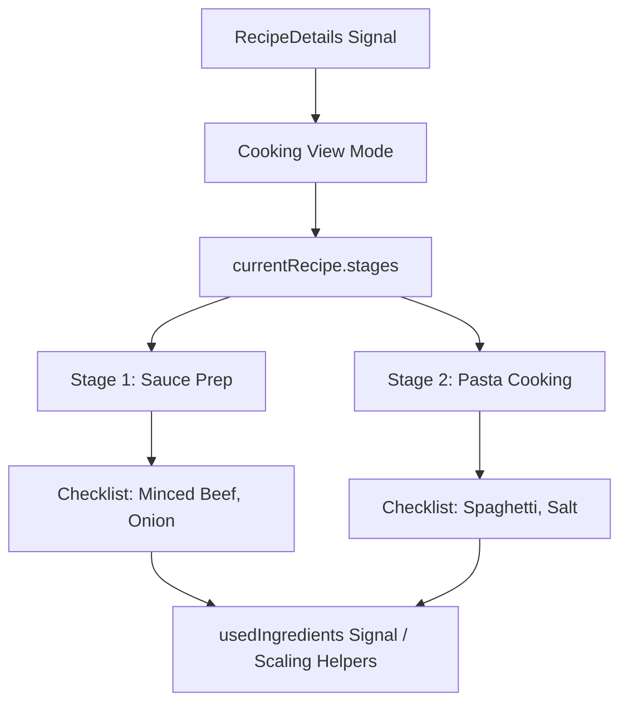

# Requirements

### Overview & Goals
In `RecipeDetailsPage`, the `Ingredients Checklist` in `Cooking mode` currently renders all recipe ingredients as a single flat list. This change updates the Cooking mode checklist to group ingredients by recipe stage, preserving both the stage order and the ingredient order within each stage, while keeping the "At A Glance" mode ingredient view untouched.

### Scope
- **In Scope:**
  - Grouping ingredients by recipe stage in the `Ingredients Checklist` within Cooking mode in `RecipeDetailsPage`.
  - Preserving the defined recipe stage order and ingredient order inside each stage.
  - Adding clear stage headers/groupings within the checklist card.
  - Retaining interactive check-off behavior and quantity scaling per ingredient.
  - Updating and expanding unit tests to cover stage-grouped checklist behavior.
- **Out of Scope:**
  - Modifying "At A Glance" mode ingredients or stages layout.
  - Modifying backend API models or database schema (stages and ingredients relations already exist).
  - Changing recipe editing or creation flows.

### User Stories
- **As a cook using Cooking mode**, I want to see ingredients grouped by recipe stage so that I can easily find and measure ingredients needed for each specific step of the cooking process without losing track of stages.
- **As a cook reviewing a recipe in At A Glance mode**, I want the overview ingredient list to remain as a consolidated list with shopping list actions.

### Functional Requirements
1. **Cooking Mode Checklist Grouping:**
   - The checklist inside `cooking-ingredients-card` must iterate over the recipe's stages (`currentRecipe.stages`).
   - For each stage containing ingredients, display a stage header (e.g. stage index badge and stage name) followed by the stage's ingredients.
   - Stage order and ingredient order within each stage must be preserved.
   - If a recipe has no ingredients across all stages, the empty state ("No ingredients needed.") is displayed.
2. **Interactive Ingredient Status:**
   - Each ingredient checkbox must remain interactive, toggling the used state via `toggleIngredientUsed(ingredient.id)` and applying the line-through styling via `isIngredientUsed(ingredient.id)`.
   - Ingredient quantities must continue to scale with the servings control (`getScaledQuantity` and `formatUnit`).
3. **Glance Mode Invariance:**
   - The "At A Glance" mode must not be modified; it must continue to render the full flat ingredient list with shopping list action buttons and the collapsible stages accordion.

# Technical Design

### Current Implementation
- `RecipeDetailsPage` (`apps/web/src/recipes/pages/recipe-details/recipe-details.page.ts` & `.html`):
  - In Glance mode (`viewMode === 'glance'`), ingredients are rendered from `allIngredients()` flat computed array, and stages are rendered in a `mat-accordion`.
  - In Cooking mode (`viewMode === 'cooking'`), ingredients are rendered in `.cooking-ingredients-card` using a single flat `ul.checklist` over `ingredients` (`allIngredients()`).
  - `RecipeDetails` model already contains `stages: RecipeStageDetails[]`, and each stage contains `ingredients: IngredientDetails[]` and `steps: CookingStepDetails[]`.

### Key Decisions
- **Template-level Stage Iteration vs Computed Grouping Signal:**
  - *Decision:* Iterate directly over `currentRecipe.stages` in the template with `@if (stage.ingredients && stage.ingredients.length > 0)` and nested `@for (ingredient of stage.ingredients)`.
  - *Rationale:* `currentRecipe.stages` is already ordered by stage `order`, and `stage.ingredients` is already ordered by ingredient `order`. Direct template iteration is concise, reactive, avoids redundant intermediate data structures, and matches the pattern used in the Cooking Steps container (`@for (stage of currentRecipe.stages)`).

### Proposed Changes

#### Template Changes (`apps/web/src/recipes/pages/recipe-details/recipe-details.page.html`)
- In `.cooking-ingredients-card mat-card-content`:
  - Keep the empty state `@if (ingredients.length === 0)`.
  - In the `@else` branch, replace the single flat `ul.checklist` with:
    ```html
    @for (stage of currentRecipe.stages; track stage.id || stage.name; let stageIndex = $index) {
      @if (stage.ingredients && stage.ingredients.length > 0) {
        <div class="checklist-stage-group" data-testid="checklist-stage-group">
          <h4 class="checklist-stage-title" data-testid="checklist-stage-title">
            <span class="stage-index-badge">Stage {{ stageIndex + 1 }}</span>
            {{ stage.name }}
          </h4>

          <ul class="checklist">
            @for (ingredient of stage.ingredients; track ingredient.id || ingredient.name) {
              <li class="checklist-item"
                  [class.used]="isIngredientUsed(ingredient.id)"
                  data-testid="cooking-ingredient-item">
                <mat-checkbox [checked]="isIngredientUsed(ingredient.id)"
                              (change)="toggleIngredientUsed(ingredient.id)"
                              data-testid="ingredient-checkbox">
                  <span class="ingredient-scaled-amount">
                    {{ getScaledQuantity(ingredient.quantity) }}
                    {{ formatUnit(ingredient.unit, getScaledQuantity(ingredient.quantity)) }}
                  </span>
                  <span class="ingredient-item-name">{{ ingredient.name }}</span>
                </mat-checkbox>
              </li>
            }
          </ul>
        </div>
      }
    }
    ```

#### SCSS Styles (`apps/web/src/recipes/pages/recipe-details/recipe-details.page.scss`)
- Under `.cooking-ingredients-card`:
  - Add styles for `.checklist-stage-group` (e.g., margins/padding separating stages).
  - Add styles for `.checklist-stage-title` (matching theme, displaying stage badge and title text cleanly).

### File Structure & Changes
- `apps/web/src/recipes/pages/recipe-details/recipe-details.page.html`: Update Cooking mode ingredients checklist block.
- `apps/web/src/recipes/pages/recipe-details/recipe-details.page.scss`: Add styles for stage grouping headers and spacing.
- `apps/web/src/recipes/pages/recipe-details/recipe-details.page.spec.ts`: Add and update unit tests for multi-stage checklist grouping and interaction.

### Architecture Diagram


# Testing

### Validation Approach
Run automated Jest unit tests for `RecipeDetailsPage` to ensure all functionality works as expected without regressions.

### Key Scenarios
1. **Stage Grouping in Cooking Mode:**
   - Multi-stage recipe displays distinct stage headers (`checklist-stage-group` / `checklist-stage-title`).
   - Ingredients for Stage 1 appear under Stage 1 header in the correct order.
   - Ingredients for Stage 2 appear under Stage 2 header in the correct order.
2. **Single Stage / Stage without Ingredients:**
   - Recipe with a single stage renders that stage's ingredients.
   - Stages that have no ingredients are skipped without rendering empty headers.
   - Recipe with zero ingredients displays "No ingredients needed." empty state.
3. **Interactive Checkbox & Servings Scaling:**
   - Checking an ingredient toggles the `usedIngredients` set and applies `.used` class (line-through style).
   - Changing servings scales quantities properly inside each stage group.
4. **Glance Mode Isolation:**
   - "At A Glance" mode displays the full ingredients list with `add-to-shopping-list-btn` unchanged.
   - Collapsible stages accordion in Glance mode functions as before.

### Test Changes
- Update `apps/web/src/recipes/pages/recipe-details/recipe-details.page.spec.ts` to include multi-stage test fixtures and assertions validating the grouped checklist structure.

# Delivery Steps

### ✓ Step 1: Update template and styling for stage-grouped checklist in Cooking mode
Update the cooking mode ingredients checklist template in `RecipeDetailsPage` and add corresponding SCSS styles to group ingredients under their respective recipe stages.

- In `apps/web/src/recipes/pages/recipe-details/recipe-details.page.html`, iterate through `currentRecipe.stages` inside `.cooking-ingredients-card mat-card-content`.
- For stages that contain ingredients, render a stage group header (displaying stage order/index and name) and a nested ingredient list preserving stage and ingredient order.
- Maintain existing empty states when no ingredients are present in the recipe (`ingredients.length === 0`).
- Retain all ingredient item attributes, scaled quantities (`getScaledQuantity`), unit formatting (`formatUnit`), and interactive checkbox binding (`toggleIngredientUsed` / `isIngredientUsed`).
- In `apps/web/src/recipes/pages/recipe-details/recipe-details.page.scss`, add styling for `.checklist-stage-group` and `.checklist-stage-title` with proper margins, spacing, and typography to visually distinguish stage sections.
- Ensure the "At A Glance" view mode remains unchanged.

### ✓ Step 2: Update unit tests for stage-grouped checklist and verify mode isolation
Add and update unit tests in `RecipeDetailsPage` spec to verify that Cooking mode checklist renders ingredients grouped by stage, handles multi-stage recipes, and preserves Glance mode.

- In `apps/web/src/recipes/pages/recipe-details/recipe-details.page.spec.ts`, add test cases for multi-stage recipes verifying stage header rendering and grouped ingredient items in Cooking mode.
- Verify that stage order and ingredient order within stages are strictly preserved.
- Verify checkbox toggling and used status across different stages in Cooking mode.
- Verify that "At A Glance" mode displays the flat ingredient list and collapsible stages as before.
- Run Jest test suite to ensure all unit tests pass cleanly.