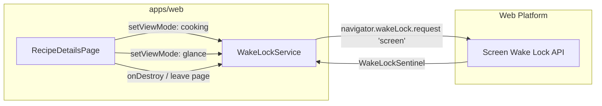

# Requirements

### Overview & Goals
Keep the user's device display awake while in cooking mode so that cooks do not have to repeatedly touch the screen with messy hands to prevent the device from sleeping. This will be achieved using the standard Screen Wake Lock Web API encapsulated in a reusable service within the `system` feature of the `web` application.

### Scope
#### In Scope
- **`WakeLockService`**: A new Angular service in `apps/web/src/system/services/wake-lock/` to acquire, cache, and release screen wake locks using `navigator.wakeLock`.
- **`RecipeDetailsPage` Integration**: Acquire screen wake lock when entering `cooking` mode; release screen wake lock when switching back to `glance` mode or navigating away from the page.
- **Silent Error Handling**: Log wake lock errors to the browser console without displaying UI alerts or notifications.
- **No UI Clutter**: Ensure no success toasts or badges are shown for screen wake lock status.
- **Unit Testing**: Complete unit test coverage for `WakeLockService` and updated tests for `RecipeDetailsPage`.

#### Out of Scope
- Custom UI toggle switch specifically for wake lock override (wake lock follows cooking mode directly).
- Wake lock support for other pages or modes.
- Fallback video-loop wake lock workarounds for browsers lacking Screen Wake Lock Web API support (graceful degradation returning `false`).

### User Stories
- **As a cook following a recipe in Cooking Mode**, I want my screen to stay awake without dimming or locking so that I can read steps hands-free without touching my device while cooking.
- **As a cook switching back to Glance Mode or navigating away**, I want the screen wake lock released so that my device battery is preserved.
- **As a user whose browser or battery saver blocks wake lock**, I want the app to fail silently without disruptive error popups or breaking the cooking workflow.

### Functional Requirements
1. **Wake Lock Service (`WakeLockService`)**:
   - Provide `acquire(): Promise<boolean>`:
     - If a lock is already held and not released, return `true` immediately without requesting duplicate locks.
     - If `navigator.wakeLock` is supported, request a `'screen'` lock via `navigator.wakeLock.request('screen')`.
     - Cache the resulting `WakeLockSentinel`.
     - Listen for sentinel release events (e.g. system power events or tab focus loss) to reset the cached reference.
     - Return `true` on successful acquisition.
     - If the API is unsupported or the request rejects (e.g., low battery, permission denied), catch the error and return `false`.
   - Provide `release(): Promise<boolean>`:
     - If an active sentinel is cached, release it via `sentinel.release()`.
     - Clear the cached sentinel reference.
     - Return `true` upon completion (or promise resolving to `true`).
2. **Recipe Details Page (`RecipeDetailsPage`)**:
   - Trigger `wakeLockService.acquire()` when `viewMode` changes to `'cooking'`.
   - Trigger `wakeLockService.release()` when `viewMode` changes to `'glance'`.
   - Trigger `wakeLockService.release()` when `RecipeDetailsPage` is destroyed (user leaves the page).
   - Log any unexpected rejection or failure from wake lock operations to `console.error`.
   - Do not display any UI success messages, banners, or error snackbars.

### Non-Functional Requirements
- **Graceful Degradation**: Devices and browsers that do not support `navigator.wakeLock` should continue working normally without throwing unhandled exceptions.
- **Battery Preservation**: Never leave a dangling wake lock active when navigating away from cooking mode.

# Technical Design

### Current Implementation
- `RecipeDetailsPage` (`apps/web/src/recipes/pages/recipe-details/recipe-details.page.ts`) manages `viewMode` as an Angular signal (`signal<RecipeViewMode>('glance')`), updated via `setViewMode(mode)`.
- `apps/web/src/system` contains system-level infrastructure (guards, interceptors, pages) and is the designated home for cross-cutting platform capabilities.
- Services across `apps/web` use Angular's `@Injectable({ providedIn: 'root' })` and `inject(...)` dependency injection pattern.

### Key Decisions
1. **Location of `WakeLockService`**:
   - *Decision*: Create `WakeLockService` inside `apps/web/src/system/services/wake-lock/wake-lock.service.ts`.
   - *Rationale*: Wake Lock is a browser system API applicable across any feature, matching the project specification to place it in the `system` feature.
2. **State & Sentinel Caching**:
   - *Decision*: Cache `WakeLockSentinel | null` in `WakeLockService`. Add an event listener to the sentinel's `release` event (`sentinel.addEventListener('release', ...)`) to automatically reset the cached variable to `null` if the browser or OS revokes the lock.
   - *Rationale*: Prevents stale sentinel references and avoids attempting redundant releases if the system already released the lock.
3. **Promise-Based Result Contract**:
   - *Decision*: `acquire()` returns `Promise<boolean>` (`true` on success/already locked, `false` on failure). `release()` returns `Promise<boolean>` (`true` when released or no lock active).
   - *Rationale*: Matches the specification requirement and makes calling code clean and simple without requiring try-catch blocks everywhere.
4. **Lifecycle Cleanup via `DestroyRef`**:
   - *Decision*: Use `inject(DestroyRef).onDestroy(...)` inside `RecipeDetailsPage` to ensure `wakeLockService.release()` is called on page exit.
   - *Rationale*: Guarantees wake lock release when the user navigates away from the recipe page while cooking mode is active.

### Architecture Diagram


### Proposed Changes

#### 1. Create `WakeLockService`
- **File**: `apps/web/src/system/services/wake-lock/wake-lock.service.ts`
- **Interface & Implementation**:
  ```typescript
  import { Injectable } from '@angular/core';

  @Injectable({ providedIn: 'root' })
  export class WakeLockService {
    private sentinel: WakeLockSentinel | null = null;

    readonly acquire = async (): Promise<boolean> => {
      if (this.sentinel && !this.sentinel.released) {
        return true;
      }

      if (typeof navigator === 'undefined' || !('wakeLock' in navigator)) {
        return false;
      }

      try {
        const sentinel = await navigator.wakeLock.request('screen');
        this.sentinel = sentinel;
        sentinel.addEventListener('release', () => {
          if (this.sentinel === sentinel) {
            this.sentinel = null;
          }
        });
        return true;
      } catch (error) {
        return false;
      }
    };

    readonly release = async (): Promise<boolean> => {
      if (!this.sentinel) {
        return true;
      }

      try {
        const sentinel = this.sentinel;
        this.sentinel = null;
        if (!sentinel.released) {
          await sentinel.release();
        }
        return true;
      } catch (error) {
        this.sentinel = null;
        return false;
      }
    };
  }
  ```

#### 2. Update `RecipeDetailsPage`
- **File**: `apps/web/src/recipes/pages/recipe-details/recipe-details.page.ts`
- **Changes**:
  - Inject `WakeLockService`: `private readonly wakeLockService = inject(WakeLockService);`
  - In `constructor()` or field initialization, register cleanup:
    ```typescript
    this.destroyRef.onDestroy(() => {
      this.wakeLockService.release().catch(err => console.error('Failed to release wake lock on destroy:', err));
    });
    ```
  - Update `setViewMode`:
    ```typescript
    readonly setViewMode = (mode: RecipeViewMode): void => {
      this.viewMode.set(mode);
      if (mode === 'cooking') {
        this.wakeLockService.acquire().catch(err => console.error('Failed to acquire wake lock:', err));
      } else if (mode === 'glance') {
        this.wakeLockService.release().catch(err => console.error('Failed to release wake lock:', err));
      }
    };
    ```

### File Structure
- `apps/web/src/system/services/wake-lock/wake-lock.service.ts` (new)
- `apps/web/src/system/services/wake-lock/wake-lock.service.spec.ts` (new)
- `apps/web/src/recipes/pages/recipe-details/recipe-details.page.ts` (modified)
- `apps/web/src/recipes/pages/recipe-details/recipe-details.page.spec.ts` (modified)

### Risks & Mitigations
- **Unsupported Browsers (e.g., older browsers or non-HTTPS environments)**: Guard with `'wakeLock' in navigator` check and catch rejections, returning `false` gracefully without throwing.
- **Tab Inactivity / Visibility Change**: Browsers automatically release screen wake locks when the document becomes hidden; the `sentinel.addEventListener('release', ...)` handler ensures the cached sentinel is cleared so subsequent mode changes can re-acquire the lock without stale state issues.

# Testing

### Validation Approach
Automated testing via Jest unit tests for `WakeLockService` and `RecipeDetailsPage`, mocking `navigator.wakeLock` and `WakeLockService` respectively.

### Key Scenarios
1. **`WakeLockService.acquire()`**:
   - Acquires a new screen lock when none exists, stores sentinel, and returns `true`.
   - Returns `true` immediately if an active lock is already present (idempotent).
   - Returns `false` if `navigator.wakeLock` is not supported in the environment.
   - Returns `false` if `navigator.wakeLock.request('screen')` rejects (e.g., low battery or permission denied).
2. **`WakeLockService.release()`**:
   - Calls `sentinel.release()`, clears cached sentinel, and returns `true`.
   - Returns `true` safely if no lock is currently held.
   - Automatically resets cached sentinel when the sentinel emits the `'release'` event.
3. **`RecipeDetailsPage` Integration**:
   - Switching `viewMode` to `'cooking'` calls `wakeLockService.acquire()`.
   - Switching `viewMode` to `'glance'` calls `wakeLockService.release()`.
   - Destroying `RecipeDetailsPage` calls `wakeLockService.release()`.
   - Rejection in `acquire()` or `release()` logs to `console.error` without throwing or showing UI alerts.

### Test Changes
- **New Test File**: `apps/web/src/system/services/wake-lock/wake-lock.service.spec.ts`
  - Tests covering `acquire()` success, idempotent calls, unsupported API, request rejections, `release()` with active lock, `release()` without lock, and `release` event listener callback.
- **Modified Test File**: `apps/web/src/recipes/pages/recipe-details/recipe-details.page.spec.ts`
  - Provide a mock `WakeLockService` in the test bed setup.
  - Test verifying `wakeLockService.acquire()` is called when switching to cooking mode.
  - Test verifying `wakeLockService.release()` is called when switching back to glance mode.
  - Test verifying `wakeLockService.release()` is called when component is destroyed.

# Delivery Steps

### ✓ Step 1: Implement WakeLockService in the system feature with unit tests
The `WakeLockService` is implemented in `apps/web/src/system/services/wake-lock/wake-lock.service.ts` and verified with comprehensive unit tests in `wake-lock.service.spec.ts`.

- Create `WakeLockService` as a root-provided injectable service (`@Injectable({ providedIn: 'root' })`) in `apps/web/src/system/services/wake-lock/wake-lock.service.ts`.
- Implement `acquire(): Promise<boolean>` method:
  - Check if a wake lock sentinel is already active; if present and not released, return `true`.
  - Check for Screen Wake Lock API availability (`'wakeLock' in navigator`).
  - Request the `'screen'` wake lock via `navigator.wakeLock.request('screen')`.
  - Cache the acquired `WakeLockSentinel` and bind its `'release'` event listener to clear internal state if released by the OS or browser.
  - Return `true` on success and `false` when acquisition fails or is unsupported.
- Implement `release(): Promise<boolean>` method:
  - Check if an active sentinel exists; if so, release it via `sentinel.release()`.
  - Clear the cached sentinel reference and return `true`.
  - Safely handle cases where no lock is currently held.
- Create unit tests in `apps/web/src/system/services/wake-lock/wake-lock.service.spec.ts` mocking `navigator.wakeLock` to verify acquisition, idempotency, release, failure handling, and event-triggered release.

### ✓ Step 2: Integrate WakeLockService into RecipeDetailsPage with lifecycle management and unit tests
`RecipeDetailsPage` requests a wake lock when entering cooking mode, releases it when leaving cooking mode or navigating away, and logs failures without displaying UI notifications.

- Inject `WakeLockService` into `RecipeDetailsPage` (`apps/web/src/recipes/pages/recipe-details/recipe-details.page.ts`).
- Update `setViewMode(mode: RecipeViewMode)`:
  - When switching to `'cooking'`, call `wakeLockService.acquire()`, catching any errors and logging them to `console.error`.
  - When switching to `'glance'`, call `wakeLockService.release()`, catching any errors and logging them to `console.error`.
- Register a component destruction lifecycle hook using `DestroyRef.onDestroy(...)` to release any active wake lock when the user navigates away from the page.
- Ensure no UI toast, snack-bar, or banner notifications are shown for wake lock success or failure.
- Update unit tests in `apps/web/src/recipes/pages/recipe-details/recipe-details.page.spec.ts` to verify wake lock acquisition on cooking mode toggle, release on glance mode toggle, release on page destruction, and error handling.