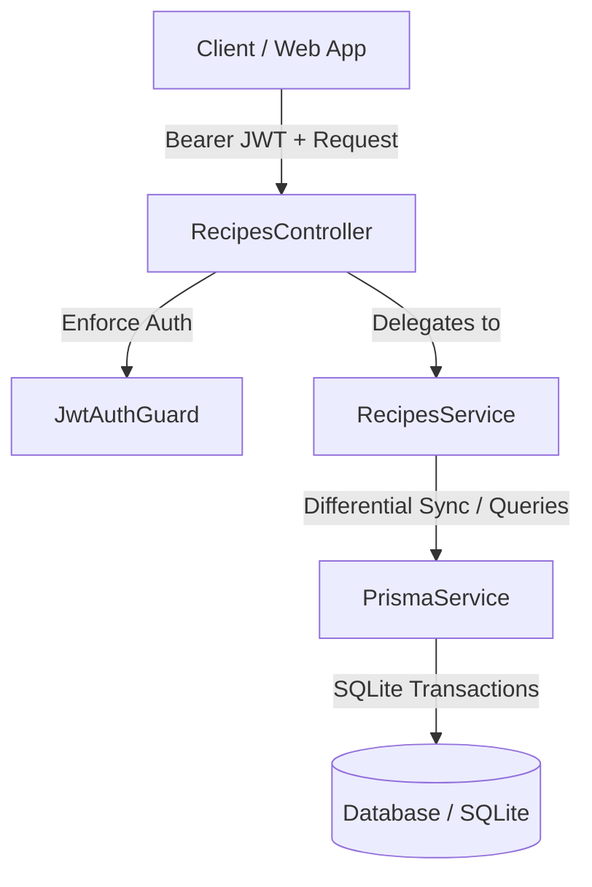

# Requirements

### Overview & Goals
Implement a complete RESTful CRUD API for recipes in the `api` project (`apps/api`), including their child entities: stages, cooking steps, and ingredients. All endpoints require JWT authentication. In addition to standard CRUD operations, the module supports:
- Aggregating existing cuisines and categories into a sorted tree-like structure for frontend filter menus.
- Paginated recipe listing (50 items per page, sorted by creation date descending) with optional search term filtering (by recipe name) and cuisine/category filtering.
- Soft deletion of recipes preserving linked child entities in the database.
- Deep nested creation and differential updates of recipes and their associated stages, cooking steps, and ingredients.

### Scope
- **In Scope**:
  - Prisma schema update to support soft deletion on `Recipe` (`deletedAt`).
  - DTO definitions with validation rules using `class-validator` and `class-transformer`.
  - `RecipesService` containing business logic for tree aggregation, paginated search, retrieval, creation, differential update, and soft deletion.
  - `RecipesController` exposing authenticated REST endpoints secured with `JwtAuthGuard`.
  - Registration in `RecipesModule` and `AppModule`.
  - Unit and integration tests for service, controller, and endpoints.
- **Out of Scope**:
  - Frontend UI components or routes (backend API implementation only).
  - User permissions/roles beyond standard authenticated JWT user.

### User Stories
- **As an authenticated user**, I want to retrieve a tree structure of all available cuisines and categories so that I can easily navigate and filter recipe listings.
- **As an authenticated user**, I want to browse recipes with pagination, optional search by recipe name, and cuisine/category filters so that I can discover recipes efficiently.
- **As an authenticated user**, I want to view full details of a specific recipe including stages, cooking steps, and ingredients.
- **As an authenticated user**, I want to create a new recipe with multi-stage steps and ingredients in a single request.
- **As an authenticated user**, I want to update an existing recipe and have newly added, modified, or removed stages/steps/ingredients properly synchronized.
- **As an authenticated user**, I want to soft-delete a recipe so that it is excluded from active views while preserving data integrity in the database.

### Functional Requirements
1. **Authentication**: All endpoints must require a valid JWT Bearer token using `JwtAuthGuard`. Unauthenticated requests must return `401 Unauthorized`.
2. **Cuisine & Category Listing (`GET /api/recipes/cuisines-categories`)**:
   - Aggregate all distinct cuisines and their associated categories from existing (non-deleted) recipes.
   - Return a tree-like structure: an array of cuisine objects, each containing the cuisine name and an array of associated category names (e.g. `[{ cuisine: 'Italian', categories: ['Pasta', 'Pizza'] }]`).
   - Sort alphabetically by cuisine name, and sort categories alphabetically within each cuisine.
3. **Recipe Listing (`GET /api/recipes`)**:
   - Support optional query parameters `search` (search term to filter by recipe name), `cuisine`, `category`, and `page` (default 1).
   - When `search` is provided, filter recipes by `name` using case-insensitive substring matching (`contains`).
   - Fixed page size of 50 recipes per page.
   - Exclude soft-deleted recipes (`deletedAt` is null).
   - Sort results by `createdAt` in descending order.
   - Return pagination metadata: `data` (list of Recipe models without relations), `total` (total matching count), `page` (current page), `totalPages` (total pages).
4. **Recipe Details (`GET /api/recipes/:id`)**:
   - Return full recipe details including `stages`, `steps`, and `ingredients`.
   - Order stages by `order ASC`, steps by `order ASC`, and ingredients by `order ASC`.
   - Return `404 Not Found` if the recipe does not exist or has been soft-deleted.
5. **Create Recipe (`POST /api/recipes`)**:
   - Accept a recipe payload containing recipe attributes (`name`, `cuisine`, `category`, `description`, `servings`) and nested `stages` with `steps` and `ingredients`.
   - Validate payload fields (e.g. valid enum for `IngredientUnit`, required fields, positive numbers).
   - Create all entities in a single database operation/transaction.
   - Return the created recipe ID (`{ id: string }`) with `201 Created` status code.
6. **Update Recipe (`PUT /api/recipes/:id`)**:
   - Accept a recipe payload including all stages, cooking steps, and ingredients.
   - Detect added, modified, and removed stages, cooking steps, and ingredients:
     - Retain and update existing items with matching IDs.
     - Create new items without IDs.
     - Delete removed items belonging to the recipe that are not present in the payload.
   - Return the updated recipe model with `200 OK`.
   - Return `404 Not Found` if the recipe does not exist or has been soft-deleted.
7. **Delete Recipe (`DELETE /api/recipes/:id`)**:
   - Perform a soft delete by updating `deletedAt` to current timestamp.
   - Do not remove linked stages, cooking steps, or ingredients from the database.
   - Return `200 OK` with a success message (e.g. `{ message: 'Recipe deleted successfully' }`).
   - Return `404 Not Found` if the recipe does not exist or is already soft-deleted.

### Non-Functional Requirements
- Consistent JSON error formats conforming to NestJS standard HTTP exceptions.
- Strict input validation with `class-validator` and `ValidationPipe({ whitelist: true, transform: true })`.
- Transactional consistency for creation and differential updates to prevent partial writes.

# Technical Design

### Current Implementation
- `apps/api/src/app/app.module.ts`: Root module importing `PrismaModule` and `AuthModule`.
- `apps/api/src/app/auth/guards/jwt-auth.guard.ts`: Passport JWT auth guard protecting endpoints.
- `prisma/schema.prisma`: Defines models `Recipe`, `RecipeStage`, `CookingStep`, `Ingredient`, and enum `IngredientUnit`. `Recipe` currently lacks a `deletedAt` column.
- `libs/data-access`: Provides `PrismaService` connected to SQLite (`dev.db`).

### Key Decisions
1. **Soft Delete Storage Strategy**:
   - *Decision*: Add `deletedAt DateTime? @map("deleted_at")` to the `Recipe` model and an index on `deletedAt`.
   - *Rationale*: A nullable timestamp (`deletedAt`) is standard for soft deletion, allowing query filtering (`where: { deletedAt: null }`) and preserving timestamp metadata of when deletion occurred.
2. **Differential Update Synchronization Strategy**:
   - *Decision*: Perform differential updates in a Prisma `$transaction`. Compare incoming IDs with existing database IDs for stages, steps, and ingredients: update existing records, insert new ones, and delete removed ones that belonged to the updated stages/recipe.
   - *Rationale*: Ensures referential integrity, preserves existing stage/step IDs when edited, removes orphaned steps/ingredients, and completes atomically.
3. **Cuisine & Category Tree Aggregation**:
   - *Decision*: Query distinct pairs of `(cuisine, category)` for active recipes using Prisma `groupBy` or `findMany({ select: { cuisine: true, category: true }, distinct: ['cuisine', 'category'] })`, then group and sort in memory.
   - *Rationale*: Leverages the existing compound index `@@index([cuisine, category])` for high performance and minimal memory footprint.

### Data Models / Contracts

#### DTO Definitions
```ts
export class RecipeQueryDto {
  @IsOptional()
  @IsString()
  search?: string;

  @IsOptional()
  @IsString()
  cuisine?: string;

  @IsOptional()
  @IsString()
  category?: string;

  @IsOptional()
  @Type(() => Number)
  @IsInt()
  @Min(1)
  page?: number = 1;
}

export class CreateIngredientDto {
  @IsString()
  @IsNotEmpty()
  name: string;

  @IsNumber()
  @Min(0)
  quantity: number;

  @IsEnum(IngredientUnit)
  unit: IngredientUnit;

  @IsInt()
  @IsOptional()
  order?: number;
}

export class CreateCookingStepDto {
  @IsString()
  @IsNotEmpty()
  name: string;

  @IsString()
  description: string;

  @IsInt()
  @IsOptional()
  order?: number;
}

export class CreateRecipeStageDto {
  @IsString()
  @IsNotEmpty()
  name: string;

  @IsInt()
  @IsOptional()
  order?: number;

  @IsArray()
  @ValidateNested({ each: true })
  @Type(() => CreateCookingStepDto)
  steps: CreateCookingStepDto[];

  @IsArray()
  @ValidateNested({ each: true })
  @Type(() => CreateIngredientDto)
  ingredients: CreateIngredientDto[];
}

export class CreateRecipeDto {
  @IsString()
  @IsNotEmpty()
  name: string;

  @IsString()
  @IsNotEmpty()
  cuisine: string;

  @IsString()
  @IsNotEmpty()
  category: string;

  @IsString()
  description: string;

  @IsInt()
  @Min(1)
  servings: number;

  @IsArray()
  @ValidateNested({ each: true })
  @Type(() => CreateRecipeStageDto)
  stages: CreateRecipeStageDto[];
}
```

#### Tree Response Interface
```ts
export interface CuisineCategoryTreeItem {
  cuisine: string;
  categories: string[];
}
```

#### Paginated Response Interface
```ts
export interface PaginatedRecipeResponse {
  data: Recipe[];
  total: number;
  page: number;
  totalPages: number;
}
```

### Components
- **`RecipesController`** (`apps/api/src/app/recipes/recipes.controller.ts`):
  - Decorated with `@Controller('recipes')` and `@UseGuards(JwtAuthGuard)`.
  - Routes:
    - `GET /recipes/cuisines-categories` -> `getCuisinesAndCategories()`
    - `GET /recipes` -> `getRecipes(@Query() query: RecipeQueryDto)`
    - `GET /recipes/:id` -> `getRecipeById(@Param('id') id: string)`
    - `POST /recipes` -> `createRecipe(@Body() dto: CreateRecipeDto)`
    - `PUT /recipes/:id` -> `updateRecipe(@Param('id') id: string, @Body() dto: UpdateRecipeDto)`
    - `DELETE /recipes/:id` -> `deleteRecipe(@Param('id') id: string)`
- **`RecipesService`** (`apps/api/src/app/recipes/recipes.service.ts`):
  - Encapsulates database queries with `PrismaService`.
  - Manages transactions for create and differential updates.
  - Excludes soft-deleted records across all lookup operations.
- **`RecipesModule`** (`apps/api/src/app/recipes/recipes.module.ts`):
  - Imports `PrismaModule`. Registers `RecipesController` and `RecipesService`.

### File Structure
```
apps/api/src/app/
├── recipes/
│   ├── dto/
│   │   ├── create-recipe.dto.ts
│   │   ├── update-recipe.dto.ts
│   │   ├── recipe-query.dto.ts
│   │   └── recipe-response.dto.ts
│   ├── recipes.controller.ts
│   ├── recipes.controller.spec.ts
│   ├── recipes.service.ts
│   ├── recipes.service.spec.ts
│   ├── recipes.module.ts
│   └── recipes.e2e.spec.ts
├── app.module.ts
prisma/
├── schema.prisma
└── migrations/
    └── <timestamp>_add_recipe_deleted_at/
        └── migration.sql
```

### Architecture Diagram


### Risks & Mitigations
- **Orphaned Steps & Ingredients during Differential Updates**:
  - *Risk*: Modifying nested stages or deleting a stage might leave orphaned child steps/ingredients.
  - *Mitigation*: Perform differential updates in an explicit interactive Prisma transaction (`$transaction`), deleting removed children before updating parent stages, and verifying all foreign keys.
- **Pagination Boundary Calculations**:
  - *Risk*: `totalPages` calculation returning 0 when total is 0 or rounding incorrectly.
  - *Mitigation*: Handle `total === 0 ? 0 : Math.ceil(total / limit)` explicitly in the service layer.

# Testing

### Validation Approach
Verification will be automated through comprehensive unit tests and integration (E2E) tests in `apps/api`:
1. **Unit Testing (`recipes.service.spec.ts` & `recipes.controller.spec.ts`)**:
   - Mock `PrismaService` to test business logic isolation, error handling, pagination math, and tree structuring.
2. **Integration / E2E Testing (`recipes.e2e.spec.ts`)**:
   - Run against the SQLite test database using `supertest`.
   - Test full request-response lifecycle, JWT authentication guards, validation pipe rejections, create, update, delete, pagination, and tree aggregation.

### Key Scenarios
1. **Authentication Enforcement**:
   - Request any recipe endpoint without `Authorization` header -> verify `401 Unauthorized`.
   - Request with invalid token -> verify `401 Unauthorized`.
   - Request with valid Bearer token -> verify successful response.
2. **Cuisine & Category Tree**:
   - Seed recipes across multiple cuisines and categories.
   - Request `GET /api/recipes/cuisines-categories`.
   - Verify alphabetical ordering of cuisines and alphabetical ordering of categories within each cuisine.
   - Verify soft-deleted recipes do not contribute cuisines/categories.
3. **Paginated Recipe Listing & Search**:
   - Request `GET /api/recipes` with 0, 1, or >50 recipes.
   - Verify page size is 50 and records are sorted by `createdAt DESC`.
   - Filter by `?search=Pasta` -> verify only recipes with matching name are returned.
   - Filter by `?cuisine=Italian` -> verify only Italian recipes returned.
   - Filter by `?search=Spaghetti&cuisine=Italian&category=Pasta` -> verify combined search and filters work.
   - Verify response schema contains `data`, `total`, `page`, and `totalPages`.
4. **Recipe Creation**:
   - Send valid `POST /api/recipes` payload with multiple stages, steps, and ingredients.
   - Verify `201 Created` with `{ id: string }`.
   - Query `GET /api/recipes/:id` and verify all nested stages, steps, and ingredients are persisted in exact specified order.
5. **Differential Recipe Update**:
   - Update recipe metadata (name, servings).
   - Add a new stage, update an existing cooking step, remove an ingredient.
   - Send `PUT /api/recipes/:id`.
   - Verify removed entities are deleted, new entities created, and existing entities updated without creating duplicate stages.
6. **Soft Deletion**:
   - Send `DELETE /api/recipes/:id`.
   - Verify `200 OK` success message.
   - Verify subsequent `GET /api/recipes/:id` returns `404 Not Found`.
   - Verify subsequent `GET /api/recipes` excludes the soft-deleted recipe.
   - Verify database still contains the recipe row with `deletedAt` populated and all child stage/step/ingredient rows intact.

### Edge Cases
- **Missing or Non-Existent ID**: `GET /api/recipes/invalid-uuid`, `PUT /api/recipes/invalid-uuid`, `DELETE /api/recipes/invalid-uuid` must throw `404 Not Found`.
- **Invalid Payload Validation**: Sending payload with missing required fields or invalid `unit` enum must return `400 Bad Request` with descriptive validation messages.
- **Empty Filter / Search Results**: Filtering or searching with no matching recipes returns `{ data: [], total: 0, page: 1, totalPages: 0 }`.
- **Double Soft-Delete**: Attempting to delete an already deleted recipe returns `404 Not Found`.

# Delivery Steps

### ✓ Step 1: Schema Update & Soft-Delete Migration
Add soft-delete support to the Prisma schema and run migrations.

- Add `deletedAt DateTime? @map("deleted_at")` to the `Recipe` model in `prisma/schema.prisma`.
- Generate and run the database migration.
- Re-generate the Prisma Client to include the new field.

### ✓ Step 2: DTOs & Validation Models
Define request validation DTOs and response interfaces for recipe operations.

- Create `CreateRecipeDto`, `CreateRecipeStageDto`, `CreateCookingStepDto`, and `CreateIngredientDto` with class-validator decorators (`@IsString`, `@IsInt`, `@IsNumber`, `@IsEnum`, `@ValidateNested`, `@Type`).
- Create `UpdateRecipeDto` and nested update DTOs supporting optional entity IDs to track additions, updates, and removals.
- Create `RecipeQueryDto` for pagination (`page`), search term (`search`), and optional filtering (`cuisine`, `category`).
- Define response types for cuisine-category tree aggregation, paginated recipe list, recipe creation ID response, and full recipe details.

### ✓ Step 3: RecipesService Implementation
Implement core CRUD, differential updating, pagination, and aggregation logic in `RecipesService`.

- Implement `getCuisinesAndCategories()` aggregating distinct cuisines and categories from non-deleted recipes into a sorted tree structure.
- Implement `getRecipes(query)` returning 50 recipes per page sorted by `createdAt` descending along with total count and page metadata, supporting search by recipe name (`search`) and filters (`cuisine`, `category`).
- Implement `getRecipeById(id)` retrieving full recipe details with ordered stages, cooking steps, and ingredients, throwing `NotFoundException` if missing or soft-deleted.
- Implement `createRecipe(dto)` persisting recipes with nested stages, steps, and ingredients in a database transaction and returning the new recipe ID.
- Implement `updateRecipe(id, dto)` with differential synchronization: updating the recipe, modifying existing child entities, inserting newly added items, and removing deleted stages/steps/ingredients.
- Implement `deleteRecipe(id)` performing soft deletion (`deletedAt`) without deleting linked stages, steps, or ingredients.

### ✓ Step 4: RecipesController & Module Registration
Expose REST endpoints on `RecipesController` and wire `RecipesModule` into `AppModule`.

- Create `RecipesController` with `@Controller('recipes')` and controller-level `@UseGuards(JwtAuthGuard)`.
- Implement `GET /recipes/cuisines-categories`, `GET /recipes`, `GET /recipes/:id`, `POST /recipes`, `PUT /recipes/:id`, and `DELETE /recipes/:id`.
- Wire `RecipesModule` importing `PrismaModule` and register `RecipesModule` in `AppModule`.

### ✓ Step 5: Unit & Integration Tests
Add unit and integration/E2E test suites covering all recipe CRUD operations and security.

- Add `recipes.service.spec.ts` unit tests covering all service methods, edge cases, and not-found scenarios.
- Add `recipes.controller.spec.ts` unit tests verifying controller method delegation.
- Add `recipes.e2e.spec.ts` integration tests verifying JWT authentication enforcement, payload validation, pagination, name search, differential update logic, and soft deletion.