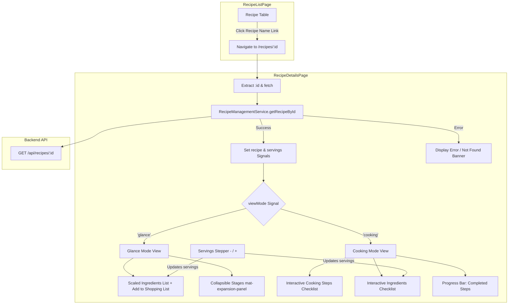

# Requirements

### Overview & Goals
Implement the "Recipe Details Page" inside the `recipes` feature of the `web` Angular application in accordance with `.junie/specs/recipe-details-page.md`. The page allows users to view complete recipe metadata, inspect ingredients scaled to adjustable serving sizes, preview collapsible cooking stages at a glance, and switch into an interactive step-by-step cooking mode where steps and ingredients can be marked off as progress is made.

### Scope
- **In Scope**:
  - `RecipeDetails`, `RecipeStageDetails`, `CookingStepDetails`, `IngredientDetails`, and `RecipeViewMode` type definitions in `web`.
  - Extension of `RecipeManagementService` with `getRecipeById(id: string): Observable<RecipeDetails>` calling `GET /api/recipes/:id`.
  - Creation of `RecipeDetailsPage` standalone component registered at route `/recipes/:id`:
    - Loading indicator during async fetch.
    - User-friendly error message when a recipe is not found or fails to load.
    - Navigation link to return to the recipe list (`/recipes`).
    - Non-functional Edit and Delete recipe action buttons.
    - Dynamic servings stepper allowing users to scale serving size (minimum 1), automatically recalculating ingredient quantities in real time.
    - Two user experience modes:
      - **Glance Mode**: Overview of recipe metadata, collapsible stages accordion, and ingredient list where each ingredient has a non-functional "Add to shopping list" button.
      - **Cooking Mode**: Step-by-step workflow with interactive checkboxes/toggles to mark completed cooking steps and used-up ingredients, along with a completion progress bar.
  - Update `RecipeListPage` (`apps/web/src/recipes/pages/recipe-list/recipe-list.page.html`) to link recipe names to `/recipes/:id`.
  - Strict compliance with project architecture: `ChangeDetectionStrategy.OnPush`, Angular signals, standalone components, and `readonly` arrow function class methods.
  - Full unit test coverage for `RecipeManagementService.getRecipeById` and `RecipeDetailsPage`.

- **Out of Scope**:
  - Persistence of step completion, ingredient usage marks, or adjusted serving sizes (local ephemeral state only).
  - Active implementation of shopping list mutation (shopping list is not yet built).
  - Active implementation of recipe editing or recipe deletion endpoints from this page (buttons are non-functional placeholders).

### User Stories
- **As a home cook**, I want to view recipe details and required ingredients at a glance so that I can quickly decide if I want to prepare it and see what ingredients I need to buy.
- **As a home cook**, I want to adjust the serving size with a stepper so that ingredient quantities automatically scale to the exact number of people I am cooking for.
- **As a home cook**, I want to switch to a cooking mode where I can follow stages step-by-step and check off finished steps and used ingredients so that I can keep track of my cooking progress.
- **As a user**, I want clear visual feedback when a recipe is loading or if it cannot be found, and an easy way to navigate back to the recipe list.

### Functional Requirements
1. **Service API Integration**:
   - `RecipeManagementService.getRecipeById(id)` sends `GET /api/recipes/:id`.
   - Emits `RecipeDetails` on success (HTTP 200) and propagates error on failure (e.g., HTTP 404/500).
2. **Page State & Loading / Error Handling**:
   - Display a spinner (`mat-spinner`) while recipe data is loading.
   - If loading fails or recipe is not found, display an error message card with an action button to return to the recipe list.
3. **Glance Mode Experience**:
   - Displays recipe title, description, cuisine tag, category tag, and base servings.
   - Displays ingredient list with calculated quantities based on the serving stepper.
   - Each ingredient row includes a non-functional "Add to shopping list" icon/button.
   - Collapsible stages accordion (`mat-accordion` / `mat-expansion-panel`) showing steps and ingredients per stage.
4. **Servings Stepper & Quantity Scaling**:
   - Interactive stepper (`-` / `+` buttons) with minimum value 1, initialized to `recipe.servings`.
   - All ingredient quantities are dynamically computed: `scaledQuantity = (originalQuantity * currentServings) / baseServings`.
   - Fractions/decimals formatted cleanly (e.g. rounded to 2 decimals or whole numbers).
5. **Cooking Mode Experience**:
   - Mode switcher (e.g., `mat-button-toggle-group`) to switch between "Glance" and "Cook" modes.
   - Interactive step items allowing user to toggle completion state (strikethrough text / checked icon).
   - Interactive ingredient items allowing user to toggle used-up state.
   - Overall progress indicator (e.g., `mat-progress-bar` showing percentage of completed steps).
   - Servings stepper remains accessible to adjust ingredient quantities while cooking.
6. **Actions & Navigation**:
   - "Back to Recipes" link/button navigating back to `/recipes`.
   - "Edit Recipe" button (non-functional placeholder).
   - "Delete Recipe" button (non-functional placeholder).
7. **Recipe List Linking**:
   - In `RecipeListPage`, recipe names link to `/recipes/:id`.

### Non-Functional Requirements
- **UI Components & Styling**: Angular Material 3 (`@angular/material`), Angular CDK (`@angular/cdk`), and responsive SCSS supporting mobile and desktop viewports.
- **Reactivity & State**: Angular Signals (`signal`, `computed`) for local page state, `OnPush` change detection.
- **Code Standards**: All class methods declared as `readonly` arrow function properties.

# Technical Design

### Current Implementation
- **Backend Endpoint**: `GET /api/recipes/:id` in `apps/api/src/app/recipes/recipes.controller.ts` returns `RecipeWithDetails` containing stages, cooking steps, and ingredients.
- **Recipe Management Service**: `apps/web/src/recipes/services/recipe-management/recipe-management.service.ts` provides list fetching and creation, but lacks a single recipe lookup method.
- **Routing**: `apps/web/src/recipes/recipes.routes.ts` routes `''` to `RecipeListPage` and `'new'` to `CreateRecipePage`.
- **Recipe List Page**: `apps/web/src/recipes/pages/recipe-list/recipe-list.page.html` has placeholder `<a>` tags with `(click)="$event.preventDefault()"` instead of actual navigation links.

### Key Decisions
- **Unified Standalone Page with Signal-Driven View Modes**: Rather than separating into multiple route URLs, use a single `RecipeDetailsPage` at `/recipes/:id` with a `viewMode = signal<'glance' | 'cooking'>('glance')`. This keeps serving adjustments and step progress intact when toggling views.
- **Ephemeral Signals for Interactive Cooking Marks**: Step completion (`completedSteps = signal<Set<string>>(new Set())`) and used ingredients (`usedIngredients = signal<Set<string>>(new Set())`) are kept in memory signals. No backend mutation or persistence is performed.
- **Dynamic Computed Scaling**: `servings = signal<number>(...)` powers a computed signal `scaledStages` that computes scaled quantities on the fly:
  `scaledQuantity = (ingredient.quantity * servings()) / baseServings`.
- **Arrow Function Properties**: Strict adherence to the repository convention where every class method is defined as a `readonly` property initialized with an arrow function.

### Proposed Changes

#### 1. Models (`apps/web/src/recipes/models/recipe-details.types.ts`)
```typescript
import { IngredientUnit } from './create-recipe.types';

export interface CookingStepDetails {
  id: string;
  stageId: string;
  name: string;
  description: string;
  order: number;
}

export interface IngredientDetails {
  id: string;
  stageId: string;
  name: string;
  quantity: number;
  unit: IngredientUnit;
  order: number;
}

export interface RecipeStageDetails {
  id: string;
  recipeId: string;
  name: string;
  order: number;
  steps: CookingStepDetails[];
  ingredients: IngredientDetails[];
}

export interface RecipeDetails {
  id: string;
  name: string;
  cuisine: string;
  category: string;
  description: string;
  servings: number;
  stages: RecipeStageDetails[];
  createdAt: string;
  updatedAt: string;
}

export type RecipeViewMode = 'glance' | 'cooking';
```

#### 2. RecipeManagementService (`apps/web/src/recipes/services/recipe-management/recipe-management.service.ts`)
Add method:
```typescript
readonly getRecipeById = (id: string): Observable<RecipeDetails> =>
  this.http.get<RecipeDetails>(`${environment.apiUrl}/recipes/${id}`);
```

#### 3. RecipeDetailsPage Component (`apps/web/src/recipes/pages/recipe-details/recipe-details.page.ts`)
- Standalone component with `ChangeDetectionStrategy.OnPush`.
- Injects `ActivatedRoute`, `Router`, `RecipeManagementService`, `BreakpointObserver`.
- State signals:
  - `recipe = signal<RecipeDetails | null>(null)`
  - `isLoading = signal<boolean>(true)`
  - `hasError = signal<boolean>(false)`
  - `viewMode = signal<RecipeViewMode>('glance')`
  - `servings = signal<number>(1)`
  - `completedSteps = signal<Set<string>>(new Set())`
  - `usedIngredients = signal<Set<string>>(new Set())`
- Readonly arrow functions:
  - `loadRecipe = (id: string): void => { ... }`
  - `setViewMode = (mode: RecipeViewMode): void => { ... }`
  - `incrementServings = (): void => { ... }`
  - `decrementServings = (): void => { ... }`
  - `toggleStepCompletion = (stepId: string): void => { ... }`
  - `toggleIngredientUsed = (ingredientId: string): void => { ... }`
  - `onBackToList = (): void => { ... }`
  - `onEditRecipe = (): void => { /* non-functional placeholder */ }`
  - `onDeleteRecipe = (): void => { /* non-functional placeholder */ }`
  - `onAddToShoppingList = (ingredient: IngredientDetails): void => { /* non-functional placeholder */ }`

#### 4. Route Configuration (`apps/web/src/recipes/recipes.routes.ts`)
```typescript
export const routes: Route[] = [
  { path: '', component: RecipeListPage },
  { path: 'new', component: CreateRecipePage },
  { path: ':id', component: RecipeDetailsPage }
];
```

#### 5. RecipeListPage Link Update (`apps/web/src/recipes/pages/recipe-list/recipe-list.page.html`)
Update recipe title link:
```html
<a [routerLink]="['/recipes', recipe.id]" class="recipe-name-link">
  {{ recipe.name }}
</a>
```

### Architecture Diagram


### File Structure
- `apps/web/src/recipes/models/recipe-details.types.ts` (New)
- `apps/web/src/recipes/pages/recipe-details/recipe-details.page.ts` (New)
- `apps/web/src/recipes/pages/recipe-details/recipe-details.page.html` (New)
- `apps/web/src/recipes/pages/recipe-details/recipe-details.page.scss` (New)
- `apps/web/src/recipes/pages/recipe-details/recipe-details.page.spec.ts` (New)
- `apps/web/src/recipes/pages/recipe-details/recipe-details.page.stories.ts` (New)
- `apps/web/src/recipes/services/recipe-management/recipe-management.service.ts` (Modified)
- `apps/web/src/recipes/services/recipe-management/recipe-management.service.spec.ts` (Modified)
- `apps/web/src/recipes/recipes.routes.ts` (Modified)
- `apps/web/src/recipes/pages/recipe-list/recipe-list.page.html` (Modified)
- `apps/web/src/recipes/pages/recipe-list/recipe-list.page.ts` (Modified - imports RouterLink)

### Risks & Mitigations
- **Serving Stepper Zero/Negative Values**: Constrain `servings` to `>= 1` so division by zero or negative ingredient amounts are impossible.
- **Dynamic Route Conflict**: Ensure `{ path: ':id', component: RecipeDetailsPage }` is placed after `'new'` in `recipes.routes.ts` to prevent `'new'` from being captured as an ID parameter.
- **Precision in Ingredient Quantity Scaling**: Round calculated quantities to 2 decimal places (or cleanly trim trailing zeroes) to avoid floating point rendering artifacts like `1.3333333333333333 g`.

# Testing

### Validation Approach
Automated testing will be executed using Jest via Nx (`nx test web`) to validate service methods, route parameters, component rendering, reactivity, and user interactions.

### Key Scenarios
1. **Recipe Management Service**:
   - `getRecipeById` calls `GET /api/recipes/:id` and emits recipe details.
   - `getRecipeById` emits an error when the server returns 404 or 500.
   - Verify `getRecipeById` is defined as a `readonly` arrow function property.
2. **Recipe Details Page - Loading & Error States**:
   - Shows loading spinner while data fetching is pending.
   - Shows error/not-found message and back navigation button when recipe lookup fails.
   - Successfully renders recipe metadata (title, description, cuisine, category) once loaded.
3. **Recipe Details Page - Servings Stepper & Scaling**:
   - Stepper initialized with recipe's default servings count.
   - Clicking increment increases servings and recalculates ingredient quantities proportionally.
   - Clicking decrement decreases servings (blocked at minimum of 1) and recalculates ingredient quantities.
4. **Recipe Details Page - Glance Mode**:
   - Displays all ingredient rows with scaled amounts and non-functional "Add to shopping list" buttons.
   - Renders collapsible stage panels with steps.
   - Back button navigates to `/recipes`.
5. **Recipe Details Page - Cooking Mode**:
   - Switching mode to "Cook" displays interactive step checklist and ingredient checklist.
   - Toggling step checkboxes updates completed step count and progress bar.
   - Toggling ingredient checkboxes marks ingredients as used.
6. **Recipe List Page Integration**:
   - Recipe name links point to `/recipes/:id`.
   - Clicking recipe name navigates to the recipe details view.

### Test Changes
- `apps/web/src/recipes/services/recipe-management/recipe-management.service.spec.ts`: Add test cases for `getRecipeById`.
- `apps/web/src/recipes/pages/recipe-details/recipe-details.page.spec.ts`: Comprehensive test suite for the new component.
- `apps/web/src/recipes/pages/recipe-list/recipe-list.page.spec.ts`: Verify router link integration.

# Delivery Steps

### ✓ Step 1: Implement Recipe Details Models and Service Method
Recipe details data contracts are defined and `RecipeManagementService` can fetch full recipe details by ID.

- Create `apps/web/src/recipes/models/recipe-details.types.ts` with models for `RecipeDetails`, `RecipeStageDetails`, `CookingStepDetails`, `IngredientDetails`, and UI view modes.
- Implement `getRecipeById(id: string): Observable<RecipeDetails>` in `RecipeManagementService` targeting `GET /api/recipes/:id` as a readonly arrow function.
- Add unit tests in `apps/web/src/recipes/services/recipe-management/recipe-management.service.spec.ts` verifying successful recipe retrieval, error propagation on 404/500, and method declaration consistency.

### ✓ Step 2: Scaffold RecipeDetailsPage and Configure Routing
The `RecipeDetailsPage` component is generated and wired to the `/recipes/:id` route.

- Scaffold `RecipeDetailsPage` inside `apps/web/src/recipes/pages/recipe-details/` using dev-toolkit generator (`nx g @top-nosh/dev-toolkit:page --project=web --feature=recipes --name=recipe-details --no-interactive`).
- Register route `{ path: ':id', component: RecipeDetailsPage }` in `apps/web/src/recipes/recipes.routes.ts` following the `:id` parameter convention.
- Wire route parameter extraction (`id`) and initialize component signals for loading state, error handling, recipe data, and active view mode (`glance` vs `cooking`).

### ✓ Step 3: Implement Glance Mode with Dynamic Servings Stepper
The Recipe Details page displays recipe metadata, ingredients list with shopping buttons, collapsible stages, and an interactive servings stepper in Glance mode.

- Implement header section with recipe name, description, cuisine badge, category badge, back navigation link, and non-functional edit/delete action buttons.
- Implement loading spinner state (`mat-spinner`) and not-found / error fallback banner with a return link.
- Implement servings stepper (`-` / `+` controls with minimum value of 1) and computed signals for dynamic ingredient quantity scaling based on `(originalQuantity * currentServings) / baseServings`.
- Build the "At a Glance" ingredients list card with non-functional "Add to shopping list" buttons and collapsible stages accordion (`mat-accordion` / `mat-expansion-panel`).

### ✓ Step 4: Implement Step-by-Step Cooking Mode with Progress Tracking
Cooking mode provides an interactive step-by-step workflow with completion toggles and progress tracking.

- Implement mode toggle control (`mat-button-toggle-group` or tab switch) allowing seamless transition between Glance Mode and Cooking Mode.
- Build interactive ingredient checklist in cooking mode to mark ingredients as used up (strikethrough styling and checkbox state, stored in local component signals).
- Build interactive step-by-step checklist to mark finished cooking steps with visual progress indicator (e.g. `mat-progress-bar`).
- Ensure servings stepper remains accessible during cooking mode for mid-recipe adjustments.

### ✓ Step 5: Connect List Navigation and Add Unit Tests
Recipe list items navigate directly to details, and all components and services pass complete test suites.

- Update `apps/web/src/recipes/pages/recipe-list/recipe-list.page.html` to link recipe item names to `[routerLink]="['/recipes', recipe.id]"`.
- Add comprehensive unit tests in `apps/web/src/recipes/pages/recipe-details/recipe-details.page.spec.ts` verifying loading, error handling, mode switching, servings adjustment, step/ingredient tracking, and readonly arrow function compliance.
- Update `recipe-list.page.spec.ts` if needed to assert updated router link bindings.
- Format code with `npm run format` and verify all tests and linters pass via `nx run-many -t lint,test`.