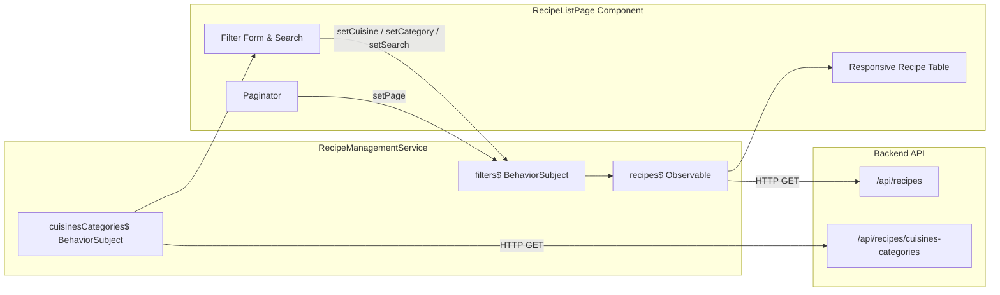

# Requirements

### Overview & Goals
The goal is to implement the Recipe List Page and Recipe Management Service within the `recipes` feature of the `web` Angular application, adhering strictly to the specification in `.junie/specs/recipes-list-page.md`. The feature will provide users with a reactive, filterable, searchable, and paginated overview of recipes built with Angular Material 3 and responsive presentation for desktop and mobile clients.

### Scope
- **In Scope**:
  - `RecipeListFilters` interface and default filters factory function.
  - `RecipeManagementService` providing reactive streams for recipes, active filters, and cuisine/category options.
  - Methods to set individual filters (resetting page to 1 when search/cuisine/category changes) and change page independently.
  - Integration with backend endpoints `/api/recipes` and `/api/recipes/cuisines-categories`.
  - `RecipeListPage` component styled with Angular Material:
    - Search text input.
    - Cuisine select dropdown.
    - Category select dropdown dependent on the selected cuisine.
    - "Create Recipe" button (placeholder action).
    - Responsive recipe table: full columns (name, description, cuisine, category, actions) on desktop; name and actions on mobile.
    - Recipe name linking to `#`.
    - Edit and delete row action buttons (placeholder actions).
    - Pagination controls.
  - All class methods implemented as readonly arrow functions.
  - Route configuration in `apps/web/src/recipes/recipes.routes.ts` and navigation link integration in `ui-menu-bar`.
  - Comprehensive unit test suites for the service and page component.
- **Out of Scope**:
  - Implementation of Recipe Details page, Create Recipe page, Edit Recipe dialog, or Delete Recipe mutation (these will be added in subsequent features).

### User Stories
- **As a user**, I want to browse recipes with pagination so that I can discover dishes easily without page overload.
- **As a user**, I want to filter recipes by cuisine and category, and search by keywords, so that I can quickly find specific dishes.
- **As a user on mobile**, I want a clean, responsive table view that focuses on recipe names while desktop users view the full details.

### Functional Requirements
1. **Filter State Management**:
   - `RecipeListFilters` contains optional `cuisine?: string`, `category?: string`, `search?: string`, `page?: number`.
   - `defaultRecipeListFilters()` returns `{ page: 1 }` ensuring immutability.
   - Setting cuisine, category, or search automatically resets `page` to `1`.
   - Changing `page` maintains current search, cuisine, and category filters.
   - `resetFilters()` restores filter state to default values.
2. **Data Fetching & Reactive Streams**:
   - `RecipeManagementService` queries `/api/recipes` via `HttpClient` using current filter query parameters.
   - `RecipeManagementService` queries `/api/recipes/cuisines-categories` and exposes options as an Observable via `cuisinesCategories()`.
   - `reloadCuisinesCategories()` refreshes the cuisine/category options.
3. **UI & Material Design**:
   - Material form controls for filtering (`mat-form-field`, `mat-select`, `mat-input`).
   - Category options are filtered dynamically based on the currently selected cuisine.
   - Responsive `mat-table` switching between full desktop layout and compact mobile layout.
   - Row action buttons for edit and delete.
4. **Method Signatures**:
   - All public and private class methods in the service and component must be declared as `readonly` arrow function properties on the class instance.

# Technical Design

### Current Implementation
- `apps/web/src/recipes/recipes.routes.ts` exists as an empty routes array lazy-loaded by `app.routes.ts` under `/recipes` protected by `authGuard`.
- Backend endpoints are defined in `apps/api/src/app/recipes/recipes.controller.ts`:
  - `GET /api/recipes` accepts `page`, `pageSize`, `search`, `cuisine`, `category` and returns `{ data: Recipe[], total: number, page: number, totalPages: number }`.
  - `GET /api/recipes/cuisines-categories` returns `{ cuisines: string[], categories: Record<string, string[]> }`.
- Angular 20 Standalone components and Material 3 theme (`@angular/material`, `@angular/cdk`) are used across the workspace.

### Key Decisions
- **Filter State via BehaviorSubject**: `filters$` is managed internally via `BehaviorSubject<RecipeListFilters>` initialized with `defaultRecipeListFilters()`.
- **Recipes Stream**: `recipes$` is derived from `filters$` using `switchMap` and `catchError` to ensure search query switches cancel pending requests and stream remains alive.
- **Responsive Table**: Angular CDK `BreakpointObserver` (or CSS media queries with `BreakpointObserver.observe([Breakpoints.Handset])`) determines displayed columns (`['name', 'description', 'cuisine', 'category', 'actions']` on desktop vs `['name', 'actions']` on mobile).
- **Arrow Function Methods**: All class methods adhere to `readonly methodName = (...) => { ... }` as required.

### Architecture Diagram


### Data Models / Contracts
```typescript
export interface RecipeListFilters {
  cuisine?: string;
  category?: string;
  search?: string;
  page?: number;
}

export interface CuisinesCategoriesResponse {
  cuisines: string[];
  categories: Record<string, string[]>;
}

export interface RecipeListItem {
  id: string;
  name: string;
  cuisine: string;
  category: string;
  description: string;
  servings: number;
}

export interface PaginatedRecipeResponse {
  data: RecipeListItem[];
  total: number;
  page: number;
  totalPages: number;
}
```

### Components & Services Design

#### `RecipeManagementService` (`apps/web/src/recipes/services/recipe-management/recipe-management.service.ts`)
- `private readonly http = inject(HttpClient);`
- `private readonly filters$ = new BehaviorSubject<RecipeListFilters>(defaultRecipeListFilters());`
- `private readonly cuisinesCategories$ = new BehaviorSubject<CuisinesCategoriesResponse>({ cuisines: [], categories: {} });`
- `private readonly recipes$: Observable<PaginatedRecipeResponse> = this.filters$.pipe(switchMap(...), shareReplay(1));`
- Methods:
  - `readonly filters = (): Observable<RecipeListFilters> => this.filters$.asObservable();`
  - `readonly recipes = (): Observable<PaginatedRecipeResponse> => this.recipes$;`
  - `readonly cuisinesCategories = (): Observable<CuisinesCategoriesResponse> => this.cuisinesCategories$.asObservable();`
  - `readonly setCuisine = (cuisine?: string): void => { ... }`
  - `readonly setCategory = (category?: string): void => { ... }`
  - `readonly setSearch = (search?: string): void => { ... }`
  - `readonly setPage = (page: number): void => { ... }`
  - `readonly resetFilters = (): void => { ... }`
  - `readonly reloadCuisinesCategories = (): void => { ... }`

#### `RecipeListPage` (`apps/web/src/recipes/pages/recipe-list/recipe-list.page.ts`)
- Injects `RecipeManagementService`, `BreakpointObserver`, `FormBuilder`.
- Reactive form with `search`, `cuisine`, and `category` controls.
- Signals/Observables:
  - `readonly recipes$ = this.recipeService.recipes();`
  - `readonly filters$ = this.recipeService.filters();`
  - `readonly cuisinesCategories$ = this.recipeService.cuisinesCategories();`
  - `readonly isMobile = toSignal(this.breakpointObserver.observe(Breakpoints.Handset).pipe(map(res => res.matches)), { initialValue: false });`
  - `readonly displayedColumns = computed(() => this.isMobile() ? ['name', 'actions'] : ['name', 'description', 'cuisine', 'category', 'actions']);`
  - `readonly availableCategories = computed(...)` derived from selected cuisine.
- Action handlers (arrow functions): `onCreateRecipe`, `onEditRecipe`, `onDeleteRecipe`, `onPageChange`, `onClearFilters`.

### File Structure
```
apps/web/src/
├── recipes/
│   ├── models/
│   │   └── recipe-list.types.ts
│   ├── pages/
│   │   └── recipe-list/
│   │       ├── recipe-list.page.html
│   │       ├── recipe-list.page.scss
│   │       ├── recipe-list.page.spec.ts
│   │       └── recipe-list.page.ts
│   ├── services/
│   │   └── recipe-management/
│   │       ├── recipe-management.service.spec.ts
│   │       └── recipe-management.service.ts
│   └── recipes.routes.ts
└── libs/ui/src/navigation/components/menu-bar/
    └── menu-bar.component.html
```

### Risks & Mitigations
- **Category options mismatch when switching cuisines**: When user changes cuisine, any currently selected category that does not belong to the newly selected cuisine will be cleared automatically in `setCuisine` or form listener.
- **Race conditions with fast search typing**: Handled by `switchMap` in `RecipeManagementService` to discard stale in-flight HTTP requests.
- **Arrow function method requirement**: Verified with explicit unit tests checking `hasOwnProperty.call(instance, methodName)` to ensure full compliance.

# Testing

### Validation Approach
Automated testing with Vitest/Jest and Angular Testing Utilities (`TestBed`, `HttpTestingController`, `ComponentFixture`, `By`).

### Key Scenarios
1. **RecipeManagementService**:
   - Initial state: `filters()` emits `{ page: 1 }`.
   - Arrow function checks: verify `hasOwnProperty` on instance for `filters`, `recipes`, `cuisinesCategories`, `setCuisine`, `setCategory`, `setSearch`, `setPage`, `resetFilters`, `reloadCuisinesCategories`.
   - `setCuisine`, `setCategory`, `setSearch` update their respective filter and reset `page` to 1.
   - `setPage` updates `page` without mutating other filter fields.
   - `resetFilters` resets to `{ page: 1 }`.
   - `recipes()` fetches `/api/recipes` with correct query parameters whenever filters change.
   - `cuisinesCategories()` loads options from `/api/recipes/cuisines-categories` and `reloadCuisinesCategories()` triggers a refresh.

2. **RecipeListPage Component**:
   - Initial render displays search input, cuisine select, category select, create button, table headers, and paginator.
   - Category select options dynamically update when cuisine changes.
   - Submitting search / changing selects calls service filter setters.
   - Recipe rows render correct columns for desktop (`name`, `description`, `cuisine`, `category`, `actions`).
   - Recipe rows render only `name` and `actions` when viewport is mobile.
   - Recipe name contains an anchor with `href="#"`.
   - Edit, delete, and create buttons are rendered and clickable.
   - Paginator changes call `service.setPage`.

### Edge Cases
- Backend error on `/api/recipes`: Service handles error gracefully without breaking the reactive stream.
- Empty search results: Component shows empty state message in the table.
- Changing cuisine clears invalid category selection.

# Delivery Steps

### ✓ Step 1: Implement RecipeManagementService and unit tests
`RecipeManagementService` is implemented in `apps/web/src/recipes/services/recipe-management/` with reactive filter and recipe streams, option loaders, and comprehensive unit tests.

- Define `RecipeListFilters`, `CuisinesCategoriesResponse`, and paginated response models.
- Implement immutable `defaultRecipeListFilters` factory function returning `{ page: 1 }`.
- Create `RecipeManagementService` with `BehaviorSubject` state for filters and cuisines/categories options.
- Implement reactive `recipes$` stream powered by `switchMap` calling backend `/api/recipes` with query parameters (`page`, `cuisine`, `category`, `search`).
- Add readonly arrow function methods: `filters`, `recipes`, `cuisinesCategories`, `setCuisine`, `setCategory`, `setSearch`, `setPage`, `resetFilters`, and `reloadCuisinesCategories`.
- Ensure changing `cuisine`, `category`, or `search` resets `page` to 1, while `setPage` preserves other filter values.
- Write unit tests in `recipe-management.service.spec.ts` testing initial state, arrow function property declarations, API requests, filter updates, pagination resets, and error handling.

### ✓ Step 2: Implement RecipeListPage component and unit tests
`RecipeListPage` is created in `apps/web/src/recipes/pages/recipe-list/` with Material form controls, responsive data table, action buttons, and pagination.

- Scaffold `RecipeListPage` standalone component with Angular Material (`MatCardModule`, `MatFormFieldModule`, `MatInputModule`, `MatSelectModule`, `MatTableModule`, `MatPaginatorModule`, `MatButtonModule`, `MatIconModule`).
- Implement filter controls: search input with debounce/update, cuisine select dropdown, dependent category select dropdown (filtered by selected cuisine), and a "Create Recipe" action button.
- Implement recipe list table with responsive column handling: show `name`, `description`, `cuisine`, `category`, and `actions` on desktop; show `name` and `actions` on mobile devices using `BreakpointObserver` or CSS responsiveness.
- Link recipe names to `#` (placeholder for future recipe details page) and add placeholder edit/delete action buttons for each row.
- Integrate `MatPaginator` to bind page changes to `service.setPage`.
- Declare all component methods as readonly arrow functions.
- Write component unit tests in `recipe-list.page.spec.ts` covering rendering, form filtering, dependent category logic, responsive column toggling, pagination interaction, and empty/loading states.

### ✓ Step 3: Configure routing, navigation links, and verify workspace
Recipe routes and navigation menu links are configured and verified with automated test suites and linting.

- Register `RecipeListPage` as default route (`path: ''`) in `apps/web/src/recipes/recipes.routes.ts`.
- Update navigation menu in `libs/ui/src/navigation/components/menu-bar/menu-bar.component.html` to navigate to `/recipes`.
- Run full test suite (`npx nx test web`) and linting (`npx nx lint web`) to verify zero regressions and complete test coverage.