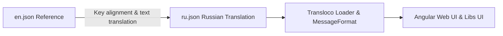

# Requirements

### Overview & Goals
The objective is to complete the Russian localization for the Top Nosh web application by updating `apps/web/public/assets/i18n/ru.json` so that all untranslated English strings are translated into natural, accurate Russian while maintaining UTF-8 encoding, consistent key hierarchy with `en.json`, and proper ICU/interpolation placeholder formatting.

### Scope
#### In Scope
- Translating all English strings in `apps/web/public/assets/i18n/ru.json` into Russian.
- Correcting casing mismatches in key namespaces (e.g., `ui.MenuBar`, `ui.PageHeader`) to align with `en.json` and Angular template transloco prefix configurations.
- Adding missing keys present in `en.json` (such as `ui.MenuBar.logout`).
- Preserving all interpolation tokens (`{{ index }}`, `{{ name }}`) and ICU pluralization structures (`{count, plural, ...}`).
- Validating UTF-8 encoding and valid JSON formatting according to project standards (`dprint`).

#### Out of Scope
- Modifying application components or TypeScript source code.
- Adding new localization languages other than Russian (`ru.json`).
- Backend API localization (backend uses standard error payloads).

### Functional Requirements
- **Authentication & Onboarding**: All form labels, placeholders, validation hints, submit buttons, and toast messages across Login, Onboard, and Password Change pages must be in Russian.
- **Dashboard & Landing**: Greetings, recent recipe summaries, shopping list widgets, and navigation calls-to-action must be in Russian.
- **Recipe Management**:
  - Recipe list, filtering by cuisine/category, search bar placeholders, pagination, and deletion dialogues.
  - Recipe details, view mode switchers (At a Glance / Cooking Mode), servings adjuster, and cooking stage instructions.
  - Recipe creation and editing form (metadata, stage management, steps, ingredients, units, quantities, public sharing toggles).
- **Shopping Lists**:
  - Shopping list overview table and creation prompt.
  - Shopping list item details, item checkoff/completion, drag-to-reorder aria labels, and batch deletion of bought items.
- **User Management**:
  - System user listing, profile viewing, user creation, and profile editing forms.
- **UI & System**:
  - Navigation bar links and mobile menu triggers.
  - Page header back buttons and common system dialog confirmations ("OK").

### Non-Functional Requirements
- **Encoding**: File must remain strictly UTF-8 encoded.
- **Formatting**: Valid JSON structure matching `dprint` rules (`npm run format:check`).
- **Linguistic Quality**: Professional, clear culinary and UI terminology appropriate for web applications.

# Technical Design

### Current Implementation
The web application uses `@jsverse/transloco` and `@jsverse/transloco-messageformat` with translation files stored under `apps/web/public/assets/i18n/`.
- `en.json`: Fully defined English translation dictionary.
- `ru.json`: Partially localized dictionary where several sections (e.g., `LoginPage`, `OnboardPage`, `PasswordChangePage`, `RecipeFormComponent`, `ShoppingListPage`, `UserListPage`) currently contain untranslated English text, minor key casing differences (`menuBar` vs `MenuBar`), and missing keys (`logout`).

### Key Decisions
- **Structural Synchronization with `en.json`**: Ensure all keys and object hierarchies in `ru.json` strictly match `en.json` to avoid fallback issues or runtime missing translation warnings.
- **Natural Russian Terminology**:
  - "Dashboard" -> "Главная"
  - "Recipes" -> "Рецепты"
  - "Shopping Lists" -> "Списки покупок"
  - "Settings" -> "Настройки"
  - "Log out" -> "Выйти"
  - "Cuisine" -> "Кухня"
  - "Category" -> "Категория"
  - "Servings" -> "Порции"
  - "Cooking Stages" -> "Этапы приготовления"
  - "Cooking Steps" -> "Шаги приготовления"
  - "Ingredients" -> "Ингредиенты"
- **ICU MessageFormat & Interpolations**: Keep all Transloco variable syntax `{{ name }}`, `{{ index }}` and ICU pluralization structures (`{count, plural, =1 {# порцию} =2 {# порции} =3 {# порции} =4 {# порции} other {# порций}}`) intact.

### Components Affected
- `libs/ui/src/navigation/components/menu-bar/menu-bar.component.html` (`ui.MenuBar.*`)
- `libs/ui/src/layouts/components/page-header/page-header.component.html` (`ui.PageHeader.*`)
- `apps/web/src/auth/pages/*` (`web.LoginPage`, `web.OnboardPage`, `web.PasswordChangePage`)
- `apps/web/src/dashboard/pages/*` (`web.LandingPage`)
- `apps/web/src/recipes/pages/*` & `apps/web/src/recipes/components/*` (`web.RecipeListPage`, `web.RecipeDetailsPage`, `web.RecipeFormComponent`, `web.CreateRecipePage`, `web.EditRecipePage`, `web.CookingStagesComponent`, `web.GlanceStagesComponent`, `web.IngredientListComponent`)
- `apps/web/src/shopping-lists/pages/*` & `apps/web/src/shopping-lists/directives/*` (`web.ShoppingListPage`, `web.ShoppingListDetailsPage`, `web.AddToShoppingListDirective`, `web.AddToShoppingListContentComponent`)
- `apps/web/src/users/pages/*` (`web.UserListPage`, `web.CreateUserPage`, `web.EditUserPage`)

### File Structure
- `apps/web/public/assets/i18n/ru.json` (Target modified file)
- `apps/web/public/assets/i18n/en.json` (Reference file)

### Architecture Diagram

# Testing

### Validation Approach
- Validate that `apps/web/public/assets/i18n/ru.json` is syntactically valid JSON.
- Verify key parity between `en.json` and `ru.json` to ensure no translation key is omitted or misspelled.
- Validate that all English string values in `ru.json` have been replaced with Russian translations.
- Run `npm run format:check` to ensure formatting complies with project standards.

### Key Scenarios
- **Key Completeness**: All sections present in `en.json` (`ui`, `web.LoginPage`, `web.OnboardPage`, `web.PasswordChangePage`, `web.LandingPage`, `web.SharedRecipePage`, `web.CookingStagesComponent`, `web.GlanceStagesComponent`, `web.IngredientListComponent`, `web.RecipeFormComponent`, `web.CreateRecipePage`, `web.EditRecipePage`, `web.RecipeDetailsPage`, `web.RecipeListPage`, `web.AddToShoppingListDirective`, `web.AddToShoppingListContentComponent`, `web.ShoppingListPage`, `web.ShoppingListDetailsPage`, `web.CreateUserPage`, `web.EditUserPage`, `web.UserListPage`) are fully translated.
- **Placeholder Integrity**: Placeholders like `{{ index }}`, `{{ name }}` and plural patterns match the expected variable bindings.

### Edge Cases
- **Case Sensitivity in Transloco Prefixes**: Ensure `MenuBar` and `PageHeader` keys match the exact case required by UI components.
- **Special Characters & Quotes**: Ensure Russian quotes, dashes, and Cyrillic UTF-8 characters are formatted properly without escaped corruption.

# Delivery Steps

### ✓ Step 1: Translate UI navigation and authentication modules
Complete Russian translations for top-level navigation, system messages, and all authentication pages.

- Update `ui.MenuBar` (ensure proper key casing and add missing `logout` translation: "Выйти").
- Update `ui.PageHeader` (ensure proper key casing for `back`: "Назад").
- Translate `web.LoginPage` strings (email, password, login actions, and error messages).
- Translate `web.OnboardPage` strings (account creation labels, placeholders, validation, and feedback messages).
- Translate `web.PasswordChangePage` strings (password update labels, validation errors, and statuses).

### ✓ Step 2: Translate recipe browsing, viewing, and management modules
Complete Russian translations for recipe browsing, detailed viewing, and creation/editing workflows.

- Translate `web.LandingPage` dashboard strings (recent recipes, call-to-actions, and empty states).
- Complete remaining untranslated strings in `web.SharedRecipePage` (e.g. `modeAriaLabel`).
- Translate `web.RecipeFormComponent` metadata labels, placeholders, cooking stages, step instructions, and ingredient inputs.
- Translate `web.CreateRecipePage` and `web.EditRecipePage` titles, actions, submission states, and feedback banners.
- Translate `web.RecipeDetailsPage` controls, confirmations, and view mode labels.
- Translate `web.RecipeListPage` table headers, filters, search placeholders, actions, and empty states.

### ✓ Step 3: Translate shopping lists and user management modules
Complete Russian translations for shopping lists management and user administration.

- Translate `web.AddToShoppingListDirective` and `web.AddToShoppingListContentComponent` prompts and statuses.
- Translate `web.ShoppingListPage` table columns, actions, descriptions, and empty states.
- Translate `web.ShoppingListDetailsPage` item list controls, drag/drop labels, completed item states, and item management.
- Translate `web.CreateUserPage` form fields, validation messages, and action buttons.
- Translate `web.EditUserPage` user profile modification and view strings.
- Translate `web.UserListPage` administrative table columns, user management actions, and pagination labels.

### ✓ Step 4: Validate translations, ICU placeholders, and JSON formatting
`ru.json` is fully valid, matches the structure and parameter placeholders of `en.json`, and adheres to formatting guidelines.

- Ensure all interpolation parameters (e.g. `{{ index }}`, `{{ name }}`) and ICU MessageFormat pluralization syntax (e.g., in `IngredientListComponent`) are preserved accurately.
- Verify that `ru.json` contains no leftover English text and is valid UTF-8 JSON.
- Run project formatting (`npm run format:check`) and linting/tests to verify code style and integrity.