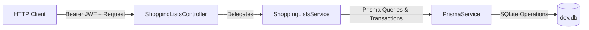

# Requirements

### Overview & Goals
Implement a complete CRUD (Create, Read, Update, Delete) module for Shopping Lists in the `apps/api` NestJS backend application. The module allows authenticated users to manage multiple shopping lists with nested items, supporting pagination, full details retrieval, differential item updates, and non-destructive soft deletion.

### Scope
#### In Scope
- Database schema changes in `prisma/schema.prisma` adding `ShoppingList` and `ShoppingListItem` models with proper relations and indices.
- Database migration and Prisma client generation.
- Request DTOs with validation (`class-validator` and `class-transformer`) for creation, update, and pagination querying.
- Response types and interfaces for shopping list entities and paginated metadata.
- `ShoppingListsService` providing business logic for:
  - Paginated listing of non-deleted shopping lists ordered by creation date (excluding child items).
  - Retrieving full shopping list details with associated items.
  - Creating new shopping lists with nested items.
  - Differentially updating existing shopping lists and their items (handling additions, updates, and removals).
  - Soft deleting shopping lists (setting `deletedAt` timestamp without deleting child item records).
- `ShoppingListsController` exposing REST endpoints protected by `JwtAuthGuard`.
- `ShoppingListsModule` registered in `AppModule`.
- Unit tests (`.spec.ts`) for service and controller, plus E2E integration tests (`.e2e.spec.ts`).

#### Out of Scope
- Frontend UI components for shopping lists (API implementation only).
- User-specific ownership filtering (matches existing recipe implementation pattern).

### User Stories
- **As an authenticated user**, I want to list all active shopping lists with pagination metadata so that I can browse through my lists without loading unneeded child items.
- **As an authenticated user**, I want to view the full details of a shopping list, including all its items, so that I can see what I need to buy and their status.
- **As an authenticated user**, I want to create a new shopping list with initial items and receive its ID.
- **As an authenticated user**, I want to update a shopping list's information and its items (adding new items, modifying existing items, or removing items) in a single request.
- **As an authenticated user**, I want to soft delete a shopping list so that it is excluded from active queries while retaining database history and child records.

### Functional Requirements
- **Authentication**: All endpoints (`GET /shopping-lists`, `GET /shopping-lists/:id`, `POST /shopping-lists`, `PUT /shopping-lists/:id`, `DELETE /shopping-lists/:id`) must require a valid JWT bearer token.
- **Listing Endpoint (`GET /shopping-lists`)**:
  - Exclude soft-deleted records (`deletedAt IS NULL`).
  - Order results by `createdAt` descending.
  - Return paginated data (`data: ShoppingList[]`) without child items.
  - Return pagination metadata: `total` (number of records), `page` (current page, default 1), and `totalPages` (calculated from page size 50).
- **Details Endpoint (`GET /shopping-lists/:id`)**:
  - Return the shopping list details with nested `items: ShoppingListItem[]` ordered by item order / creation.
  - Return `404 Not Found` if the shopping list does not exist or has `deletedAt` set.
- **Create Endpoint (`POST /shopping-lists`)**:
  - Accept `CreateShoppingListDto` with `name`, `description`, and `items` array (`name`, `quantity`, `isBought`, `order`).
  - Create the shopping list and child items atomically.
  - Return `201 Created` with `{ id: string }`.
  - Validate payloads and return `400 Bad Request` on invalid input.
- **Update Endpoint (`PUT /shopping-lists/:id`)**:
  - Accept `UpdateShoppingListDto` with updated metadata and items.
  - Execute within a database transaction:
    - Update shopping list fields (`name`, `description`).
    - Update existing items (matched by `id`).
    - Create new items (items without `id`).
    - Remove items omitted from the payload.
  - Return the updated shopping list model with refreshed items.
  - Return `404 Not Found` if the shopping list does not exist or is soft deleted.
- **Delete Endpoint (`DELETE /shopping-lists/:id`)**:
  - Perform a soft delete by setting `deletedAt = new Date()`.
  - Preserve child item records in the database (no cascade or direct deletion of items).
  - Return `200 OK` with `{ message: 'Shopping list deleted successfully' }`.
  - Return `404 Not Found` if the shopping list does not exist or was already deleted.

# Technical Design

### Current Implementation
The `apps/api` application is built on NestJS and uses Prisma ORM connected to SQLite (`dev.db`). Authentication is implemented via `JwtAuthGuard` and Passport JWT strategy. Existing modules such as `RecipesModule` establish conventions for:
- DTO validation using `class-validator` and `class-transformer` with `@ValidateNested()` and `@Type()`.
- Global validation pipe configured in `main.ts` with `{ whitelist: true, transform: true }`.
- Transactional differential updates using `this.prisma.$transaction(...)`.
- Soft deletion via `deletedAt: DateTime?` column.
- Standard pagination structure: `{ data, total, page, totalPages }` with `PAGE_SIZE = 50`.

### Key Decisions
1. **Model & Relation Design**:
   - `ShoppingList` model with `id`, `name`, `description`, `createdAt`, `updatedAt`, `deletedAt`, and relation to `ShoppingListItem[]`.
   - `ShoppingListItem` model with `id`, `shoppingListId`, `name`, `quantity` (Float), `isBought` (Boolean, default `false`), `order` (Int, default `0`), `createdAt`, `updatedAt`.
   - Foreign key constraint with `onDelete: Cascade` defined on the database level for referential integrity, while application-level delete logic sets `deletedAt` without deleting rows.
2. **Differential Sync for Items**:
   - In `updateShoppingList`, compare existing item IDs with incoming item IDs within a Prisma transaction. Delete omitted items, update existing ones, and insert new items.
3. **Soft Deletion Strategy**:
   - Soft delete updates `deletedAt` on `ShoppingList`. All query methods (`findMany`, `findFirst`, `count`) filter by `where: { deletedAt: null }`. Child `ShoppingListItem` records remain untouched in the database.

### Proposed Changes
#### 1. Prisma Schema (`prisma/schema.prisma`)
Add the following models:
```prisma
model ShoppingList {
  id          String             @id @default(uuid())
  name        String
  description String
  items       ShoppingListItem[]
  createdAt   DateTime           @default(now()) @map("created_at")
  updatedAt   DateTime           @updatedAt @map("updated_at")
  deletedAt   DateTime?          @map("deleted_at")

  @@index([deletedAt])
  @@index([createdAt])
  @@map("shopping_lists")
}

model ShoppingListItem {
  id             String       @id @default(uuid())
  shoppingListId String       @map("shopping_list_id")
  name           String
  quantity       Float
  isBought       Boolean      @default(false) @map("is_bought")
  order          Int          @default(0)
  shoppingList   ShoppingList @relation(fields: [shoppingListId], references: [id], onDelete: Cascade)
  createdAt      DateTime     @default(now()) @map("created_at")
  updatedAt      DateTime     @updatedAt @map("updated_at")

  @@index([shoppingListId])
  @@map("shopping_list_items")
}
```

#### 2. DTOs and Response Types (`apps/api/src/app/shopping-lists/dto/`)
- `create-shopping-list.dto.ts`:
  - `CreateShoppingListItemDto`: `name` (string, non-empty), `quantity` (number, min 0), `isBought` (boolean, optional, default false), `order` (int, optional).
  - `CreateShoppingListDto`: `name` (string, non-empty), `description` (string), `items` (array of `CreateShoppingListItemDto`).
- `update-shopping-list.dto.ts`:
  - `UpdateShoppingListItemDto`: `id` (optional string), `name` (string, non-empty), `quantity` (number, min 0), `isBought` (boolean), `order` (int, optional).
  - `UpdateShoppingListDto`: `name` (string, non-empty), `description` (string), `items` (array of `UpdateShoppingListItemDto`).
- `shopping-list-query.dto.ts`:
  - `ShoppingListQueryDto`: `page` (optional number, min 1, default 1).
- `shopping-list-response.dto.ts`:
  - `PaginatedShoppingListResponse`: `{ data: ShoppingList[], total: number, page: number, totalPages: number }`
  - `ShoppingListCreatedResponse`: `{ id: string }`
  - `DeleteShoppingListResponse`: `{ message: string }`
  - `ShoppingListWithDetails`: `ShoppingList & { items: ShoppingListItem[] }`

#### 3. Service (`apps/api/src/app/shopping-lists/shopping-lists.service.ts`)
- `getShoppingLists(query: ShoppingListQueryDto)`: Queries count and list with `where: { deletedAt: null }`, `skip`, `take: PAGE_SIZE`, `orderBy: { createdAt: 'desc' }`.
- `getShoppingListById(id: string)`: Queries `findFirst` with `where: { id, deletedAt: null }` and `include: { items: { orderBy: { order: 'asc' } } }`. Throws `NotFoundException` if missing.
- `createShoppingList(dto: CreateShoppingListDto)`: Calls `prisma.shoppingList.create` with nested `items.create`.
- `updateShoppingList(id: string, dto: UpdateShoppingListDto)`: Performs differential synchronization in `prisma.$transaction`.
- `deleteShoppingList(id: string)`: Verifies list exists and `deletedAt: null`, then updates `deletedAt: new Date()`.

#### 4. Controller (`apps/api/src/app/shopping-lists/shopping-lists.controller.ts`)
- `@Controller('shopping-lists')`
- `@UseGuards(JwtAuthGuard)`
- `@Get()` -> `getShoppingLists(@Query() query: ShoppingListQueryDto)`
- `@Get(':id')` -> `getShoppingListById(@Param('id') id: string)`
- `@Post()` -> `@HttpCode(HttpStatus.CREATED)` `createShoppingList(@Body() dto: CreateShoppingListDto)`
- `@Put(':id')` -> `@HttpCode(HttpStatus.OK)` `updateShoppingList(@Param('id') id: string, @Body() dto: UpdateShoppingListDto)`
- `@Delete(':id')` -> `@HttpCode(HttpStatus.OK)` `deleteShoppingList(@Param('id') id: string)`

#### 5. Module & App Integration (`apps/api/src/app/`)
- Create `ShoppingListsModule` providing `ShoppingListsService` and `ShoppingListsController`.
- Register `ShoppingListsModule` in `AppModule.imports`.

### Architecture Diagram


### File Structure
```
prisma/
├── schema.prisma                                              (modified)
└── migrations/
    └── <timestamp>_create_shopping_list_tables/migration.sql  (added)
apps/api/src/app/
├── app.module.ts                                              (modified)
└── shopping-lists/
    ├── dto/
    │   ├── create-shopping-list.dto.ts                        (added)
    │   ├── update-shopping-list.dto.ts                        (added)
    │   ├── shopping-list-query.dto.ts                         (added)
    │   └── shopping-list-response.dto.ts                      (added)
    ├── shopping-lists.controller.ts                           (added)
    ├── shopping-lists.controller.spec.ts                      (added)
    ├── shopping-lists.service.ts                              (added)
    ├── shopping-lists.service.spec.ts                         (added)
    ├── shopping-lists.module.ts                               (added)
    └── shopping-lists.e2e.spec.ts                             (added)
```

# Testing

### Validation Approach
Automated verification will be executed via unit tests (`jest`) and integration E2E tests (`supertest` hitting the NestJS application with SQLite database).

### Key Scenarios
1. **Authentication Guard**:
   - Verify `401 Unauthorized` for all 5 endpoints when unauthenticated or token is invalid.
   - Verify `200` / `201` when valid Bearer token is provided.
2. **Shopping List Creation (`POST /api/shopping-lists`)**:
   - Create shopping list with nested items; verify return value `{ id: string }`.
   - Verify DB contains the new list and related items.
   - Verify `400 Bad Request` when required fields are missing or types are invalid.
3. **Shopping List Details (`GET /api/shopping-lists/:id`)**:
   - Fetch details by ID; verify complete list properties and nested items array.
   - Verify `404 Not Found` for non-existent ID.
   - Verify `404 Not Found` for soft-deleted ID.
4. **Shopping List Listing & Pagination (`GET /api/shopping-lists`)**:
   - Fetch listing; verify items are sorted by `createdAt` descending.
   - Verify children items are excluded from list objects.
   - Verify `total`, `page`, and `totalPages` are calculated accurately.
   - Verify soft-deleted lists are excluded from results.
   - Verify empty state returns `{ data: [], total: 0, page: 1, totalPages: 0 }`.
5. **Differential Update (`PUT /api/shopping-lists/:id`)**:
   - Update metadata (e.g. name, description).
   - Retain existing item (by ID) and update properties (`name`, `quantity`, `isBought`).
   - Add new item (without ID) and verify it receives a generated ID.
   - Delete omitted item and verify it is removed from relations.
   - Verify response contains the complete updated entity with updated item list.
   - Verify `404 Not Found` when attempting to update a missing or soft-deleted list.
6. **Soft Deletion (`DELETE /api/shopping-lists/:id`)**:
   - Soft delete list; verify response `{ message: 'Shopping list deleted successfully' }`.
   - Verify list no longer appears in `GET /api/shopping-lists` or `GET /api/shopping-lists/:id` (returns `404`).
   - Verify database row still exists with `deletedAt` set and child item rows remain intact.
   - Verify subsequent delete of the same ID returns `404 Not Found`.

### Edge Cases
- Empty items array in creation or update.
- Pagination requesting a page beyond total pages.
- Item quantity as a floating point number.
- Toggling item `isBought` status between true and false.
- Attempting to update or delete non-existent or already soft-deleted IDs.

# Delivery Steps

### ✓ Step 1: Define database schema and apply Prisma migration
Database schema updated with `ShoppingList` and `ShoppingListItem` models, migrations applied, and Prisma client generated.

- Add `ShoppingList` and `ShoppingListItem` models to `prisma/schema.prisma` with proper relations (`fields: [shoppingListId], references: [id], onDelete: Cascade`), indices (`deletedAt`, `createdAt`, `shoppingListId`), and field mappings.
- Execute Prisma migration using `npx prisma migrate dev --name create_shopping_list_tables` to create the `shopping_lists` and `shopping_list_items` SQLite tables.
- Run `npx prisma generate` to update `@prisma/client` types with the new models.

### ✓ Step 2: Create DTOs and response interfaces
All DTO classes and TypeScript interfaces for shopping list requests and responses are implemented and validated.

- Create `apps/api/src/app/shopping-lists/dto/create-shopping-list.dto.ts` with validation decorators (`@IsString()`, `@IsNotEmpty()`, `@IsNumber()`, `@Min()`, `@IsBoolean()`, `@ValidateNested()`, `@Type()`) for list and item fields.
- Create `apps/api/src/app/shopping-lists/dto/update-shopping-list.dto.ts` supporting differential item synchronization with optional item `id` fields.
- Create `apps/api/src/app/shopping-lists/dto/shopping-list-query.dto.ts` for pagination query parameters (`page?: number`).
- Create `apps/api/src/app/shopping-lists/dto/shopping-list-response.dto.ts` defining `PaginatedShoppingListResponse`, `ShoppingListCreatedResponse`, `DeleteShoppingListResponse`, and `ShoppingListWithDetails` types.

### ✓ Step 3: Implement ShoppingListsService with unit tests
`ShoppingListsService` implements listing, retrieval, creation, differential item updating, and soft deletion with comprehensive unit tests.

- Implement `getShoppingLists(query)` in `ShoppingListsService` to return paginated non-deleted shopping lists ordered by `createdAt` descending, excluding item relations.
- Implement `getShoppingListById(id)` returning full details with items ordered by item `order` / creation date, throwing `NotFoundException` for non-existent or soft-deleted records.
- Implement `createShoppingList(dto)` creating the shopping list and nested `ShoppingListItem` rows in a single Prisma query, returning `{ id }`.
- Implement `updateShoppingList(id, dto)` in a Prisma transaction (`$transaction`) to update list fields and differentially synchronize items (updating items with matching IDs, inserting new items, and deleting removed items).
- Implement `deleteShoppingList(id)` setting `deletedAt = new Date()` on the shopping list record without deleting child `ShoppingListItem` rows, returning `{ message: 'Shopping list deleted successfully' }`.
- Write unit tests in `apps/api/src/app/shopping-lists/shopping-lists.service.spec.ts` covering all service methods, pagination, transaction sync, and error cases.

### ✓ Step 4: Implement Controller, wire AppModule, and add E2E integration tests
`ShoppingListsController` and `ShoppingListsModule` are wired into `AppModule`, and controller unit tests along with full E2E integration tests are implemented.

- Create `ShoppingListsController` in `apps/api/src/app/shopping-lists/shopping-lists.controller.ts` with `@UseGuards(JwtAuthGuard)` and endpoints: `GET /shopping-lists`, `GET /shopping-lists/:id`, `POST /shopping-lists`, `PUT /shopping-lists/:id`, and `DELETE /shopping-lists/:id`.
- Create `ShoppingListsModule` in `apps/api/src/app/shopping-lists/shopping-lists.module.ts` importing `PrismaModule` and exporting `ShoppingListsService`.
- Register `ShoppingListsModule` in `apps/api/src/app/app.module.ts`.
- Write controller unit tests in `apps/api/src/app/shopping-lists/shopping-lists.controller.spec.ts`.
- Write E2E integration tests in `apps/api/src/app/shopping-lists/shopping-lists.e2e.spec.ts` using Supertest covering JWT auth enforcement, validation errors, listing pagination, CRUD operations, differential item updates, and soft deletion persistence.