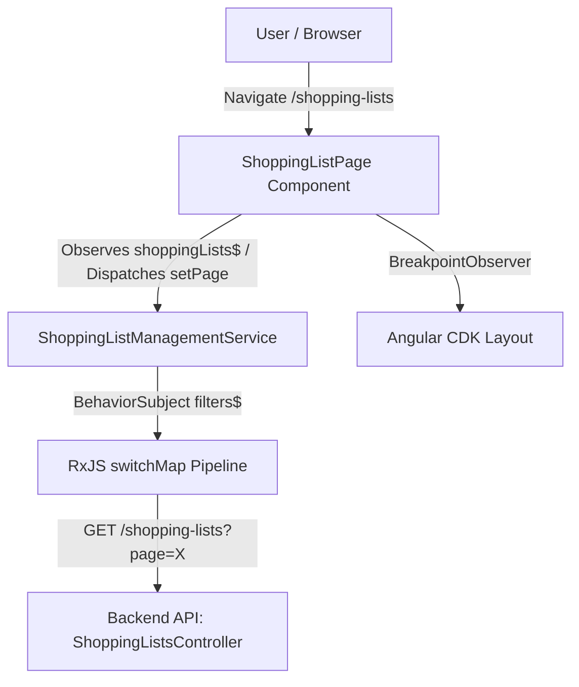

# Requirements

### Overview & Goals
Create a shopping lists listing page within the `shopping-lists` feature of the `web` Angular application and a supporting reactive management service to fetch and manage paginated shopping lists from the backend API.

### Scope
- **In Scope**:
  - `ShoppingListFilter` model and immutable default filter provider function.
  - `ShoppingListManagementService` implementing reactive state management with `BehaviorSubject` and `switchMap` HTTP requests, matching `RecipeManagementService`.
  - `ShoppingListPage` component with Material Design table, responsive column layout for desktop vs mobile, pagination controls, empty state, and action buttons.
  - Route registration in `apps/web/src/shopping-lists/shopping-lists.routes.ts`.
  - Comprehensive unit tests for both the service and the page component.
- **Out of Scope**:
  - Shopping list details page (links set to `#` for now).
  - Create shopping list flow / form (create button is a no-op placeholder for now).
  - Delete shopping list execution / dialog (delete button is a no-op placeholder for now).
  - Edit shopping list functionality (explicitly not needed).

### User Stories
- **As an authenticated user**, I want to view a paginated list of my shopping lists with their name, description, and last updated date so that I can easily browse and manage them.
- **As a mobile user**, I want a streamlined list showing only the shopping list name and action buttons so that the interface fits comfortably on small screens.
- **As a user**, I want pagination controls to navigate through multiple pages of shopping lists.

### Functional Requirements
1. **Filter Model & State**:
   - Define interface `ShoppingListFilter` containing single property `page?: number`.
   - Export immutable function `defaultShoppingListFilters(): ShoppingListFilter` returning `{ page: 1 }`.
2. **Shopping List Management Service**:
   - Maintain current filters in a private `BehaviorSubject<ShoppingListFilter>`.
   - Expose public `filters(): Observable<ShoppingListFilter>`.
   - Maintain private readonly `shoppingLists$: Observable<PaginatedShoppingListResponse>` fetching `GET /shopping-lists?page=<page>` whenever filters emit.
   - Expose public `shoppingLists(): Observable<PaginatedShoppingListResponse>`.
   - Expose public `setPage(page: number): void` to update the current filter page.
   - Expose public `resetFilters(): void` to restore filters to default values.
   - All class methods must be declared as readonly arrow function properties.
3. **Shopping List Listing Page**:
   - Follow Angular Standalone Component pattern with `ChangeDetectionStrategy.OnPush`.
   - Include page header with title "Shopping Lists", subtitle, and "Create Shopping List" button (no-op action at this stage).
   - Display a Material table (`mat-table`) with columns:
     - Desktop: `name`, `description`, `updatedAt`, `actions`.
     - Mobile (Breakpoints.Handset): `name`, `actions`.
   - Name column renders an anchor tag with `href="#"`.
   - Actions column renders a delete icon button (no-op action at this stage).
   - Display `mat-paginator` wired to total count and current page with page size 50.
   - Display empty state when no items are returned.
   - All component methods must be declared as readonly arrow function properties.
4. **Routing**:
   - Route `''` in `apps/web/src/shopping-lists/shopping-lists.routes.ts` loads `ShoppingListPage`.

# Technical Design

### Current Implementation
- `apps/web/src/app/app.routes.ts` already configures the lazy route `/shopping-lists` protected by `authGuard` pointing to `apps/web/src/shopping-lists/shopping-lists.routes.ts`.
- `apps/web/src/shopping-lists/shopping-lists.routes.ts` currently exports an empty `routes: Route[] = []`.
- Backend API endpoint `GET /shopping-lists` is implemented in `apps/api/src/app/shopping-lists/shopping-lists.controller.ts`, accepting `ShoppingListQueryDto` (`page?: number`) and returning `PaginatedShoppingListResponse`.
- Existing reference implementation: `RecipeManagementService` (`apps/web/src/recipes/services/recipe-management/recipe-management.service.ts`) and `RecipeListPage` (`apps/web/src/recipes/pages/recipe-list/recipe-list.page.ts`).

### Key Decisions
- **Reactivity Pattern**: Follow exact `RecipeManagementService` pattern using `BehaviorSubject<ShoppingListFilter>` piped into `switchMap` HTTP request with `catchError` fallback.
- **Methods Style**: Declare all service and component methods as `readonly methodName = (...) => ...` to strictly adhere to workspace coding conventions and test assertions.
- **Responsive Table Layout**: Use `@angular/cdk/layout` `BreakpointObserver` (`Breakpoints.Handset`) to switch `displayedColumns` between `[ 'name', 'description', 'updatedAt', 'actions' ]` (desktop) and `[ 'name', 'actions' ]` (mobile).
- **Component Structure**: Standalone component with OnPush change detection, AsyncPipe in template, and signals for responsive breakpoints.

### Data Models / Contracts
```typescript
// apps/web/src/shopping-lists/models/shopping-list.types.ts

export interface ShoppingListFilter {
  page?: number;
}

export const defaultShoppingListFilters = (): ShoppingListFilter => ({
  page: 1
});

export interface ShoppingListItem {
  id: string;
  name: string;
  description?: string | null;
  createdAt?: string | Date;
  updatedAt?: string | Date;
  deletedAt?: string | Date | null;
}

export interface PaginatedShoppingListResponse {
  data: ShoppingListItem[];
  total: number;
  page: number;
  totalPages: number;
}
```

### Components & Architecture

#### `ShoppingListManagementService` (`apps/web/src/shopping-lists/services/shopping-list-management/shopping-list-management.service.ts`)
```typescript
@Injectable({ providedIn: 'root' })
export class ShoppingListManagementService {
  private readonly http = inject(HttpClient);
  private readonly filters$ = new BehaviorSubject<ShoppingListFilter>(defaultShoppingListFilters());

  private readonly shoppingLists$: Observable<PaginatedShoppingListResponse> = this.filters$.pipe(
    switchMap(filters => {
      let params = new HttpParams();
      if (filters.page !== undefined && filters.page !== null) {
        params = params.set('page', filters.page.toString());
      }
      return this.http.get<PaginatedShoppingListResponse>('/shopping-lists', { params }).pipe(
        catchError(() =>
          of({
            data: [],
            total: 0,
            page: 1,
            totalPages: 0
          })
        )
      );
    })
  );

  readonly filters = (): Observable<ShoppingListFilter> => this.filters$.asObservable();
  readonly shoppingLists = (): Observable<PaginatedShoppingListResponse> => this.shoppingLists$;

  readonly setPage = (page: number): void =>
    this.filters$.next({
      ...this.filters$.value,
      page
    });

  readonly resetFilters = (): void => this.filters$.next(defaultShoppingListFilters());
}
```

#### `ShoppingListPage` (`apps/web/src/shopping-lists/pages/shopping-list/shopping-list.page.ts`)
- Standalone component importing `CommonModule`, `AsyncPipe`, `DatePipe`, `MatCardModule`, `MatTableModule`, `MatPaginatorModule`, `MatButtonModule`, `MatIconModule`.
- Signals: `isMobile` via `toSignal(this.breakpointObserver.observe(Breakpoints.Handset)...)`.
- Computed: `displayedColumns = computed(() => this.isMobile() ? [ 'name', 'actions' ] : [ 'name', 'description', 'updatedAt', 'actions' ])`.
- Observables: `readonly shoppingLists$ = this.shoppingListService.shoppingLists()`.
- Handlers:
  - `readonly onPageChange = (event: PageEvent): void => this.shoppingListService.setPage(event.pageIndex + 1);`
  - `readonly onCreateShoppingList = (): void => { /* no-op */ };`
  - `readonly onDeleteShoppingList = (item: ShoppingListItem): void => { /* no-op */ };`

### File Structure
```
apps/web/src/shopping-lists/
├── models/
│   └── shopping-list.types.ts
├── services/
│   └── shopping-list-management/
│       ├── shopping-list-management.service.ts
│       └── shopping-list-management.service.spec.ts
├── pages/
│   └── shopping-list/
│       ├── shopping-list.page.html
│       ├── shopping-list.page.scss
│       ├── shopping-list.page.ts
│       └── shopping-list.page.spec.ts
└── shopping-lists.routes.ts
```

### Architecture Diagram


# Testing

### Validation Approach
Automated unit testing using Jest/Vitest with `TestBed`, `HttpTestingController`, and Angular Material test setups matching the testing standards established in `recipe-management.service.spec.ts` and `recipe-list.page.spec.ts`.

### Key Scenarios
1. **ShoppingListManagementService**:
   - Verifies all class methods are declared as readonly arrow function properties.
   - Verifies `defaultShoppingListFilters()` returns `{ page: 1 }` and maintains immutability across calls.
   - Verifies initial emission of `filters()` is `{ page: 1 }`.
   - Verifies `shoppingLists()` emits data received from `GET /shopping-lists?page=1`.
   - Verifies `setPage(2)` triggers HTTP call with `page=2` and emits updated paginated response.
   - Verifies `resetFilters()` resets page to `1`.
   - Verifies HTTP error handling returns a fallback response `{ data: [], total: 0, page: 1, totalPages: 0 }`.

2. **ShoppingListPage Component**:
   - Verifies component creation and all class methods declared as readonly arrow function properties.
   - Verifies rendering of page header: title "Shopping Lists", subtitle, and "Create Shopping List" button.
   - Verifies desktop displayed columns: `[ 'name', 'description', 'updatedAt', 'actions' ]`.
   - Verifies mobile handset breakpoint switches columns to `[ 'name', 'actions' ]`.
   - Verifies table rendering with shopping list rows, `#` link for name, formatted `updatedAt`, and delete button.
   - Verifies pagination event calls `shoppingListService.setPage` with `pageIndex + 1`.
   - Verifies empty state is rendered when `data` is empty.

3. **Routing**:
   - Verifies route configuration in `shopping-lists.routes.ts` resolves `path: ''` to `ShoppingListPage`.

# Delivery Steps

### ✓ Step 1: Define data models and implement ShoppingListManagementService
Define the TypeScript data types and create the reactive management service for shopping lists.

- Create `apps/web/src/shopping-lists/models/shopping-list.types.ts` defining:
  - `ShoppingListFilter` interface with `page?: number`
  - `defaultShoppingListFilters()` returning immutable `{ page: 1 }`
  - `ShoppingListItem` interface matching the shopping list entity (`id`, `name`, `description`, `createdAt`, `updatedAt`, `deletedAt`)
  - `PaginatedShoppingListResponse` interface (`data`, `total`, `page`, `totalPages`)
- Create `apps/web/src/shopping-lists/services/shopping-list-management/shopping-list-management.service.ts`:
  - Provide in root (`providedIn: 'root'`) and inject `HttpClient`
  - Store filter state in `private readonly filters$ = new BehaviorSubject<ShoppingListFilter>(defaultShoppingListFilters())`
  - Define `private readonly shoppingLists$: Observable<PaginatedShoppingListResponse>` reacting to `filters$` via `switchMap` and calling `GET /shopping-lists` with `HttpParams`
  - Implement public readonly arrow function methods: `filters()`, `shoppingLists()`, `setPage(page: number)`, and `resetFilters()`
  - Handle errors gracefully in `shoppingLists$` returning fallback empty paginated response
- Create `apps/web/src/shopping-lists/services/shopping-list-management/shopping-list-management.service.spec.ts`:
  - Unit tests for service creation, arrow function method properties, default filters immutability, reactive pagination updates, reset filters, and HTTP error recovery

### ✓ Step 2: Implement ShoppingListPage UI and styles
Build the shopping lists list page UI adhering to Material Design, responsiveness, and project conventions.

- Create `apps/web/src/shopping-lists/pages/shopping-list/shopping-list.page.ts`:
  - Use `ChangeDetectionStrategy.OnPush`
  - Inject `ShoppingListManagementService`, `BreakpointObserver`, and `DestroyRef`
  - Define `isMobile` signal via `BreakpointObserver` with `Breakpoints.Handset`
  - Define `displayedColumns` computed signal (`[ 'name', 'description', 'updatedAt', 'actions' ]` on desktop, `[ 'name', 'actions' ]` on mobile)
  - Expose `readonly shoppingLists$ = this.shoppingListService.shoppingLists()`
  - Implement readonly arrow function event handlers: `onPageChange(event: PageEvent)`, `onCreateShoppingList()`, and `onDeleteShoppingList(item: ShoppingListItem)` (no-op at this stage)
- Create `apps/web/src/shopping-lists/pages/shopping-list/shopping-list.page.html`:
  - Page header with title "Shopping Lists", subtitle, and primary "Create Shopping List" button
  - Table card with `mat-table`, columns for `name` (with link `href="#"`), `description`, `updatedAt` (formatted with `date` pipe), and `actions` (delete icon button)
  - `mat-paginator` configured with total length, page size 50, and pageIndex
  - Empty state row with `*matNoDataRow` displaying icon and "No shopping lists found"
- Create `apps/web/src/shopping-lists/pages/shopping-list/shopping-list.page.scss`:
  - Styled consistent with `recipe-list.page.scss` and Material Design system variables

### ✓ Step 3: Configure routing and implement comprehensive unit tests
Connect the new page to routing and verify complete functionality with unit tests and formatting.

- Update `apps/web/src/shopping-lists/shopping-lists.routes.ts`:
  - Register route `{ path: '', component: ShoppingListPage }`
- Create `apps/web/src/shopping-lists/pages/shopping-list/shopping-list.page.spec.ts`:
  - Test component creation and readonly arrow function method properties
  - Test header elements rendering (title, subtitle, create button)
  - Test column responsiveness between desktop and handset mobile breakpoints
  - Test table rows rendering with `#` details links, descriptions, dates, and delete buttons
  - Test pagination change dispatching `setPage` to the service
  - Test empty state display when no shopping lists exist
- Run formatting and ensure all tests pass (`npm run format` / `nx run-many -t lint,test`)