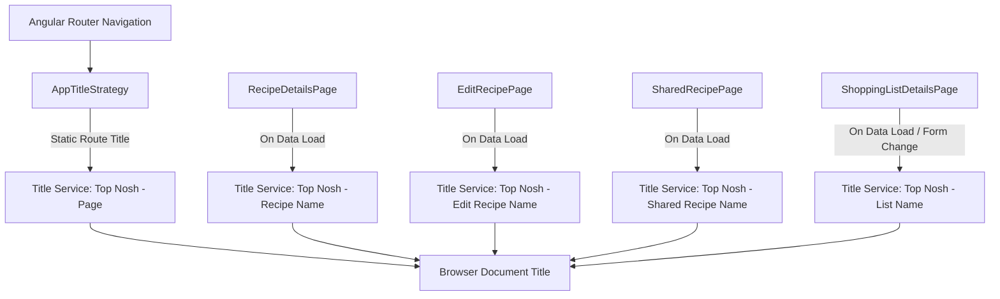

# Requirements

### Overview & Goals
The objective is to update the document `<title>` in the `web` Angular application whenever users navigate across pages or load dynamic entity details. All document titles must follow the standard naming convention prefixed with `Top Nosh - `.

### Scope
- **In Scope:**
  - Implementing an Angular `TitleStrategy` to automatically format all route-based titles with the `Top Nosh - ` prefix.
  - Adding static titles to routing configurations for login, onboarding, password change, dashboard, recipe list, create recipe, and shopping list pages.
  - Dynamically updating page titles when loading or editing dynamic resources:
    - Recipe Details (`Top Nosh - <Recipe Name>`)
    - Edit Recipe (`Top Nosh - Edit <Recipe Name>`)
    - Shared Recipe (`Top Nosh - <Recipe Name>`)
    - Shopping List Details (`Top Nosh - <Shopping List Name>` or `Top Nosh - Create new shopping list` if the name is blank).
  - Unit tests verifying title formatting and dynamic updates.
- **Out of Scope:**
  - Modifying backend API endpoints or NestJS controllers.
  - Changing UI layout or page headers beyond document title updates.

### User Stories
- As a user navigating Top Nosh, I want the browser tab title to accurately display the name of the page I am viewing so that I can easily identify and switch tabs.
- As a user viewing or editing a recipe or shopping list, I want the tab title to reflect the specific item name so that I have immediate context.

### Functional Requirements
- **Title Prefixing**: Every resolved title must be prefixed with `Top Nosh - `.
- **Static Page Titles**:
  - `LoginPage` -> `Top Nosh - Login`
  - `OnboardPage` -> `Top Nosh - Onboarding`
  - `PasswordChangePage` -> `Top Nosh - Change your password`
  - `LandingPage` -> `Top Nosh - Dashboard`
  - `RecipeListPage` -> `Top Nosh - Recipes`
  - `CreateRecipePage` -> `Top Nosh - Create new recipe`
  - `ShoppingListPage` -> `Top Nosh - Shopping Lists`
- **Dynamic Page Titles**:
  - `RecipeDetailsPage` -> `Top Nosh - <recipe.name>`
  - `EditRecipePage` -> `Top Nosh - Edit <recipe.name>`
  - `SharedRecipePage` -> `Top Nosh - <recipe.name>`
  - `ShoppingListDetailsPage` -> `Top Nosh - <shoppingList.name>` or `Top Nosh - Create new shopping list` when name is empty.

# Technical Design

### Current Implementation
The `web` application uses Angular 22 standalone components with `provideRouter` in `apps/web/src/app/app.config.ts`. Currently, the `index.html` static title is `Top Nosh`, and routes in `apps/web/src/**/*.routes.ts` do not define `title` attributes. Dynamic pages fetch data via services but do not interact with Angular's `Title` service.

### Key Decisions
1. **Custom `TitleStrategy` for Route Transitions**:
   - Provide a custom `AppTitleStrategy extends TitleStrategy` in `app.config.ts`.
   - When Angular router resolves a route `title`, `AppTitleStrategy` builds the title and calls `Title.setTitle(\`Top Nosh - ${title}\`)`.
   - Rationale: Idiomatic Angular pattern that automatically intercepts all route navigations without duplicating the prefix in each route definition.
2. **Direct `Title` Service for Asynchronous Dynamic Pages**:
   - Dynamic pages (`RecipeDetailsPage`, `EditRecipePage`, `SharedRecipePage`, `ShoppingListDetailsPage`) inject `Title` (from `@angular/platform-browser`) to update the title immediately when asynchronous data is fetched or modified in the form.
   - For `ShoppingListDetailsPage`, title reacts to name changes in the form and defaults to `Top Nosh - Create new shopping list` if empty.

### Proposed Changes

#### 1. Custom Title Strategy (`apps/web/src/app/strategies/app-title.strategy.ts`)
```typescript
@Injectable({ providedIn: 'root' })
export class AppTitleStrategy extends TitleStrategy {
  private readonly title = inject(Title);

  override updateTitle(routerState: RouterStateSnapshot): void {
    const title = this.buildTitle(routerState);
    if (title) {
      this.title.setTitle(`Top Nosh - ${title}`);
    } else {
      this.title.setTitle('Top Nosh');
    }
  }
}
```

#### 2. App Config (`apps/web/src/app/app.config.ts`)
Add `{ provide: TitleStrategy, useClass: AppTitleStrategy }` to providers.

#### 3. Route Title Configurations
- `apps/web/src/auth/auth.routes.ts`:
  - `login`: `title: 'Login'`
  - `onboard`: `title: 'Onboarding'`
  - `change-password`: `title: 'Change your password'`
- `apps/web/src/dashboard/dashboard.routes.ts`:
  - `''`: `title: 'Dashboard'`
- `apps/web/src/recipes/recipes.routes.ts`:
  - `''`: `title: 'Recipes'`
  - `'new'`: `title: 'Create new recipe'`
- `apps/web/src/shopping-lists/shopping-lists.routes.ts`:
  - `''`: `title: 'Shopping Lists'`
  - `'new'`: `title: 'Create new shopping list'`

#### 4. Component Updates for Dynamic Titles
- `RecipeDetailsPage`: Set `this.title.setTitle(\`Top Nosh - ${recipe.name}\`)` after loading recipe.
- `EditRecipePage`: Set `this.title.setTitle(\`Top Nosh - Edit ${recipe.name}\`)` after loading recipe.
- `SharedRecipePage`: Set `this.title.setTitle(\`Top Nosh - ${recipe.name}\`)` after loading shared recipe.
- `ShoppingListDetailsPage`: Set `this.title.setTitle(\`Top Nosh - ${name.trim() || 'Create new shopping list'}\`)` on load and when list name changes.

### Architecture Diagram


### File Structure
- Modified: `apps/web/src/app/app.config.ts`
- Modified: `apps/web/src/auth/auth.routes.ts`
- Modified: `apps/web/src/dashboard/dashboard.routes.ts`
- Modified: `apps/web/src/recipes/recipes.routes.ts`
- Modified: `apps/web/src/shopping-lists/shopping-lists.routes.ts`
- Modified: `apps/web/src/recipes/pages/recipe-details/recipe-details.page.ts`
- Modified: `apps/web/src/recipes/pages/edit-recipe/edit-recipe.page.ts`
- Modified: `apps/web/src/share/pages/shared-recipe/shared-recipe.page.ts`
- Modified: `apps/web/src/shopping-lists/pages/shopping-list-details/shopping-list-details.page.ts`
- Created: `apps/web/src/app/strategies/app-title.strategy.ts`
- Created: `apps/web/src/app/strategies/app-title.strategy.spec.ts`

# Testing

### Validation Approach
Verify page title generation across static navigation and asynchronous dynamic page loading using Angular testing utilities (`TestBed`, `Title` service).

### Key Scenarios
1. **AppTitleStrategy formatting**:
   - Verify that non-empty route title `'Login'` produces `Top Nosh - Login`.
   - Verify that default fallback when no title is provided yields `Top Nosh`.
2. **Static Route Navigation**:
   - Navigate to `/auth/login` -> expect title `Top Nosh - Login`.
   - Navigate to `/auth/onboard` -> expect title `Top Nosh - Onboarding`.
   - Navigate to `/auth/change-password` -> expect title `Top Nosh - Change your password`.
   - Navigate to `/dashboard` -> expect title `Top Nosh - Dashboard`.
   - Navigate to `/recipes` -> expect title `Top Nosh - Recipes`.
   - Navigate to `/recipes/new` -> expect title `Top Nosh - Create new recipe`.
   - Navigate to `/shopping-lists` -> expect title `Top Nosh - Shopping Lists`.
3. **Dynamic Resource Titles**:
   - `RecipeDetailsPage`: when recipe `{ name: 'Pasta Carbonara' }` loads, title becomes `Top Nosh - Pasta Carbonara`.
   - `EditRecipePage`: when recipe `{ name: 'Pasta Carbonara' }` loads, title becomes `Top Nosh - Edit Pasta Carbonara`.
   - `SharedRecipePage`: when shared recipe `{ name: 'Pizza Margherita' }` loads, title becomes `Top Nosh - Pizza Margherita`.
   - `ShoppingListDetailsPage`:
     - On empty / new list: title is `Top Nosh - Create new shopping list`.
     - When shopping list `{ name: 'Weekly Groceries' }` is loaded or edited: title is `Top Nosh - Weekly Groceries`.
     - When name is cleared in form: title reverts to `Top Nosh - Create new shopping list`.

### Test Suite Updates
- `apps/web/src/app/strategies/app-title.strategy.spec.ts` (new)
- `apps/web/src/recipes/pages/recipe-details/recipe-details.page.spec.ts` (updated)
- `apps/web/src/recipes/pages/edit-recipe/edit-recipe.page.spec.ts` (updated)
- `apps/web/src/share/pages/shared-recipe/shared-recipe.page.spec.ts` (updated)
- `apps/web/src/shopping-lists/pages/shopping-list-details/shopping-list-details.page.spec.ts` (updated)

# Delivery Steps

### ✓ Step 1: Implement custom AppTitleStrategy and configure static route titles
Configure Angular TitleStrategy and define static page titles across routes:

- Create `AppTitleStrategy` extending Angular's `TitleStrategy` in `apps/web/src/app/strategies/app-title.strategy.ts` (or `app-title.strategy.ts`) to intercept route title changes and prefix them with `Top Nosh - <Title>`.
- Register `AppTitleStrategy` in `apps/web/src/app/app.config.ts` via `{ provide: TitleStrategy, useClass: AppTitleStrategy }`.
- Update static route definitions in:
  - `apps/web/src/auth/auth.routes.ts`: add `title: 'Login'`, `title: 'Onboarding'`, `title: 'Change your password'`.
  - `apps/web/src/dashboard/dashboard.routes.ts`: add `title: 'Dashboard'`.
  - `apps/web/src/recipes/recipes.routes.ts`: add `title: 'Recipes'` to list route and `title: 'Create new recipe'` to new route.
  - `apps/web/src/shopping-lists/shopping-lists.routes.ts`: add `title: 'Shopping Lists'` to list route.

### ✓ Step 2: Integrate dynamic title updates in recipe and shared pages
Update recipe detail, edit, and shared pages to dynamically set the document title upon data retrieval:

- Inject `Title` (from `@angular/platform-browser`) or title helper into `RecipeDetailsPage` (`apps/web/src/recipes/pages/recipe-details/recipe-details.page.ts`) and update document title to `Top Nosh - ${recipe.name}` upon successful load.
- Inject `Title` into `EditRecipePage` (`apps/web/src/recipes/pages/edit-recipe/edit-recipe.page.ts`) and update document title to `Top Nosh - Edit ${recipe.name}` upon successful load.
- Inject `Title` into `SharedRecipePage` (`apps/web/src/share/pages/shared-recipe/shared-recipe.page.ts`) and update document title to `Top Nosh - ${recipe.name}` upon successful load.

### ✓ Step 3: Implement dynamic title handling in ShoppingListDetailsPage
Update ShoppingListDetailsPage to dynamically reflect the list name or default creation title:

- In `ShoppingListDetailsPage` (`apps/web/src/shopping-lists/pages/shopping-list-details/shopping-list-details.page.ts`), inject `Title` service.
- When loading an existing shopping list, set title to `Top Nosh - ${details.name || 'Create new shopping list'}`.
- When on the `/shopping-lists/new` route or when the name field changes, dynamically synchronize the title so it renders `Top Nosh - ${name}` if name is non-empty, or `Top Nosh - Create new shopping list` if empty.

### ✓ Step 4: Verify and test title updates across unit and integration tests
Add and update unit tests to verify title changes across all routes and components:

- Create unit test for `AppTitleStrategy` verifying title prefixing logic and default fallback.
- Update page spec files (`login.page.spec.ts`, `recipe-details.page.spec.ts`, `edit-recipe.page.spec.ts`, `shared-recipe.page.spec.ts`, `shopping-list-details.page.spec.ts`, etc.) to assert that the document title is updated accurately under various lifecycle and data states.
- Run `nx test web` to ensure all tests pass.