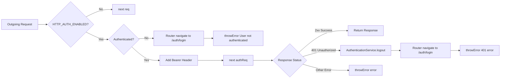

# Requirements

### Overview & Goals
Update the existing `authInterceptor` in the Angular `web` application to automatically handle token expiration and unauthorized responses (HTTP 401 Unauthorized) returned from API requests. When a 401 status code is encountered, the interceptor should terminate the active user session via `AuthenticationService.logout()`, redirect the user to `/auth/login`, and rethrow the error for proper stream propagation.

### Scope
- **In Scope**:
  - `apps/web/src/auth/interceptors/auth/auth.interceptor.ts`: Intercept HTTP responses on authenticated requests, check for `HttpErrorResponse` with `status === 401`, call `authenticationService.logout()`, and navigate to `['/auth', 'login']`.
  - `apps/web/src/auth/interceptors/auth/auth.interceptor.spec.ts`: Unit test coverage for 401 response interception, session cleanup, login redirection, and non-401 error pass-through.
- **Out of Scope**:
  - Token refresh / rotation flow (not supported by the current API specification).
  - Modifying `AuthenticationService` API or guest state storage logic.
  - Modifying other interceptors (e.g. `baseUrlInterceptor`).

### User Stories
- As an authenticated user whose session token has expired, I want the application to automatically log me out and redirect me to the login page when an API call fails with 401 Unauthorized, so that I can re-authenticate cleanly without stale state.
- As a developer, I want unauthorized response handling centralized within `authInterceptor`, ensuring individual services and components do not need redundant 401 handling logic.

### Functional Requirements
- **Response Interception**:
  - Intercept HTTP error responses for outgoing requests handled by `authInterceptor`.
- **401 Unauthorized Handling**:
  - Detect when an error is an `HttpErrorResponse` with status `401` (`HttpStatusCode.Unauthorized`).
  - Call `AuthenticationService.logout()` to clear memory state and persisted `localStorage` credentials.
  - Navigate to the login route via `Router.navigate([ '/auth', 'login' ])`.
  - Rethrow the original error observable using `throwError(() => error)` so downstream callers remain informed of request failure.
- **Non-401 Error Pass-Through**:
  - Non-401 HTTP errors (e.g., 400, 403, 404, 500) and network errors should be rethrown without calling `logout()` or triggering navigation to login.
- **Bypass Requests**:
  - Requests where `HTTP_AUTH_ENABLED` is `false` (such as `/auth/login`) should continue passing directly through `next(req)`.

### Non-Functional Requirements
- **Standard Angular Practices**: Use functional HTTP interceptors (`HttpInterceptorFn`) with RxJS `catchError` and `HttpErrorResponse`.
- **Formatting and Linting**: Adhere to existing codebase formatting rules (`dprint`) and ESLint guidelines.

# Technical Design

### Current Implementation
- `apps/web/src/auth/interceptors/auth/auth.interceptor.ts`:
  - Reads `req.context.get(HTTP_AUTH_ENABLED)`. If `false`, forwards `next(req)`.
  - Injects `AuthenticationService` and `Router`.
  - Reads `authenticationService.state()` with `take(1)`. If unauthenticated or token is missing, navigates to `['/auth', 'login']` and throws `'User is not authenticated'`.
  - If authenticated, clones the request with `Authorization: Bearer <token>` and returns `next(authReq)`. Currently does not attach a response pipeline (`catchError`) to handle backend 401 errors.
- `apps/web/src/auth/services/authentication/authentication.service.ts`:
  - Exposes `logout(): void` which calls `updateState(guestAuthState())`, resetting `isAuthenticated: false, token: null` and saving to `localStorage`.

### Key Decisions
- **Catching Errors on `next(authReq)` Pipeline**: Use RxJS `catchError` operator on the observable returned by `next(authReq)`. This ensures that API responses for authenticated requests are intercepted.
- **Session Cleanup via `AuthenticationService.logout()`**: Calling `logout()` ensures internal `BehaviorSubject` state updates and `localStorage` is updated to guest state synchronously.
- **Rethrowing Caught Errors**: Always rethrow the error using `throwError(() => error)` after triggering logout/redirect. This preserves RxJS error handling semantics for calling services and components.

### Architecture Diagram



### Proposed Changes

#### Update `apps/web/src/auth/interceptors/auth/auth.interceptor.ts`
```ts
import { HttpErrorResponse, HttpInterceptorFn } from '@angular/common/http';
import { inject } from '@angular/core';
import { Router } from '@angular/router';
import { catchError, switchMap, take, throwError } from 'rxjs';
import { AuthenticationService } from '../../services/authentication/authentication.service';
import { HTTP_AUTH_ENABLED } from './auth.interceptor.types';

export const authInterceptor: HttpInterceptorFn = (req, next) => {
  const isAuthEnabled = req.context.get(HTTP_AUTH_ENABLED);

  if (!isAuthEnabled) {
    return next(req);
  }

  const authenticationService = inject(AuthenticationService);
  const router = inject(Router);

  return authenticationService.state()
    .pipe(
      take(1),
      switchMap(state => {
        if (!state.isAuthenticated || !state.token) {
          router.navigate([ '/auth', 'login' ]).then();
          return throwError(() => new Error('User is not authenticated'));
        }

        const authReq = req.clone({
          setHeaders: {
            Authorization: `Bearer ${state.token}`
          }
        });

        return next(authReq).pipe(
          catchError((error: unknown) => {
            if (error instanceof HttpErrorResponse && error.status === 401) {
              authenticationService.logout();
              router.navigate([ '/auth', 'login' ]).then();
            }

            return throwError(() => error);
          })
        );
      })
    );
};
```

### File Structure
- **Modified**: `apps/web/src/auth/interceptors/auth/auth.interceptor.ts`
- **Modified**: `apps/web/src/auth/interceptors/auth/auth.interceptor.spec.ts`

# Testing

### Validation Approach
Automated unit testing using Jest and Angular's `HttpTestingController` (`provideHttpClientTesting()`) to test all response handling scenarios of `authInterceptor`.

### Key Scenarios
- **401 Unauthorized Response Handling**:
  - Perform an HTTP GET request with an authenticated state.
  - Flush a 401 response from `HttpTestingController`: `req.flush('Unauthorized', { status: 401, statusText: 'Unauthorized' })`.
  - Verify that `authServiceMock.logout` is called.
  - Verify that `routerMock.navigate` is called with `[ '/auth', 'login' ]`.
  - Verify that the subscription error callback receives the 401 `HttpErrorResponse`.
- **Other HTTP Error Status (e.g. 404 / 500)**:
  - Perform an HTTP GET request with an authenticated state.
  - Flush a 404 or 500 response from `HttpTestingController`.
  - Verify that `authServiceMock.logout` is **not** called and `routerMock.navigate` is **not** called.
  - Verify that the subscription error callback receives the error.
- **Unauthenticated State on Request Initiation**:
  - Verify that when user is not authenticated or token is missing, `routerMock.navigate` is called with `[ '/auth', 'login' ]` and an error is thrown without sending the HTTP request.
- **Public Request Bypass (`HTTP_AUTH_ENABLED = false`)**:
  - Verify request passes through without attaching `Authorization` header.

### Test Changes
- `apps/web/src/auth/interceptors/auth/auth.interceptor.spec.ts`:
  - Add mock `logout: jest.fn()` to `authServiceMock`.
  - Add unit tests verifying 401 automatic logout and navigation behavior.
  - Add unit test verifying unauthenticated request redirection.
  - Add unit test verifying non-401 error pass-through.

# Delivery Steps

### ✓ Step 1: Update authInterceptor with 401 response handling
The `authInterceptor` intercepts HTTP responses and triggers session termination and navigation upon receiving a 401 Unauthorized error.

- Import `HttpErrorResponse` from `@angular/common/http` and `catchError` from `rxjs` in `apps/web/src/auth/interceptors/auth/auth.interceptor.ts`.
- Pipe `catchError` onto `next(authReq)` inside the `switchMap` handler.
- Check if the caught error is an instance of `HttpErrorResponse` with `status === 401` (or `HttpStatusCode.Unauthorized`).
- Invoke `authenticationService.logout()` to reset authentication state to guest in both memory and `localStorage`.
- Call `router.navigate([ '/auth', 'login' ])` to redirect the user to the login route.
- Re-throw the error with `throwError(() => error)` so consuming observables can handle completion or failure appropriately.

### ✓ Step 2: Add unit tests for authInterceptor error handling and verify suite
The unit test suite validates automatic logout and redirection on 401 responses while ensuring other HTTP error codes and successful responses remain unaffected.

- Add test cases in `apps/web/src/auth/interceptors/auth/auth.interceptor.spec.ts` using `HttpTestingController` to simulate a 401 Unauthorized response on a protected endpoint.
- Assert that `AuthenticationService.logout()` is called and `Router.navigate` is invoked with `['/auth', 'login']` when a 401 error is received.
- Add test case verifying that non-401 HTTP errors (e.g., 400 Bad Request, 404 Not Found, 500 Internal Server Error) re-throw without invoking `logout()` or navigating.
- Add test case verifying unauthenticated initial request behavior redirects to login and throws an error.
- Run `npm test` across the workspace to ensure all tests pass and code style complies with project standards.