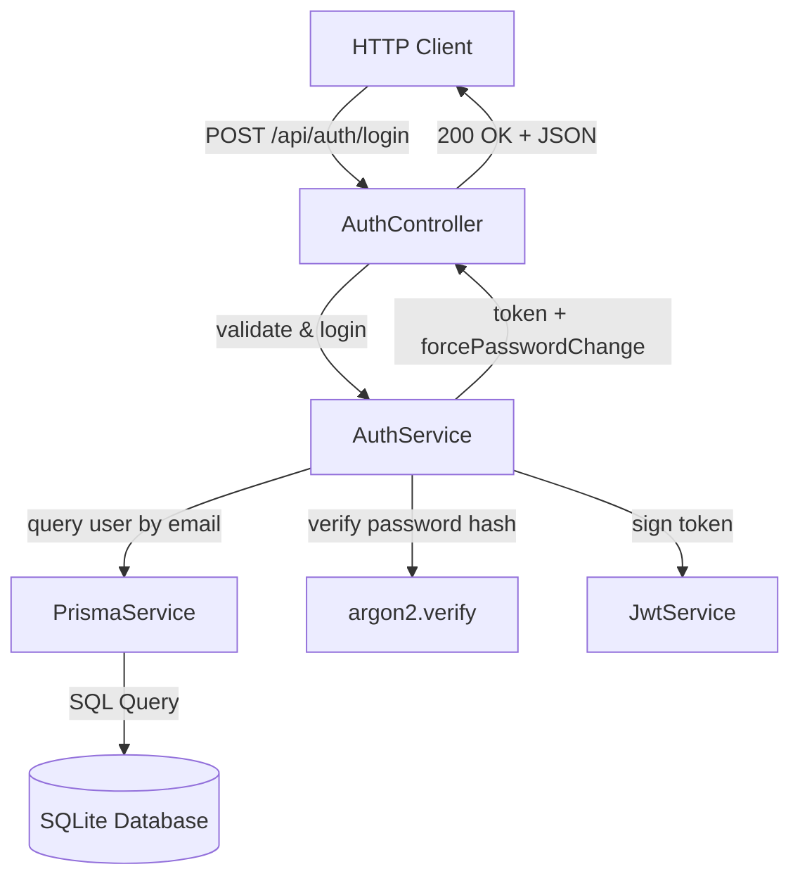

# Requirements

### Overview & Goals
The goal of this task is to implement user authentication for the `api` NestJS application. This includes creating the `User` database schema with Prisma ORM, providing a database migration and seed script with an initial user, and exposing a public `POST /api/auth/login` endpoint that authenticates user credentials using argon2 hashing and issues a configurable JWT token.

### Scope
#### In Scope
- **Prisma Schema & Migration**: Define `User` model with `fullName`, unique `email`, `passwordHash`, and `forcePasswordChange` flag, then generate and apply the database migration.
- **Database Seed**: Add a Prisma seed script creating the default user (`fullName`: "Aux", `email`: "aux@hexmode.org", `password`: "Pass1234!!!!", `forcePasswordChange`: true).
- **Password Security**: Use `argon2` for secure password hashing and verification.
- **JWT Authentication**: Issue JWT tokens upon successful login with 24-hour expiration configurable via environment variables.
- **Login Endpoint**: Expose `POST /api/auth/login` accepting `email` and `password`, returning `{ token, forcePasswordChange }` on success and HTTP 401 on failure.
- **NestJS Auth Infrastructure**: Set up `AuthModule`, `AuthService`, `AuthController`, `JwtStrategy`, and `JwtAuthGuard`.

#### Out of Scope
- Frontend UI implementation (Angular app changes).
- User registration (`/api/auth/register`) and password reset endpoints.
- Refresh token rotation mechanisms.
- Role-based access control (RBAC) permissions.

### User Stories
- **As an API client / frontend application**, I want to send user credentials to `/api/auth/login` so that I can receive a JWT token to access protected resources.
- **As an API client / frontend application**, I want to receive the `forcePasswordChange` status in the login response so that I can prompt the user to update their initial password when required.
- **As a system administrator**, I want invalid login attempts to return HTTP 401 Unauthorized so that unauthorized access is prevented.

### Functional Requirements
- **User Entity**:
  - `id`: Unique identifier (UUID or autoincrement integer).
  - `fullName`: String containing user's full name.
  - `email`: String, unique and indexed.
  - `passwordHash`: String storing the argon2 password hash.
  - `forcePasswordChange`: Boolean flag indicating if user must change password.
  - `createdAt` and `updatedAt`: Timestamps.
- **Seed Script**:
  - Seed one user: Full Name = `Aux`, Email = `aux@hexmode.org`, Password = `Pass1234!!!!` (hashed with argon2), Force Password Change = `true`.
- **Login Endpoint (`POST /api/auth/login`)**:
  - Publicly accessible without authentication guard.
  - Request body: `{ "email": string, "password": string }`.
  - Validate request body format (valid email and non-empty password).
  - Query user by email from database; verify password using `argon2.verify`.
  - If valid: Return HTTP 200/201 with `{ "token": "<jwt_string>", "forcePasswordChange": boolean }`.
  - If invalid (wrong email or wrong password): Return HTTP 401 Unauthorized.
- **JWT Configuration**:
  - Token signed with `JWT_SECRET` environment variable.
  - Expiration time configured via `JWT_EXPIRES_IN` environment variable (default: `24h`).

### Non-Functional Requirements
- **Security**: Passwords must never be stored or compared in plain text. Argon2 hashing algorithm must be used. Generic error messages on login failure to prevent user enumeration.
- **Maintainability**: Clear separation of concerns between Controller, Service, Prisma Data Access, and Authentication Guards.
- **Configurability**: Secret keys and token expiration managed through environment variables (`.env`).

# Technical Design

### Current Implementation
- `apps/api`: NestJS 11 application with a global prefix `api` set in `apps/api/src/main.ts`. Currently contains basic `AppController` and `AppService`.
- `prisma`: Prisma 7 setup with SQLite provider (`DATABASE_URL="file:./dev.db"`), `prisma7.config.ts`, and generated client path `../generated/prisma`.
- `libs/data-access`: Existing shared data access library configured in `tsconfig.base.json` (`@top-nosh/data-access`).

### Key Decisions
- **Password Hashing Library**: Use `argon2` for hashing and verifying passwords as specified in the requirements.
- **JWT Strategy & Guards**: Use `@nestjs/jwt` and `@nestjs/passport` with `passport-jwt` to establish standard NestJS authentication patterns (`JwtStrategy` and `JwtAuthGuard`).
- **Prisma Integration**: Implement `PrismaService` in `libs/data-access` (or `apps/api/src/app/prisma`) that extends `PrismaClient` for dependency injection across NestJS modules.
- **Configuration Management**: Use `@nestjs/config` or `process.env` with fallback defaults for `JWT_SECRET` and `JWT_EXPIRES_IN`.

### Proposed Changes

#### 1. Prisma Schema & Seed
- Add `User` model to `prisma/schema.prisma`.
- Generate and apply migration with `npx prisma migrate dev --name create_user_table`.
- Create `prisma/seed.ts` to hash `Pass1234!!!!` with argon2 and upsert user `aux@hexmode.org`.
- Configure `prisma7.config.ts` seed configuration: `migrations: { seed: 'ts-node prisma/seed.ts' }` or npm script.

#### 2. Dependencies
- Install required packages:
  - `argon2`
  - `@nestjs/jwt`, `@nestjs/passport`, `passport`, `passport-jwt`
  - `@types/passport-jwt` (dev dependency)
  - `class-validator`, `class-transformer` (for DTO validation)

#### 3. Database Access Module (`PrismaService`)
- Create `PrismaService` implementing `OnModuleInit` and `OnModuleDestroy` to manage `PrismaClient` lifecycle.
- Create `PrismaModule` exporting `PrismaService`.

#### 4. Auth Module (`apps/api/src/app/auth`)
- `LoginDto`: DTO validating `email` (isEmail, isNotEmpty) and `password` (isString, isNotEmpty).
- `AuthService`:
  - `validateUser(email: string, pass: string)`: Queries user by email via `PrismaService`, verifies password with `argon2.verify`, returns sanitized user or null.
  - `login(loginDto: LoginDto)`: Calls `validateUser`, throws `UnauthorizedException` on failure, generates JWT token with payload `{ sub: user.id, email: user.email }`, and returns `{ token: string, forcePasswordChange: boolean }`.
- `AuthController`:
  - Controller with path `'auth'` (resulting in `/api/auth` under global prefix).
  - `@Post('login')`: Public endpoint calling `AuthService.login(loginDto)`.
- `JwtStrategy`: Passport JWT strategy extracting Bearer token from header and validating payload.
- `JwtAuthGuard`: Auth guard extending `AuthGuard('jwt')` for securing other endpoints.

### Data Models / Contracts

#### Prisma Model (`prisma/schema.prisma`)
```prisma
model User {
  id                  String   @id @default(uuid())
  fullName            String   @map("full_name")
  email               String   @unique
  passwordHash        String   @map("password_hash")
  forcePasswordChange Boolean  @default(false) @map("force_password_change")
  createdAt           DateTime @default(now()) @map("created_at")
  updatedAt           DateTime @updatedAt @map("updated_at")

  @@map("users")
}
```

#### DTOs & Payloads
```typescript
// Login Request DTO
export class LoginDto {
  @IsEmail()
  @IsNotEmpty()
  email: string;

  @IsString()
  @IsNotEmpty()
  password: string;
}

// Login Response Interface
export interface LoginResponse {
  token: string;
  forcePasswordChange: boolean;
}

// JWT Payload
export interface JwtPayload {
  sub: string;
  email: string;
}
```

### File Structure
```
apps/api/src/
├── app/
│   ├── auth/
│   │   ├── dto/
│   │   │   └── login.dto.ts
│   │   ├── guards/
│   │   │   └── jwt-auth.guard.ts
│   │   ├── strategies/
│   │   │   └── jwt.strategy.ts
│   │   ├── auth.controller.spec.ts
│   │   ├── auth.controller.ts
│   │   ├── auth.module.ts
│   │   ├── auth.service.spec.ts
│   │   └── auth.service.ts
│   ├── prisma/
│   │   ├── prisma.module.ts
│   │   └── prisma.service.ts
│   ├── app.controller.ts
│   ├── app.module.ts
│   └── app.service.ts
├── main.ts
prisma/
├── migrations/
│   └── 202xxxxx_create_user_table/
│       └── migration.sql
├── schema.prisma
└── seed.ts
```

### Architecture Diagram


### Risks
- **Prisma Client Generation Path**: Custom client output path `../generated/prisma` in `schema.prisma`. Ensure imports match the configured generator path or standard `@prisma/client`.
- **Timing Attack Mitigation**: Ensure failed password verification and missing user lookups return uniform 401 responses to avoid username enumeration.
- **Environment Configuration**: Ensure fallback values for `JWT_SECRET` and `JWT_EXPIRES_IN` are provided if environment variables are missing in development.

# Testing

### Validation Approach
Automated tests and manual API verification will validate the authentication flow, database migration, seeding, and endpoint response statuses.

### Key Scenarios
- **Seed User Verification**:
  - Run `prisma db seed` and verify `aux@hexmode.org` is seeded in the database.
- **Successful Login**:
  - `POST /api/auth/login` with body `{ "email": "aux@hexmode.org", "password": "Pass1234!!!!" }`.
  - Expected: HTTP 200/201, response body contains valid `token` (string) and `forcePasswordChange: true`.
  - Validate that the decoded JWT contains the user's `sub` (user id) and `email`.
- **Invalid Password**:
  - `POST /api/auth/login` with body `{ "email": "aux@hexmode.org", "password": "WrongPassword123" }`.
  - Expected: HTTP 401 Unauthorized.
- **Non-existent User**:
  - `POST /api/auth/login` with body `{ "email": "nonexistent@hexmode.org", "password": "Pass1234!!!!" }`.
  - Expected: HTTP 401 Unauthorized.
- **Malformed Request**:
  - `POST /api/auth/login` with missing email or invalid email format.
  - Expected: HTTP 400 Bad Request (via NestJS ValidationPipe).

### Edge Cases
- Empty email or password strings.
- Case insensitivity or exact matching on email addresses.
- Expired or invalid JWT token passed to `JwtAuthGuard`.

### Test Changes
- **Unit Tests**:
  - `auth.service.spec.ts`: Test `validateUser` and `login` methods with mocked `PrismaService` and `JwtService`.
  - `auth.controller.spec.ts`: Test login route delegation and response handling.
- **Integration Tests / E2E Tests**:
  - Test `/api/auth/login` HTTP request/response cycle against seeded database.

# Delivery Steps

### ✓ Step 1: Define User model, generate Prisma migration, and configure seed data
Prisma schema defines the `User` model, database migration is generated and applied, and the seed script creates the initial user record.

- Update `prisma/schema.prisma` with the `User` model containing `id`, `fullName`, `email` (unique index), `passwordHash`, `forcePasswordChange`, and timestamp fields.
- Create and execute database migration using Prisma CLI to update the SQLite database schema.
- Install `argon2` and configure `prisma/seed.ts` (referenced in `prisma7.config.ts`) to hash `Pass1234!!!!` with argon2 and insert the seed user `Aux` (`aux@hexmode.org`, `forcePasswordChange: true`).
- Execute `prisma db seed` to verify seed data population in the database.

### ✓ Step 2: Implement Prisma service and database access layer
A dedicated `PrismaService` is created and integrated into the NestJS dependency injection system to provide database access across the API application.

- Create `PrismaService` extending `PrismaClient` to handle database connections, lifecycle hooks (`onModuleInit`, `onModuleDestroy`), and client instantiation.
- Register `PrismaModule` and `PrismaService` in `@top-nosh/data-access` library or API module to export database access for application services.
- Verify Prisma Client generation (`prisma generate`) and module export.

### ✓ Step 3: Implement authentication service, argon2 verification, and JWT token issuing
Authentication business logic is implemented to validate credentials using argon2 and issue signed JWT tokens with configurable expiration.

- Install `@nestjs/jwt`, `@nestjs/passport`, `passport`, `passport-jwt`, `@types/passport-jwt`, `class-validator`, and `class-transformer`.
- Update `.env` and `.env.example` with `JWT_SECRET` and `JWT_EXPIRES_IN` configuration variables (defaulting to 24 hours).
- Implement `AuthService` with `validateUser(email, password)` comparing incoming passwords against `passwordHash` using `argon2.verify()`.
- Implement `login(loginDto)` in `AuthService` returning a signed JWT token and the `forcePasswordChange` boolean flag.
- Add unit tests for `AuthService` validating success and failure authentication scenarios.

### ✓ Step 4: Implement Login endpoint, DTO validation, and configure JWT authentication strategy and guards
The `/api/auth/login` endpoint is exposed on `AuthController`, input validation is applied via `LoginDto`, and NestJS JWT strategy and guard are configured for secured routes.

- Create `LoginDto` with validation decorators for `email` (valid email format) and `password` (non-empty string).
- Create `AuthController` with a public `@Post('login')` route mapped to `/api/auth/login`.
- Return HTTP 401 `UnauthorizedException` when credentials are invalid or user is not found.
- Implement `JwtStrategy` (Passport strategy) to validate incoming Bearer tokens and extract user payload.
- Implement `JwtAuthGuard` extending `AuthGuard('jwt')` to protect future secured endpoints while keeping login publicly accessible.
- Register `AuthModule` in `AppModule` and write integration tests for the `/api/auth/login` endpoint.