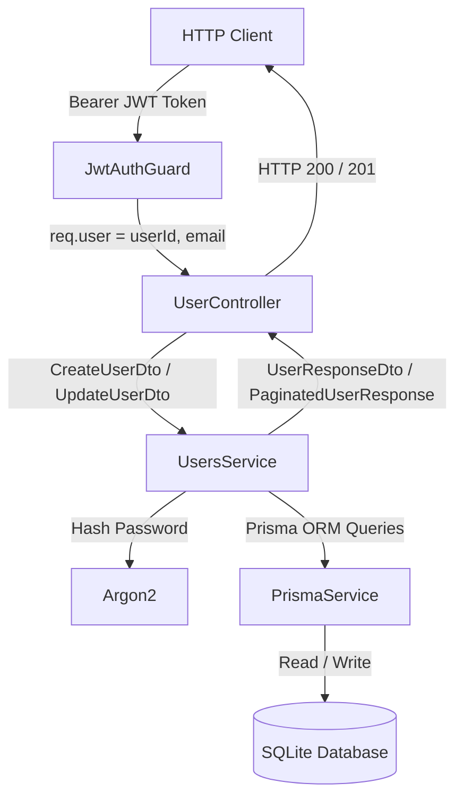

# Requirements

### Overview & Goals
The objective is to implement a new `UserController` in the `api` project (`apps/api`) providing secure, authenticated user management capabilities. The controller will handle user creation, user listing with pagination and sorting, user detail retrieval, and authenticated self-service profile updates. In alignment with security requirements, no user deletion endpoint will be provided.

### Scope
#### In Scope
- Creation of a new `UsersModule`, `UserController`, and `UsersService` in `apps/api/src/app/users/`.
- Authentication enforcement across all user endpoints via `JwtAuthGuard`.
- User creation endpoint (`POST /api/users`) that hashes passwords using Argon2 and sets `forcePasswordChange: true`.
- User listing endpoint (`GET /api/users`) paginated with a fixed page size of 50 records and sorted alphabetically by `fullName`.
- User details retrieval endpoint (`GET /api/users/:id`) returning public user fields.
- User profile update endpoint (`PUT /api/users` and `PUT /api/users/:id`) deducting user ID from the JWT token and permitting only self-updates.
- Strict payload sanitization: sensitive fields (`passwordHash`, `forcePasswordChange`) are omitted from all response payloads.
- Integration into `AppModule` and comprehensive unit (`.spec.ts`) and integration (`.e2e.spec.ts`) tests.

#### Out of Scope
- User deletion endpoint (explicitly prohibited by specifications).
- Modifying the Prisma database schema (the existing `User` model in `prisma/schema.prisma` already supports all required fields).
- Role-based access control (RBAC) or admin permissions beyond JWT authentication.
- Frontend user management UI.

### User Stories
- **As an authenticated user or administrator**, I want to create new users with their full name, email, and password so that new accounts can be provisioned with forced password change on first login.
- **As an authenticated user**, I want to browse a paginated list of all users sorted alphabetically by full name so that I can discover users in the system.
- **As an authenticated user**, I want to view detailed information of a specific user by their ID.
- **As an authenticated user**, I want to update my own profile information (full name, email, password) without being able to modify any other user's account.

### Functional Requirements
- **FR-1 Authentication**: All endpoints under `/api/users` must reject unauthenticated requests with `401 Unauthorized`.
- **FR-2 Create User**:
  - Endpoint: `POST /api/users`
  - Payload: `{ fullName: string, email: string, password: string }`
  - Validation: `fullName` non-empty string; `email` valid email address; `password` string with minimum length of 12 characters.
  - Behavior: Verifies email uniqueness (returns `409 Conflict` if email already in use), hashes password via Argon2, creates user with `forcePasswordChange = true`, and returns HTTP `201 Created`.
  - Response: `{ id, fullName, email, createdAt, updatedAt }`.
- **FR-3 List Users**:
  - Endpoint: `GET /api/users`
  - Query parameters: `page` (optional integer >= 1, defaults to 1).
  - Page size: Fixed at 50 records per page.
  - Sorting: Ascending order by `fullName` (`orderBy: { fullName: 'asc' }`).
  - Response: `{ data: UserResponseDto[], total: number, page: number, totalPages: number }`.
  - Fields per user item: `id`, `fullName`, `email`, `createdAt`, `updatedAt`.
- **FR-4 User Details**:
  - Endpoint: `GET /api/users/:id`
  - Behavior: Returns user matching `id` with HTTP `200 OK`. Returns `404 Not Found` if user does not exist.
  - Response: `{ id, fullName, email, createdAt, updatedAt }`.
- **FR-5 Update User**:
  - Endpoint: `PUT /api/users` and `PUT /api/users/:id`
  - Deduction of User ID: Deducts user ID from `req.user.userId` (extracted from the verified JWT payload).
  - Authorization: If an `id` parameter is supplied in the URL and does not match the authenticated user's ID, returns `403 Forbidden`.
  - Payload: `{ fullName?: string, email?: string, password?: string }`
  - Behavior: Updates specified fields; if password is provided, it is hashed via Argon2; checks email uniqueness before updating.
  - Response: Updated `{ id, fullName, email, createdAt, updatedAt }`.
- **FR-6 No Delete Endpoint**: No `DELETE` handler will be implemented in `UserController`. Requests to `DELETE /api/users/:id` will return `404 Not Found`.

### Non-Functional Requirements
- **Security**: Never expose `passwordHash` or `forcePasswordChange` in API responses. Use Argon2 with recommended hashing parameters matching `AuthService`.
- **Data Integrity**: Enforce email uniqueness constraint and handle Prisma `P2002` errors gracefully.
- **Consistency**: Adhere strictly to existing controller, service, DTO, and e2e testing patterns present in `apps/api`.
- **Code Style**: Follow repository `dprint` and `eslint` formatting standards.

# Technical Design

### Current Implementation
The backend is a NestJS 11 application in `apps/api`. Database access is provided by `PrismaService` (`@top-nosh/data-access`) connected to a SQLite database.
- **User Model**: Located in `prisma/schema.prisma`:
  - `id` (String UUID)
  - `fullName` (`full_name`)
  - `email` (unique)
  - `passwordHash` (`password_hash`)
  - `forcePasswordChange` (`force_password_change`, Boolean)
  - `createdAt` (`created_at`)
  - `updatedAt` (`updated_at`)
- **Authentication**: `JwtAuthGuard` (`apps/api/src/app/auth/guards/jwt-auth.guard.ts`) verifies Bearer JWT tokens and attaches `{ userId: payload.sub, email: payload.email }` to `req.user`.
- **Password Hashing**: `argon2` is used in `apps/api/src/app/auth/auth.service.ts`.
- **Existing Modules**: `recipes`, `shopping-lists`, `dashboard`, `auth`. Each feature has dedicated DTOs, controller, service, module, unit tests, and e2e integration tests.

### Key Decisions
1. **Module Separation (`UsersModule`)**:
   - *Decision*: Create an independent `UsersModule` in `apps/api/src/app/users/` containing `UserController`, `UsersService`, and DTOs, and register it in `AppModule`.
   - *Rationale*: Keeps user management concerns separate from authentication/session management (`AuthModule`) while matching the structure of `RecipesModule` and `ShoppingListsModule`.
2. **Controller Naming**:
   - *Decision*: Name the controller class `UserController` and route prefix `@Controller('users')`.
   - *Rationale*: Meets the explicit specification requirement ("Create a new controller called `UserController` in `api` project") while adhering to RESTful pluralized resource conventions (`/api/users`).
3. **User ID Deduction for Updates**:
   - *Decision*: Extract the user ID from `req.user.userId` via JWT token. Support both `PUT /api/users` (direct self-update) and `PUT /api/users/:id` (verifying `param.id === req.user.userId`, otherwise returning `403 Forbidden`).
   - *Rationale*: Guarantees that users cannot tamper with route params to modify another user's profile while remaining compatible with REST clients expecting `PUT /api/users/:id`.
4. **Pagination Response Structure**:
   - *Decision*: Return `{ data: UserResponseDto[], total: number, page: number, totalPages: number }` with `PAGE_SIZE = 50`.
   - *Rationale*: Exactly matches the existing pagination pattern used in `PaginatedRecipeResponse` and `PaginatedShoppingListResponse`.
5. **Data Transfer and Sanitization**:
   - *Decision*: Use Prisma's `select` projection to select only `id`, `fullName`, `email`, `createdAt`, and `updatedAt`.
   - *Rationale*: Ensures database queries never load or leak `passwordHash` into memory for read operations.

### Proposed Changes
1. **DTOs (`apps/api/src/app/users/dto/`)**:
   - `create-user.dto.ts`: `CreateUserDto` with validation rules.
   - `update-user.dto.ts`: `UpdateUserDto` with validation rules.
   - `user-query.dto.ts`: `UserQueryDto` with `page` parameter validation.
   - `user-response.dto.ts`: `UserResponseDto` and `PaginatedUserResponse` interfaces.
2. **Service (`apps/api/src/app/users/users.service.ts`)**:
   - `createUser`: Hashes password, sets `forcePasswordChange: true`, handles email conflict.
   - `getUsers`: Implements 50-item pagination, sorts by `fullName: 'asc'`.
   - `getUserById`: Retrieves user by ID or throws `NotFoundException`.
   - `updateUser`: Validates user exists, checks email conflicts, re-hashes password if provided, updates record.
3. **Controller (`apps/api/src/app/users/user.controller.ts`)**:
   - Class-level `@UseGuards(JwtAuthGuard)`.
   - Route handlers for `POST /`, `GET /`, `GET /:id`, and `PUT /` / `PUT /:id`.
   - No `DELETE` handler.
4. **Module Integration**:
   - `apps/api/src/app/users/users.module.ts`: Declares `UserController` and `UsersService`.
   - `apps/api/src/app/app.module.ts`: Imports `UsersModule`.

### Data Models / Contracts

#### `CreateUserDto`
```typescript
export class CreateUserDto {
  @IsString()
  @IsNotEmpty()
  fullName!: string;

  @IsEmail()
  @IsNotEmpty()
  email!: string;

  @IsString()
  @IsNotEmpty()
  @MinLength(12)
  password!: string;
}
```

#### `UpdateUserDto`
```typescript
export class UpdateUserDto {
  @IsOptional()
  @IsString()
  @IsNotEmpty()
  fullName?: string;

  @IsOptional()
  @IsEmail()
  @IsNotEmpty()
  email?: string;

  @IsOptional()
  @IsString()
  @IsNotEmpty()
  @MinLength(12)
  password?: string;
}
```

#### `UserResponseDto` & `PaginatedUserResponse`
```typescript
export interface UserResponseDto {
  id: string;
  fullName: string;
  email: string;
  createdAt: Date;
  updatedAt: Date;
}

export interface PaginatedUserResponse {
  data: UserResponseDto[];
  total: number;
  page: number;
  totalPages: number;
}
```

### Components
- `UserController` (`apps/api/src/app/users/user.controller.ts`): Handles HTTP routing, input validation pipes, authentication guard, user ID extraction from JWT, and delegating to `UsersService`.
- `UsersService` (`apps/api/src/app/users/users.service.ts`): Implements business logic, Argon2 hashing, Prisma queries, and exception throwing (`NotFoundException`, `ConflictException`, `ForbiddenException`).
- `UsersModule` (`apps/api/src/app/users/users.module.ts`): Bundles controller, service, and data access.
- `AppModule` (`apps/api/src/app/app.module.ts`): Main application module, updated to import `UsersModule`.

### File Structure
```
apps/api/src/app/
├── app.module.ts (modified)
└── users/
    ├── dto/
    │   ├── create-user.dto.ts (new)
    │   ├── update-user.dto.ts (new)
    │   ├── user-query.dto.ts (new)
    │   └── user-response.dto.ts (new)
    ├── user.controller.spec.ts (new)
    ├── user.controller.ts (new)
    ├── users.e2e.spec.ts (new)
    ├── users.module.ts (new)
    ├── users.service.spec.ts (new)
    └── users.service.ts (new)
```

### Architecture Diagram


### Risks & Mitigations
- **Risk**: Leaking password hashes or sensitive internal flags (`passwordHash`, `forcePasswordChange`) in responses.
  - *Mitigation*: Explicit Prisma `select` projection excluding those fields, combined with strictly typed `UserResponseDto` interfaces.
- **Risk**: Email collisions during user creation or profile update.
  - *Mitigation*: Check for existing email records prior to mutation and handle Prisma `P2002` unique constraint exceptions by throwing a clear `ConflictException('A user with this email already exists')`.
- **Risk**: Unauthorized users modifying another user's profile.
  - *Mitigation*: Strictly extract target ID from `req.user.userId` in the verified JWT token and reject mismatched path IDs with `ForbiddenException`.
- **Risk**: Parallel test database contamination during Jest runs.
  - *Mitigation*: Maintain distinct test user IDs/emails or run test suites with `--runInBand` matching existing API test patterns.

# Testing

### Validation Approach
The implementation will be verified through unit tests (testing `UserController` and `UsersService` in isolation with mocked dependencies) and integration e2e tests (testing full HTTP requests against the NestJS app with a database and Supertest).

### Key Scenarios
1. **Authentication Enforcement**:
   - `GET /api/users` without token returns `401 Unauthorized`.
   - `GET /api/users/:id` without token returns `401 Unauthorized`.
   - `POST /api/users` without token returns `401 Unauthorized`.
   - `PUT /api/users` without token returns `401 Unauthorized`.
2. **User Creation (`POST /api/users`)**:
   - Valid payload returns `201 Created` with sanitized user fields (`id`, `fullName`, `email`, `createdAt`, `updatedAt`).
   - Verifies record in database has `forcePasswordChange === true`.
   - Verifies record in database stores Argon2 password hash (not plaintext password).
   - Duplicate email returns `409 Conflict`.
   - Missing fields or short password (< 12 characters) returns `400 Bad Request`.
3. **User Listing (`GET /api/users`)**:
   - Returns paginated list of users sorted ascending by `fullName`.
   - Verifies max page size is 50.
   - Verifies pagination metadata (`total`, `page`, `totalPages`).
   - Verifies response items contain only `id`, `fullName`, `email`, `createdAt`, `updatedAt`.
4. **User Details (`GET /api/users/:id`)**:
   - Existing user ID returns `200 OK` with user details.
   - Non-existent user ID returns `404 Not Found`.
5. **User Self-Update (`PUT /api/users` and `PUT /api/users/:id`)**:
   - Authenticated user updating their own profile returns `200 OK` with updated fields.
   - Password update hashes new password and permits subsequent authentication.
   - Attempting to update another user's ID via `PUT /api/users/:id` returns `403 Forbidden`.
   - Changing email to an already existing user's email returns `409 Conflict`.
6. **Deletion Prohibition**:
   - `DELETE /api/users/:id` returns `404 Not Found` confirming no delete endpoint is exposed.

### Edge Cases
- Empty database when listing users: returns `data: []`, `total: 0`, `page: 1`, `totalPages: 0`.
- Case-sensitivity of email in uniqueness checks and retrieval.
- Update payload with no fields changed: returns existing user details without unnecessary database mutation.
- SQL injection / query injection prevention via Prisma parameterized queries.

### Test Changes
- **Add**: `apps/api/src/app/users/users.service.spec.ts` (unit tests for service logic).
- **Add**: `apps/api/src/app/users/user.controller.spec.ts` (unit tests for controller route handlers).
- **Add**: `apps/api/src/app/users/users.e2e.spec.ts` (integration tests covering end-to-end HTTP lifecycle).
- **Update**: `apps/api/src/app/app.module.ts` (register `UsersModule`).

# Delivery Steps

### ✓ Step 1: Define User Management DTOs and Response Contracts
Type-safe request validation and response models for user creation, update, pagination, and retrieval are available in `apps/api/src/app/users/dto/`.

- Create `apps/api/src/app/users/dto/create-user.dto.ts` with validation constraints using `class-validator` (`fullName`: required string, `email`: valid email string, `password`: string with `@MinLength(12)`).
- Create `apps/api/src/app/users/dto/update-user.dto.ts` allowing updates to `fullName`, `email`, and `password` with appropriate validation rules.
- Create `apps/api/src/app/users/dto/user-query.dto.ts` supporting optional `page` number parsing via `class-transformer` (`@Type(() => Number)` and `@Min(1)`).
- Create `apps/api/src/app/users/dto/user-response.dto.ts` defining `UserResponseDto` (containing `id`, `fullName`, `email`, `createdAt`, `updatedAt` and strictly omitting `passwordHash` and `forcePasswordChange`) and `PaginatedUserResponse` (`data`, `total`, `page`, `totalPages`).

### ✓ Step 2: Implement UsersService with business logic and database operations
`UsersService` provides tested methods for creating, paginating, retrieving, and updating users while securely handling password hashing and email uniqueness.

- Create `apps/api/src/app/users/users.service.ts` injecting `PrismaService` from `@top-nosh/data-access`.
- Implement `createUser(dto: CreateUserDto)`: verify email is not taken (throw `ConflictException` on duplicate), hash password with `argon2.hash()`, persist record with `forcePasswordChange: true`, and return `UserResponseDto`.
- Implement `getUsers(query: UserQueryDto)`: query user records with `take: 50` and `skip: (page - 1) * 50`, order by `fullName: 'asc'`, count total records, calculate `totalPages`, and return `PaginatedUserResponse`.
- Implement `getUserById(id: string)`: fetch user by primary key, throw `NotFoundException` if record does not exist, and return `UserResponseDto`.
- Implement `updateUser(userId: string, dto: UpdateUserDto)`: ensure user exists (throw `NotFoundException`), verify email uniqueness if changed, hash new password if provided, update record, and return updated `UserResponseDto`.
- Add unit tests in `apps/api/src/app/users/users.service.spec.ts` mocking `PrismaService` and verifying all success and error paths.

### ✓ Step 3: Implement UserController and register UsersModule in AppModule
REST endpoints are exposed under `/api/users`, protected by `JwtAuthGuard`, and wired into the application.

- Create `apps/api/src/app/users/user.controller.ts` decorated with `@Controller('users')` and class-level `@UseGuards(JwtAuthGuard)`.
- Implement `POST /` (`createUser`): accepts `CreateUserDto`, returns HTTP 201 Created with created `UserResponseDto`.
- Implement `GET /` (`getUsers`): accepts `UserQueryDto`, returns HTTP 200 with `PaginatedUserResponse`.
- Implement `GET /:id` (`getUserById`): accepts `id` param, returns HTTP 200 with `UserResponseDto`.
- Implement update user endpoint: support `PUT /` (and `PUT /:id` ensuring `:id === req.user.userId`), extracting authenticated user ID from JWT token via `@Req() req: { user: { userId: string } }`, rejecting unauthorized updates with `ForbiddenException` when attempting to modify another user, and calling `usersService.updateUser`.
- Ensure NO delete endpoint exists on `UserController`.
- Create `apps/api/src/app/users/users.module.ts` exporting `UsersService` and registering `UserController`.
- Register `UsersModule` in `imports` of `AppModule` (`apps/api/src/app/app.module.ts`).
- Add unit tests in `apps/api/src/app/users/user.controller.spec.ts` verifying request delegation, parameter handling, and status codes.

### ✓ Step 4: Implement end-to-end integration tests for User Management endpoints
Comprehensive integration test suite verifies authentication enforcement, input validation, CRUD operations, pagination, and security constraints.

- Create `apps/api/src/app/users/users.e2e.spec.ts` using Supertest against the NestJS application context.
- Verify authentication enforcement: ensure all endpoints (`GET /api/users`, `GET /api/users/:id`, `POST /api/users`, `PUT /api/users`) return 401 Unauthorized without a valid Bearer token.
- Verify user creation: validate DTO rules, verify duplicate email rejection (409 Conflict), and confirm `forcePasswordChange` is set to `true` in the database.
- Verify user listing: validate 50-item pagination, alphabetical ordering by `fullName`, and absence of sensitive fields (`passwordHash`, `forcePasswordChange`) in response payload.
- Verify user details: confirm 200 OK for existing user and 404 Not Found for non-existent ID.
- Verify user update: confirm self-update succeeds (including password hashing update) and confirm attempts to update another user's profile return 403 Forbidden.
- Verify that `DELETE /api/users/:id` returns 404 Not Found (confirming no deletion endpoint exists).
- Run the full test suite (`npx jest --config apps/api/jest.config.cts --runInBand apps/api/src/app/users`) to verify zero regressions.