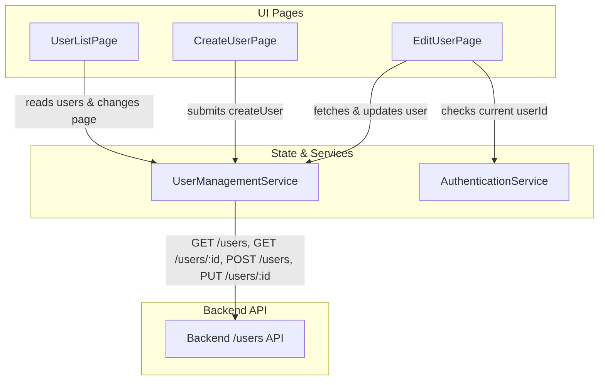

# Requirements

### Overview & Goals
The goal of this task is to deliver a complete User Management UI within the `users` feature module of the `web` Angular application. The UI communicates with the backend user management API via a new `UserManagementService`, updates `AuthenticationService` to track `userId` in `AuthState`, and implements responsive pages for listing, creating, and editing users.

### Scope
#### In Scope
- Update `AuthState` and `AuthenticationService` to parse, store, and expose `userId` decoded from JWT tokens (or `null` when logged out).
- Create `user.types.ts` containing DTOs, interfaces, and pagination filter models.
- Implement `UserManagementService` using reactive `BehaviorSubject` and `Observable` streams consistent with `ShoppingListManagementService`.
- Implement `UserListPage` with Angular Material table, responsive column display (desktop vs mobile handset), pagination, create navigation, and edit links (no delete option).
- Implement `CreateUserPage` using Angular Reactive Forms with validation (full name, email, min-12 char password, matching confirm password), Material Design controls, and snackbar feedback.
- Implement `EditUserPage` allowing users to edit details only if the route user ID matches the logged-in user's ID; disables form controls and hides Update button otherwise.
- Register routes in `apps/web/src/users/users.routes.ts` and `apps/web/src/app/app.routes.ts`.

#### Out of Scope
- User deletion functionality (users cannot be deleted per API and business rules).
- Role-based authorization beyond matching logged-in `userId`.
- Backend API modifications (backend endpoints and DTOs already exist).

### User Stories
- **US1: View Users List** — As an authenticated user, I want to view a paginated list of all users so that I can see user details and find users to edit.
- **US2: Responsive View** — As a mobile user, I want the user list to show essential columns (full name and email) so that it fits neatly on my screen.
- **US3: Create User** — As an authenticated user, I want to create a new user account with validated credentials so that new members can join.
- **US4: Edit Own User Profile** — As an authenticated user, I want to edit my user profile information and password so that my account details stay updated.
- **US5: Guarded Edit Access** — As an authenticated user viewing another user's edit page, I want the form to be disabled without an update button so that unauthorized edits cannot occur.

### Functional Requirements
- **FR1: AuthState userId** — `AuthState` must contain `userId: string | null`. Extracted from JWT token payload (`sub` claim) on login and state recovery from `localStorage`. Defaults to `null` when unauthenticated or logged out.
- **FR2: User Filter Model** — `UsersFilter` interface with `{ page: number }`. Default filter `{ page: 1 }` produced by immutable factory function `defaultUsersFilter()`.
- **FR3: Reactive UserManagementService** —
  - `filters()` returns `Observable<UsersFilter>`.
  - `users()` returns `Observable<PaginatedUserResponse>` based on active filters.
  - `setPage(page)` updates current filter page.
  - `resetFilters()` resets to default filter.
  - `getUserById(id)` fetches single user details.
  - `create(dto)` calls `POST /users` and returns user ID.
  - `update(id, dto)` calls `PUT /users/:id` and returns user ID.
  - Throws errors on API failures.
- **FR4: User List Page** —
  - Material table showing full name, email, created at, updated at, actions (desktop) or full name, email, actions (mobile via CDK `BreakpointObserver`).
  - Full name links to edit page (`/users/:id/edit` or `/users/:id`).
  - Edit action button per row.
  - Create user button in page header.
  - Material paginator connected to service page state.
- **FR5: Create User Page** —
  - Reactive form with `fullName`, `email`, `password`, `confirmPassword`.
  - Validations: `fullName` (required), `email` (required + valid email), `password` (required + minLength 12), `confirmPassword` (required + matches password).
  - Create button disabled when form is invalid or request is pending.
  - Success: 5000ms auto-dismissing snackbar and navigation to `/users`.
  - Failure: persistent snackbar with 'OK' action.
- **FR6: Edit User Page** —
  - Loads user details by ID on init.
  - Validates `authService.state().userId === targetUserId`.
  - When matching: editable form and enabled Update button.
  - When not matching: form is disabled (`form.disable()`) and Update button is omitted.
  - Success: 5000ms auto-dismissing snackbar and navigation to `/users`.
  - Failure: persistent snackbar with 'OK' action.
- **FR7: Routing** — Child routes registered in `users.routes.ts` and loaded in `app.routes.ts` under `/users` with `authGuard`.

### Non-Functional Requirements
- OnPush change detection strategy across all components.
- Strict typing, no `any` types.
- Accessible form fields with Material Design styling and appropriate labels/placeholders.
- Fast reactive updates using RxJS streams and Angular Signals.

# Technical Design

### Current Implementation
- **Authentication**: `AuthenticationService` in `apps/web/src/auth/services/authentication/authentication.service.ts` manages `AuthState` (`isAuthenticated`, `token`) stored in `localStorage`. JWT payload produced by NestJS backend contains `{ sub: string, email: string }`, where `sub` is the user ID.
- **Existing Features**: `ShoppingListManagementService` in `apps/web/src/shopping-lists/services/shopping-list-management/shopping-list-management.service.ts` and `ShoppingListPage` serve as architectural reference for pagination, filtering, reactive state, and responsive Material tables.
- **Form Patterns**: `CreateRecipePage` and `PasswordChangePage` show patterns for reactive forms, custom password match validators, and snackbar handling.
- **Backend API**: `UserController` in `apps/api/src/app/users/user.controller.ts` exposes `GET /users?page=X`, `GET /users/:id`, `POST /users`, `PUT /users`, and `PUT /users/:id`.

### Key Decisions
1. **JWT Decoding for userId**:
   - *Decision*: Decode the JWT base64 payload (`JSON.parse(atob(token.split('.')[1]))`) inside `AuthenticationService` to read `sub` as `userId`.
   - *Rationale*: Avoids extra network calls on app launch or login, immediately synchronizing `userId` into `AuthState`.
2. **User List State Management**:
   - *Decision*: Follow the exact reactive pattern of `ShoppingListManagementService` with a `BehaviorSubject<UsersFilter>` and `switchMap` requesting `GET /users`.
   - *Rationale*: Ensures consistency across the codebase, predictable pagination reactivity, and easy filter resets.
3. **Password Validation & Confirmation**:
   - *Decision*: Implement `passwordsMatchValidator` validator function at form group level, marking `confirmPassword` with `passwordMismatch` error when values diverge.
   - *Rationale*: Reuses established pattern from `PasswordChangePage` and integrates seamlessly with Material error directives (`uiWhenError`).
4. **Edit Page Access Control**:
   - *Decision*: Read `authService.state()` in `EditUserPage` and compare `userId` with the route ID. If mismatched, disable all controls via `this.form.disable()` and hide the submit button in the template.
   - *Rationale*: Fulfills specification requirements while preventing unauthorized form mutations client-side.

### Data Models / Contracts
```typescript
// apps/web/src/users/models/user.types.ts
export interface UserResponseDto {
  id: string;
  fullName: string;
  email: string;
  createdAt: Date | string;
  updatedAt: Date | string;
}

export interface PaginatedUserResponse {
  data: UserResponseDto[];
  total: number;
  page: number;
  totalPages: number;
}

export interface CreateUserDto {
  fullName: string;
  email: string;
  password: string;
}

export interface UpdateUserDto {
  fullName?: string;
  email?: string;
  password?: string;
}

export interface UsersFilter {
  page: number;
}

export const defaultUsersFilter = (): UsersFilter => ({
  page: 1
});
```

### File Structure
```
apps/web/src/
├── auth/
│   └── services/authentication/
│       ├── authentication.service.ts          # [MODIFY] Add userId to AuthState & token decoding
│       ├── authentication.service.types.ts    # [MODIFY] Update AuthState interface
│       └── authentication.service.spec.ts     # [MODIFY] Test userId in AuthState
├── users/
│   ├── models/
│   │   └── user.types.ts                      # [NEW] User DTOs, interfaces & filter factory
│   ├── services/user-management/
│   │   ├── user-management.service.ts         # [NEW] UserManagementService
│   │   └── user-management.service.spec.ts    # [NEW] Service unit tests
│   ├── pages/
│   │   ├── user-list/
│   │   │   ├── user-list.page.ts              # [NEW] Table & paginator
│   │   │   ├── user-list.page.html
│   │   │   ├── user-list.page.scss
│   │   │   └── user-list.page.spec.ts
│   │   ├── create-user/
│   │   │   ├── create-user.page.ts            # [NEW] Creation reactive form
│   │   │   ├── create-user.page.html
│   │   │   ├── create-user.page.scss
│   │   │   └── create-user.page.spec.ts
│   │   └── edit-user/
│   │       ├── edit-user.page.ts              # [NEW] Edit form with auth check
│   │       ├── edit-user.page.html
│   │       ├── edit-user.page.scss
│   │       └── edit-user.page.spec.ts
│   ├── users.routes.ts                        # [MODIFY] Child routes for users feature
│   └── users.routes.spec.ts                   # [NEW] Route tests
└── app/
    └── app.routes.ts                          # [MODIFY] Add /users route registration
```

### Architecture Diagram


### Risks & Mitigations
- **Malformed JWT Token**: If a token in `localStorage` is malformed, decoding might throw an exception.
  - *Mitigation*: Wrap base64 token decoding in a `try...catch` block falling back safely to `userId: null`.
- **Password validation in Edit mode**: User may want to update name or email without updating password.
  - *Mitigation*: In `EditUserPage`, if password field is provided, enforce minLength(12) and password matching; if left blank, do not send password in payload. If required by strict form spec, form validates password and confirm password accordingly.

# Testing

### Validation Approach
Verification will be conducted using automated unit and integration tests with Jest/Vitest via Nx (`nx test web`), linting (`nx lint web`), and formatter checks (`npm run format:check`).

### Key Scenarios
1. **AuthenticationService with userId**:
   - Initial state without token has `isAuthenticated: false, token: null, userId: null`.
   - Successful login with token containing `{ sub: 'user-123' }` updates `AuthState` with `userId: 'user-123'`.
   - Restoring valid token from `localStorage` populates `userId: 'user-123'`.
   - Logout resets state to `userId: null`.

2. **UserManagementService Reactive Flow**:
   - `users()` emits list of users returned from `GET /users?page=1`.
   - Calling `setPage(2)` triggers API call with `page=2` and emits updated list.
   - Calling `resetFilters()` resets page to 1.
   - `create(dto)` sends `POST /users` and returns user ID.
   - `update(id, dto)` sends `PUT /users/:id` and returns user ID.
   - Errors from HTTP requests are propagated correctly.

3. **User List Page Interaction**:
   - Renders desktop columns (`fullName`, `email`, `createdAt`, `updatedAt`, `actions`) on desktop viewport.
   - Switches to mobile columns (`fullName`, `email`, `actions`) when handset breakpoint matches.
   - Clicking "Create User" navigates to `/users/new`.
   - Clicking user name or edit action navigates to `/users/:id/edit`.
   - Changing page in paginator invokes `setPage` on service.
   - Displays empty state message when data array is empty.

4. **Create User Flow**:
   - Form controls are initialized with empty values.
   - Create button is disabled when inputs are invalid.
   - Email format, required fields, and password min-length 12 are validated.
   - Password mismatch error is flagged when `password !== confirmPassword`.
   - On successful submit: calls `service.create()`, displays 5-second snackbar, navigates to `/users`.
   - On failed submit: displays error snackbar with 'OK' action and keeps user on page.

5. **Edit User Flow & Permission Checking**:
   - When route ID matches `authService.state().userId`: form is enabled, populated with user details, and Update button is present.
   - When route ID does NOT match logged-in user ID: form is disabled (`form.disabled === true`) and Update button is hidden.
   - On successful update: displays 5-second snackbar and navigates to `/users`.
   - On failed update: displays error snackbar with 'OK' action.

### Edge Cases
- **Token without sub claim or invalid JWT format**: Gracefully handles decoding failure, defaulting `userId` to `null`.
- **Non-existent User ID on Edit Page**: Handles 404 from `getUserById` by showing error state / snackbar.
- **Empty user list response**: Shows table empty state without breaking paginator.

### Test Changes
- `apps/web/src/auth/services/authentication/authentication.service.spec.ts` — Update existing tests to assert `userId` and add token decoding test cases.
- `apps/web/src/users/services/user-management/user-management.service.spec.ts` — New tests for all service methods and reactive streams.
- `apps/web/src/users/pages/user-list/user-list.page.spec.ts` — New tests for table rendering, responsive columns, and pagination.
- `apps/web/src/users/pages/create-user/create-user.page.spec.ts` — New tests for validation rules, submission, and notifications.
- `apps/web/src/users/pages/edit-user/edit-user.page.spec.ts` — New tests for matching vs non-matching user ID permissions, loading, and updates.
- `apps/web/src/users/users.routes.spec.ts` — New tests for child route configuration.

# Delivery Steps

### ✓ Step 1: Update AuthenticationService with userId in AuthState
AuthenticationService extracts and stores `userId` from JWT token in `AuthState`, resetting to `null` when unauthenticated.

- Update `AuthState` interface in `apps/web/src/auth/services/authentication/authentication.service.ts` to include `userId: string | null`.
- Update `guestAuthState` helper to default `userId` to `null`.
- Add JWT payload parsing logic to extract `sub` as `userId` when logging in and when loading stored state from `localStorage`.
- Update `login` and `logout` methods to manage `userId` in `AuthState`.
- Update unit tests in `authentication.service.spec.ts` and related auth spec files to verify `userId` handling.

### ✓ Step 2: Implement User models and UserManagementService
Data models and a reactive UserManagementService are implemented to communicate with the user management API.

- Create `apps/web/src/users/models/user.types.ts` defining `UserResponseDto`, `PaginatedUserResponse`, `CreateUserDto`, `UpdateUserDto`, `UsersFilter`, and `defaultUsersFilter()`.
- Create `UserManagementService` in `apps/web/src/users/services/user-management/user-management.service.ts` following `ShoppingListManagementService` patterns.
- Implement reactive `filters$` (`BehaviorSubject<UsersFilter>`) and `users$` Observable stream invoking `GET /users` with query parameters.
- Expose `filters()`, `users()`, `setPage(page)`, `resetFilters()`, and `getUserById(id)` methods.
- Implement `create(dto)` (`POST /users`) and `update(id, dto)` (`PUT /users/:id`) returning the user ID and propagating errors on failure.
- Add comprehensive unit tests in `user-management.service.spec.ts`.

### ✓ Step 3: Implement User List Page
The User List page displays paginated users in a responsive Material table with creation and editing actions.

- Create `UserListPage` in `apps/web/src/users/pages/user-list/user-list.page.ts`, `user-list.page.html`, and `user-list.page.scss`.
- Use `ui-page-header` with a "Create User" action button linking or navigating to `/users/new`.
- Implement responsive Material table columns: desktop shows `fullName`, `email`, `createdAt`, `updatedAt`, and `actions`; mobile shows `fullName`, `email`, and `actions`.
- Render user `fullName` as a router link to the user edit page and add an edit button in the actions column (with no delete button).
- Bind table data to `userManagementService.users()` and connect `mat-paginator` to `setPage`.
- Add unit tests in `user-list.page.spec.ts` testing table rendering, responsive column switches, pagination, and navigation.

### ✓ Step 4: Implement Create User Page
The Create User page provides a validated reactive form to create new users with feedback snackbars.

- Create `CreateUserPage` in `apps/web/src/users/pages/create-user/create-user.page.ts`, `create-user.page.html`, and `create-user.page.scss`.
- Build a reactive form containing `fullName`, `email`, `password`, and `confirmPassword` with custom `passwordsMatchValidator`.
- Enforce validations: required non-empty full name, valid email format, minimum 12-character password, and matching confirm password.
- Disable the Create button while the form is invalid or while submitting.
- Submit via `userManagementService.create(dto)`: on success, display a 5-second auto-dismissing snackbar and navigate to `/users`; on error, show a persistent error snackbar with an 'OK' action.
- Add unit tests in `create-user.page.spec.ts` testing form validation, error states, service invocation, and notifications.

### ✓ Step 5: Implement Edit User Page
The Edit User page loads user details, validates edit permissions against the logged-in user, and submits updates.

- Create `EditUserPage` in `apps/web/src/users/pages/edit-user/edit-user.page.ts`, `edit-user.page.html`, and `edit-user.page.scss`.
- Retrieve route param `id` and load user details using `userManagementService.getUserById(id)`.
- Compare the target user ID against `authService.state().userId`: if IDs do not match, disable all form controls and omit the Update button.
- If authorized, allow editing `fullName`, `email`, `password`, and `confirmPassword` with validations matching creation rules.
- Disable the Update button while invalid or submitting.
- Submit via `userManagementService.update(id, dto)`: on success, display a 5-second snackbar and navigate to `/users`; on failure, display a persistent snackbar with an 'OK' action.
- Add unit tests in `edit-user.page.spec.ts` testing permission verification, form population, submission, and error handling.

### ✓ Step 6: Configure Users Routes and App Routing Integration
User management pages are connected via routing and registered in the root app configuration.

- Define child routes in `apps/web/src/users/users.routes.ts` for list (`''`), create (`'new'`), and edit (`':id'` and `':id/edit'`).
- Register the `/users` route path in `apps/web/src/app/app.routes.ts` protected with `authGuard` and wrapped with `AuthorizedPage`.
- Add unit tests in `users.routes.spec.ts` to verify route configuration and lazy loading.
- Run full test suite and linter across the workspace to ensure complete verification.