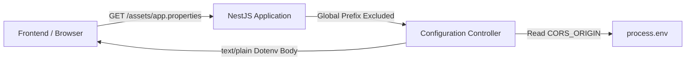

# Requirements

### Overview & Goals
The `web` project loads runtime configuration on startup by requesting `/assets/app.properties`. While this file is present during local development, in production environments it must be dynamically served by the `api` service. The goal of this task is to implement a public `Configuration` controller in `api` that dynamically serves `/assets/app.properties` in dotenv format, reflecting production mode and the CORS origin URL.

### Scope
#### In Scope
- Creating a new `Configuration` controller in `apps/api`.
- Exposing a public `GET` endpoint `webProperties` mapped to `/assets/app.properties`.
- Configuring global prefix exclusion in `apps/api/src/main.ts` so the endpoint is accessible at `/assets/app.properties` rather than `/api/assets/app.properties`.
- Formatting the response as a dotenv text document containing `PRODUCTION=true` and `API_URL=<CORS_ORIGIN>`.
- Setting the HTTP Content-Type header to `text/plain; charset=utf-8`.
- Writing unit tests and end-to-end integration tests.

#### Out of Scope
- Modifying the frontend `web` project's configuration loading logic.
- Adding database persistence for configuration values.
- Introducing authentication or authorization guards on the configuration endpoint.

### Functional Requirements
- **Endpoint Path & Method**: `GET /assets/app.properties`.
- **Global Prefix Bypass**: Requesting `GET /assets/app.properties` must resolve directly without the `/api` global prefix.
- **Public Accessibility**: The endpoint must not require JWT authentication or bearer tokens.
- **Payload Format**: The response body must be formatted in dotenv syntax:
  ```text
  PRODUCTION=true
  API_URL=<value of CORS_ORIGIN>
  ```
- **Content-Type**: The response header must include `Content-Type: text/plain` (or `text/plain; charset=utf-8`).
- **Environment Handling**:
  - `PRODUCTION` must always be `true`.
  - `API_URL` must reflect `process.env['CORS_ORIGIN'] ?? ''`.

### Non-Functional Requirements
- **Performance**: Instantaneous in-memory string response without I/O or database queries.
- **Code Standards**: Adhere to TypeScript and NestJS project guidelines (regular class methods in NestJS, no `any`, immutable properties, explicit visibility).
- **Formatting**: Adhere to `dprint` rules configured in the repository.

# Technical Design

### Current Implementation
- `apps/api/src/main.ts` configures a global prefix: `app.setGlobalPrefix('api')`. All controller routes by default are mounted under `/api/...`.
- `apps/api/src/app/app.module.ts` imports feature modules (`AuthModule`, `DashboardModule`, `RecipesModule`, `SharingModule`, `ShoppingListsModule`, `UsersModule`) and configures `ServeStaticModule` with `exclude: [ '/api{/*path}' ]`.
- Controllers that require authentication use `@UseGuards(JwtAuthGuard)`. Routes without guards are publicly accessible.
- `apps/web/src/environments/environment.ts` uses `@elemental-concept/env-bakery` to read `PRODUCTION` (boolean) and `API_URL` (string) loaded from `/assets/app.properties`.

### Key Decisions
- **Feature Module Structure**: Encapsulate the controller in `apps/api/src/app/configuration/configuration.controller.ts` and `apps/api/src/app/configuration/configuration.module.ts`, then import `ConfigurationModule` into `AppModule`. This follows the existing modular architecture of `apps/api`.
- **Controller Class Naming**: Name the controller class `Configuration` as requested by the specification, and export an alias `export { Configuration as ConfigurationController }` to ensure clarity and standard naming conventions.
- **Route Mapping & Exclusion**: Decorate the endpoint method with `@Get('assets/app.properties')`. In `apps/api/src/main.ts`, use NestJS's route exclusion option:
  ```typescript
  app.setGlobalPrefix(globalPrefix, {
    exclude: [
      { path: 'assets/app.properties', method: RequestMethod.GET }
    ]
  });
  ```
  NestJS will exclude this specific path and method combination from prepending `'api'`, exposing it directly at `/assets/app.properties`.
- **Response Headers**: Apply `@Header('Content-Type', 'text/plain; charset=utf-8')` to ensure HTTP clients parse the response as plain text dotenv.

### Proposed Changes
1. **New Controller**: `apps/api/src/app/configuration/configuration.controller.ts`
   - Class `Configuration`.
   - Method `webProperties(): string`.
   - Returns `PRODUCTION=true\nAPI_URL=${process.env['CORS_ORIGIN'] ?? ''}\n`.
2. **New Module**: `apps/api/src/app/configuration/configuration.module.ts`
   - Registers `Configuration` in `controllers`.
3. **App Module Update**: `apps/api/src/app/app.module.ts`
   - Imports `ConfigurationModule`.
4. **Bootstrap Update**: `apps/api/src/main.ts`
   - Adds `{ exclude: [{ path: 'assets/app.properties', method: RequestMethod.GET }] }` to `app.setGlobalPrefix()`.

### Data Models / Contracts
#### Endpoint Contract
- **Request**: `GET /assets/app.properties`
  - Headers: Standard HTTP headers (no Authorization required).
- **Response**:
  - Status: `200 OK`
  - Headers: `Content-Type: text/plain; charset=utf-8`
  - Body:
    ```dotenv
    PRODUCTION=true
    API_URL=http://localhost:4200/
    ```

### Components
- `Configuration` (`apps/api/src/app/configuration/configuration.controller.ts`): NestJS controller exposing `webProperties`.
- `ConfigurationModule` (`apps/api/src/app/configuration/configuration.module.ts`): NestJS module grouping configuration components.
- `AppModule` (`apps/api/src/app/app.module.ts`): Root module importing `ConfigurationModule`.
- `bootstrap` (`apps/api/src/main.ts`): Entry point applying prefix exclusion rule.

### File Structure
```text
apps/api/src/
├── app/
│   ├── configuration/
│   │   ├── configuration.controller.ts       (new)
│   │   ├── configuration.controller.spec.ts  (new)
│   │   ├── configuration.e2e.spec.ts         (new)
│   │   └── configuration.module.ts           (new)
│   └── app.module.ts                         (modified: import ConfigurationModule)
└── main.ts                                   (modified: exclude route from prefix)
```

### Architecture Diagram


### Risks & Mitigations
- **Precedence with ServeStaticModule**: In production, `ServeStaticModule` serves files from `dist/apps/web/browser`. Controller routes are registered before the fallback static route (`app.get('*')`), ensuring `/assets/app.properties` resolves directly to the controller. This will be verified in end-to-end integration tests.
- **Missing CORS_ORIGIN Variable**: If `CORS_ORIGIN` is not defined in the environment, `API_URL` will default to an empty string (`API_URL=`), preventing runtime crashes.

# Testing

### Validation Approach
Automated tests will be implemented at two levels:
1. **Unit Tests (`configuration.controller.spec.ts`)**: Verify the controller class and `webProperties` method in isolation, testing dotenv formatting under various environment variable configurations.
2. **End-to-End Integration Tests (`configuration.e2e.spec.ts`)**: Verify HTTP request routing through NestJS using `supertest`, confirming path resolution without `/api` prefix, public accessibility without authentication tokens, status code 200, Content-Type headers, and response body.

### Key Scenarios
- **Standard Request**: `GET /assets/app.properties` returns HTTP 200 with `Content-Type: text/plain` and payload:
  ```text
  PRODUCTION=true
  API_URL=http://localhost:4200/
  ```
- **Custom CORS Origin**: When `process.env['CORS_ORIGIN'] = 'https://app.example.com/'`, `API_URL` in response is `https://app.example.com/`.
- **Unauthenticated Access**: Requesting without `Authorization` header succeeds with HTTP 200.
- **Prefix Isolation**: Requesting `GET /api/assets/app.properties` returns HTTP 404 (confirming it is mounted at root `/assets/app.properties`).

### Edge Cases
- **Undefined CORS_ORIGIN**: When `process.env['CORS_ORIGIN']` is not set or deleted, `API_URL` is empty (`API_URL=`) and does not throw errors.
- **Trailing Slash / Special Characters**: Origin URLs containing ports, trailing slashes, or query parameters are preserved as provided.

### Test Changes
- **Add**: `apps/api/src/app/configuration/configuration.controller.spec.ts` (unit tests for `Configuration`).
- **Add**: `apps/api/src/app/configuration/configuration.e2e.spec.ts` (end-to-end HTTP integration tests).
- **Run**: `npx nx test api` to verify all existing and new test suites pass.
- **Run**: `npx nx lint api` to ensure lint compliance.

# Delivery Steps

### ✓ Step 1: Implement Configuration controller, module, and unit tests
The `Configuration` controller is created, registered in `ConfigurationModule` and `AppModule`, generating dotenv configuration with unit tests passing.

- Create `apps/api/src/app/configuration/configuration.controller.ts` defining controller class `Configuration` (and alias `ConfigurationController`).
- Implement the `webProperties` method decorated with `@Get('assets/app.properties')` and `@Header('Content-Type', 'text/plain; charset=utf-8')`.
- Read `process.env['CORS_ORIGIN'] ?? ''` and generate the response string with `PRODUCTION=true` and `API_URL=<CORS_ORIGIN>`.
- Create `apps/api/src/app/configuration/configuration.module.ts` declaring `Configuration` controller.
- Import `ConfigurationModule` into `apps/api/src/app/app.module.ts`.
- Create unit tests in `apps/api/src/app/configuration/configuration.controller.spec.ts` validating output when `CORS_ORIGIN` is configured, empty, or undefined.

### ✓ Step 2: Configure global prefix exclusion in main.ts and add e2e integration tests
The `/assets/app.properties` endpoint is excluded from the global `api` prefix in `main.ts` and verified with end-to-end integration tests.

- Update `apps/api/src/main.ts` to pass exclusion options to `app.setGlobalPrefix('api', { exclude: [{ path: 'assets/app.properties', method: RequestMethod.GET }] })`.
- Ensure `RequestMethod` is imported from `@nestjs/common`.
- Add end-to-end integration test in `apps/api/src/app/configuration/configuration.e2e.spec.ts` using `supertest` to verify `GET /assets/app.properties` is reachable without `/api` prefix, is publicly accessible without JWT auth headers, returns HTTP 200 with `text/plain` Content-Type, and contains expected dotenv variables.
- Run `npx nx test api`, `npx nx lint api`, and `npx dprint check` to ensure code formatting, linting, and test suites pass.