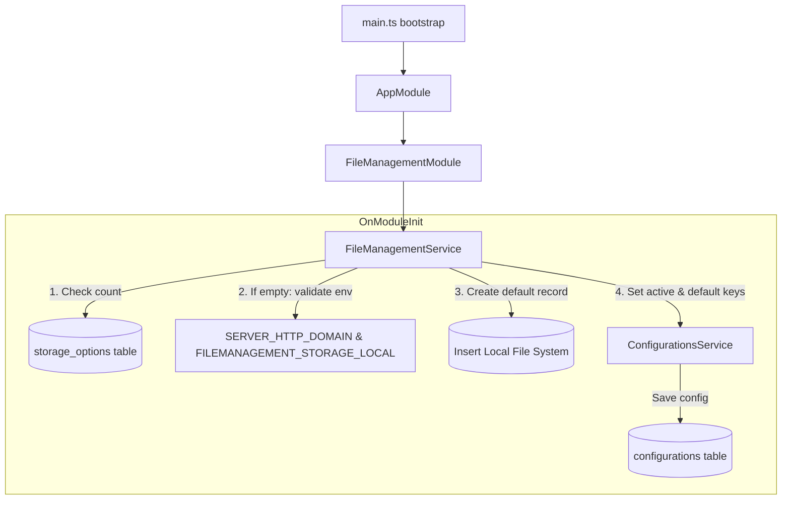

# Requirements

### Overview & Goals
The objective of this task is to lay the foundation for file management in the `api` application (`apps/api`) by establishing storage configuration persistence and an initialization lifecycle:
- Define a database model and table to store file storage configurations (`storage_options`).
- Implement `FileManagementService` in `apps/api` using `ConfigurationsService` under the `fileManagement` configuration domain.
- Automatically bootstrap a default `local` storage option and set active and default configuration keys on application startup when no storage options exist.
- Ensure strict environment variable validation (`SERVER_HTTP_DOMAIN`) during initialization.
- Adhere strictly to the scope constraint of Step 1: no controllers or endpoints are created.

### Scope
- **In Scope**:
  - Prisma schema definition for `StorageOption` model mapping to `storage_options` table with soft-deletion support (`deletedAt`).
  - Database migration creating `storage_options`.
  - `FileManagementService` implementing NestJS `OnModuleInit` lifecycle hook.
  - Automatic default storage creation on startup if table is empty.
  - Storing active storage ID (`fileManagement.storage.active`) and default storage ID (`fileManagement.storage.default`) via `ConfigurationsService`.
  - Environment variable resolution for `FILEMANAGEMENT_STORAGE_LOCAL` (with fallback to `/app/data/storage`) and `SERVER_HTTP_DOMAIN` (with `/storage` path appended and strict slash normalization).
  - Application termination (throwing an error) if `SERVER_HTTP_DOMAIN` is missing during default storage initialization.
  - NestJS `FileManagementModule` integrated into `AppModule`.
  - Unit tests covering `FileManagementService` initialization, fallback handling, environment variable validation, and configuration persistence.
- **Out of Scope**:
  - Any HTTP controllers or REST endpoints (explicitly prohibited in Step 1).
  - File upload endpoints, multer configuration, or file streaming (Step 2 and Step 3).
  - Storage providers other than `local` (e.g. S3, GCS).
  - File staging, deployment, or deletion business logic (`stage`, `deploy`, `delete` methods belong to subsequent steps).

### User Stories
- **As a system administrator**, I want the API application to automatically initialize default local file storage settings on first startup so that the system is ready for file management without manual database seeding.
- **As a system administrator**, I want file storage configurations to be persisted in the database and tracked via `ConfigurationsService` so that storage settings are manageable and queryable across the application.
- **As a developer**, I want application startup to fail fast if required environment variables (`SERVER_HTTP_DOMAIN`) are missing so that misconfigurations are detected immediately before serving requests.

### Functional Requirements
1. **Storage Options Database Model**:
   - Create a model `StorageOption` mapped to table `storage_options`.
   - Fields:
     - `id`: Unique identifier (UUID).
     - `name`: Storage name (String).
     - `description`: Storage description (String, can be empty string, cannot be null).
     - `type`: Storage type identifier (String, currently `'local'`).
     - `url`: Path or root URL for the storage (for local storage, the local filesystem path).
     - `externalUrl`: URL prefix used by frontend clients to access files over HTTP/HTTPS.
     - `username`: Storage username (nullable String, `null` for local filesystem).
     - `password`: Storage password (nullable String, `null` for local filesystem).
     - `createdAt`: Timestamp of record creation.
     - `updatedAt`: Timestamp of record update.
     - `deletedAt`: Nullable timestamp for soft deletion; records must only be soft-deleted.
   - Include an index on `deletedAt`.

2. **FileManagementService Startup Initialization**:
   - Implement NestJS `OnModuleInit` lifecycle hook in `FileManagementService`.
   - On startup, check whether the `storage_options` table is empty (`count === 0`).
   - If the table is empty:
     - Retrieve `FILEMANAGEMENT_STORAGE_LOCAL` environment variable; if unset, default to `/app/data/storage`.
     - Retrieve `SERVER_HTTP_DOMAIN` environment variable.
     - If `SERVER_HTTP_DOMAIN` is not set or empty, throw an error to terminate the application.
     - Join `SERVER_HTTP_DOMAIN` and `/storage` ensuring no duplicate slashes and validating the resulting URL.
     - Create a new record in `storage_options` with:
       - `name`: `'Local File System'`
       - `description`: `''`
       - `type`: `'local'`
       - `url`: resolved local storage path.
       - `externalUrl`: resolved external storage URL.
       - `username`: `null`
       - `password`: `null`
     - Save the newly created storage option ID to `fileManagement.storage.active` via `ConfigurationsService`.
     - Save the newly created storage option ID to `fileManagement.storage.default` via `ConfigurationsService`.
   - If the table is not empty:
     - Do not create a new storage option; do not overwrite existing configurations.

3. **Scope Constraint**:
   - Do not create any controller classes or route handlers.
   - Do not implement file upload/download logic.

### Non-Functional Requirements
- **Reliability & Fail-Fast**: If `SERVER_HTTP_DOMAIN` is missing during initial setup, fail bootstrap immediately with a clear error message.
- **Data Integrity**: Soft-delete semantics must be preserved; never hard-delete storage options.
- **Clean Architecture**: Decouple configuration storage using `ConfigurationsService` (`domain: 'fileManagement'`).

# Technical Design

### Current Implementation
- `prisma/schema.prisma`: Contains database models including `User`, `Recipe`, `ShoppingList`, and `Configuration`. Soft-deletion pattern is implemented via `deletedAt DateTime? @map("deleted_at")` and `@@index([deletedAt])`.
- `apps/api/src/app/configurations/configurations.service.ts`: Global service providing configuration access with support for 3-tier dot notation (`domain.group.entity`) or segment arguments `(domain, group, entity)`.
- `libs/data-access/src/lib/prisma.service.ts`: Global Prisma client provider using SQLite (`better-sqlite3`).
- `apps/api/src/app/app.module.ts`: Root NestJS application module orchestrating domain modules.

### Key Decisions
1. **Model & Table Naming**:
   - *Decision*: Name the Prisma model `StorageOption` with `@@map("storage_options")`.
   - *Rationale*: Directly matches the specification requirement ("storage options table") and aligns with existing plural snake_case database naming conventions (`recipes`, `shopping_lists`, `configurations`).
2. **Soft Deletion Pattern**:
   - *Decision*: Use `deletedAt DateTime? @map("deleted_at")` with `@@index([deletedAt])`.
   - *Rationale*: Consistent with existing models (`Recipe`, `ShoppingList`) in `schema.prisma`.
3. **Application Startup Hook**:
   - *Decision*: Implement `OnModuleInit` in `FileManagementService`.
   - *Rationale*: NestJS invokes `onModuleInit()` during application bootstrap before HTTP listeners open. An uncaught exception in `onModuleInit()` rejects the bootstrap promise, terminating application startup as mandated when `SERVER_HTTP_DOMAIN` is missing.
4. **URL Normalization**:
   - *Decision*: Strip trailing slashes from `SERVER_HTTP_DOMAIN`, append `/storage`, and validate using `new URL(...)`.
   - *Rationale*: Prevents invalid URLs (e.g., `http://localhost:3000//storage`) regardless of whether the environment variable includes a trailing slash.
5. **No Controllers in Step 1**:
   - *Decision*: Create only `FileManagementModule`, `FileManagementService`, constants, and unit tests.
   - *Rationale*: Respects the explicit task rule: "Do not write any other code, do not create any controllers."

### Proposed Changes
- **Database Schema**:
  - Add `StorageOption` model to `prisma/schema.prisma`.
  - Add migration script `prisma/migrations/<timestamp>_create_storage_options_table/migration.sql`.
- **API Module**:
  - `apps/api/src/app/file-management/file-management.constants.ts`: Define domain constants and default paths.
  - `apps/api/src/app/file-management/file-management.service.ts`: Core service logic for startup check, default storage creation, and configuration registration.
  - `apps/api/src/app/file-management/file-management.module.ts`: NestJS module registering and exporting `FileManagementService`.
  - `apps/api/src/app/app.module.ts`: Import `FileManagementModule`.

### Data Models / Contracts

#### Prisma Model (`prisma/schema.prisma`)
```prisma
model StorageOption {
  id          String    @id @default(uuid())
  name        String
  description String    @default("")
  type        String
  url         String
  externalUrl String    @map("external_url")
  username    String?
  password    String?
  createdAt   DateTime  @default(now()) @map("created_at")
  updatedAt   DateTime  @updatedAt @map("updated_at")
  deletedAt   DateTime? @map("deleted_at")

  @@index([deletedAt])
  @@map("storage_options")
}
```

#### Constants (`apps/api/src/app/file-management/file-management.constants.ts`)
```ts
export const FILE_MANAGEMENT_CONFIG_DOMAIN = 'fileManagement';

export const FILE_MANAGEMENT_CONFIG_KEYS = {
  ACTIVE_STORAGE: 'fileManagement.storage.active',
  DEFAULT_STORAGE: 'fileManagement.storage.default',
} as const;

export const DEFAULT_LOCAL_STORAGE_CONFIG = {
  NAME: 'Local File System',
  DESCRIPTION: '',
  TYPE: 'local',
  FALLBACK_PATH: '/app/data/storage',
  STORAGE_URL_PATH: '/storage',
} as const;
```

#### Service Signature (`FileManagementService`)
```ts
@Injectable()
export class FileManagementService implements OnModuleInit {
  constructor(
    private readonly prisma: PrismaService,
    private readonly configurationsService: ConfigurationsService,
  ) {}

  async onModuleInit(): Promise<void>;
  private async initializeDefaultStorage(): Promise<void>;
  private resolveExternalStorageUrl(): string;
  private resolveLocalStoragePath(): string;
}
```

### Components
- `FileManagementModule`: Encapsulates file management functionality. Exports `FileManagementService`.
- `FileManagementService`: Handles storage options querying and startup initialization. Uses `PrismaService` for database interaction and `ConfigurationsService` for domain-level configuration persistence.

### File Structure
```
apps/api/src/app/
├── app.module.ts (modified - import FileManagementModule)
└── file-management/
    ├── file-management.constants.ts (new)
    ├── file-management.module.ts (new)
    ├── file-management.service.spec.ts (new)
    └── file-management.service.ts (new)
prisma/
├── migrations/
│   └── 2026XXXXXX_create_storage_options_table/
│       └── migration.sql (new)
└── schema.prisma (modified - add StorageOption model)
```

### Architecture Diagram


### Risks
- **Missing `SERVER_HTTP_DOMAIN`**: When starting up in local development or Docker without `SERVER_HTTP_DOMAIN` set, initialization will throw an error and terminate the process.
  - *Mitigation*: Clearly document the requirement in error message (`"SERVER_HTTP_DOMAIN environment variable is required to initialize default storage option"`).
- **Malformed URL format**: Extra or missing trailing slashes in `SERVER_HTTP_DOMAIN`.
  - *Mitigation*: Normalize using `rawDomain.trim().replace(/\/+$/, '')` and validate via `new URL(...)`.

# Testing

### Validation Approach
Verification relies on automated unit tests for `FileManagementService` mocking `PrismaService` and `ConfigurationsService`, testing environment variable handling and database interactions.

### Key Scenarios
1. **Empty Storage Options Table (First Startup)**:
   - Given `storageOption.count()` returns `0`, `SERVER_HTTP_DOMAIN="http://localhost:3000"`, and `FILEMANAGEMENT_STORAGE_LOCAL="/custom/path"`.
   - When `onModuleInit()` runs:
     - Creates storage option with `name: 'Local File System'`, `description: ''`, `type: 'local'`, `url: '/custom/path'`, and `externalUrl: 'http://localhost:3000/storage'`.
     - Calls `configurationsService.set('fileManagement.storage.active', newStorageId)`.
     - Calls `configurationsService.set('fileManagement.storage.default', newStorageId)`.
2. **Fallback to Default Local Path**:
   - Given `storageOption.count()` returns `0` and `FILEMANAGEMENT_STORAGE_LOCAL` is undefined.
   - When `onModuleInit()` runs:
     - Sets `url` to `/app/data/storage`.
3. **URL Slash Normalization**:
   - Given `SERVER_HTTP_DOMAIN="http://localhost:3000/"` (with trailing slash) or `"http://localhost:3000"` (without trailing slash).
   - Expected `externalUrl` in both cases is `"http://localhost:3000/storage"`.
4. **Existing Storage Options (Subsequent Startups)**:
   - Given `storageOption.count()` returns `1` or greater.
   - When `onModuleInit()` runs:
     - Does not call `storageOption.create()`.
     - Does not call `configurationsService.set()`.

### Edge Cases
1. **Missing `SERVER_HTTP_DOMAIN` on Initial Bootstrap**:
   - Given `storageOption.count()` returns `0` and `SERVER_HTTP_DOMAIN` is not set or empty string.
   - When `onModuleInit()` runs:
     - Throws an `Error` and terminates without inserting database records.
2. **Invalid `SERVER_HTTP_DOMAIN`**:
   - Given `SERVER_HTTP_DOMAIN="not-a-valid-url"`.
   - When `onModuleInit()` runs:
     - Throws an `Error` indicating the URL is invalid.
3. **Soft-Deleted Storage Records**:
   - Ensure soft-deleted records have `deletedAt` set and schema enforces nullable `deletedAt`.

### Test Changes
- **New Test Suite**: `apps/api/src/app/file-management/file-management.service.spec.ts`
  - Unit tests testing `FileManagementService` under all scenarios and edge cases outlined above.

# Delivery Steps

### ✓ Step 1: Define StorageOption Prisma schema model and database migration
The database schema includes the `storage_options` table supporting storage configuration metadata and soft deletion, with Prisma client regenerated.

- Add the `StorageOption` model to `prisma/schema.prisma` with fields: `id` (UUID primary key), `name` (String), `description` (String, default empty string), `type` (String, default `'local'`), `url` (String), `externalUrl` (String mapped to `external_url`), `username` (nullable String), `password` (nullable String), `createdAt` (DateTime mapped to `created_at`), `updatedAt` (DateTime mapped to `updated_at`), and `deletedAt` (nullable DateTime mapped to `deleted_at`).
- Add index on `deletedAt` (`@@index([deletedAt])`) and table mapping `@@map("storage_options")` following project schema conventions.
- Generate and execute Prisma migration (e.g. `create_storage_options_table`) using `npx prisma migrate dev`.
- Ensure Prisma client is regenerated via `npx prisma generate` so `@top-nosh/data-access` and `@prisma/client` export the new model and typings.

### ✓ Step 2: Implement FileManagementService with startup initialization and unit tests
`FileManagementService` checks for existing storage options on startup, initializes the default local storage option with validated environment variables, records configuration keys, and is verified by comprehensive unit tests.

- Define domain constants in `apps/api/src/app/file-management/file-management.constants.ts` for configuration domain (`'fileManagement'`), configuration keys (`'fileManagement.storage.active'`, `'fileManagement.storage.default'`), and storage types (`'local'`).
- Implement `FileManagementService` in `apps/api/src/app/file-management/file-management.service.ts` implementing NestJS `OnModuleInit`.
- Inject `PrismaService` and `ConfigurationsService`.
- Implement `resolveExternalStorageUrl()` helper that retrieves `SERVER_HTTP_DOMAIN`, validates it as a proper URL, strips any trailing slashes, appends `/storage`, and throws a descriptive startup-terminating `Error` if `SERVER_HTTP_DOMAIN` is not set or malformed.
- In `onModuleInit()`, count existing storage options via `prisma.storageOption.count()`. If the table is empty (`count === 0`):
  - Read `FILEMANAGEMENT_STORAGE_LOCAL` from `process.env` (defaulting to `/app/data/storage`).
  - Create the default storage record with `name: 'Local File System'`, `description: ''`, `type: 'local'`, `url`, `externalUrl`, `username: null`, `password: null`.
  - Save the created storage record's ID to `fileManagement.storage.active` and `fileManagement.storage.default` using `ConfigurationsService.set`.
- If the table is not empty, bypass initialization without modifying existing storage records or configuration.
- Add unit test suite in `apps/api/src/app/file-management/file-management.service.spec.ts` covering:
  - Startup initialization when table is empty (creates default record and sets active/default config keys).
  - Startup bypass when storage options already exist.
  - Startup failure when `SERVER_HTTP_DOMAIN` is undefined, empty, or invalid.
  - Slash normalization logic for `SERVER_HTTP_DOMAIN` (with and without trailing slash).
  - Fallback to `/app/data/storage` when `FILEMANAGEMENT_STORAGE_LOCAL` is not provided.

### ✓ Step 3: Create FileManagementModule and register in AppModule
`FileManagementModule` is created and registered in `AppModule`, ensuring the service lifecycle initializes during application startup without exposing any HTTP controllers.

- Create `FileManagementModule` in `apps/api/src/app/file-management/file-management.module.ts` declaring `FileManagementService` as a provider and exporting it for downstream consumer modules.
- Import `ConfigurationsModule` and `PrismaModule` (or leverage their `@Global()` availability).
- Register `FileManagementModule` in the `imports` list of `apps/api/src/app/app.module.ts`.
- Ensure no controller or HTTP endpoints are created or registered, strictly honoring the constraint "Do not write any other code, do not create any controllers."
- Verify application bootstrap and module resolution by executing `npx nx test api`.