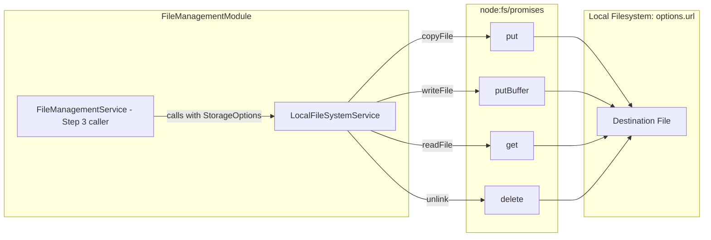

# Requirements

### Overview & Goals
The objective of this task is to implement the local file system storage provider for the file management subsystem in the `api` application (`apps/api`):
- Implement `LocalFileSystemService` adhering to the required file storage interface.
- Provide file manipulation methods: `put` (copying file from source path), `putBuffer` (writing file from buffer), `get` (reading file as buffer), and `delete` (unlinking file from storage).
- Enforce storage option parameterization: every method receives a storage configuration object as its first argument containing the root storage `url`.
- Support future extensibility for additional storage providers (such as cloud object storage) by maintaining a clean provider interface.
- Strictly adhere to the scope limitation: no HTTP controllers or endpoints are created.

### Scope
- **In Scope**:
  - `LocalFileSystemService` NestJS service class located at `apps/api/src/app/file-management/local-file-system.service.ts`.
  - Type definitions and interfaces (`StorageOptions`, `FileStorageService`) in `apps/api/src/app/file-management/file-management.types.ts`.
  - Registration and export of `LocalFileSystemService` in `FileManagementModule` (`apps/api/src/app/file-management/file-management.module.ts`).
  - Path resolution logic safely appending destination/file paths to `options.url`.
  - Automatic creation of parent directories for destination files if they do not exist.
  - Asynchronous file operations using `node:fs/promises` (`copyFile`, `writeFile`, `readFile`, `unlink`, `mkdir`).
  - Complete unit test suite in `apps/api/src/app/file-management/local-file-system.service.spec.ts`.
- **Out of Scope**:
  - Any HTTP controllers or REST endpoints (explicitly prohibited in Step 2).
  - Multer upload handlers, staging pipelines, and deployment logic (reserved for Step 3).
  - Remote/cloud storage providers (S3, Azure Blob, GCS).
  - Database schema changes or migrations.

### User Stories
- **As a file management subsystem**, I want a dedicated local filesystem storage service so that file read, write, copy, and delete operations can be executed against configurable storage roots.
- **As a developer**, I want storage methods to accept storage options as their first parameter so that the active or staging storage target can be passed dynamically.
- **As a developer**, I want file operations to return standard responses (`true` for success, file `Buffer` for reads) and throw informative errors on failure so that upstream callers can reliably handle errors.

### Functional Requirements
1. **Service Definition**:
   - Create `@Injectable()` service `LocalFileSystemService` in `apps/api/src/app/file-management/local-file-system.service.ts`.
   - Provide and export `LocalFileSystemService` in `FileManagementModule`.

2. **Storage Options Parameter**:
   - Every service method must accept a storage options object (`options: StorageOptions`) as its first argument.
   - `options.url` defines the root path for local file operations.

3. **Method `put(options, sourcePath, destinationPath)`**:
   - Accepts storage options, source file path (`string`), and destination file path (`string`).
   - Resolves target path by appending `destinationPath` to `options.url`.
   - Ensures destination directory exists before copying.
   - Copies file from `sourcePath` to resolved destination path.
   - Returns `true` on success; throws an error on failure.

4. **Method `putBuffer(options, sourceBuffer, destinationPath)`**:
   - Accepts storage options, source buffer (`Buffer`), and destination file path (`string`).
   - Resolves target path by appending `destinationPath` to `options.url`.
   - Ensures destination directory exists before writing.
   - Writes `sourceBuffer` to resolved destination path.
   - Returns `true` on success; throws an error on failure.

5. **Method `get(options, filePath)`**:
   - Accepts storage options and file path (`string`).
   - Resolves target path by appending `filePath` to `options.url`.
   - Reads file contents and returns a `Buffer`.
   - Throws an error on failure (e.g. file not found or read permission failure).

6. **Method `delete(options, filePath)`**:
   - Accepts storage options and file path (`string`).
   - Resolves target path by appending `filePath` to `options.url`.
   - Deletes the file from storage.
   - Returns `true` on success; throws an error on failure.

7. **Scope Guard**:
   - Do not write any controllers or expose HTTP routes.
   - Do not modify existing `FileManagementService` startup logic.

### Non-Functional Requirements
- **TypeScript Compliance**: Strictly avoid `any` types; all class methods declared as regular NestJS class methods; internal helper methods marked `private`.
- **Reliability & Robustness**: Safe path concatenation (handling leading and trailing slashes) preventing path traversal outside intended roots.
- **Error Handling**: Native filesystem errors must be propagated or rethrown with clear context so higher layers can handle failures predictably.

# Technical Design

### Current Implementation
- `apps/api/src/app/file-management/file-management.module.ts`: Declares `FileManagementModule`, imports `PrismaModule` and `ConfigurationsModule`, and exports `FileManagementService`.
- `apps/api/src/app/file-management/file-management.service.ts`: Implements startup initialization for default `local` storage in the database table `storage_options`.
- `apps/api/src/app/file-management/file-management.constants.ts`: Contains domain keys (`fileManagement.storage.active`, `fileManagement.storage.default`) and default configuration values.
- `prisma/schema.prisma`: Contains the `StorageOption` model with fields `id`, `name`, `description`, `type`, `url`, `externalUrl`, `username`, `password`.

### Key Decisions
1. **Asynchronous File I/O with `node:fs/promises`**:
   - *Decision*: Implement all methods as asynchronous (`async/await`) using Node's native `node:fs/promises`.
   - *Rationale*: Non-blocking asynchronous I/O is standard practice in NestJS to prevent thread blocking during file copies and reads.
2. **Path Resolution Strategy**:
   - *Decision*: Normalize paths using `path.join(options.url, destinationPath.replace(/^[/\\]+/, ''))`.
   - *Rationale*: Stripping leading slashes prevents `path.join` or `path.resolve` from treating `destinationPath` as an absolute filesystem root, ensuring the path is safely anchored to `options.url`.
3. **Automatic Directory Creation on Write**:
   - *Decision*: Call `await fs.mkdir(path.dirname(targetPath), { recursive: true })` prior to `copyFile` and `writeFile`.
   - *Rationale*: Uploaded and staged files frequently use nested subdirectories (e.g. `.staging` or date-based partitions); ensuring parent directories exist prevents unnecessary `ENOENT` failures.
4. **Storage Contract Interface**:
   - *Decision*: Define `FileStorageService` and `StorageOptions` interfaces in `file-management.types.ts` implemented by `LocalFileSystemService`.
   - *Rationale*: Satisfies future extensibility requirements (e.g., S3/GCS providers) and enables typed dependency injection in Step 3.
5. **No Controllers Constraint**:
   - *Decision*: Implement only the service, contracts, module export, and unit tests.
   - *Rationale*: Adheres to the strict instruction: "Do not write any other code, do not create any controllers."

### Architecture Diagram


### Data Models / Contracts
```typescript
export interface StorageOptions {
  url: string;
  [key: string]: unknown;
}

export interface FileStorageService {
  put(options: StorageOptions, sourcePath: string, destinationPath: string): Promise<boolean>;
  putBuffer(options: StorageOptions, sourceBuffer: Buffer, destinationPath: string): Promise<boolean>;
  get(options: StorageOptions, filePath: string): Promise<Buffer>;
  delete(options: StorageOptions, filePath: string): Promise<boolean>;
}
```

### Components
- `LocalFileSystemService`: Core NestJS provider in `local-file-system.service.ts` implementing `FileStorageService`.
- `FileManagementModule`: Updated to provide and export `LocalFileSystemService`.

### File Structure
- **New Files**:
  - `apps/api/src/app/file-management/file-management.types.ts`: Interface definitions for storage options and storage service contract.
  - `apps/api/src/app/file-management/local-file-system.service.ts`: Implementation of `LocalFileSystemService`.
  - `apps/api/src/app/file-management/local-file-system.service.spec.ts`: Unit test suite.
- **Modified Files**:
  - `apps/api/src/app/file-management/file-management.module.ts`: Add `LocalFileSystemService` to providers and exports.

### Risks
- **Path Traversal**: Malicious relative paths (e.g. `../../etc/passwd`) passed in `destinationPath` or `filePath`.
  - *Mitigation*: Ensure resolved path starts with normalized `options.url` or normalize relative paths safely.
- **Concurrency & Directory Creation**: Multiple writes to the same folder simultaneously.
  - *Mitigation*: `fs.mkdir(..., { recursive: true })` is idempotent in Node.js and avoids race conditions.

# Testing

### Validation Approach
Automated validation via Jest unit tests executing the full lifecycle of `LocalFileSystemService`:
- Test using Node's filesystem mocking via Jest (`jest.spyOn(fs, ...)` or `jest.mock('node:fs/promises')`) and temporary scratch directory tests where appropriate.
- Verify exact method signatures, return values, and thrown errors.
- Run `npx nx test api` to verify that all new tests and existing test suites pass.

### Key Scenarios
1. **`put` Operation**:
   - Successfully copies file from `sourcePath` to `options.url/destinationPath` and returns `true`.
   - Creates parent directory recursively if missing.
   - Throws error when source file is not accessible.
2. **`putBuffer` Operation**:
   - Successfully writes `Buffer` to `options.url/destinationPath` and returns `true`.
   - Creates parent directory recursively if missing.
   - Throws error if write fails.
3. **`get` Operation**:
   - Successfully reads file at `options.url/filePath` and returns the file `Buffer`.
   - Throws error when file does not exist.
4. **`delete` Operation**:
   - Successfully unlinks file at `options.url/filePath` and returns `true`.
   - Throws error when file does not exist or cannot be deleted.

### Edge Cases
- Leading slashes in `destinationPath` or `filePath` (must not overwrite or escape root `options.url`).
- Nested destination paths (e.g. `sub/deeply/nested/file.txt`).
- Filesystem permission errors or missing source files throwing descriptive errors.

### Test Changes
- **Add**: `apps/api/src/app/file-management/local-file-system.service.spec.ts` covering:
  - Service instantiation and dependency injection.
  - `put` success, nested path creation, and failure cases.
  - `putBuffer` success, nested path creation, and failure cases.
  - `get` success with Buffer comparison, and failure cases.
  - `delete` success and failure cases.
  - Path normalization edge cases.

# Delivery Steps

### ✓ Step 1: Implement storage contracts and write operations (put, putBuffer)
LocalFileSystemService and storage contract interfaces are established with fully working and tested write operations (`put` and `putBuffer`).

- Create `apps/api/src/app/file-management/file-management.types.ts` defining `StorageOptions` (requiring `url: string`) and the `FileStorageService` interface.
- Implement `LocalFileSystemService` in `apps/api/src/app/file-management/local-file-system.service.ts` with helper methods for path resolution (`resolveDestinationPath`) and directory creation (`mkdir` with `recursive: true`).
- Implement the `put` method accepting `options: StorageOptions`, `sourcePath: string`, and `destinationPath: string` to copy files to the resolved path and return `true` on success or throw an error on failure.
- Implement the `putBuffer` method accepting `options: StorageOptions`, `sourceBuffer: Buffer`, and `destinationPath: string` to write buffer data to the resolved path and return `true` on success or throw an error on failure.
- Register `LocalFileSystemService` in `FileManagementModule` providers and exports in `apps/api/src/app/file-management/file-management.module.ts`.
- Add unit tests in `apps/api/src/app/file-management/local-file-system.service.spec.ts` validating `put` and `putBuffer` behavior, path concatenation with `options.url`, automatic folder creation, and error propagation when operations fail.

### ✓ Step 2: Implement read and delete operations (get, delete)
LocalFileSystemService provides read and delete operations (`get` and `delete`) with full unit test coverage and error handling.

- Implement the `get` method in `LocalFileSystemService` accepting `options: StorageOptions` and `filePath: string` that reads the file at the resolved path and returns a `Buffer`.
- Implement the `delete` method in `LocalFileSystemService` accepting `options: StorageOptions` and `filePath: string` that unlinks the file from storage and returns `true` on success or throws an error on failure.
- Ensure all methods strictly adhere to the TypeScript coding guidelines (regular class methods in NestJS, no `any`, readonly properties, private helper methods).
- Add unit tests in `apps/api/src/app/file-management/local-file-system.service.spec.ts` validating `get` and `delete` operations, successful buffer retrieval, file unlinking, and error throwing for non-existent files or filesystem errors.
- Execute the test suite (`nx test api`) to confirm that all unit tests pass cleanly without regression.