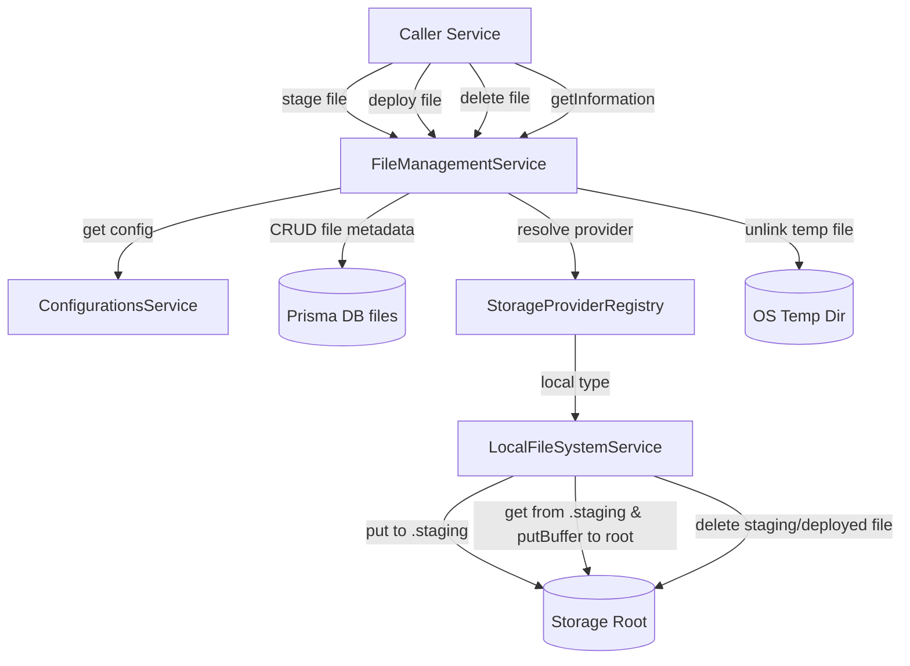

# Requirements

### Overview & Goals
The objective of this task is to implement the file management core service logic in `apps/api` according to Step 3 specifications:
- Establish the database model and table (`files`) to store uploaded file records, their storage associations, locations, states, and metadata with soft delete support.
- Implement the file staging pipeline (`stage`) accepting `Express.Multer.File`, placing staged files into a `.staging` directory on the default local storage, and cleaning up temporary upload files.
- Implement the deployment workflow (`deploy`) to transfer staged files to the active storage location by chaining buffer retrieval and write operations, and purging staging remnants.
- Implement file deletion (`delete`) delegating physical file removal to the appropriate storage provider via a provider registry and soft-deleting the database record.
- Implement file metadata retrieval (`getInformation`) returning active (non-soft-deleted) file records.
- Support future storage expansions through a decoupled `StorageProviderRegistry`.
- Strictly adhere to the scope constraint: do not create controllers or HTTP endpoints.

### Scope
- **In Scope**:
  - Prisma schema model `File` mapping to table `files` with soft deletion (`deletedAt`).
  - Database migration creating table `files` and updating `StorageOption` relations.
  - `StorageProviderRegistry` service registering and resolving storage providers by type (`local`).
  - Methods in `FileManagementService`:
    - `stage(file: Express.Multer.File)`: moves uploaded file to `.staging` on default storage, deletes temp file directly with Node `fs.unlink`, and saves metadata record.
    - `deploy(fileId: string)`: moves staged file to active storage via `get` and `putBuffer`, cleans up staging copy via `delete`, and updates record to deployed.
    - `delete(fileId: string)`: deletes physical file via resolved storage provider and soft deletes database record.
    - `getInformation(fileId: string)`: retrieves file metadata if not soft deleted; returns `null` otherwise.
  - Constants and types for file states (`staging`, `deployed`) and storage registry.
  - Unit tests in `apps/api/src/app/file-management/file-management.service.spec.ts`.
- **Out of Scope**:
  - Any HTTP controllers or route handlers (explicitly prohibited).
  - Multer endpoint integration or HTTP file upload interceptors (handled in subsequent steps).
  - Remote/cloud storage engines (e.g., S3, Azure Blob) — only `local` is implemented in this step.

### User Stories
- **As an application service**, I want to stage newly uploaded files in a dedicated `.staging` location on local storage so that other modules can process or validate files before finalizing them.
- **As an application service**, I want to deploy staged files to permanent active storage so that approved files become permanent and staging space is cleaned up.
- **As an application service**, I want to delete files and maintain soft-delete audit records in the database so that file lifecycle is safely managed.
- **As an application service**, I want to query file metadata without retrieving soft-deleted records so that only valid active files are accessible.

### Functional Requirements
1. **File Database Model**:
   - Model `File` in `prisma/schema.prisma` mapping to `files` table.
   - Fields:
     - `id`: String (UUID primary key).
     - `originalFileName`: String (mapped to `original_file_name`).
     - `fileSize`: Int (mapped to `file_size`).
     - `mimeType`: String (mapped to `mime_type`).
     - `generatedFileName`: String (mapped to `generated_file_name`).
     - `storageId`: String (mapped to `storage_id`, foreign key referencing `storage_options.id`).
     - `locationPath`: String (mapped to `location_path`).
     - `state`: String (values: `'staging'`, `'deployed'`, default: `'staging'`).
     - `createdAt`: DateTime (`now()`).
     - `updatedAt`: DateTime (`updatedAt`).
     - `deletedAt`: DateTime (nullable, for soft deletes).
   - Indexes on `deletedAt`, `storageId`, and `state`.
   - Update `StorageOption` to include `files File[]`.

2. **File Staging (`stage`)**:
   - Method signature: `stage(file: Express.Multer.File): Promise<File>`.
   - Resolves default storage option ID from `ConfigurationsService.get('fileManagement.storage.default')`.
   - Throws an error if configuration is not set or default storage option is missing/inaccessible (`deletedAt !== null`).
   - Generates a unique filename (e.g., UUID + original extension) to prevent filesystem collisions.
   - Staging destination path: `.staging/${generatedFileName}`.
   - Moves file into default storage using `LocalFileSystemService.put(defaultStorage, file.path, stagingPath)`.
   - Deletes original uploaded temporary file using Node's `fs.unlink(file.path)`.
   - Inserts record into `files` table with state `'staging'`.
   - Returns created `File` record.

3. **File Deployment (`deploy`)**:
   - Method signature: `deploy(fileId: string): Promise<File>`.
   - Reads file record by `fileId` where `deletedAt === null`. Throws error if not found.
   - Validates that `file.state === 'staging'`. Throws error if file is not in staging state.
   - Resolves staging storage option using `fileManagement.storage.default`.
   - Resolves deployed storage option using `fileManagement.storage.active`.
   - Deployed destination path: `${file.generatedFileName}`.
   - Reads buffer from staging via `LocalFileSystemService.get(stagingStorage, file.locationPath)`.
   - Writes buffer to deployed destination via `LocalFileSystemService.putBuffer(activeStorage, buffer, deployedPath)`.
   - Deletes staging file via `LocalFileSystemService.delete(stagingStorage, file.locationPath)`.
   - Updates `File` record in database: `state = 'deployed'`, `storageId = activeStorage.id`, `locationPath = deployedPath`.
   - Returns updated `File` record.

4. **File Deletion (`delete`)**:
   - Method signature: `delete(fileId: string): Promise<boolean>`.
   - Reads file record by `fileId` where `deletedAt === null`. Throws error if not found.
   - Reads associated `StorageOption` from database. Throws error if storage option not found.
   - Resolves storage provider from `StorageProviderRegistry` using `storageOption.type`. Throws error if unsupported.
   - Deletes physical file from storage provider: `provider.delete(storageOption, file.locationPath)`.
   - Soft-deletes database record: sets `deletedAt = new Date()`.
   - Returns `true`.

5. **File Metadata Retrieval (`getInformation`)**:
   - Method signature: `getInformation(fileId: string): Promise<File | null>`.
   - Finds unique file record where `id === fileId` and `deletedAt === null`.
   - Returns file record or `null` if not found.

6. **Scope Guard**:
   - No controllers, route decorators, or HTTP endpoints are implemented in this step.

### Non-Functional Requirements
- **TypeScript Standards**: Zero `any` types; class properties `readonly` where appropriate; camelCase constants; regular NestJS class methods.
- **Fail-Fast Error Handling**: Descriptive errors thrown when storage configs are missing, storage targets are inaccessible, or non-staged files are passed to `deploy()`.
- **Data Integrity**: Soft deletion enforced for all `File` records; physical storage cleaned up atomically during deployment and deletion.

# Technical Design

### Current Implementation
- `prisma/schema.prisma`: Contains `StorageOption` model with soft deletion, alongside other domain models (`Recipe`, `Configuration`, `User`).
- `apps/api/src/app/file-management/file-management.service.ts`: Implements `onModuleInit` to bootstrap default storage and populate `fileManagement.storage.active` and `fileManagement.storage.default` via `ConfigurationsService`.
- `apps/api/src/app/file-management/local-file-system.service.ts`: Implements `FileStorageService` with `put`, `putBuffer`, `get`, and `delete`.
- `apps/api/src/app/file-management/file-management.types.ts`: Defines `StorageOptions` and `FileStorageService` contracts.
- `apps/api/src/app/file-management/file-management.constants.ts`: Defines config keys and default local storage settings.

### Key Decisions
1. **Storage Provider Registry Pattern**:
   - *Decision*: Introduce `StorageProviderRegistry` in `file-management` module that registers `LocalFileSystemService` under `'local'`.
   - *Rationale*: Confirmed with user in clarification. Enables dynamic multi-storage resolution for `delete` and future storage types without coupling core business logic to specific storage implementations.
2. **Deploy Method Implementation**:
   - *Decision*: Implement `deploy()` method in `FileManagementService` as specified in functional requirements.
   - *Rationale*: Confirmed with user in clarification to resolve the contradiction in the specification.
3. **Database Schema & Naming**:
   - *Decision*: Name the model `File` mapped to `files` table, with field `fileSize` (Int), `mimeType`, `originalFileName`, `generatedFileName`, `locationPath`, and `state`.
   - *Rationale*: Follows project conventions matching `storage_options`, `shopping_lists`, and `recipes` with snake_case database column mappings.
4. **Direct Temp File Cleanup**:
   - *Decision*: Use `node:fs/promises.unlink` directly in `FileManagementService.stage()` to remove `file.path` after moving it to staging.
   - *Rationale*: Multer writes temporary files to system temp paths outside configured storage roots; `LocalFileSystemService` enforces path jail within `options.url` and cannot delete external paths.
5. **Path Formatting for Staged and Deployed Files**:
   - *Decision*: Store staging paths as `.staging/<generatedFileName>` and deployed paths as `<generatedFileName>` (POSIX format).
   - *Rationale*: Guarantees cross-platform path consistency and seamless resolution against `options.url` by `LocalFileSystemService`.

### Data Models / Contracts
```prisma
model File {
  id                String         @id @default(uuid())
  originalFileName  String         @map("original_file_name")
  fileSize          Int            @map("file_size")
  mimeType          String         @map("mime_type")
  generatedFileName String         @map("generated_file_name")
  storageId         String         @map("storage_id")
  locationPath      String         @map("location_path")
  state             String         @default("staging")
  createdAt         DateTime       @default(now()) @map("created_at")
  updatedAt         DateTime       @updatedAt @map("updated_at")
  deletedAt         DateTime?      @map("deleted_at")
  storage           StorageOption  @relation(fields: [storageId], references: [id])

  @@index([storageId])
  @@index([deletedAt])
  @@index([state])
  @@map("files")
}
```

```ts
export const fileStates = {
  staging: 'staging',
  deployed: 'deployed'
} as const;

export type FileState = typeof fileStates[keyof typeof fileStates];

export interface StorageProviderRegistry {
  register(type: string, provider: FileStorageService): void;
  get(type: string): FileStorageService;
}
```

### Components
- `StorageProviderRegistry` (`apps/api/src/app/file-management/storage-provider.registry.ts`):
  - Injected into `FileManagementService`.
  - Registers `LocalFileSystemService` on module initialization for key `'local'`.
  - Provides lookup by storage type.
- `FileManagementService` (`apps/api/src/app/file-management/file-management.service.ts`):
  - Injects `PrismaService`, `ConfigurationsService`, `LocalFileSystemService`, and `StorageProviderRegistry`.
  - Implements `stage`, `deploy`, `delete`, and `getInformation`.
- `FileManagementModule` (`apps/api/src/app/file-management/file-management.module.ts`):
  - Provides and exports `StorageProviderRegistry`, `FileManagementService`, and `LocalFileSystemService`.

### File Structure
- `prisma/schema.prisma` (modified: add `File` model, update `StorageOption`)
- `prisma/migrations/<timestamp>_create_files_table/migration.sql` (added)
- `apps/api/src/app/file-management/file-management.constants.ts` (modified: add file states and staging subfolder constant)
- `apps/api/src/app/file-management/file-management.types.ts` (modified: add FileState and provider registry contracts)
- `apps/api/src/app/file-management/storage-provider.registry.ts` (added: registry provider)
- `apps/api/src/app/file-management/file-management.module.ts` (modified: provide and wire registry)
- `apps/api/src/app/file-management/file-management.service.ts` (modified: implement `stage`, `deploy`, `delete`, `getInformation`)
- `apps/api/src/app/file-management/file-management.service.spec.ts` (modified: comprehensive unit tests for all four methods)

### Architecture Diagram


### Risks
- **Orphaned physical files on database error**: If database record insertion fails after copying a file to staging, the staged file could remain on disk. *Mitigation*: Wrap file move and database insertion in a try-catch block to clean up the staged file upon database failure.
- **Inaccessible default/active storage configuration**: Application environment might not have valid storage configuration records initialized. *Mitigation*: Explicit validation throwing informative descriptive errors when storage options are missing or soft-deleted.
- **Multer temp file cleanup**: Failed upload handling could leave temporary files in `/tmp`. *Mitigation*: Ensure `fs.unlink(file.path)` executes reliably and catches errors safely.

# Testing

### Validation Approach
Automated testing using Jest for `FileManagementService` unit test suite (`apps/api/src/app/file-management/file-management.service.spec.ts`). All dependencies (`PrismaService`, `ConfigurationsService`, `LocalFileSystemService`, `StorageProviderRegistry`, `fs.unlink`) will be mocked to verify correct interactions, method chaining, parameter passing, and exception handling.

### Key Scenarios
1. **File Staging (`stage`)**:
   - Resolves `fileManagement.storage.default` and retrieves default storage option.
   - Moves uploaded file via `LocalFileSystemService.put` to `.staging/<generatedFileName>`.
   - Calls Node's `fs.unlink` on original `file.path`.
   - Creates database record in `files` table with `state: 'staging'`.
   - Returns created record.

2. **File Deployment (`deploy`)**:
   - Retrieves file record by ID, verifies `state === 'staging'`.
   - Resolves staging storage (`fileManagement.storage.default`) and active storage (`fileManagement.storage.active`).
   - Chains `LocalFileSystemService.get` from staging location and `LocalFileSystemService.putBuffer` to deployed location.
   - Calls `LocalFileSystemService.delete` on the staging path.
   - Updates database record with `state: 'deployed'`, active `storageId`, and new `locationPath`.
   - Returns updated record.

3. **File Deletion (`delete`)**:
   - Retrieves file record by ID where `deletedAt === null`.
   - Retrieves associated storage option from database.
   - Resolves storage provider from `StorageProviderRegistry`.
   - Calls `provider.delete(storageOption, file.locationPath)`.
   - Soft-deletes database record by updating `deletedAt`.
   - Returns `true`.

4. **File Information Retrieval (`getInformation`)**:
   - Returns `File` record when found and `deletedAt === null`.
   - Returns `null` when file ID does not exist or has `deletedAt` set.

### Edge Cases
- **Missing or Inaccessible Storage Configuration**:
  - `stage` throws error if `fileManagement.storage.default` is null or points to a non-existent/soft-deleted storage option.
  - `deploy` throws error if `fileManagement.storage.default` or `fileManagement.storage.active` is missing.
- **Invalid File State in Deploy**:
  - `deploy` throws error if the requested file is already in `'deployed'` state or is soft-deleted.
- **Unsupported Storage Type in Delete**:
  - `delete` throws error if storage provider registry cannot resolve a provider for `storageOption.type`.
- **Soft Deletion Filtering**:
  - `getInformation` returns `null` for soft-deleted files.
  - `delete` throws error or ignores files that are already soft-deleted.

### Test Changes
- `apps/api/src/app/file-management/file-management.service.spec.ts`:
  - Add tests for `stage` (successful staging, unique name generation, error when default storage missing, temp file cleanup).
  - Add tests for `deploy` (successful deployment, error if not in staging, error if storage configs missing, staging deletion).
  - Add tests for `delete` (successful physical deletion and soft delete, unsupported storage type error).
  - Add tests for `getInformation` (returns record when present, returns `null` when missing or soft-deleted).

# Delivery Steps

### ✓ Step 1: Define File database model and migration
The Prisma schema includes the `File` model and database migrations create the `files` table with soft delete support.

- Define the `File` model in `prisma/schema.prisma` with fields: `id` (UUID), `originalFileName`, `fileSize`, `mimeType`, `generatedFileName`, `storageId`, `locationPath`, `state`, `createdAt`, `updatedAt`, and `deletedAt`.
- Add relation between `File` and `StorageOption` (`StorageOption.files` <-> `File.storage`), with database mapping to `files` table and indexes on `deletedAt`, `storageId`, and `state`.
- Generate and apply the Prisma migration to create the `files` table and regenerate Prisma client typings.

### ✓ Step 2: Implement Storage Provider Registry and types
Storage provider registry is established to resolve storage engine handlers by type, accompanied by file state constants and typing interfaces.

- Create `StorageProviderRegistry` in `apps/api/src/app/file-management/storage-provider.registry.ts` to register and look up `FileStorageService` implementations by storage type (`local`).
- Update `apps/api/src/app/file-management/file-management.module.ts` to provide and export `StorageProviderRegistry`.
- Define file state constants (`FILE_STATES = { STAGING: 'staging', DEPLOYED: 'deployed' }`) and typing definitions in `file-management.constants.ts` and `file-management.types.ts`.

### ✓ Step 3: Implement staging, deployment, deletion, and retrieval in FileManagementService
`FileManagementService` provides `stage`, `deploy`, `delete`, and `getInformation` methods with storage provider resolution and database tracking.

- Implement `stage(file: Express.Multer.File)`: retrieves default storage configuration (`fileManagement.storage.default`), verifies storage accessibility, generates unique file name, transfers file to `.staging/` using `LocalFileSystemService.put`, deletes temp file using `node:fs/promises.unlink`, and persists `File` database record in staging state.
- Implement `deploy(fileId: string)`: verifies file exists and is in staging state, retrieves staging storage (`fileManagement.storage.default`) and active deployed storage (`fileManagement.storage.active`), transfers file buffer chaining `get` and `putBuffer`, deletes file from staging using `LocalFileSystemService.delete`, and updates file record to deployed state.
- Implement `delete(fileId: string)`: loads file, looks up storage provider from `StorageProviderRegistry`, deletes physical file from storage, and marks file record soft-deleted (`deletedAt`).
- Implement `getInformation(fileId: string)`: queries non-deleted file record by ID and returns file metadata or `null` if not found.

### ✓ Step 4: Add unit tests for FileManagementService file operations
`FileManagementService` unit test suite comprehensively covers all new file management methods, edge cases, and error conditions.

- Add unit tests for `stage`: verify successful file staging, unique name generation, direct temp file unlinking, and failure handling when default storage configuration is missing or invalid.
- Add unit tests for `deploy`: verify staging validation error when not in staging state, buffer retrieval and writing pipeline, staging cleanup, active storage assignment, and database updates.
- Add unit tests for `delete`: verify storage provider lookup via registry, storage file deletion invocation, database soft deletion, and error handling for missing files or unsupported storage engines.
- Add unit tests for `getInformation`: verify retrieval of active file records, returning `null` for non-existent or soft-deleted records.