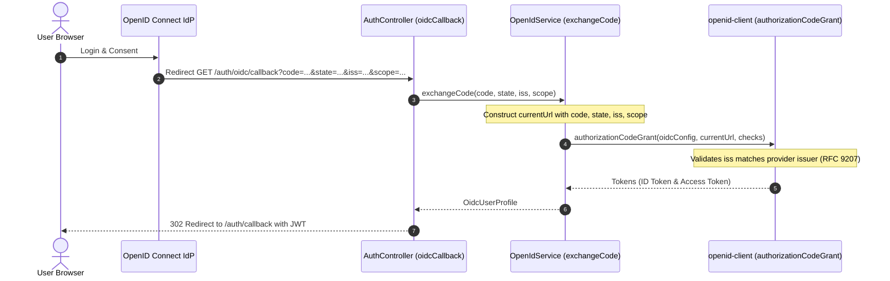

# Requirements

### Overview & Goals
When authenticating via OpenID Connect (OIDC) identity providers that support RFC 9207 (Authorization Server Issuer Identification in Authorization Responses), the IdP includes the `iss` parameter (and optionally `scope`) in the authorization response query parameters.
Currently, `AuthController.oidcCallback` only accepts `code` and `state`. When `OpenIdService.exchangeCode()` constructs the incoming URL for `openid-client`'s `authorizationCodeGrant()`, `iss` is missing, causing `openid-client` (via `oauth4webapi`) to throw:
`OperationProcessingError: response parameter "iss" (issuer) missing`.

The goal is to accept `iss` and `scope` query parameters in the callback endpoints and forward them to `OpenIdService` so `openid-client` can validate the authorization response correctly.

### Scope
- **In Scope**:
  - Updating `AuthController.oidcCallback` in `apps/api/src/app/auth/auth.controller.ts` to accept optional `iss` and `scope` query parameters.
  - Updating `OidcController.oidcCallback` in `apps/api/src/app/auth/oidc.controller.ts` for route parity.
  - Updating `OpenIdService.exchangeCode` in `apps/api/src/app/auth/open-id.service.ts` to accept `iss` and `scope` and set them on `currentUrl` before delegating to `client.authorizationCodeGrant()`.
  - Updating `OidcCallbackQueryDto` in `apps/api/src/app/auth/dto/oidc.dto.ts`.
  - Updating and expanding unit tests in `auth.controller.spec.ts`, `oidc.controller.spec.ts`, and `open-id.service.spec.ts`.
  - Resolving Jest ESM transform ignore pattern in `apps/api/jest.config.cts` for `change-case` so the test suite can run without module loading errors.
- **Out of Scope**:
  - Modifying frontend OIDC redirection or callback logic in `apps/web`.
  - Changing provider discovery or client credential management.

### User Stories
- **As an end user logging in via an RFC 9207-compliant OpenID Connect provider (e.g., Keycloak, Okta, Google)**, I want the callback to process successfully without throwing an `iss missing` error so that I am authenticated and redirected to the application.
- **As a system administrator configuring OpenID Connect**, I want standard OIDC authorization response parameters (`iss`, `scope`) to be properly verified so that authorization server responses remain secure and compliant with specifications.

### Functional Requirements
1. `GET /auth/oidc/callback` and `GET /oidc/callback` must accept optional query parameters:
   - `iss`: string (optional issuer identifier returned by RFC 9207 compliant IdPs)
   - `scope`: string (optional scope string returned by IdPs)
2. When `iss` is present in the callback request:
   - It must be forwarded to `OpenIdService.exchangeCode()`.
   - `OpenIdService` must set `iss` on the callback URL search parameters passed to `openid-client.authorizationCodeGrant()`.
3. When `scope` is present in the callback request:
   - It must be forwarded to `OpenIdService.exchangeCode()`.
   - `OpenIdService` must set `scope` on the callback URL search parameters passed to `openid-client.authorizationCodeGrant()`.
4. If `iss` or `scope` are omitted from the callback request, existing behavior must remain intact for IdPs that do not supply them.

# Technical Design

### Current Implementation
- `AuthController.oidcCallback` (`apps/api/src/app/auth/auth.controller.ts`):
  ```typescript
  @Get('oidc/callback')
  async oidcCallback(
    @Res() res: Response,
    @Query('code') code?: string,
    @Query('state') state?: string
  ): Promise<void>
  ```
- `OidcController.oidcCallback` (`apps/api/src/app/auth/oidc.controller.ts`):
  Has identical logic mapped to route `/oidc/callback`.
- `OpenIdService.exchangeCode` (`apps/api/src/app/auth/open-id.service.ts`):
  Constructs `currentUrl` using only `code` and `state`:
  ```typescript
  const currentUrl = new URL(this.callbackUrl);
  currentUrl.searchParams.set('code', code);
  currentUrl.searchParams.set('state', state);
  ```
  `openid-client`'s `authorizationCodeGrant` delegates response validation to `oauth4webapi.validateAuthResponse`. When the discovered provider metadata has `authorization_response_iss_parameter_supported: true`, `validateAuthResponse` checks for `iss` on the search parameters of the response URL. Because `iss` was not set, it throws `OperationProcessingError: response parameter "iss" (issuer) missing`.

### Key Decisions
1. **Query Parameter Handling**:
   - *Decision*: Add `@Query('iss') iss?: string` and `@Query('scope') scope?: string` to both `AuthController.oidcCallback` and `OidcController.oidcCallback`.
   - *Rationale*: Keeps parameter binding idiomatic with NestJS controller conventions and handles both callback routes consistently.
2. **Flexible Signature in OpenIdService**:
   - *Decision*: Support both positional arguments `(code, state, iss?, scope?)` and an options object `({ code, state, iss?, scope? })` in `OpenIdService.exchangeCode`.
   - *Rationale*: Maintains backwards compatibility with existing calls and test suites while supporting full parameter forwarding.
3. **Parameter Injection into Callback URL**:
   - *Decision*: Conditionally append `iss` and `scope` to `currentUrl.searchParams` only when non-empty strings are provided.
   - *Rationale*: Avoids appending empty query keys (`?iss=&scope=`) which could interfere with provider response validation when they are absent.

### Architecture Diagram


### Components and File Changes
1. **`apps/api/src/app/auth/dto/oidc.dto.ts`**:
   - Update `OidcCallbackQueryDto` with `@IsOptional() @IsString() iss?: string;` and `@IsOptional() @IsString() scope?: string;`.
   - Export `OidcCallbackParams` interface.
2. **`apps/api/src/app/auth/open-id.service.ts`**:
   - Update `exchangeCode(codeOrParams: string | OidcCallbackParams, maybeState?: string, maybeIss?: string, maybeScope?: string): Promise<OidcUserProfile>`.
   - Conditionally set `iss` and `scope` on `currentUrl.searchParams`.
3. **`apps/api/src/app/auth/auth.controller.ts`**:
   - Add `@Query('iss') iss?: string` and `@Query('scope') scope?: string` to `oidcCallback`.
   - Pass `iss` and `scope` to `this.openIdService.exchangeCode(code, state, iss, scope)`.
4. **`apps/api/src/app/auth/oidc.controller.ts`**:
   - Add `@Query('iss') iss?: string` and `@Query('scope') scope?: string` to `oidcCallback`.
   - Pass `iss` and `scope` to `this.openIdService.exchangeCode(code, state, iss, scope)`.
5. **`apps/api/jest.config.cts`**:
   - Update `transformIgnorePatterns` from `node_modules/(?!(openid-client|oauth4webapi|jose)/)` to `node_modules/(?!(openid-client|oauth4webapi|jose|change-case)/)` so Jest compiles `change-case` correctly.

# Testing

### Validation Approach
Verification will be performed via automated Jest unit tests covering controllers, service URL construction, and query parameter forwarding.

### Key Scenarios
1. **AuthController forwards all parameters**:
   - Invoke `AuthController.oidcCallback(response, 'code-123', 'state-456', 'https://idp.example.com', 'openid email')`.
   - Verify `openIdService.exchangeCode` is called with `'code-123'`, `'state-456'`, `'https://idp.example.com'`, and `'openid email'`.
2. **OidcController forwards all parameters**:
   - Invoke `OidcController.oidcCallback(response, 'code-123', 'state-456', 'https://idp.example.com', 'openid email')`.
   - Verify `openIdService.exchangeCode` is called with `'code-123'`, `'state-456'`, `'https://idp.example.com'`, and `'openid email'`.
3. **OpenIdService sets parameters on URL**:
   - Invoke `openIdService.exchangeCode('code-123', 'state-456', 'https://idp.example.com', 'openid email')`.
   - Verify that the `URL` passed to `client.authorizationCodeGrant` has search parameters:
     - `code=code-123`
     - `state=state-123`
     - `iss=https://idp.example.com`
     - `scope=openid email`
4. **Backwards compatibility when `iss` and `scope` are omitted**:
   - Invoke `openIdService.exchangeCode('code-123', 'state-456')`.
   - Verify `currentUrl` contains `code` and `state`, and does not have `iss` or `scope` keys.

### Test Changes
- `apps/api/src/app/auth/auth.controller.spec.ts`:
  - Add test verifying `iss` and `scope` pass-through to `exchangeCode`.
  - Ensure existing tests pass with updated signatures.
- `apps/api/src/app/auth/oidc.controller.spec.ts`:
  - Add test verifying `iss` and `scope` pass-through to `exchangeCode`.
  - Ensure existing tests pass with updated signatures.
- `apps/api/src/app/auth/open-id.service.spec.ts`:
  - Add tests verifying `authorizationCodeGrant` receives a URL containing `iss` and `scope` when supplied.

# Delivery Steps

### ✓ Step 1: Extend DTO and OpenIdService with iss and scope support
`OpenIdService.exchangeCode()` and OIDC DTOs accept `iss` and `scope` parameters and set them on the callback URL passed to `openid-client`.

- Update `OidcCallbackQueryDto` in `apps/api/src/app/auth/dto/oidc.dto.ts` with optional `iss` and `scope` properties decorated with `@IsString()` and `@IsOptional()`.
- Define `OidcCallbackParams` interface or extend existing types to support both object and positional parameter calling conventions for `exchangeCode()`.
- Update `OpenIdService.exchangeCode()` in `apps/api/src/app/auth/open-id.service.ts` to accept optional `iss` and `scope` parameters (supporting both `code, state, iss, scope` and `{ code, state, iss, scope }`).
- When constructing `currentUrl` before calling `client.authorizationCodeGrant()`, append `iss` and `scope` as query parameters when provided (`currentUrl.searchParams.set('iss', iss)` and `currentUrl.searchParams.set('scope', scope)`).
- Ensure no `any` types are introduced in accordance with project TypeScript guidelines.

### ✓ Step 2: Add missing parameters to controller callback handlers
Both `AuthController.oidcCallback()` and `OidcController.oidcCallback()` extract `iss` and `scope` from the query string and forward them to `OpenIdService`.

- In `apps/api/src/app/auth/auth.controller.ts`, add `@Query('iss') iss?: string` and `@Query('scope') scope?: string` to `oidcCallback()`.
- Update the invocation of `openIdService.exchangeCode()` in `AuthController.oidcCallback()` to pass `iss` and `scope`.
- In `apps/api/src/app/auth/oidc.controller.ts`, add `@Query('iss') iss?: string` and `@Query('scope') scope?: string` to `oidcCallback()` for parity on the `/oidc/callback` endpoint.
- Update the invocation of `openIdService.exchangeCode()` in `OidcController.oidcCallback()` to pass `iss` and `scope`.

### ✓ Step 3: Update unit tests and Jest transform configuration
Unit tests verify that `iss` and `scope` query parameters are extracted by controllers, passed to `OpenIdService`, set on the verification URL for `openid-client`, and the test suite passes.

- Update `apps/api/jest.config.cts` `transformIgnorePatterns` to include `change-case` (`node_modules/(?!(openid-client|oauth4webapi|jose|change-case)/)`) so that Jest can execute auth test suites without ESM errors.
- In `apps/api/src/app/auth/open-id.service.spec.ts`, add test cases validating that `iss` and `scope` are correctly appended to the `currentUrl` passed to `client.authorizationCodeGrant()`.
- In `apps/api/src/app/auth/auth.controller.spec.ts`, update existing callback tests and add a test case verifying that `iss` and `scope` query parameters are forwarded to `openIdService.exchangeCode()`.
- In `apps/api/src/app/auth/oidc.controller.spec.ts`, update existing callback tests and add a test case verifying that `iss` and `scope` query parameters are forwarded to `openIdService.exchangeCode()`.
- Run Jest test suite across `apps/api/src/app/auth` to confirm all specs pass cleanly.