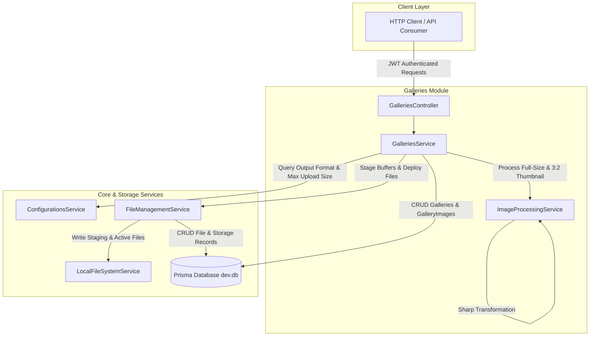

# Requirements

### Overview & Goals
Implement a backend API module in `apps/api` for managing image galleries, including gallery creation, updating, retrieval, soft-deletion, image upload with automatic image processing (full-size optimization and thumbnail generation), and batch image deletion. The feature leverages `ConfigurationsService` under the `gallery` domain, `FileManagementService` for file staging/deployment/storage lifecycle, and `sharp` for image transformations. Frontend changes are out of scope.

### Scope
- **In Scope**:
  - Prisma database models: `Gallery` and `GalleryImage` with soft-deletion support and foreign keys to `File`.
  - Extension of `FileManagementService` to support direct staging of in-memory `Buffer` payloads.
  - Dedicated `ImageProcessingService` using `sharp` to process full-size images (max 3840x2160, aspect-ratio preserved) and thumbnails (3:2 crop, max 600x400 without upscaling).
  - Configurable settings via `ConfigurationsService` (`gallery.output.format`, `gallery.input.maxUploadSize`).
  - Supported input formats: JPEG, JPEG XL, AVIF, WebP, PNG.
  - Supported output formats: AVIF (default) and JPEG XL.
  - RESTful controller `GalleriesController` with JWT authentication (`JwtAuthGuard`).
  - Upload pipeline with failure rollback (deleting staged files on processing failure).
  - Deletion workflows (gallery delete and batch image delete) that soft-delete DB entities and invoke `FileManagementService.delete` for physical file cleanup.
  - Unit and integration tests for services and controller.
- **Out of Scope**:
  - Frontend UI components, gallery views, or Angular routes.
  - Client-side image cropping or compression.
  - Hard physical deletion of gallery or gallery image database rows (soft delete via `deletedAt` is used).

### User Stories
- **As an authenticated API user**, I want to create a new gallery with a name so that I can organize recipe and food pictures.
- **As an authenticated API user**, I want to update an existing gallery's name so that I can keep gallery titles up to date.
- **As an authenticated API user**, I want to fetch details of a gallery including an ordered list of images with their full-size and thumbnail `externalUrl`s so that the frontend can render responsive image views.
- **As an authenticated API user**, I want to upload an image (JPEG, JPEG XL, AVIF, WebP, PNG) to a gallery, having it automatically validated against maximum size limits, converted into the configured output format (AVIF or JPEG XL), and stored as both full-size and thumbnail variants.
- **As an authenticated API user**, I want failed image uploads to cleanly discard all staged files and not leave orphaned artifacts.
- **As an authenticated API user**, I want to delete specific images from a gallery so that unwanted pictures are removed from active display and deleted from physical storage.
- **As an authenticated API user**, I want to delete a gallery so that the gallery and all its linked images are soft-deleted and physical files are deleted from storage.

### Functional Requirements
1. **Authentication**: All gallery endpoints require authentication via `@UseGuards(JwtAuthGuard)`. Unauthenticated requests return `401 Unauthorized`.
2. **Configuration Domain (`gallery`)**:
   - `gallery.output.format`: Output format for generated full-size and thumbnail images. Default is `AVIF`. Supported values are `AVIF` and `JPEG XL` (case-insensitive handling, mapping to `avif` and `jxl`).
   - `gallery.input.maxUploadSize`: Maximum allowed image upload size in megabytes. Default is `20` (MB).
3. **Gallery CRUD Endpoints**:
   - `POST /galleries`: Creates a new gallery. Request body: `{ name: string }`. Returns `201 Created` with created gallery record (`id`, `name`, `createdAt`, `updatedAt`).
   - `PUT /galleries/:id`: Updates an existing gallery. Request body: `{ name: string }`. Returns `200 OK` with updated gallery record. Returns `404 Not Found` if gallery does not exist or is soft-deleted.
   - `DELETE /galleries/:id`: Soft-deletes the gallery (`deletedAt = now()`), soft-deletes all associated active `GalleryImage` records, and calls `FileManagementService.delete` on every linked full-size and thumbnail `File`. Returns `200 OK` with confirmation message.
   - `GET /galleries/:id`: Returns gallery details (`id`, `name`) and ordered `images` (`order ASC`). For each image, include `id`, `order`, `createdAt`, and nested variant objects (`fullSize` and `thumbnail`) containing file ID and `externalUrl` derived from the linked `File` and its `StorageOption`.
4. **Image Upload Endpoint (`POST /galleries/:id/images`)**:
   - Accepts a single multipart/form-data file upload (field name `image` or `file`).
   - Enforces upload size limit based on `gallery.input.maxUploadSize` configuration (default 20 MB). Rejects files exceeding this size with `400 Bad Request` or `413 Payload Too Large`.
   - Validates input format (JPEG, JPEG XL, AVIF, WebP, PNG). Rejects other MIME/format types with `400 Bad Request`.
   - Uses uploaded file buffer to process:
     1. Full-size image: constrained to maximum 3840 x 2160 resolution while maintaining original aspect ratio without enlargement.
     2. Thumbnail image: cropped to 3:2 aspect ratio, resized to 600 x 400. Small source images are cropped to 3:2 without upscaling.
   - Stages both output buffers in `FileManagementService` (`stageBuffer`).
   - If any error occurs during processing or staging, deletes any staged files and temporary files, then throws an error.
   - Upon successful processing and staging, deploys both staged files using `FileManagementService.deploy(fileId)`.
   - Persists a new `GalleryImage` record linked to the gallery, full-size file, and thumbnail file, with `order` set to the next available position (or 0 if first).
   - Returns `201 Created` with the newly created gallery image record (including variant URLs).
5. **Batch Image Deletion Endpoint (`DELETE /galleries/:id/images`)**:
   - Accepts `{ imageIds: string[] }`.
   - Validates that target images exist and belong to the specified gallery.
   - Soft-deletes `GalleryImage` records (`deletedAt = now()`).
   - Calls `FileManagementService.delete(fileId)` for each full-size and thumbnail `File`.
   - Returns `200 OK` with status/count of deleted images.

### Non-Functional Requirements
- **Atomicity & Cleanup**: No orphaned staged files or partial records in case of upload failure or image processing error.
- **Resource Efficiency**: Use stream/buffer processing with Sharp, taking advantage of libvips native operations.
- **Validation**: Strict DTO validation with `class-validator` and `ValidationPipe`.
- **Consistency**: Follow existing NestJS patterns in `apps/api` (standard exception filters, Prisma repositories, dependency injection).

# Technical Design

### Current Implementation
- `prisma/schema.prisma`: Contains `StorageOption` and `File` models with soft-delete fields and relations. `File` records track state (`staging`, `deployed`), `storageId`, and `locationPath`.
- `apps/api/src/app/file-management/file-management.service.ts`: Exposes `stage(file: Express.Multer.File)`, `deploy(fileId)`, `delete(fileId)`, and `getInformation(fileId)`. Uses `LocalFileSystemService` to read/write files and buffers to disk.
- `apps/api/src/app/configurations/configurations.service.ts`: Key-value configuration service with domain-group-entity fallback and environment variable resolution.
- `package.json`: Already has `sharp` (v0.35.4) and `@types/multer` installed.

### Key Decisions
1. **Dedicated ImageProcessingService in GalleriesModule**:
   - *Decision*: Encapsulate all Sharp logic (format validation, aspect ratio crop calculation, resizing constraints, format encoding) in `ImageProcessingService` within `apps/api/src/app/galleries/`.
   - *Rationale*: Keeps `FileManagementService` agnostic to domain-specific image manipulation and allows isolated unit testing of image math and encoding rules.
2. **Buffer Staging Extension in FileManagementService**:
   - *Decision*: Add `stageBuffer(buffer: Buffer, originalFileName: string, mimeType: string): Promise<File>` to `FileManagementService`.
   - *Rationale*: Sharp outputs in-memory Buffers. Staging directly via buffer avoids intermediate disk temp files and integrates cleanly with existing `LocalFileSystemService.putBuffer` and `deploy()` lifecycle.
3. **Gallery-Scoped Image Deletion (`DELETE /galleries/:id/images`)**:
   - *Decision*: Scope batch image deletion to a specific gallery path parameter.
   - *Rationale*: Guarantees tenant/gallery boundary validation, preventing unintentional deletion of images belonging to other galleries.
4. **Nested Variant Representation for Gallery Details**:
   - *Decision*: In gallery details responses, represent image assets as nested `fullSize` and `thumbnail` objects containing `id` and `externalUrl`.
   - *Rationale*: Clear separation between variant metadata and easy extensibility for future variant properties (e.g., width, height, mimeType).
5. **No Upscaling for Small Source Thumbnails**:
   - *Decision*: In `ImageProcessingService`, calculate crop rectangle to 3:2 centered on the image. If source dimensions are smaller than 600 x 400, retain the cropped dimensions without upscaling. If larger, downscale to 600 x 400.
   - *Rationale*: Prevents blurriness and pixelation on small input images while guaranteeing the 3:2 aspect ratio.

### Proposed Changes

#### 1. Prisma Schema (`prisma/schema.prisma`)
Add `Gallery` and `GalleryImage` models:
```prisma
model Gallery {
  id        String         @id @default(uuid())
  name      String
  images    GalleryImage[]
  createdAt DateTime       @default(now()) @map("created_at")
  updatedAt DateTime       @updatedAt @map("updated_at")
  deletedAt DateTime?      @map("deleted_at")

  @@index([deletedAt])
  @@map("galleries")
}

model GalleryImage {
  id              String    @id @default(uuid())
  galleryId       String    @map("gallery_id")
  fullSizeFileId  String    @map("full_size_file_id")
  thumbnailFileId String    @map("thumbnail_file_id")
  order           Int       @default(0)
  createdAt       DateTime  @default(now()) @map("created_at")
  updatedAt       DateTime  @updatedAt @map("updated_at")
  deletedAt       DateTime? @map("deleted_at")

  gallery       Gallery @relation(fields: [galleryId], references: [id], onDelete: Cascade)
  fullSizeFile  File    @relation("GalleryImageFullSize", fields: [fullSizeFileId], references: [id])
  thumbnailFile File    @relation("GalleryImageThumbnail", fields: [thumbnailFileId], references: [id])

  @@index([galleryId])
  @@index([deletedAt])
  @@map("gallery_images")
}
```
Update `File` model in `prisma/schema.prisma`:
```prisma
  galleryImagesFullSize  GalleryImage[] @relation("GalleryImageFullSize")
  galleryImagesThumbnail GalleryImage[] @relation("GalleryImageThumbnail")
```

#### 2. FileManagementService Extension (`apps/api/src/app/file-management/file-management.service.ts`)
Add method:
```ts
async stageBuffer(
  buffer: Buffer,
  originalFileName: string,
  mimeType: string
): Promise<File> {
  const defaultStorage = await this.getStorageOptionByKey(
    FILE_MANAGEMENT_CONFIG_KEYS.DEFAULT_STORAGE,
    'Default'
  );
  const extension = path.extname(originalFileName) || '.bin';
  const generatedFileName = `${randomUUID()}${extension}`;
  const stagingPath = `${stagingDirectory}/${generatedFileName}`;

  await this.localFileSystemService.putBuffer(defaultStorage, buffer, stagingPath);

  try {
    return await this.prisma.file.create({
      data: {
        originalFileName,
        fileSize: buffer.length,
        mimeType,
        generatedFileName,
        storageId: defaultStorage.id,
        locationPath: stagingPath,
        state: fileStates.staging
      }
    });
  } catch (error) {
    try {
      await this.localFileSystemService.delete(defaultStorage, stagingPath);
    } catch {}
    throw error;
  }
}
```

#### 3. ImageProcessingService (`apps/api/src/app/galleries/image-processing.service.ts`)
- Format inspection: Support `image/jpeg`, `image/jxl`, `image/avif`, `image/webp`, `image/png`.
- Output format resolution: Query `gallery.output.format` from `ConfigurationsService`. If unset or `AVIF`, encode as AVIF. If `JPEG XL` / `JXL`, encode as JPEG XL.
- Full-size processing:
  ```ts
  sharp(inputBuffer)
    .rotate() // auto-orient based on EXIF
    .resize({ width: 3840, height: 2160, fit: 'inside', withoutEnlargement: true })
    [outputFormat]()
    .toBuffer();
  ```
- Thumbnail processing:
  - Extract metadata (`width`, `height`).
  - Calculate 3:2 target crop dimensions:
    - If `width / height > 3 / 2`, crop width: `targetWidth = Math.round(height * 1.5)`, `targetHeight = height`.
    - Else, crop height: `targetHeight = Math.round(width / 1.5)`, `targetWidth = width`.
  - Extract center crop using `.extract({ left, top, width: targetWidth, height: targetHeight })`.
  - If `targetWidth > 600 || targetHeight > 400`, resize to `600 x 400` with `fit: 'cover'`. Otherwise do not upscale.
  - Encode to `outputFormat`.

#### 4. GalleriesService (`apps/api/src/app/galleries/galleries.service.ts`)
- `createGallery(dto: CreateGalleryDto)`: creates gallery with name.
- `updateGallery(id: string, dto: UpdateGalleryDto)`: updates name.
- `getGallery(id: string)`: fetches gallery with active images ordered by `order ASC`, loads `fullSizeFile.storage` and `thumbnailFile.storage`, computes `externalUrl` (`${storage.externalUrl.replace(/\/+$/, '')}/${file.locationPath}`).
- `uploadImage(galleryId: string, file: Express.Multer.File)`:
  - Check max size: `gallery.input.maxUploadSize` (default 20MB).
  - Verify gallery exists and is not deleted.
  - Process full size and thumbnail buffers via `ImageProcessingService`.
  - Stage buffers via `FileManagementService.stageBuffer(...)`.
  - Try block: deploy both files via `FileManagementService.deploy(fileId)`, create `GalleryImage` record with order = count + 1.
  - Catch block: on any failure, delete staged files via `FileManagementService.delete(...)` and rethrow.
- `deleteGallery(id: string)`: soft-deletes gallery and images, calls `FileManagementService.delete` for each image variant.
- `deleteImages(galleryId: string, imageIds: string[])`: verifies gallery ownership, soft-deletes images, calls `FileManagementService.delete` for each image file.

#### 5. GalleriesController (`apps/api/src/app/galleries/galleries.controller.ts`)
- Endpoints:
  - `POST /galleries` -> `createGallery`
  - `PUT /galleries/:id` -> `updateGallery`
  - `DELETE /galleries/:id` -> `deleteGallery`
  - `GET /galleries/:id` -> `getGallery`
  - `POST /galleries/:id/images` -> `@UseInterceptors(FileInterceptor('image'))` -> `uploadImage`
  - `DELETE /galleries/:id/images` -> `deleteImages`

### Architecture Diagram


### Data Models / Contracts

```ts
export class CreateGalleryDto {
  @IsString()
  @IsNotEmpty()
  name: string;
}

export class UpdateGalleryDto {
  @IsString()
  @IsNotEmpty()
  name: string;
}

export class DeleteGalleryImagesDto {
  @IsArray()
  @IsUUID('4', { each: true })
  @ArrayNotEmpty()
  imageIds: string[];
}

export interface ImageVariantDto {
  id: string;
  externalUrl: string;
}

export interface GalleryImageDto {
  id: string;
  order: number;
  createdAt: Date;
  fullSize: ImageVariantDto;
  thumbnail: ImageVariantDto;
}

export interface GalleryDetailsDto {
  id: string;
  name: string;
  createdAt: Date;
  updatedAt: Date;
  images: GalleryImageDto[];
}
```

### File Structure
- Modified files:
  - `prisma/schema.prisma`
  - `apps/api/src/app/app.module.ts`
  - `apps/api/src/app/file-management/file-management.service.ts`
  - `apps/api/src/app/file-management/file-management.service.spec.ts`
- Added files:
  - `prisma/migrations/<timestamp>_create_gallery_tables/migration.sql`
  - `apps/api/src/app/galleries/galleries.module.ts`
  - `apps/api/src/app/galleries/galleries.controller.ts`
  - `apps/api/src/app/galleries/galleries.controller.spec.ts`
  - `apps/api/src/app/galleries/galleries.service.ts`
  - `apps/api/src/app/galleries/galleries.service.spec.ts`
  - `apps/api/src/app/galleries/image-processing.service.ts`
  - `apps/api/src/app/galleries/image-processing.service.spec.ts`
  - `apps/api/src/app/galleries/dto/create-gallery.dto.ts`
  - `apps/api/src/app/galleries/dto/update-gallery.dto.ts`
  - `apps/api/src/app/galleries/dto/delete-gallery-images.dto.ts`
  - `apps/api/src/app/galleries/dto/gallery-response.dto.ts`

### Risks & Mitigations
- **JPEG XL Sharp support**: Libvips/Sharp in certain distributions may require specific plugins for JXL. Mitigation: Detect and test JXL output encoding capability; fallback or validate format support gracefully, providing clear error responses if unsupported by the installed Sharp build.
- **Memory spikes with large images**: Processing up to 20MB input images simultaneously could consume memory. Mitigation: Limit uploads strictly via Multer file size options and `gallery.input.maxUploadSize`, process sequentially per request, and release buffer references immediately after staging.

# Testing

### Validation Approach
Automated verification will be performed via Jest unit tests and integration tests using NestJS testing utilities:
1. Unit tests for `FileManagementService.stageBuffer` validating storage interaction and database record creation.
2. Unit tests for `ImageProcessingService` verifying format detection, resize bounding, 3:2 aspect-ratio cropping without upscaling, and format conversion.
3. Unit tests for `GalleriesService` covering all CRUD methods, transaction handling, upload rollback, and cascading soft-deletes.
4. Controller and E2E tests validating route guards, HTTP status codes, validation pipes, and multipart upload handling.

### Key Scenarios
- **Gallery Creation**: Call `POST /galleries` with valid name, expect `201 Created` with gallery record.
- **Gallery Update**: Call `PUT /galleries/:id` with new name, expect `200 OK` with updated name.
- **Gallery Retrieval**: Call `GET /galleries/:id`, expect `200 OK` with gallery name and images ordered by `order ASC`, each with valid `externalUrl`s for `fullSize` and `thumbnail`.
- **Image Upload Success**: Upload a valid JPEG image (e.g. 1920x1080) to `POST /galleries/:id/images`:
  - Output format matches `gallery.output.format` configuration (AVIF by default).
  - Staged files deployed to active storage.
  - Image record returned with order index.
- **Thumbnail Aspect Ratio & No-Upscale**:
  - For image larger than 600x400 (e.g. 1200x1200), verify thumbnail is cropped to 3:2 (1200x800) and downscaled to 600x400.
  - For small image (e.g. 300x300), verify thumbnail is cropped to 3:2 (300x200) without enlarging to 600x400.
- **Full-Size Resolution Constraint**: For a very large image (e.g. 5000x4000), verify full-size image is constrained to max 3840x2160 preserving aspect ratio.
- **Image Deletion**: Call `DELETE /galleries/:id/images` with list of image IDs, verify soft-deletion of `GalleryImage` records and physical deletion calls to `FileManagementService.delete`.
- **Gallery Deletion**: Call `DELETE /galleries/:id`, verify soft-deletion of gallery, soft-deletion of all linked images, and invocation of `FileManagementService.delete` for all associated files.

### Edge Cases
- **Upload File Exceeds Size Limit**: Upload a file larger than `gallery.input.maxUploadSize` (e.g. > 20MB); expect `400 Bad Request` or `413 Payload Too Large`.
- **Invalid Upload Format**: Upload an unsupported format (e.g. PDF, SVG, GIF, TXT); expect `400 Bad Request`.
- **Upload Processing Failure Rollback**: Simulate an error during thumbnail staging or database commit; verify that the full-size staged file is removed from storage and not left orphaned in `.staging`.
- **Delete Non-Existent or Foreign Images**: Attempt to delete images that do not belong to the target gallery ID; verify rejection or proper filtering.
- **Accessing Soft-Deleted Gallery**: Verify `GET /galleries/:id` returns `404 Not Found` after deletion.

### Test Changes
- `apps/api/src/app/file-management/file-management.service.spec.ts`: Add tests for `stageBuffer`.
- `apps/api/src/app/galleries/image-processing.service.spec.ts`: New unit tests for image transformations and format validations.
- `apps/api/src/app/galleries/galleries.service.spec.ts`: New unit tests for gallery operations and upload rollback.
- `apps/api/src/app/galleries/galleries.controller.spec.ts`: New unit tests for endpoint routing and parameter passing.

# Delivery Steps

### * Step 1: Prisma Schema & Database Migration for Galleries
Database schema updated with Gallery and GalleryImage models, with Prisma client generated and migrations applied.

- Update `prisma/schema.prisma` to define `Gallery` and `GalleryImage` models with UUID primary keys, timestamps, soft-delete columns (`deletedAt`), and relational indexes.
- Add relation fields between `GalleryImage` and `File` (`fullSizeFile` and `thumbnailFile`), and inverse relations on `File`.
- Generate Prisma migration SQL in `prisma/migrations` and apply it to `dev.db`.
- Run `prisma generate` to update the Prisma client types used across `@top-nosh/data-access` and the `api` project.

###   Step 2: Extend FileManagementService with Buffer Staging
FileManagementService supports staging binary Buffers alongside existing Multer file staging.

- Add `stageBuffer(buffer: Buffer, originalFileName: string, mimeType: string): Promise<File>` to `FileManagementService` in `apps/api/src/app/file-management/file-management.service.ts`.
- Write the buffer to `.staging/${generatedFileName}` via `LocalFileSystemService.putBuffer` and create a `File` record in `staging` state within the default storage option.
- Verify that staged buffer files seamlessly deploy to active storage via `deploy()` and clean up via `delete()`.
- Add unit tests to `apps/api/src/app/file-management/file-management.service.spec.ts` covering `stageBuffer` success and error cases.

###   Step 3: Image Processing Service with Sharp
ImageProcessingService handles format validation, metadata inspection, full-size constraint resizing, 3:2 thumbnail cropping without upscaling, and AVIF/JPEG XL encoding.

- Create `apps/api/src/app/galleries/image-processing.service.ts` injecting `ConfigurationsService`.
- Support input formats: JPEG, JPEG XL, AVIF, WebP, PNG by inspecting file metadata and mime types.
- Read output format from `gallery.output.format` configuration key (defaulting to `AVIF`, supporting `AVIF` and `JPEG XL`).
- Process full-size images: constrain dimensions to max 3840 x 2160 maintaining aspect ratio (`fit: 'inside', withoutEnlargement: true`) and encode to target format.
- Process thumbnail images: calculate 3:2 crop rectangle centered on source image without upscaling small images, resize to 600 x 400 (if >= 600x400) or maintain cropped dimensions, and encode to target format.
- Add unit tests in `apps/api/src/app/galleries/image-processing.service.spec.ts` covering all input formats, dimension bounds, aspect ratios, no-upscaling logic, and format conversion.

###   Step 4: Galleries Service & Pipeline Orchestration
GalleriesService encapsulates business logic for gallery CRUD, image upload pipeline with atomic rollback, and cascading soft-deletes.

- Create `apps/api/src/app/galleries/galleries.service.ts` injecting `PrismaService`, `ConfigurationsService`, `FileManagementService`, and `ImageProcessingService`.
- Implement `createGallery` and `updateGallery` with name validation and soft-delete filtering.
- Implement `getGallery` returning gallery details with nested `fullSize` and `thumbnail` objects containing `id` and `externalUrl` (resolved from `StorageOption.externalUrl` and `File.locationPath`).
- Implement `uploadImage`:
  - Validate file size against `gallery.input.maxUploadSize` (in MB, default 20 MB).
  - Process full-size and thumbnail buffers via `ImageProcessingService`.
  - Stage both buffers via `FileManagementService.stageBuffer`.
  - On any error, clean up staged files using `FileManagementService.delete` and throw an exception.
  - On success, deploy staged files via `FileManagementService.deploy` and persist `GalleryImage` with auto-incremented `order`.
- Implement `deleteGallery`: soft-delete gallery, soft-delete linked images, and call `FileManagementService.delete` for each image variant.
- Implement `deleteImages`: validate images belong to the specified gallery, soft-delete images, and delete underlying physical files via `FileManagementService.delete`.
- Add unit tests in `apps/api/src/app/galleries/galleries.service.spec.ts`.

###   Step 5: Galleries Controller, DTOs & Module Registration
GalleriesController exposes secured endpoints, validates incoming DTOs and file uploads, and integrates GalleriesModule into AppModule.

- Create DTOs in `apps/api/src/app/galleries/dto/` (`create-gallery.dto.ts`, `update-gallery.dto.ts`, `delete-gallery-images.dto.ts`, `gallery-response.dto.ts`).
- Create `GalleriesController` in `apps/api/src/app/galleries/galleries.controller.ts` secured with `JwtAuthGuard`.
- Implement endpoints:
  - `POST /galleries` (create gallery)
  - `PUT /galleries/:id` (update gallery)
  - `DELETE /galleries/:id` (soft-delete gallery and linked files)
  - `GET /galleries/:id` (fetch gallery details and nested variant image URLs)
  - `POST /galleries/:id/images` (upload image with `FileInterceptor` using memory storage)
  - `DELETE /galleries/:id/images` (batch delete images by ID)
- Create `GalleriesModule` in `apps/api/src/app/galleries/galleries.module.ts` and import it into `AppModule` (`apps/api/src/app/app.module.ts`).
- Write controller unit tests in `galleries.controller.spec.ts` and module E2E tests.