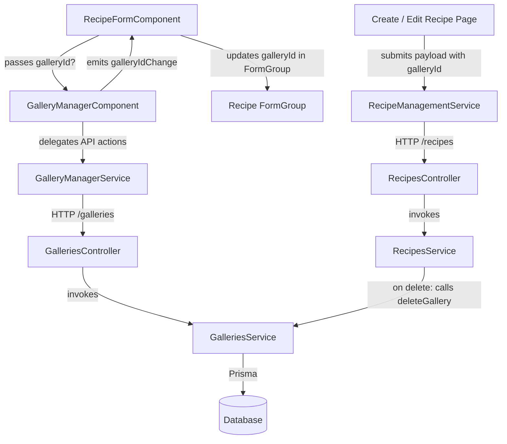

# Requirements

### Overview & Goals
The goal of this task is to enable image galleries for recipes by connecting the backend `Recipe` and `Gallery` entities and introducing front-end gallery management in the Angular `web` application. Users will be able to attach image galleries to recipes, upload images via drag-and-drop or file selection, reorder uploaded images via drag-and-drop, view full-size images in a new browser tab, and delete images, while maintaining clean separation of concerns and adhering to Material Design 3 guidelines.

### Scope
- **In Scope**:
  - Prisma schema update: Add optional `galleryId` foreign key and relation on `Recipe` model and reverse relation on `Gallery`.
  - API update: Support `galleryId` in `createRecipe` and `updateRecipe` (optional, null/missing indicates no gallery).
  - API update: Soft-delete linked gallery when `deleteRecipe` is executed.
  - API update: Support image sorting update in `GalleriesController.updateGallery()`.
  - Frontend feature: Create `GalleryManagerService` in `apps/web/src/galleries/` for full gallery CRUD and image upload/delete operations.
  - Frontend component: Create `GalleryManagerComponent` in `apps/web/src/galleries/` wrapped in `mat-card`, featuring drag-and-drop upload, auto-creation of galleries when none exists, sortable grid using Angular CDK Drag & Drop, delete action per image, and full-size image viewing in a new tab.
  - Recipe integration: Embed `GalleryManagerComponent` in `RecipeFormComponent` below the Recipe Info Card, bind `galleryId` state, and persist it on recipe creation and update.
  - Unit and integration tests for API services/controllers and Angular components/services.

- **Out of Scope**:
  - Image cropping or client-side manipulation (handled by backend Sharp service).
  - Non-recipe gallery usages.
  - Modifying recipe view glance/cooking pages (only recipe form editing/creation is in scope per spec).

### User Stories
- **As a cook/user**, I want to upload photos of my recipe directly within the recipe creation/editing form, so that my recipe has rich visual documentation.
- **As a cook/user**, I want to drag and drop multiple or single images to upload them quickly without navigating away from the recipe form.
- **As a cook/user**, I want to reorder gallery images by dragging them into position, so that the best photo appears first.
- **As a cook/user**, I want to click any thumbnail to inspect the full-resolution photo in a new tab.
- **As a cook/user**, I want to remove obsolete or incorrect images from the recipe gallery.
- **As a system**, when a recipe is deleted, its linked gallery and associated files should be soft-deleted to avoid orphaned gallery records.

### Functional Requirements
1. **Database & API**:
   - `Recipe` table links optionally to `Gallery` via `gallery_id` foreign key.
   - `POST /recipes` accepts optional `galleryId` (`string | null`).
   - `PUT /recipes/:id` accepts optional `galleryId` (`string | null`).
   - `DELETE /recipes/:id` invokes gallery soft-deletion if `recipe.galleryId` is present.
   - `PUT /galleries/:id` accepts optional image ordering payload to update image display order.
2. **GalleryManagerService**:
   - Provides methods: `createGallery(dto)`, `getGallery(id)`, `updateGallery(id, dto)`, `deleteGallery(id)`, `uploadImage(galleryId, file)`, and `deleteImages(galleryId, imageIds)`.
3. **GalleryManagerComponent**:
   - Accepts optional `galleryId` input (`string | undefined`).
   - Wraps content in `<mat-card>` styled with Material Design 3 tokens.
   - Provides a drag-and-drop upload zone that accepts image files (`dragover`, `dragleave`, `drop`) and file picker input.
   - If `galleryId` is not set when uploading an image, generates an auto-named gallery first (e.g. `Recipe Gallery <timestamp>`), emits the new `galleryId` via `galleryIdChange`, and then uploads the image.
   - Renders a sortable grid of images using `@angular/cdk/drag-drop` (`cdkDropList`, `cdkDrag`).
   - Each image tile has a delete icon button (`mat-icon-button`) that invokes image deletion.
   - Clicking an image tile opens its `fullSize.externalUrl` in a new browser window/tab (`target="_blank"`).
4. **Recipe Form Integration**:
   - Inserted in `RecipeFormComponent` directly below the Recipe Info `<mat-card>`.
   - Passes `galleryId` to `GalleryManagerComponent` (or `undefined` if new/empty).
   - Catches `galleryIdChange` events and patches the recipe reactive form's `galleryId` control.
   - Includes `galleryId` in create and update payloads sent to `RecipeManagementService`.

### Non-Functional Requirements
- **Material 3 Compliance**: Use Material 3 styling and components (`@angular/material` M3). Do not use deprecated M2 classes or redundant custom CSS.
- **Performance & Reactivity**: Use Angular standalone components, signal inputs/outputs where standard, `ChangeDetectionStrategy.OnPush`, and Angular CDK Drag-Drop.
- **Robustness**: Atomic error handling on file uploads and image reordering with user feedback (snackbars or inline notices).

# Technical Design

### Current Implementation
- **Backend**:
  - `apps/api/src/app/recipes/`: `RecipesController` and `RecipesService` handle recipe CRUD. `Recipe` model in `prisma/schema.prisma` currently has no `galleryId`.
  - `apps/api/src/app/galleries/`: `GalleriesController` and `GalleriesService` handle gallery CRUD, image uploads with Sharp thumbnail generation, and image deletions. `UpdateGalleryDto` currently only allows updating the `name`.
- **Frontend**:
  - `apps/web/src/recipes/components/recipe-form/`: Contains `RecipeFormComponent`, `createRecipeForm` factory, and reactive form controls for recipe fields and cooking stages.
  - `apps/web/src/recipes/pages/create-recipe/` and `edit-recipe/`: Instantiate `createRecipeForm`, manage submission, and map form values to `CreateRecipeDto` and `UpdateRecipeDto`.
  - `apps/web/src/galleries/`: Currently contains only `galleries.routes.ts`.

### Key Decisions
1. **Prisma Foreign Key Relation**:
   - Add optional `galleryId String? @map("gallery_id")` and `gallery Gallery? @relation(fields: [galleryId], references: [id])` to `Recipe`, with index `@@index([galleryId])`.
   - Add reverse `recipes Recipe[]` on `Gallery`.
   - *Rationale*: Maintains schema referential integrity while keeping galleries reusable or cleanly associated with recipes.
2. **Gallery Soft-Deletion on Recipe Deletion**:
   - In `RecipesService.deleteRecipe()`, if `recipe.galleryId` is present, call `this.galleriesService.deleteGallery(recipe.galleryId)`.
   - *Rationale*: Fulfills the requirement that deleting a recipe soft-deletes its linked gallery and purges staged/deployed files via existing `GalleriesService` cleanup logic.
3. **Image Reordering via `updateGallery`**:
   - Extend `UpdateGalleryDto` with optional `images?: UpdateGalleryImageOrderDto[]` where each element has `{ id: string; order: number }`.
   - `GalleriesService.updateGallery` performs a database transaction updating the `order` column of specified `gallery_images`.
   - *Rationale*: Reuses the standard `PUT /galleries/:id` endpoint as specified without introducing unnecessary single-purpose endpoints.
4. **Auto-creation of Gallery in Component**:
   - If a user drops/selects an image when `galleryId` is `undefined`, `GalleryManagerComponent` first calls `galleryManagerService.createGallery({ name: `Recipe Gallery ${Date.now()}` })`.
   - Upon success, the component emits the new gallery ID via `galleryIdChange`, updates its internal state, and proceeds to upload the image into the new gallery.
   - *Rationale*: Avoids creating empty gallery records when a user creates a recipe but never uploads photos; galleries are instantiated just-in-time upon first upload.
5. **Reordering UX with CDK Drag & Drop**:
   - Utilize Angular CDK `cdkDropList` with flex/grid orientation and `cdkDrag` items.
   - On drop, update the local image array using `moveItemInArray`, assign sequential indices, and call `galleryManagerService.updateGallery(galleryId, { images: ... })`.
   - *Rationale*: CDK Drag and Drop is already bundled in the repository and provides smooth cross-browser accessibility and visual feedback.

### Data Models / Contracts
```typescript
// Backend: apps/api/src/app/galleries/dto/update-gallery.dto.ts
export class UpdateGalleryImageOrderDto {
  @IsString()
  @IsNotEmpty()
  id!: string;

  @IsInt()
  order!: number;
}

export class UpdateGalleryDto {
  @IsString()
  @IsNotEmpty()
  @IsOptional()
  name?: string;

  @IsArray()
  @IsOptional()
  @ValidateNested({ each: true })
  @Type(() => UpdateGalleryImageOrderDto)
  images?: UpdateGalleryImageOrderDto[];
}

// Frontend: apps/web/src/galleries/models/gallery.types.ts
export interface ImageVariantDto {
  id: string;
  externalUrl: string;
}

export interface GalleryImageItem {
  id: string;
  order: number;
  createdAt: string;
  fullSize: ImageVariantDto;
  thumbnail: ImageVariantDto;
}

export interface GalleryDetails {
  id: string;
  name: string;
  createdAt: string;
  updatedAt: string;
  images: GalleryImageItem[];
}

export interface CreateGalleryDto {
  name: string;
}

export interface UpdateGalleryDto {
  name?: string;
  images?: Array<{ id: string; order: number }>;
}
```

### Components
- **`GalleryManagerService` (`apps/web/src/galleries/services/gallery-manager/gallery-manager.service.ts`)**:
  - Encapsulates HTTP calls to `/galleries` using Angular `HttpClient`.
- **`GalleryManagerComponent` (`apps/web/src/galleries/components/gallery-manager/gallery-manager.component.ts`)**:
  - Inputs: `galleryId = input<string | undefined>(undefined)`
  - Outputs: `galleryIdChange = output<string>()`
  - Internal state: `images = signal<GalleryImageItem[]>([])`, `isLoading = signal<boolean>(false)`, `isDragging = signal<boolean>(false)`.
- **`RecipeFormComponent` (`apps/web/src/recipes/components/recipe-form/recipe-form.component.ts`)**:
  - Renders `<app-gallery-manager>` directly below the Recipe Info Card.
  - Updates `galleryId` form control on `galleryIdChange`.

### File Structure
- **Modified files**:
  - `prisma/schema.prisma`
  - `apps/api/src/app/recipes/dto/create-recipe.dto.ts`
  - `apps/api/src/app/recipes/dto/update-recipe.dto.ts`
  - `apps/api/src/app/recipes/recipes.service.ts`
  - `apps/api/src/app/recipes/recipes.module.ts` (imports `GalleriesModule`)
  - `apps/api/src/app/galleries/dto/update-gallery.dto.ts`
  - `apps/api/src/app/galleries/galleries.service.ts`
  - `apps/web/src/recipes/models/create-recipe.types.ts`
  - `apps/web/src/recipes/models/update-recipe.types.ts`
  - `apps/web/src/recipes/models/recipe-details.types.ts`
  - `apps/web/src/recipes/components/recipe-form/recipe-form.component.ts`
  - `apps/web/src/recipes/components/recipe-form/recipe-form.component.html`
  - `apps/web/src/recipes/pages/create-recipe/create-recipe.page.ts`
  - `apps/web/src/recipes/pages/edit-recipe/edit-recipe.page.ts`
  - `apps/web/public/assets/i18n/en.json` & `ru.json`
- **New files**:
  - `apps/web/src/galleries/models/gallery.types.ts`
  - `apps/web/src/galleries/services/gallery-manager/gallery-manager.service.ts`
  - `apps/web/src/galleries/services/gallery-manager/gallery-manager.service.spec.ts`
  - `apps/web/src/galleries/components/gallery-manager/gallery-manager.component.ts`
  - `apps/web/src/galleries/components/gallery-manager/gallery-manager.component.html`
  - `apps/web/src/galleries/components/gallery-manager/gallery-manager.component.scss`
  - `apps/web/src/galleries/components/gallery-manager/gallery-manager.component.spec.ts`

### Architecture Diagram


# Testing

### Validation Approach
Automated testing will validate both the backend API and frontend Angular layers using Jest and Angular testing utilities:
1. **Backend Integration / Unit Testing**:
   - `RecipesService`: Verify `createRecipe` and `updateRecipe` properly persist and clear `galleryId`.
   - `RecipesService`: Verify `deleteRecipe` invokes `GalleriesService.deleteGallery` when a recipe has a linked gallery, and doesn't fail when no gallery is linked.
   - `GalleriesService` & `GalleriesController`: Verify `updateGallery` handles image sorting updates.
2. **Frontend Service Testing**:
   - `GalleryManagerService`: Verify correct HTTP methods, URL formats, FormData multipart structure for uploads, and response handling using `HttpTestingController`.
3. **Frontend Component Testing**:
   - `GalleryManagerComponent`: Verify drag-and-drop state, just-in-time gallery creation on first upload, image list rendering, thumbnail click opening `window.open`, delete button action, and CDK drag drop reordering.
   - `RecipeFormComponent`: Verify integration with `GalleryManagerComponent`, input binding, and output propagation to form control.
   - `CreateRecipePage` & `EditRecipePage`: Verify `galleryId` is passed in request payloads.

### Key Scenarios
- **Scenario 1: Uploading image to a new recipe**: User creates recipe without gallery -> drags image to upload zone -> service creates new gallery with auto-generated name -> `galleryIdChange` emits new gallery ID -> image is uploaded and rendered in grid -> recipe form stores gallery ID -> submitting recipe includes gallery ID.
- **Scenario 2: Uploading image to existing recipe with gallery**: User opens recipe edit page with existing gallery -> component loads existing gallery and images -> user drops additional image -> uploaded directly to existing gallery -> grid updates.
- **Scenario 3: Sorting images**: User drags image #2 to position #0 -> grid updates -> `updateGallery` is called with updated order -> order is persisted in database.
- **Scenario 4: Deleting an image**: User clicks delete button on an image tile -> `deleteImages` is called with image ID -> image removed from grid.
- **Scenario 5: Viewing full-size image**: User clicks on an image -> `window.open` is called with the image's full-size URL in a new tab.
- **Scenario 6: Soft-deleting recipe**: Recipe with gallery is deleted -> linked gallery and its files are soft-deleted.

### Edge Cases
- Recipe created or updated with `galleryId: null` or omitted -> recipe has no gallery.
- Deleting a recipe that has no gallery attached -> succeeds without calling `deleteGallery`.
- Dragging non-image files into dropzone -> validation prevents upload and shows an error message.
- Reordering images fails on API -> component displays error and reverts or reloads gallery.
- Upload failure -> user notified via snackbar without corrupting component state.

### Test Changes
- `apps/api/src/app/recipes/recipes.service.spec.ts`: Add test cases for `galleryId` creation, update, and soft deletion cascade.
- `apps/api/src/app/galleries/galleries.service.spec.ts`: Add test cases for image reordering in `updateGallery`.
- `apps/web/src/galleries/services/gallery-manager/gallery-manager.service.spec.ts`: New test suite.
- `apps/web/src/galleries/components/gallery-manager/gallery-manager.component.spec.ts`: New test suite.
- `apps/web/src/recipes/components/recipe-form/recipe-form.component.spec.ts`: Update tests to cover gallery manager child component and form control binding.
- `apps/web/src/recipes/pages/create-recipe/create-recipe.page.spec.ts` & `edit-recipe.page.spec.ts`: Verify `galleryId` payload serialization.

# Delivery Steps

### ✓ Step 1: API & Database: Link Recipe to Gallery and Enable Image Sorting
The database schema links recipes to galleries, and the API supports gallery assignment on recipes, automatic gallery soft-deletion on recipe deletion, and image reordering in galleries.

- Update `prisma/schema.prisma` to add optional `galleryId` foreign key and relation to `Recipe`, relation back from `Gallery`, and migration index.
- Create and execute a Prisma migration or schema push to update the database schema and regenerate `@prisma/client`.
- Update `CreateRecipeDto` and `UpdateRecipeDto` in `apps/api/src/app/recipes/dto/` to accept optional `galleryId: string | null`.
- Update `UpdateGalleryDto` in `apps/api/src/app/galleries/dto/` to accept optional image order definitions (e.g. `images?: { id: string; order: number }[]`).
- Update `GalleriesService.updateGallery()` and `GalleriesController.updateGallery()` to handle image ordering transactions in the database.
- Update `RecipesService.createRecipe()` and `updateRecipe()` to persist `galleryId` (or clear it when set to `null` or missing).
- Update `RecipesService.deleteRecipe()` to invoke `GalleriesService.deleteGallery()` if a linked gallery is present.
- Add and update unit/e2e tests in `recipes.service.spec.ts`, `recipes.controller.spec.ts`, `galleries.service.spec.ts`, and `galleries.controller.spec.ts`.

### ✓ Step 2: Web Service: Implement GalleryManagerService and Models
The `web` application contains models and an Angular service to communicate with all gallery endpoints in the API.

- Define TypeScript interfaces in `apps/web/src/galleries/models/gallery.types.ts` for gallery summaries, gallery details, image items, and request payloads (create, update, image ordering, image deletion).
- Implement `GalleryManagerService` in `apps/web/src/galleries/services/gallery-manager/gallery-manager.service.ts` using Angular `HttpClient`.
- Add service methods: `getGallery(id)`, `createGallery(dto)`, `updateGallery(id, dto)`, `deleteGallery(id)`, `uploadImage(galleryId, file)`, and `deleteImages(galleryId, imageIds)`.
- Write unit tests for `GalleryManagerService` in `gallery-manager.service.spec.ts` testing HTTP interactions, error handling, and payload transformations.

### ✓ Step 3: Web UI: Implement GalleryManagerComponent with Upload and Sortable Grid
`GalleryManagerComponent` provides a Material Design 3 card with drag-and-drop image uploading, sortable preview grid, full-size preview in a new tab, and single-click deletion.

- Implement `GalleryManagerComponent` in `apps/web/src/galleries/components/gallery-manager/gallery-manager.component.ts` (standalone component with `OnPush` change detection).
- Accept optional input `galleryId = input<string | undefined>()` and declare output `galleryIdChange = output<string>()`.
- Wrap the component template in `<mat-card>` following Material 3 design tokens and styles without custom overrides.
- Implement a dropzone area supporting both native drag-and-drop file drops and file picker click/keyboard triggers for uploading image files.
- On file upload, if `galleryId` is not provided, first call `GalleryManagerService.createGallery` with an auto-generated name, emit the new ID via `galleryIdChange`, and upload the file to the newly created gallery.
- Implement sortable grid of uploaded images using Angular CDK Drag and Drop (`cdkDropList`, `cdkDrag`); on reorder, persist order via `GalleryManagerService.updateGallery`.
- Display delete icon button on each image card to remove images via `GalleryManagerService.deleteImages`.
- On clicking an image thumbnail/card, open the full-size image URL in a new browser tab (`window.open(url, '_blank')`).
- Add transloco translation keys for gallery management in `apps/web/public/assets/i18n/en.json` and `ru.json`.
- Add unit tests for `GalleryManagerComponent` in `gallery-manager.component.spec.ts`.

### ✓ Step 4: Recipe Integration: Integrate GalleryManagerComponent into Recipe Form
The recipe creation and editing workflows incorporate gallery management, allowing users to upload and manage recipe photos directly on the form.

- Update `RecipeDetails`, `CreateRecipeDto`, and `UpdateRecipeDto` in `apps/web/src/recipes/models/` to include optional `galleryId?: string | null`.
- Update `createRecipeForm` in `recipe-form.component.ts` to include the `galleryId` form control initialized from `recipe?.galleryId ?? null`.
- Place `<app-gallery-manager>` in `apps/web/src/recipes/components/recipe-form/recipe-form.component.html` right below the `Recipe Info Card` (`<mat-card>`).
- Bind `[galleryId]="formGroup.controls['galleryId']?.value || undefined"` and listen to `(galleryIdChange)="onGalleryIdChange($event)"` to update the form control.
- Ensure `CreateRecipePage.onSubmit` and `EditRecipePage.onSubmit` pass `galleryId` in their respective API payloads.
- Update unit tests in `recipe-form.component.spec.ts`, `create-recipe.page.spec.ts`, and `edit-recipe.page.spec.ts` to verify gallery binding and payload submission.