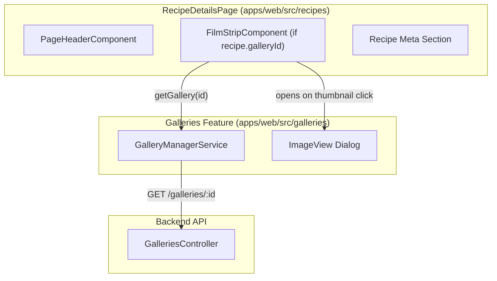

# Requirements

### Overview & Goals
The objective of this task is to display recipe image galleries in the `RecipeDetailsPage` as specified in `.junie/v0.0.7/specs/image-gallery-management-step-3.md`.
The implementation consists of:
1. Creating a full-screen `ImageView` dialog in the `galleries` feature of the `web` project to inspect full-resolution images with `object-fit: contain`.
2. Creating a `FilmStripComponent` in the `galleries` feature that accepts a required gallery ID, fetches gallery images using `GalleryManagerService`, renders thumbnails in a scrollable horizontal strip, and opens the `ImageView` dialog when a thumbnail is clicked.
3. Integrating `FilmStripComponent` into `RecipeDetailsPage` placed between the Page Header and the Recipe Meta section when the recipe has a linked gallery.

### Scope
- **In Scope**:
  - `ImageView` dialog component and data interface in `apps/web/src/galleries/dialogs/image-view/`.
  - `FilmStripComponent` in `apps/web/src/galleries/components/film-strip/`.
  - Integration of `FilmStripComponent` into `apps/web/src/recipes/pages/recipe-details/recipe-details.page.ts` & `.html`.
  - Adherence to Material Design 3 guidelines and project TypeScript conventions (e.g. `readonly` arrow function methods).
  - Comprehensive unit test coverage for `ImageView`, `FilmStripComponent`, and `RecipeDetailsPage` integration.
- **Out of Scope**:
  - Backend API changes (the gallery CRUD and image retrieval APIs are already implemented).
  - Modifying recipe edit / create forms (gallery upload/reorder was handled in Step 2).
  - Image manipulation or client-side image editing.

### User Stories
- **As a cook/user viewing a recipe**, I want to see a horizontal filmstrip of uploaded recipe photos right below the recipe title, so that I can visually inspect the dish.
- **As a cook/user**, I want to click any thumbnail in the filmstrip to open a full-screen view of the photo, so that I can see the high-resolution details without leaving the recipe.
- **As a user**, I want to easily close the full-screen photo view via a close button, Escape key, or backdrop click and return directly to the recipe details.

### Functional Requirements
1. **`ImageView` Dialog**:
   - Component name: `ImageView` (with alias `ImageViewDialog`).
   - Location: `apps/web/src/galleries/dialogs/image-view/`.
   - Accepts image URL via `MAT_DIALOG_DATA` (`ImageViewDialogData`).
   - Displays the image inside a container configured with `object-fit: contain`.
   - Fills the entire screen (`100vw` width and `100vh` height).
   - Provides a close button (`matIconButton` with `close` icon) to dismiss the dialog.
2. **`FilmStripComponent`**:
   - Selector: `app-film-strip`.
   - Location: `apps/web/src/galleries/components/film-strip/`.
   - Accepts required input for gallery ID: `galleryId = input.required<string>()`.
   - Uses `GalleryManagerService.getGallery(id)` to load gallery details and image items.
   - Sorts images by `order` ascending.
   - Renders thumbnails (`image.thumbnail.externalUrl`) in a scrollable horizontal layout.
   - When the user clicks a thumbnail, opens `ImageView` dialog passing the full-size image URL (`image.fullSize.externalUrl`).
   - Gracefully handles empty galleries and loading states.
3. **`RecipeDetailsPage` Integration**:
   - Location: `apps/web/src/recipes/pages/recipe-details/`.
   - Renders `<app-film-strip [galleryId]="currentRecipe.galleryId" />` between `<ui-page-header>` and `<div class="meta">`.
   - Conditionally displayed only when `currentRecipe.galleryId` is present.

### Non-Functional Requirements
- **Material Design 3**: Uses Material 3 components and design tokens without obsolete M2 styles or unnecessary custom CSS overrides.
- **Accessibility**: Includes accessible ARIA labels on thumbnail buttons and the dialog close button.
- **Code Standards**: Follows TypeScript conventions: standalone components, `ChangeDetectionStrategy.OnPush`, no `any`, `readonly` arrow function methods, and `readonly` properties.

# Technical Design

### Current Implementation
- `apps/web/src/galleries/services/gallery-manager/gallery-manager.service.ts`: Exposes `getGallery(id: string): Observable<GalleryDetails>` returning gallery metadata and `GalleryImageItem[]`.
- `apps/web/src/galleries/models/gallery.types.ts`: Defines `GalleryImageItem`, `ImageVariantDto` (with `externalUrl`), `GalleryDetails`, etc.
- `apps/web/src/recipes/pages/recipe-details/recipe-details.page.html`: Contains `<ui-page-header>` followed immediately by `<div class="meta">`.
- `apps/web/src/recipes/models/recipe-details.types.ts`: `RecipeDetails` interface already has optional `galleryId?: string | null;`.

### Key Decisions
1. **Dialog Dimensions & Styling**:
   - Use `MatDialog.open(ImageView, { maxWidth: '100vw', maxHeight: '100vh', width: '100vw', height: '100vh', panelClass: 'image-view-dialog-panel' })`.
   - In `ImageView`, render a full-viewport container with dark backdrop (`rgba(0, 0, 0, 0.9)`), an `` with `object-fit: contain`, and an overlaid close icon button.
   - *Rationale*: Fulfills the requirement that the dialog fills the entire screen and renders the image with `object-fit: contain`.
2. **Horizontal Filmstrip Layout**:
   - In `FilmStripComponent`, use a flex row with `overflow-x: auto`, `scroll-behavior: smooth`, and touch scrolling support.
   - Render each thumbnail inside a semantic `<button type="button">` with fixed/aspect ratio dimensions, rounded corners, and focus styles for accessibility.
   - *Rationale*: Clean, responsive, keyboard-navigable horizontal strip following Material 3 guidelines.
3. **Reactive Data Fetching**:
   - Use Angular `effect` reacting to `galleryId()` signal to trigger `loadGallery(id)` via `GalleryManagerService`.
   - Maintain sorted images in a `readonly images = signal<GalleryImageItem[]>([])`.
   - *Rationale*: Idiomatic Angular 19+ signal-based reactivity matching existing patterns in `GalleryManagerComponent`.

### Architecture Diagram


### Data Models & Contracts
```typescript
// Dialog data contract
export interface ImageViewDialogData {
  imageUrl: string;
}
export type ImageViewData = ImageViewDialogData;

// Component definitions
export class ImageView {
  readonly data: ImageViewDialogData = inject(MAT_DIALOG_DATA);
  readonly dialogRef = inject(MatDialogRef<ImageView>);
}

export class FilmStripComponent {
  readonly galleryId = input.required<string>();
  readonly images = signal<GalleryImageItem[]>([]);
  readonly isLoading = signal<boolean>(false);
  readonly onOpenImage = (image: GalleryImageItem): void => { ... };
}
```

### File Structure Changes
- **New Files**:
  - `apps/web/src/galleries/dialogs/image-view/image-view.dialog.ts`
  - `apps/web/src/galleries/dialogs/image-view/image-view.dialog.html`
  - `apps/web/src/galleries/dialogs/image-view/image-view.dialog.scss`
  - `apps/web/src/galleries/dialogs/image-view/image-view.dialog.spec.ts`
  - `apps/web/src/galleries/components/film-strip/film-strip.component.ts`
  - `apps/web/src/galleries/components/film-strip/film-strip.component.html`
  - `apps/web/src/galleries/components/film-strip/film-strip.component.scss`
  - `apps/web/src/galleries/components/film-strip/film-strip.component.spec.ts`
- **Modified Files**:
  - `apps/web/src/recipes/pages/recipe-details/recipe-details.page.ts` (import and register `FilmStripComponent`)
  - `apps/web/src/recipes/pages/recipe-details/recipe-details.page.html` (render `<app-film-strip>` between header and meta)
  - `apps/web/src/recipes/pages/recipe-details/recipe-details.page.spec.ts` (test gallery film strip integration)

# Testing

### Validation Approach
Automated testing via Jest using the existing Nx test runner (`npx nx test web`). All newly created components and modified pages will have dedicated unit tests verifying DOM rendering, input handling, service integration, and dialog interactions.

### Key Scenarios
1. **`ImageView` Dialog**:
   - Renders the image with `src` bound to `data.imageUrl`.
   - Applies `object-fit: contain` styling to the image.
   - Clicking the close button invokes `dialogRef.close()`.
2. **`FilmStripComponent`**:
   - Calls `GalleryManagerService.getGallery(id)` with the required `galleryId` input value.
   - Populates `images` signal and renders thumbnails sorted by `order`.
   - Clicking a thumbnail opens `MatDialog` with `ImageView` component and passes the full-size image URL in dialog data.
   - Handles empty images list gracefully without errors.
3. **`RecipeDetailsPage` Integration**:
   - When recipe has `galleryId: 'gallery-123'`, `<app-film-strip>` is rendered and passed `galleryId="gallery-123"`.
   - When recipe has `galleryId: null` or `undefined`, `<app-film-strip>` is not present in the DOM.
   - `<app-film-strip>` is located in DOM between `ui-page-header` and `.meta`.

### Edge Cases
- Missing full-size URL: Falls back to `thumbnail.externalUrl` if `fullSize.externalUrl` is missing.
- Gallery API error: Component handles HTTP errors without crashing or breaking the rest of `RecipeDetailsPage`.
- Fast galleryId changes: `effect` cancels or ignores stale gallery requests.

# Delivery Steps

### ✓ Step 1: Implement ImageView full-screen dialog in galleries feature
The full-screen `ImageView` dialog is available in the galleries feature to display an image with `object-fit: contain` and close controls.

- Create `apps/web/src/galleries/dialogs/image-view/image-view.dialog.ts` declaring `ImageView` (and alias `ImageViewDialog`) standalone component with `ChangeDetectionStrategy.OnPush`.
- Define `ImageViewDialogData` (and alias `ImageViewData`) interface with `imageUrl: string`.
- Inject `MAT_DIALOG_DATA` and `MatDialogRef<ImageView>` as `readonly` properties.
- In `image-view.dialog.html`, render a container with an `` tag binding `[src]="data.imageUrl"` and an accessible close button (`matIconButton` with `mat-icon` and `mat-dialog-close`).
- In `image-view.dialog.scss`, style the dialog to fill the entire viewport (`width: 100vw; height: 100vh; max-width: 100vw; max-height: 100vh;`) with backdrop styling and `object-fit: contain` on the image element.
- Implement comprehensive unit tests in `apps/web/src/galleries/dialogs/image-view/image-view.dialog.spec.ts` testing image rendering, close button interaction, and dialog data injection.

### ✓ Step 2: Implement FilmStripComponent in galleries feature
The `FilmStripComponent` retrieves gallery images by ID and renders a horizontal scrollable strip of thumbnails that open the full-screen `ImageView` dialog on click.

- Create `apps/web/src/galleries/components/film-strip/film-strip.component.ts` as a standalone Angular component with `ChangeDetectionStrategy.OnPush`.
- Declare required signal input `readonly galleryId = input.required<string>()`.
- Declare reactive signal state `readonly images = signal<GalleryImageItem[]>([])` and `readonly isLoading = signal<boolean>(false)`.
- Inject `GalleryManagerService` and `MatDialog`.
- Implement `loadGallery(id: string)` to fetch gallery data via `galleryService.getGallery(id)`, sorting images by `order` ascending. Use an `effect` reacting to `galleryId()` changes.
- Implement `readonly onOpenImage = (image: GalleryImageItem): void` opening `ImageView` with full-screen dimensions (`maxWidth: '100vw'`, `maxHeight: '100vh'`, `width: '100vw'`, `height: '100vh'`) passing `image.fullSize.externalUrl || image.thumbnail.externalUrl`.
- In `film-strip.component.html`, render a scrollable horizontal container displaying image thumbnails as keyboard-accessible items with proper alt text and click handlers when images exist.
- In `film-strip.component.scss`, style the film strip with `display: flex`, `flex-direction: row`, `overflow-x: auto`, and Material Design 3 tokens.
- Implement comprehensive unit tests in `apps/web/src/galleries/components/film-strip/film-strip.component.spec.ts` covering loading state, thumbnail rendering, image sorting, and opening `ImageView` on click.

### ✓ Step 3: Integrate FilmStripComponent into RecipeDetailsPage
`RecipeDetailsPage` displays the film strip of recipe images between the page header and the metadata section when a gallery is linked.

- In `apps/web/src/recipes/pages/recipe-details/recipe-details.page.ts`, import `FilmStripComponent` and include it in the component's `imports` array.
- In `apps/web/src/recipes/pages/recipe-details/recipe-details.page.html`, insert `@if (currentRecipe.galleryId) { <app-film-strip [galleryId]="currentRecipe.galleryId" /> }` directly between `<ui-page-header>` and `<div class="meta">`.
- Update `apps/web/src/recipes/pages/recipe-details/recipe-details.page.spec.ts` to add test cases verifying:
  - `<app-film-strip>` is rendered when `recipe.galleryId` is present.
  - The correct `galleryId` is passed to `FilmStripComponent`.
  - `<app-film-strip>` is not rendered when `recipe.galleryId` is `null` or `undefined`.
- Run the full test suite for `web` project (`npx nx test web`) to verify all existing and new tests pass.