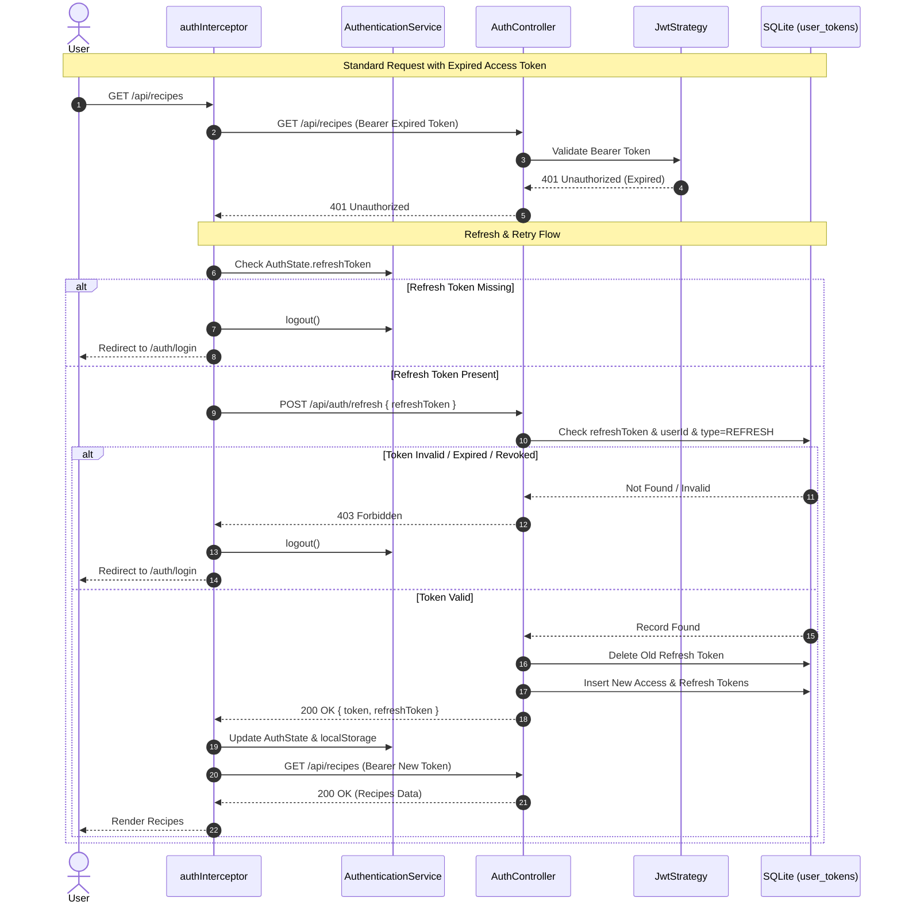

# Requirements

### Overview & Goals
The goal of this task is to implement a secure, sliding session token refresh mechanism for Top Nosh as specified in `.junie/v0.0.7/specs/token-refresh.md`. Currently, access tokens expire after 24 hours, requiring users to repeatedly re-enter their credentials. This feature introduces a dual-token authentication model:
1. Short-lived authentication tokens for API access.
2. Long-lived refresh tokens (30 days fixed expiration) persisted in the database, allowing seamless background token renewal without user interruption.
3. Automated client-side error recovery in the Angular HTTP interceptor that catches 401 Unauthorized responses, refreshes tokens via a shared queue, and transparently replays failed requests.

### Scope

#### In Scope
- **Database Schema**: Update `user_tokens` table and `UserToken` model in `prisma/schema.prisma` to add a `type` column (`TokenType` enum with values `AUTHENTICATION` and `REFRESH`), setting existing records to `AUTHENTICATION` by default.
- **Prisma Migration**: Generate and apply migration for SQLite database, regenerating Prisma Client artifacts.
- **Login Flow Update**: Update `AuthController.login` and `AuthService.login` to generate and persist both an access token and a 30-day refresh token, returning both to the client.
- **Logout Flow Update**: Update `AuthController.logout` and `AuthService.logout` to accept and remove the session's refresh token alongside the access token.
- **JwtStrategy Verification**: Ensure `JwtStrategy` validates that bearer tokens in requests have `type: TokenType.AUTHENTICATION` so refresh tokens cannot be used to access protected API endpoints.
- **Token Refresh Endpoint**: Add `POST /api/auth/refresh` in `AuthController` that validates the provided refresh token against JWT verification and database presence, invalidates the old refresh token, generates a new token pair, and returns it.
- **Frontend Storage**: Update `AuthenticationService` and `AuthState` to store `refreshToken` in `localStorage` under `auth_state`.
- **Frontend 401 Interceptor Queue**: Update `authInterceptor` to catch 401 responses, call `AuthController.refresh`, serialize concurrent 401 requests using a shared refresh queue, update storage, and replay the original requests with the new access token.
- **Automated Tests**: Unit and integration tests for backend controllers, services, strategies, frontend services, and interceptor flows.

#### Out of Scope
- Modifying UI components (e.g. login form layout or dashboard views).
- Cross-tab BroadcastChannel communication (handled via standard `localStorage` serialization).
- User password reset workflows.

### User Stories
- **As an authenticated user**, I want my session to remain active while I actively use the application so that I do not get abruptly logged out when my access token expires.
- **As an authenticated user**, I want my concurrent sessions on other devices or tabs to remain valid when I log out from one session.
- **As a user with an invalid or expired refresh token**, I want the application to automatically log me out and redirect me to the login page so that my session state is clean.
- **As a system administrator**, I want all issued refresh tokens to be revokable in the database and automatically rotated upon each refresh to mitigate token theft.

### Functional Requirements

- **Token Classification in Database**:
  - `UserToken` model in `prisma/schema.prisma` includes a `type` field (`TokenType.AUTHENTICATION` or `TokenType.REFRESH`).
  - Migration sets default value of `AUTHENTICATION` for all existing records.
- **Login Endpoint (`POST /api/auth/login`)**:
  - Signs an authentication token (default 24h expiration) and a refresh token (30 days fixed expiration).
  - Persists both tokens in `user_tokens` with their corresponding `TokenType`.
  - Returns `LoginResponse` containing `{ token: string, refreshToken: string, forcePasswordChange: boolean }`.
- **Token Refresh Endpoint (`POST /api/auth/refresh`)**:
  - Public endpoint (not guarded by `JwtAuthGuard`).
  - Accepts request body `{ refreshToken: string }`.
  - Validates cryptographic signature and 30-day expiration of the refresh token.
  - Queries `user_tokens` to ensure the token exists, belongs to the decoded user ID, and has type `TokenType.REFRESH`.
  - If the token is invalid, expired, or missing from the database, responds with HTTP status `403 Forbidden` ("Unauthorized").
  - If valid, invalidates the old refresh token, generates a new pair of authentication and refresh tokens, persists them to the database, and returns `{ token: string, refreshToken: string }`.
- **Logout Endpoint (`POST /api/auth/logout`)**:
  - Guarded by `JwtAuthGuard`.
  - Accepts optional request body `{ refreshToken?: string }`.
  - Deletes the current authentication token (`req.user.token`) and the supplied `refreshToken` from `user_tokens`.
- **Frontend Authentication Service**:
  - `AuthState` interface updated to include `refreshToken: string | null`.
  - Persists and restores `refreshToken` from `localStorage` under `auth_state`.
  - Exposes `refreshToken()` method that sends a request to `/auth/refresh` with `HTTP_AUTH_ENABLED = false` and updates local state.
- **Frontend Auth Interceptor**:
  - Listens for `HttpErrorResponse` with status `401`.
  - If `refreshToken` is absent, triggers `authenticationService.logout()` and navigates to `/auth/login`.
  - If `refreshToken` is present, initiates token refresh.
  - Uses a shared observable/subject to serialize multiple concurrent 401 errors so only a single `/auth/refresh` request is in flight.
  - On refresh success: updates tokens and retries the original failed request with the new access token.
  - On refresh failure (any error including 403): logs out and navigates to `/auth/login`.

### Non-Functional Requirements
- **Security**:
  - Enforce rotation: refresh tokens are single-use; refreshing invalidates the prior refresh token.
  - `JwtStrategy` explicitly rejects tokens with type `REFRESH` when authorizing standard API endpoints.
  - HTTP 403 status code returned when refresh token is invalid or expired.
- **Performance & Concurrency**:
  - Shared in-flight refresh queue in `authInterceptor` prevents request stampedes when multiple API requests encounter 401 simultaneously.
  - SQLite indexed queries on `userId` and unique `token` maintain low latency.
- **Compatibility**:
  - Seamless migration of existing databases with no downtime or schema breakage.

# Technical Design

### Current Implementation
- `prisma/schema.prisma`:
  - `UserToken` contains `id`, `userId`, `token`, and `createdAt`. No token type distinction exists.
- `apps/api/src/app/auth/auth.service.ts`:
  - `login()` signs a single JWT token and persists it to `prisma.userToken` without a type.
  - `logout()` deletes the record matching `userId` and `token`.
- `apps/api/src/app/auth/strategies/jwt.strategy.ts`:
  - Checks if the incoming bearer token exists in `prisma.userToken`, but does not verify token type.
- `apps/web/src/auth/services/authentication/authentication.service.ts`:
  - Manages `AuthState` (`isAuthenticated`, `token`, `userId`) in `localStorage` under key `auth_state`.
- `apps/web/src/auth/interceptors/auth/auth.interceptor.ts`:
  - On 401 error, directly triggers `authenticationService.logout()` and navigates to `/auth/login`.

### Key Decisions
- **Token Type Enum in Prisma**:
  - Introduce `enum TokenType { AUTHENTICATION, REFRESH }` in Prisma.
  - In SQLite, Prisma maps enums to text columns with check constraints. Setting `@default(AUTHENTICATION)` ensures all existing tokens are migrated cleanly without NULL errors.
- **Refresh Token Validity & Signing**:
  - Refresh tokens are signed JWTs containing `{ sub: user.id, email: user.email }` with option `{ expiresIn: '30d' }`.
  - Signed using the existing NestJS `JwtService` and secret key, avoiding redundant cryptographic configuration while allowing stateless signature and expiration verification before database queries.
- **Refresh Endpoint Public Route**:
  - `POST /api/auth/refresh` is not decorated with `JwtAuthGuard` because requests arrive when the access token has already expired.
  - User identity is extracted from the refresh token itself upon successful cryptographic verification, then validated against `user_tokens`.
- **403 Response on Invalid Refresh**:
  - As required by the specification, an invalid, expired, revoked, or mismatched refresh token causes `AuthService.refresh()` to throw `new HttpException('Unauthorized', HttpStatus.FORBIDDEN)`.
- **Session-Scoped Logout**:
  - `LogoutDto` accepts an optional `refreshToken?: string`. If provided, `AuthService.logout` deletes both `req.user.token` and `logoutDto.refreshToken`, preserving other concurrent sessions on other devices.
- **Shared Refresh Queue in `authInterceptor`**:
  - To prevent multiple parallel 401 requests from firing redundant refresh calls and invalidating the token mid-flight, `authInterceptor` maintains an in-flight refresh observable (`isRefreshing` flag with `BehaviorSubject<string | null>`). Subsequent 401s wait for the new token and retry.

### Proposed Changes

#### 1. Prisma Schema & Migration (`prisma/schema.prisma`)
```prisma
enum TokenType {
  AUTHENTICATION
  REFRESH
}

model UserToken {
  id        String    @id @default(uuid())
  userId    String    @map("user_id")
  token     String    @unique
  type      TokenType @default(AUTHENTICATION)
  user      User      @relation(fields: [userId], references: [id], onDelete: Cascade)
  createdAt DateTime  @default(now()) @map("created_at")

  @@index([userId])
  @@map("user_tokens")
}
```

#### 2. DTOs
- `apps/api/src/app/auth/dto/login.dto.ts`:
```ts
export interface LoginResponse {
  token: string;
  refreshToken: string;
  forcePasswordChange: boolean;
}
```
- `apps/api/src/app/auth/dto/logout.dto.ts`:
```ts
import { IsOptional, IsString } from 'class-validator';

export class LogoutDto {
  @IsString()
  @IsOptional()
  refreshToken?: string;
}

export interface LogoutResponse {
  message: string;
}
```
- `apps/api/src/app/auth/dto/refresh-token.dto.ts`:
```ts
import { IsNotEmpty, IsString } from 'class-validator';

export class RefreshTokenDto {
  @IsString()
  @IsNotEmpty()
  refreshToken!: string;
}

export interface RefreshTokenResponse {
  token: string;
  refreshToken: string;
}
```

#### 3. Backend Implementation
- **`AuthService.login()`**:
  - Signs access token (`expiresIn: default / 24h`).
  - Signs refresh token (`expiresIn: '30d'`).
  - Persists both tokens in `prisma.userToken` with `type: TokenType.AUTHENTICATION` and `type: TokenType.REFRESH`.
- **`AuthService.refresh(refreshToken: string)`**:
  - Verifies token with `this.jwtService.verifyAsync<JwtPayload>(refreshToken)`. On error, throws 403 Forbidden.
  - Finds record in `prisma.userToken` matching `{ token: refreshToken, userId: payload.sub, type: TokenType.REFRESH }`. If null, throws 403 Forbidden.
  - Generates new access token and new 30-day refresh token.
  - In a transaction: deletes old refresh token and saves new pair.
  - Returns `{ token, refreshToken }`.
- **`AuthService.logout(userId: string, token: string, refreshToken?: string)`**:
  - Deletes tokens matching `userId` and `token in [token, ...(refreshToken ? [refreshToken] : [])]`.
- **`JwtStrategy.validate()`**:
  - Queries `prisma.userToken.findFirst({ where: { token, userId: payload.sub, type: TokenType.AUTHENTICATION } })`.
- **`AuthController`**:
  - Updates `login` return type.
  - Updates `logout` to accept `@Body() logoutDto?: LogoutDto`.
  - Adds `@Post('refresh')` endpoint delegating to `authService.refresh(dto.refreshToken)`.

#### 4. Frontend Implementation
- **`AuthenticationService`**:
  - Adds `refreshToken: string | null` to `AuthState`.
  - Serializes `refreshToken` to `localStorage`.
  - Adds `refreshToken(): Observable<{ token: string; refreshToken: string }>` calling `POST /auth/refresh` with `HTTP_AUTH_ENABLED = false`.
- **`authInterceptor`**:
  - Manages refresh state and a queue for concurrent 401s.
  - When 401 occurs and refresh token is present, triggers `refreshToken()` or subscribes to existing refresh stream.
  - Clones request with new token header and replays.
  - On failure, calls `logout()` and navigates to `/auth/login`.

### Architecture Diagram


### File Structure
- `prisma/schema.prisma` (modified: add `TokenType` enum and `type` column to `UserToken`)
- `prisma/migrations/<timestamp>_add_token_type_to_user_tokens/migration.sql` (added)
- `apps/api/src/app/auth/dto/login.dto.ts` (modified: add `refreshToken` to `LoginResponse`)
- `apps/api/src/app/auth/dto/logout.dto.ts` (modified: add `LogoutDto` with `refreshToken`)
- `apps/api/src/app/auth/dto/refresh-token.dto.ts` (added: `RefreshTokenDto` and `RefreshTokenResponse`)
- `apps/api/src/app/auth/auth.controller.ts` (modified: update `logout`, add `POST refresh`)
- `apps/api/src/app/auth/auth.controller.spec.ts` (modified: add tests for `refresh` and updated `logout`)
- `apps/api/src/app/auth/auth.service.ts` (modified: dual token generation in `login`, session cleanup in `logout`, add `refresh`)
- `apps/api/src/app/auth/auth.service.spec.ts` (modified: tests for dual token persistence, refresh rotation, 403 error)
- `apps/api/src/app/auth/strategies/jwt.strategy.ts` (modified: filter by `type: TokenType.AUTHENTICATION`)
- `apps/api/src/app/auth/strategies/jwt.strategy.spec.ts` (modified: verify authentication token type requirement)
- `apps/web/src/auth/services/authentication/authentication.service.ts` (modified: manage `refreshToken` in state, add `refreshToken()`)
- `apps/web/src/auth/services/authentication/authentication.service.spec.ts` (modified: test refresh token storage and refresh method)
- `apps/web/src/auth/interceptors/auth/auth.interceptor.ts` (modified: implement 401 catch, refresh queue, request retry)
- `apps/web/src/auth/interceptors/auth/auth.interceptor.spec.ts` (modified: test 401 interceptor retry, concurrency queue, logout on failure)

### Risks & Mitigations
- **Concurrent Refresh Stampede**: If multiple requests fail with 401 at the same moment, sending multiple refresh calls would cause race conditions because the first call invalidates the refresh token. Mitigated by managing a shared in-flight refresh observable in `authInterceptor`.
- **Using Refresh Tokens on Protected APIs**: A 30-day token passed in `Authorization` header must not grant API access. Mitigated by checking `type: TokenType.AUTHENTICATION` in `JwtStrategy`.
- **Database Consistency**: Token rotation must not leave dangling records. Mitigated by wrapping refresh deletion and insertions in a Prisma transaction (`$transaction`).

# Testing

### Validation Approach
Automated validation is performed through Jest unit and integration suites in both `apps/api` and `apps/web`. The test suites will mock Prisma database interactions on the backend and HttpClient requests on the frontend to exercise all normal, edge, and error flows.

### Key Scenarios

#### 1. Backend Login & Dual Token Persistence
- Invoke `authService.login()`.
- Verify `jwtService.sign` is called twice: once with default options for access token, once with `{ expiresIn: '30d' }` for refresh token.
- Verify `prisma.userToken.create` or `createMany` records both tokens with respective types `TokenType.AUTHENTICATION` and `TokenType.REFRESH`.
- Verify return object includes `token`, `refreshToken`, and `forcePasswordChange`.

#### 2. Backend Refresh Token Validation & Rotation
- **Successful Refresh**:
  - Invoke `authService.refresh(validRefreshToken)`.
  - Verify signature verification succeeds.
  - Verify database check for `{ token: validRefreshToken, userId: payload.sub, type: TokenType.REFRESH }`.
  - Verify old refresh token is deleted and new authentication + refresh tokens are created.
  - Verify return payload contains new `token` and `refreshToken`.
- **Invalid Signature or Expired Token**:
  - Invoke `authService.refresh('invalid-token')`.
  - Verify exception thrown has HTTP status 403 Forbidden.
- **Revoked / Absent Token in Database**:
  - Invoke `authService.refresh(signedTokenNotInDB)`.
  - Verify exception thrown has HTTP status 403 Forbidden.
- **Mismatched Token Type**:
  - Attempting to refresh with an authentication token throws HTTP status 403 Forbidden.

#### 3. Backend Logout Token Removal
- Invoke `authService.logout(userId, authToken, refreshToken)`.
- Verify both `authToken` and `refreshToken` records for `userId` are deleted.

#### 4. Backend JwtStrategy Protection
- Verify valid authentication token allows request.
- Verify refresh token presented as Bearer token throws `UnauthorizedException` (401).

#### 5. Frontend AuthenticationService Refresh Token Storage
- Verify `login()` stores both `token` and `refreshToken` in `localStorage['auth_state']`.
- Verify `state()` observable reflects `refreshToken`.
- Verify `logout()` clears `refreshToken` from state and `localStorage`.
- Verify `refreshToken()` posts to `/auth/refresh` without auth headers and updates state.

#### 6. Frontend Auth Interceptor 401 Recovery & Retry
- Send HTTP request that returns 401.
- Interceptor catches 401, invokes `authenticationService.refreshToken()`.
- Interceptor retries original request with new `Authorization: Bearer <new-token>` header and emits successful response.

#### 7. Frontend Auth Interceptor Concurrency Queue
- Simulate two parallel HTTP requests that both return 401.
- Verify only a single HTTP POST `/auth/refresh` is made.
- Verify both original requests are retried with the new token.

#### 8. Frontend Auth Interceptor Refresh Failure
- Send HTTP request that returns 401.
- Refresh endpoint returns 403 (or network error).
- Interceptor invokes `authenticationService.logout()`, navigates router to `/auth/login`, and propagates error.

### Test Changes
- `apps/api/src/app/auth/auth.service.spec.ts`: Add tests for dual-token `login`, `refresh` rotation, and 403 error cases.
- `apps/api/src/app/auth/auth.controller.spec.ts`: Add tests for `POST /auth/refresh` delegation and `logout` with refresh token.
- `apps/api/src/app/auth/strategies/jwt.strategy.spec.ts`: Add assertion for `type: TokenType.AUTHENTICATION`.
- `apps/web/src/auth/services/authentication/authentication.service.spec.ts`: Add tests for `refreshToken` property in `AuthState`, `localStorage` persistence, and `refreshToken()` method.
- `apps/web/src/auth/interceptors/auth/auth.interceptor.spec.ts`: Add test cases for 401 refresh-and-retry, concurrent requests queueing, and refresh failure logout.

# Delivery Steps

### ✓ Step 1: Update database schema and generate Prisma migration for token types
The `user_tokens` table in SQLite and the Prisma schema support token types, existing records are migrated to `AUTHENTICATION`, and `@prisma/client` types reflect the update.

- Add `enum TokenType { AUTHENTICATION, REFRESH }` in `prisma/schema.prisma`.
- Add `type TokenType @default(AUTHENTICATION)` field to the `UserToken` model in `prisma/schema.prisma`.
- Create and execute a Prisma migration (`npx prisma migrate dev --name add_token_type_to_user_tokens`) that adds the `type` column to SQLite table `user_tokens` with `DEFAULT 'AUTHENTICATION'`.
- Regenerate the Prisma Client (`npx prisma generate`) so that `TokenType` enum and updated `UserToken` properties are exported via `@top-nosh/data-access`.

### ✓ Step 2: Update login, logout, and JwtStrategy for refresh token lifecycle
`AuthService.login` generates and stores both authentication and 30-day refresh tokens, `JwtStrategy` enforces authentication token types, and `AuthService.logout` accepts and deletes the session's refresh token.

- Update `apps/api/src/app/auth/dto/login.dto.ts` to include `refreshToken: string` in `LoginResponse`.
- Update `apps/api/src/app/auth/dto/logout.dto.ts` to add `LogoutDto` with optional `refreshToken?: string`.
- Update `AuthService.login()` in `apps/api/src/app/auth/auth.service.ts` to sign a 30-day refresh token (`this.jwtService.sign(payload, { expiresIn: '30d' })`) alongside the standard auth token, and persist both records to `user_tokens` with `TokenType.AUTHENTICATION` and `TokenType.REFRESH`.
- Update `AuthService.logout(userId: string, token: string, refreshToken?: string)` to delete the current auth token and, when supplied, the matching refresh token for that session.
- Update `AuthController.logout()` in `apps/api/src/app/auth/auth.controller.ts` to accept `@Body() logoutDto?: LogoutDto` and pass `logoutDto?.refreshToken` to `authService.logout`.
- Update `JwtStrategy.validate()` in `apps/api/src/app/auth/strategies/jwt.strategy.ts` to query `prisma.userToken.findFirst({ where: { token, userId: payload.sub, type: TokenType.AUTHENTICATION } })`, preventing refresh tokens from being used as bearer tokens.
- Update unit tests in `auth.service.spec.ts`, `auth.controller.spec.ts`, and `jwt.strategy.spec.ts` to reflect the updated method signatures, token types, and responses.

### ✓ Step 3: Implement backend token refresh endpoint and rotation logic
`AuthController.refresh` generates a new authentication and refresh token pair when presented with a valid refresh token and returns HTTP 403 on invalid, expired, or revoked tokens.

- Create `RefreshTokenDto` and `RefreshTokenResponse` in `apps/api/src/app/auth/dto/refresh-token.dto.ts` (or `login.dto.ts`).
- Add `refresh(refreshToken: string)` method in `AuthService` (`apps/api/src/app/auth/auth.service.ts`):
  - Verify refresh token signature and expiration using `JwtService.verifyAsync<JwtPayload>()`, catching errors and throwing `HttpException('Unauthorized', HttpStatus.FORBIDDEN)` (or `ForbiddenException`).
  - Check database for an existing record matching `{ token: refreshToken, userId: payload.sub, type: TokenType.REFRESH }`. Throw 403 if not found.
  - Sign new authentication token (`24h`) and new refresh token (`30d`).
  - In a database transaction, delete the old refresh token record from `user_tokens` and insert the new authentication and refresh token records.
  - Return `{ token: newAuthToken, refreshToken: newRefreshToken }`.
- Add `@Post('refresh')` endpoint with `@HttpCode(HttpStatus.OK)` in `AuthController` (`apps/api/src/app/auth/auth.controller.ts`) without `JwtAuthGuard` so expired access tokens do not block refresh.
- Add unit tests for `refresh` endpoint in `auth.controller.spec.ts` and `auth.service.spec.ts` covering valid refresh, expired JWT, revoked token, and mismatched user scenarios.

### ✓ Step 4: Implement frontend refresh token persistence and interceptor retry queue
`AuthenticationService` persists refresh tokens in local storage, exposes a refresh method, and `authInterceptor` queues concurrent 401 errors during token refresh and replays original requests.

- Update `AuthState` interface in `apps/web/src/auth/services/authentication/authentication.service.ts` to include `refreshToken: string | null`.
- Update `loadStateFromStorage`, `saveStateToStorage`, `guestAuthState`, and `login` in `AuthenticationService` to persist and manage `refreshToken` in `localStorage` under `auth_state`.
- Add `refreshToken(): Observable<{ token: string; refreshToken: string; }>` method to `AuthenticationService` that invokes `POST /auth/refresh` with `{ context: new HttpContext().set(HTTP_AUTH_ENABLED, false) }` and updates the authentication state upon success.
- Update `authInterceptor` in `apps/web/src/auth/interceptors/auth/auth.interceptor.ts`:
  - On receiving HTTP 401 error, inspect `AuthState.refreshToken`.
  - If no refresh token exists, invoke `authenticationService.logout()` and navigate to `/auth/login`.
  - If refresh token exists, coordinate with a shared refresh observable or queue so multiple concurrent 401 errors share a single in-flight refresh request.
  - On refresh success, replay the original request with the new `Bearer ${newToken}` header.
  - On refresh failure with any error, invoke `authenticationService.logout()`, navigate to `/auth/login`, and propagate the error.
- Update unit tests in `apps/web/src/auth/services/authentication/authentication.service.spec.ts` and `apps/web/src/auth/interceptors/auth/auth.interceptor.spec.ts` to verify local storage persistence, single in-flight refresh coordination, request replay, and error logout fallback.