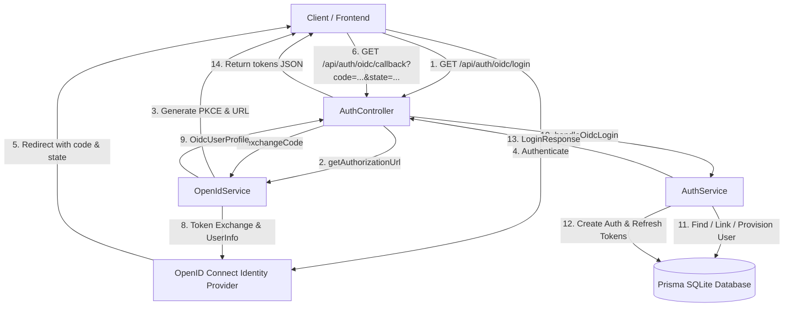

# Requirements

### Overview & Goals
The goal of this task is to implement the backend OpenID Connect (OIDC) authorization layer for Top Nosh as specified in `.junie/v0.0.7/specs/oicd-part-1.md`. OpenID Connect support is optional and configurable via `ConfigurationsService`. When configured, users will be able to authenticate with an external OpenID Connect identity provider using the modern `openid-client` library. The solution supports automatic user onboarding (JIT provisioning), optional account linking by email address, and issuance of Top Nosh JWT access and refresh tokens.

### Scope

#### In Scope
- **Database Schema**: Update `User` model in `prisma/schema.prisma` to include an optional, unique `openId` field (`open_id`) and allow `passwordHash` to be nullable for OIDC-provisioned users. Generate and apply SQLite migration.
- **Configuration Management**: Retrieve OIDC configuration keys via `ConfigurationsService`:
  - `security.oidc.issuerUrl`
  - `security.oidc.clientId`
  - `security.oidc.clientSecret`
  - `security.oidc.callbackUrl`
  - `security.oidc.linkByEmail` (boolean, default: `false`)
- **OpenIdService**: Create `OpenIdService` in `apps/api/src/app/auth/open-id.service.ts`:
  - Initializes configuration on module init.
  - Performs OpenID Connect discovery and client configuration using `openid-client`.
  - Disables OIDC gracefully if any required configuration key is missing or empty.
  - Generates authorization URLs with PKCE (`code_challenge` / `code_verifier`), `state`, and `nonce`.
  - Handles authorization code exchange and claims extraction (`sub`, `email`, `name`).
- **AuthService Integration**:
  - Handle OIDC user lookup by `openId`.
  - If not found and `security.oidc.linkByEmail` is `true`, link existing account by email.
  - If user does not exist, auto-provision a new user record from OIDC claims.
  - Issue Top Nosh JWT access and refresh tokens, registering them in `user_tokens`.
- **AuthController Endpoints**:
  - `GET auth/oidc/login`: Generates authorization URL and returns `{ authorizationUrl: string }` as JSON.
  - `GET auth/oidc/callback`: Processes authorization callback query parameters (`code`, `state`), completes the exchange, and returns `LoginResponse` (`{ token, refreshToken, forcePasswordChange }`) as JSON.
- **Automated Tests**: Unit tests for `OpenIdService`, `AuthService`, and `AuthController`.

#### Out of Scope
- Frontend UI components and login page buttons (deferred to Part 2 as specified in `.junie/v0.0.7/specs/oicd-part-2.md`).
- `WebStartUpController` updates (deferred to Part 2).
- Third-party social login buttons or provider-specific workarounds beyond standard OpenID Connect 1.0.

### User Stories
- **As a user**, I want to initiate login with my organization's OpenID Connect identity provider so that I can authenticate without typing a local password.
- **As an existing user**, I want my existing local account to be automatically linked to my OpenID Connect identity when `linkByEmail` is enabled so that I retain my existing data and preferences.
- **As a new user**, I want an account to be automatically created for me upon successful OpenID Connect authentication so that I do not need manual pre-registration.
- **As an administrator**, I want OpenID Connect to be completely optional and disabled unless valid configuration keys are provided in `ConfigurationsService`.

### Functional Requirements
- **Configuration Retrieval**:
  - `OpenIdService` retrieves `security.oidc.issuerUrl`, `security.oidc.clientId`, `security.oidc.clientSecret`, `security.oidc.callbackUrl`, and `security.oidc.linkByEmail` on module init via `ConfigurationsService`.
  - If any of the required keys (`issuerUrl`, `clientId`, `clientSecret`, `callbackUrl`) is missing or empty, OIDC support is marked as disabled.
  - `security.oidc.linkByEmail` defaults to `false` if not set or empty.
- **OIDC Discovery & Initialization**:
  - When enabled, `OpenIdService` uses `openid-client.discovery()` to load provider metadata.
  - If discovery fails (e.g., identity provider temporarily unreachable), the error is logged and the service gracefully degrades to disabled status without crashing the API server.
- **OIDC Login Endpoint (`GET /auth/oidc/login`)**:
  - When OIDC is disabled, returns HTTP `404 Not Found` (or `400 Bad Request`) with a clear error message.
  - When enabled, generates a cryptographically random PKCE code verifier, calculates S256 code challenge, generates random state and nonce, and builds the provider authorization URL.
  - Stores pending state with code verifier and nonce in an in-memory map with a 10-minute TTL.
  - Returns JSON response: `{ authorizationUrl: string }`.
- **OIDC Callback Endpoint (`GET /auth/oidc/callback`)**:
  - When OIDC is disabled, returns HTTP `404 Not Found`.
  - Requires `code` and `state` query parameters; returns HTTP `400 Bad Request` if missing.
  - Validates `state` against in-memory cache and retrieves the associated PKCE code verifier.
  - Performs authorization code exchange with the token endpoint.
  - Retrieves user claims: subject (`sub`), `email`, and full name (`name` or `preferred_username` or `given_name` + `family_name`).
  - Calls `AuthService.handleOidcLogin()`.
  - Returns `LoginResponse`: `{ token: string, refreshToken: string, forcePasswordChange: boolean }`.
- **User Account Linking & Provisioning**:
  - Search `User` table for matching `openId`.
  - If found: generate access and refresh tokens, insert into `user_tokens`, and log in.
  - If not found:
    - If `security.oidc.linkByEmail` is `true`:
      - Look up user by `email`. If found: update record with `openId = claims.sub`, issue tokens, and log in.
      - If user with `email` is not found: auto-provision new user with `fullName`, `email`, `openId`, `passwordHash: null`, `forcePasswordChange: false`, and issue tokens.
    - If `security.oidc.linkByEmail` is `false`:
      - If a user with `email` already exists: reject login with `ConflictException` to prevent unverified account takeover.
      - If no user with `email` exists: auto-provision new user with `fullName`, `email`, `openId`, `passwordHash: null`, `forcePasswordChange: false`, and issue tokens.

### Non-Functional Requirements
- **Security**:
  - Enforce PKCE (Proof Key for Code Exchange) using `S256` to prevent authorization code interception attacks.
  - Validate state parameter to mitigate Cross-Site Request Forgery (CSRF).
  - State cache items expire after 10 minutes.
  - Nullable `passwordHash` prevents OIDC-only users from logging in with blank or default passwords via the standard password endpoint.
- **Reliability & Resilience**:
  - Failure during remote OIDC discovery on startup must not crash the NestJS server.
  - Account linking is strictly controlled via `security.oidc.linkByEmail`.

# Technical Design

### Current Implementation
- `apps/api/src/app/auth/auth.controller.ts`:
  - Exposes `/auth/login`, `/auth/refresh`, `/auth/logout`, `/auth/change-password`, `/auth/onboarding-required`, `/auth/onboard-user`.
  - Relies on `AuthService` for authentication, password hashing (`argon2`), and token persistence.
- `apps/api/src/app/auth/auth.service.ts`:
  - Issues JWT access tokens (24h) and refresh tokens (30d).
  - Persists tokens into `user_tokens` with `TokenType.AUTHENTICATION` or `TokenType.REFRESH`.
  - Validates passwords using argon2 verification against `user.passwordHash`.
- `apps/api/src/app/configurations/configurations.service.ts`:
  - Provides typed access to configuration keys in the `configurations` table via `get<T>(key: string, defaultValue?: T)`.
- `prisma/schema.prisma`:
  - `User` model currently requires non-null `passwordHash` and has no `openId` field.

### Key Decisions
- **`openid-client` v6 Discovery & Client API**:
  - Utilize `openid-client`'s `discovery(issuerUrl, clientId, clientSecret)` helper.
  - Generates PKCE code verifier and challenge using `randomPKCECodeVerifier()` and `calculatePKCECodeChallenge()`.
  - Builds authorization URL using `buildAuthorizationUrl()`.
- **JSON Response Format**:
  - `oidc/login` returns `{ authorizationUrl: string }` as JSON, allowing frontend clients to initiate redirects dynamically.
  - `oidc/callback` returns standard `LoginResponse` (`{ token, refreshToken, forcePasswordChange }`) as JSON, keeping backend authentication decoupled from frontend routes.
- **Service Orchestration**:
  - `OpenIdService` encapsulates OIDC-specific protocol details: discovery, parameter generation, PKCE verification, and token exchange.
  - `AuthService` manages domain-level identity logic: user lookup by `openId`, account linking by `email`, auto-provisioning, and Top Nosh JWT/refresh token generation.
- **Nullable `passwordHash` in Prisma Schema**:
  - Making `passwordHash String? @map("password_hash")` allows OIDC-provisioned users to exist without a local password.
  - Existing local password authentication (`validateUser`) will continue to check `if (!user || !user.passwordHash) return null;`, ensuring passwordless OIDC accounts cannot be accessed via empty passwords.
- **Account Linking Safety**:
  - When `linkByEmail` is `false`, existing local users with matching email are NOT automatically linked; attempting to log in via OIDC with a colliding email throws `ConflictException` to protect account integrity.

### Proposed Changes

#### 1. Database Schema (`prisma/schema.prisma`)
Add `openId` and update `passwordHash`:
```prisma
model User {
  id                  String      @id @default(uuid())
  fullName            String      @map("full_name")
  email               String      @unique
  passwordHash        String?     @map("password_hash")
  forcePasswordChange Boolean     @default(false) @map("force_password_change")
  openId              String?     @unique @map("open_id")
  tokens              UserToken[]
  createdAt           DateTime    @default(now()) @map("created_at")
  updatedAt           DateTime    @updatedAt @map("updated_at")

  @@map("users")
}
```

#### 2. OpenIdService (`apps/api/src/app/auth/open-id.service.ts`)
```typescript
@Injectable()
export class OpenIdService implements OnModuleInit {
  private isConfigured = false;
  private oidcConfig?: client.Configuration;
  private linkByEmail = false;
  private callbackUrl?: string;
  private readonly stateCache = new Map<string, { codeVerifier: string; nonce: string; expiresAt: number }>();

  constructor(private readonly configurationsService: ConfigurationsService) {}

  async onModuleInit(): Promise<void> {
    await this.loadConfiguration();
  }

  async loadConfiguration(): Promise<void> {
    const issuerUrl = await this.configurationsService.get<string>('security.oidc.issuerUrl');
    const clientId = await this.configurationsService.get<string>('security.oidc.clientId');
    const clientSecret = await this.configurationsService.get<string>('security.oidc.clientSecret');
    const callbackUrl = await this.configurationsService.get<string>('security.oidc.callbackUrl');
    this.linkByEmail = await this.configurationsService.get<boolean>('security.oidc.linkByEmail', false);

    if (!issuerUrl || !clientId || !clientSecret || !callbackUrl) {
      this.isConfigured = false;
      return;
    }

    try {
      this.callbackUrl = callbackUrl;
      this.oidcConfig = await client.discovery(new URL(issuerUrl), clientId, clientSecret);
      this.isConfigured = true;
    } catch (err) {
      this.isConfigured = false;
      // Log discovery warning without crashing application
    }
  }

  isEnabled(): boolean {
    return this.isConfigured && !!this.oidcConfig;
  }

  isLinkByEmailEnabled(): boolean {
    return this.linkByEmail;
  }

  async getAuthorizationUrl(): Promise<{ authorizationUrl: string }> { ... }
  async exchangeCode(code: string, state: string): Promise<OidcUserProfile> { ... }
}
```

#### 3. AuthService Extensions (`apps/api/src/app/auth/auth.service.ts`)
```typescript
async handleOidcLogin(profile: OidcUserProfile): Promise<LoginResponse> {
  // 1. Check if user exists by openId
  let user = await this.prisma.user.findUnique({ where: { openId: profile.openId } });

  if (!user) {
    const existingByEmail = await this.prisma.user.findUnique({ where: { email: profile.email } });
    if (existingByEmail) {
      if (this.openIdService.isLinkByEmailEnabled()) {
        user = await this.prisma.user.update({
          where: { id: existingByEmail.id },
          data: { openId: profile.openId }
        });
      } else {
        throw new ConflictException('An account with this email already exists. Account linking is disabled.');
      }
    } else {
      // Auto-provision new user
      user = await this.prisma.user.create({
        data: {
          fullName: profile.fullName,
          email: profile.email,
          openId: profile.openId,
          passwordHash: null,
          forcePasswordChange: false
        }
      });
    }
  }

  // Issue tokens using standard token issuance
  return this.createAuthTokens(user);
}
```

#### 4. AuthController Endpoints (`apps/api/src/app/auth/auth.controller.ts`)
```typescript
@Get('oidc/login')
async oidcLogin(): Promise<{ authorizationUrl: string }> {
  if (!this.openIdService.isEnabled()) {
    throw new NotFoundException('OpenID Connect is not enabled');
  }
  return this.openIdService.getAuthorizationUrl();
}

@Get('oidc/callback')
async oidcCallback(
  @Query('code') code?: string,
  @Query('state') state?: string
): Promise<LoginResponse> {
  if (!this.openIdService.isEnabled()) {
    throw new NotFoundException('OpenID Connect is not enabled');
  }
  if (!code || !state) {
    throw new BadRequestException('Missing code or state in callback request');
  }
  const profile = await this.openIdService.exchangeCode(code, state);
  return this.authService.handleOidcLogin(profile);
}
```

### Architecture Diagram


### File Structure
- `prisma/schema.prisma` (modified: `User.openId` and nullable `User.passwordHash`)
- `prisma/migrations/<timestamp>_add_open_id_to_users/migration.sql` (added)
- `apps/api/src/app/auth/open-id.service.ts` (added)
- `apps/api/src/app/auth/open-id.service.spec.ts` (added)
- `apps/api/src/app/auth/dto/oidc.dto.ts` (added)
- `apps/api/src/app/auth/auth.service.ts` (modified: `handleOidcLogin` and token helper)
- `apps/api/src/app/auth/auth.service.spec.ts` (modified: tests for OIDC flow)
- `apps/api/src/app/auth/auth.controller.ts` (modified: `oidc/login` and `oidc/callback`)
- `apps/api/src/app/auth/auth.controller.spec.ts` (modified: tests for OIDC endpoints)
- `apps/api/src/app/auth/auth.module.ts` (modified: register `OpenIdService`)

# Testing

### Validation Approach
Verification will be performed entirely through automated Jest test suites covering unit and mock-based integration scenarios for `OpenIdService`, `AuthService`, and `AuthController`.

### Key Scenarios
1. **Disabled OIDC Configuration**:
   - Verify that when any of `issuerUrl`, `clientId`, `clientSecret`, or `callbackUrl` is missing or empty, `OpenIdService.isEnabled()` returns `false`.
   - Calling `GET /auth/oidc/login` or `GET /auth/oidc/callback` throws `NotFoundException` (404).
2. **Authorization URL Generation**:
   - Calling `OpenIdService.getAuthorizationUrl()` produces a URL containing `client_id`, `redirect_uri`, `scope`, `code_challenge`, `state`, and `nonce`.
   - Verify state and code verifier are stored in the state cache.
3. **Successful Callback & Existing User Login**:
   - Simulate valid `code` and `state` parameters.
   - Mock `openid-client` token exchange returning claims for a user whose `openId` exists in the database.
   - Verify that Top Nosh access and refresh tokens are created and returned in `LoginResponse`.
4. **Account Linking by Email (`linkByEmail = true`)**:
   - Authenticate with an OIDC identity whose `openId` is not in the database, but whose `email` matches an existing local user.
   - Verify the existing user record is updated with the new `openId`.
   - Verify login succeeds with the existing user's ID.
5. **Account Linking Disabled Collision (`linkByEmail = false`)**:
   - Authenticate with an OIDC identity whose `email` matches an existing local user, but `linkByEmail` is `false`.
   - Verify the request throws `ConflictException` (409) and the database record is not modified.
6. **Auto-Provisioning New User**:
   - Authenticate with an OIDC identity whose `openId` and `email` do not exist in the database.
   - Verify a new `User` record is created with `fullName`, `email`, `openId`, `passwordHash: null`, and `forcePasswordChange: false`.
   - Verify login tokens are issued for the newly created user.

### Edge Cases
- **Missing or Invalid State Parameter**: Callback with unrecognized or expired `state` throws `BadRequestException`.
- **Missing Code Parameter**: Callback without `code` throws `BadRequestException`.
- **Identity Provider Discovery Failure**: If `openid-client.discovery()` rejects during initialization (e.g. network timeout), `OpenIdService` catches the exception and falls back to `isEnabled() === false` without crashing the application.
- **State Expiration (TTL)**: States older than 10 minutes are evicted and rejected.
- **Local Password Login for OIDC Users**: Verify that `AuthService.validateUser()` rejects attempts to log in via password for users with `passwordHash: null`.

### Test Changes
- `apps/api/src/app/auth/open-id.service.spec.ts`: New unit tests for configuration loading, discovery error handling, authorization URL generation, and PKCE exchange.
- `apps/api/src/app/auth/auth.service.spec.ts`: New tests for `handleOidcLogin` covering existing `openId`, email linking, email collision conflict, and auto-provisioning.
- `apps/api/src/app/auth/auth.controller.spec.ts`: New tests for `oidc/login` and `oidc/callback` endpoints covering success and error handling.

# Delivery Steps

### ✓ Step 1: Update database schema and user model for OpenID Connect
The Prisma schema supports an optional `openId` field on `User` and `passwordHash` is made nullable for OIDC-provisioned users, with migrations applied and Prisma Client regenerated.

- Update `prisma/schema.prisma` to add optional `openId String? @unique @map("open_id")` and update `passwordHash String? @map("password_hash")` on the `User` model.
- Generate and apply a new Prisma migration (`add_open_id_to_users`) for SQLite.
- Regenerate Prisma Client artifacts (`npx prisma generate`).
- Update existing user fixtures and tests in `apps/api/src/app/auth/auth.service.spec.ts` and `apps/api/src/app/users/users.service.spec.ts` to accommodate the updated schema definitions.

### ✓ Step 2: Implement OpenIdService with openid-client discovery and PKCE flow
`OpenIdService` is implemented, registered in `AuthModule`, discovers the OpenID Connect provider configuration on module init, and provides methods for authorization URL generation and token exchange.

- Implement `OpenIdService` in `apps/api/src/app/auth/open-id.service.ts` implementing `OnModuleInit`.
- Inject `ConfigurationsService` to load keys: `security.oidc.issuerUrl`, `security.oidc.clientId`, `security.oidc.clientSecret`, `security.oidc.callbackUrl`, and `security.oidc.linkByEmail`.
- Implement provider discovery and client configuration using the `openid-client` library (`discovery()` function) with error-resilient fallback if the issuer is unreachable.
- Implement `getAuthorizationUrl()` to generate PKCE challenge, state, and nonce, caching them in memory with TTL, and returning the authorization URL.
- Implement `exchangeCode({ code, state })` to validate the state, exchange the authorization code for tokens, fetch user claims (`sub`, `email`, `fullName`), and return the standardized OIDC user profile.
- Add unit tests for `OpenIdService` in `apps/api/src/app/auth/open-id.service.spec.ts` covering disabled state, discovery failure handling, authorization URL generation, and code exchange.

### ✓ Step 3: Implement AuthService OIDC login flow, account linking, and AuthController endpoints
`AuthService` supports OIDC authentication, user account linking by email, and auto-provisioning; `AuthController` exposes `oidc/login` and `oidc/callback` endpoints returning JSON responses.

- Add `handleOidcLogin(profile: OidcUserProfile)` in `apps/api/src/app/auth/auth.service.ts`:
  - Check for existing user by `openId`.
  - If not found and `security.oidc.linkByEmail` is `true`, find user by email and link `openId` to the existing account.
  - If not found and account linking does not match, auto-provision a new user record with `openId`, `email`, `fullName`, and `forcePasswordChange: false`.
  - If `linkByEmail` is `false` and an existing non-linked account has the same email, throw `ConflictException`.
  - Issue application JWT access and refresh tokens, persist token records in `user_tokens`, and return `LoginResponse`.
- Add endpoints in `apps/api/src/app/auth/auth.controller.ts`:
  - `GET auth/oidc/login`: validates that OIDC is enabled, generates the authorization URL via `OpenIdService`, and returns `{ authorizationUrl: string }`.
  - `GET auth/oidc/callback`: accepts `code` and `state` query parameters, exchanges code via `OpenIdService`, delegates authentication/linking to `AuthService.handleOidcLogin()`, and returns `LoginResponse`.
- Update `AuthModule` in `apps/api/src/app/auth/auth.module.ts` to export/import dependencies (`OpenIdService`, `ConfigurationsModule`).
- Add comprehensive unit tests in `apps/api/src/app/auth/auth.controller.spec.ts` and `apps/api/src/app/auth/auth.service.spec.ts` verifying all login, linking, disabled state, and error paths.