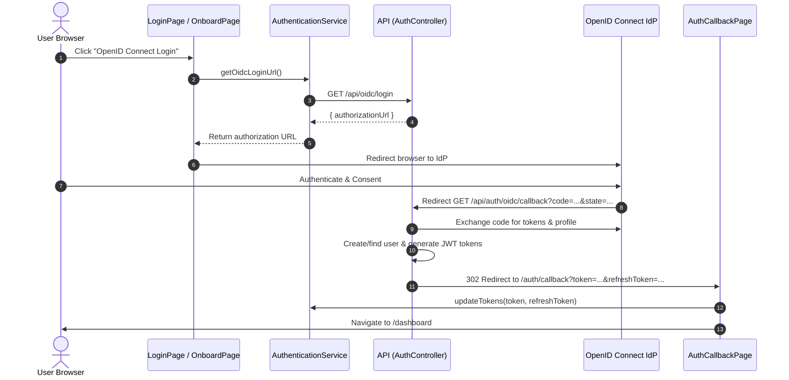

# Requirements

### Overview & Goals
Integrate OpenID Connect (OIDC) support into the Top Nosh frontend application based on the backend foundation established in Part 1. This enables users to log in or register via an external OpenID Connect identity provider, handles the OAuth2 redirect callback flow, updates the frontend authentication session, and provides appropriate user feedback.

### Scope
- **In Scope**:
  - Exposing `SECURITY_OIDC_ENABLED` from `WebStartUpController` in the `api` project.
  - Adding `oidcEnabled` boolean configuration in `apps/web/src/environments/environment.ts`.
  - Adding OIDC API client methods (`getOidcLoginUrl`) and session update methods (`updateTokens`) to `AuthenticationService`.
  - Updating `LoginPage` with an `OpenID Connect Login` button and loading state.
  - Updating `OnboardPage` with a `Register With OpenID Connect` button following the OIDC login flow.
  - Creating `AuthCallbackPage` at `/auth/callback` to process IDP callback tokens and error query parameters.
  - Updating the API callback endpoint to redirect users to `AuthCallbackPage`.
  - Adding internationalization keys (English and Russian) for all new UI components.
  - Unit and integration tests for new and updated components.
- **Out of Scope**:
  - Reconfiguring OpenID Connect discovery or token verification algorithms on the server (completed in Part 1).
  - Social login buttons other than OpenID Connect.
  - User profile editing for OIDC-specific claims.

### User Stories
- **As an existing user**, I want to click an "OpenID Connect Login" button on the login page so that I can sign in securely using my external identity provider without typing local credentials.
- **As a new administrator/user**, I want to click a "Register With OpenID Connect" button on the onboarding page so that my initial account is automatically created from my identity provider profile and I am immediately logged in.
- **As an authenticated user completing OIDC flow**, I want to be redirected smoothly to the dashboard upon successful authentication.
- **As a user whose OIDC login failed**, I want to see a clear error message on the callback page with an option to return to the login page.

### Functional Requirements
1. **Startup Configuration**:
   - `WebStartUpController.webProperties()` must return `SECURITY_OIDC_ENABLED=true` when `OpenIdService.isEnabled()` is true, and `SECURITY_OIDC_ENABLED=false` otherwise.
   - Frontend `environment().oidcEnabled` must parse `SECURITY_OIDC_ENABLED` and default to `false`.
2. **Authentication Service**:
   - `AuthenticationService.getOidcLoginUrl()` must call the API to fetch `{ authorizationUrl: string }`.
   - `AuthenticationService.updateTokens(token, refreshToken)` must decode user information, save the state to local storage, and update `authState$`.
3. **Login Page**:
   - Renders "OpenID Connect Login" button next to "LOG IN" if and only if `oidcEnabled` is true.
   - Sets `isLoading` to true while requesting the authorization URL.
   - Redirects browser to the retrieved `authorizationUrl`.
   - Shows an error snackbar and resets `isLoading` if the endpoint call fails.
4. **Onboard Page**:
   - Renders "Register With OpenID Connect" button next to "CREATE ACCOUNT" if and only if `oidcEnabled` is true.
   - Sets `isLoading` to true while requesting the authorization URL and initiates the OIDC flow.
   - Upon completion, the backend creates the user and logs them in automatically.
5. **Auth Callback Page**:
   - Route `/auth/callback` displayed within the existing `GuestPage` layout.
   - If query parameter `error` is present: renders failure message and "Back to Login" action.
   - If `token` and `refreshToken` are present: updates session tokens via `AuthenticationService` and navigates to `/dashboard` (or `/auth/change-password` if required).
   - If neither tokens nor error are present: shows invalid callback state error.

# Technical Design

### Current Implementation
- **API Startup**: `apps/api/src/app/web-start-up-module/web-start-up.controller.ts` serves `/assets/app.properties` (bypassing `/api` prefix) returning Java-style properties (`PRODUCTION`, `API_URL`).
- **Web Bootstrapping**: `apps/web/src/main.ts` uses `bakeEnv(() => import('./environments/environment'), '/assets/app.properties')` from `@elemental-concept/env-bakery` to populate `bakedEnv`.
- **Backend OIDC**: `OpenIdService` in `apps/api/src/app/auth/open-id.service.ts` validates configuration and generates authorization URLs. `AuthController` exposes `GET auth/oidc/login` and `GET auth/oidc/callback`. `AuthService.handleOidcLogin` automatically provisions non-existent users.
- **Frontend Auth State**: `AuthenticationService` manages an `Observable<AuthState>` and stores session data in `localStorage` under `auth_state`.

### Key Decisions
1. **API Callback Redirection**:
   - *Decision*: Update `AuthController.oidcCallback()` to redirect the browser via `res.redirect()` to `${frontendBaseUrl}/auth/callback?token=...&refreshToken=...` on success and `${frontendBaseUrl}/auth/callback?error=...` on failure.
   - *Rationale*: OIDC authorization code flow redirects the browser from the IdP back to the application. Redirecting from the API callback to the frontend callback page passes tokens securely in query parameters while keeping IdP redirect URI configuration intact.
2. **Dual Endpoint Path Support**:
   - *Decision*: Support both `/api/oidc/login` and `/api/auth/oidc/login` (as well as callback routes) on the API.
   - *Rationale*: Eliminates potential discrepancies between the Part 1 specification (`auth/oidc/login`) and Part 2 wording (`api/oidc/login`), ensuring compatibility with any client calling convention.
3. **Frontend Routing and Layout**:
   - *Decision*: Add `callback` to `apps/web/src/auth/auth.routes.ts` as a child route under `/auth` without auth guards.
   - *Rationale*: Integrates naturally into `GuestPage`'s card wrapper alongside `LoginPage` and `OnboardPage`.

### Architecture Diagram


### Components and Changes

#### 1. API: `apps/api/src/app/web-start-up-module/`
- `web-start-up.controller.ts`: Inject `OpenIdService` and output `SECURITY_OIDC_ENABLED=${this.openIdService.isEnabled()}`.
- `web-start-up-module.ts`: Import `AuthModule` to provide `OpenIdService`.
- `web-start-up.controller.spec.ts`: Test `SECURITY_OIDC_ENABLED` output when enabled/disabled.

#### 2. API: `apps/api/src/app/auth/`
- `auth.controller.ts`:
  - Update `oidcCallback` to use Express `@Res() res: Response` to redirect to `${frontendUrl}/auth/callback`.
  - Add `/api/oidc/login` and `/api/oidc/callback` route aliases for complete specification compliance.
- `auth.controller.spec.ts`: Update tests to verify redirect behaviour with tokens or error message.

#### 3. Web Environment: `apps/web/src/environments/`
- `environment.ts`:
  ```ts
  export const environment = () => ({
    production: getEnv('PRODUCTION').boolean(),
    apiUrl: getEnv('API_URL').string(),
    oidcEnabled: getEnv('SECURITY_OIDC_ENABLED').boolean()
  });
  ```

#### 4. Web Auth Service: `apps/web/src/auth/services/authentication/`
- `authentication.service.ts`:
  - `getOidcLoginUrl(): Observable<{ authorizationUrl: string }>`: Performs `http.get<{ authorizationUrl: string }>('/oidc/login', ...)`.
  - `updateTokens(token: string, refreshToken: string): void`: Parses JWT claims to extract `userId`, builds `AuthState`, persists to `localStorage`, and emits on `authState$`.
- `authentication.service.spec.ts`: Test new methods.

#### 5. Web Auth Callback Page: `apps/web/src/auth/pages/auth-callback/`
- `auth-callback.page.ts`: Reads query params `token`, `refreshToken`, `error`, `forcePasswordChange`. Updates tokens and redirects to `/dashboard` on success; displays error message on failure.
- `auth-callback.page.html`: Card title, status message or spinner, error alert, and "Back to Login" button.
- `auth.routes.ts`: Add `{ path: 'callback', component: AuthCallbackPage, title: 'Callback' }`.

#### 6. Web Login & Onboard Pages: `apps/web/src/auth/pages/`
- `login.page.ts` / `login.page.html`: Add `oidcEnabled` check and `OpenID Connect Login` button calling `onOidcLogin()`.
- `onboard.page.ts` / `onboard.page.html`: Add `oidcEnabled` check and `Register With OpenID Connect` button calling `onOidcRegister()`.
- Translations in `apps/web/public/assets/i18n/en.json` and `ru.json`.

# Testing

### Validation Approach
Verification relies on unit and component tests using Jest and Angular Testing Utilities across both the `api` and `web` projects, followed by full project builds and linter verification.

### Key Scenarios
1. **Web Properties Endpoint**:
   - Verify `WebStartUpController.webProperties()` returns `SECURITY_OIDC_ENABLED=true` when `OpenIdService.isEnabled()` returns `true`.
   - Verify `WebStartUpController.webProperties()` returns `SECURITY_OIDC_ENABLED=false` when `OpenIdService.isEnabled()` returns `false`.
2. **Environment Configuration**:
   - Verify `environment().oidcEnabled` returns `false` by default when the property is absent or unconfigured.
   - Verify `environment().oidcEnabled` returns `true` when `SECURITY_OIDC_ENABLED=true`.
3. **AuthenticationService OIDC Methods**:
   - `getOidcLoginUrl()` sends GET request to `/oidc/login` and emits `{ authorizationUrl }`.
   - `updateTokens(token, refreshToken)` parses user ID from JWT, writes state to `localStorage`, and updates `state()`.
4. **LoginPage OpenID Connect Action**:
   - Button is hidden when `oidcEnabled` is `false`.
   - Button is visible and enabled when `oidcEnabled` is `true`.
   - Clicking button sets `isLoading` to true and triggers redirection to the returned authorization URL.
   - API error displays snackbar and resets `isLoading`.
5. **OnboardPage OpenID Connect Action**:
   - Button is hidden when `oidcEnabled` is `false`.
   - Button is visible and enabled when `oidcEnabled` is `true`.
   - Clicking button sets `isLoading` to true and triggers redirection to the returned authorization URL.
6. **AuthCallbackPage Redirect & Error Handling**:
   - When URL contains `token` and `refreshToken`, updates `AuthenticationService` and navigates to `/dashboard`.
   - When URL contains `error`, displays error state and renders "Back to Login" button.
   - When URL has neither tokens nor error, displays invalid callback state.
7. **API Callback Redirection**:
   - Successful OIDC exchange issues 302 redirect to `${frontendUrl}/auth/callback?token=...&refreshToken=...`.
   - Error during OIDC exchange issues 302 redirect to `${frontendUrl}/auth/callback?error=...`.

### Test Changes
- **New Test Files**:
  - `apps/web/src/auth/pages/auth-callback/auth-callback.page.spec.ts`
- **Updated Test Files**:
  - `apps/api/src/app/web-start-up-module/web-start-up.controller.spec.ts`
  - `apps/api/src/app/auth/auth.controller.spec.ts`
  - `apps/web/src/auth/services/authentication/authentication.service.spec.ts`
  - `apps/web/src/auth/pages/login/login.page.spec.ts`
  - `apps/web/src/auth/pages/onboard/onboard.page.spec.ts`
- **Verification Commands**:
  - `npx nx test api`
  - `npx nx test web`
  - `npx nx lint api`
  - `npx nx lint web`

# Delivery Steps

### ✓ Step 1: Update API WebStartUpController and Callback Redirection
OpenID Connect status is communicated to the frontend, and the API callback redirects users to the frontend callback page.

- Inject `OpenIdService` into `WebStartUpController` in `apps/api/src/app/web-start-up-module/web-start-up.controller.ts` and append `SECURITY_OIDC_ENABLED=${this.openIdService.isEnabled()}` to the returned properties string in `webProperties()`.
- Update `WebStartUpModule` in `apps/api/src/app/web-start-up-module/web-start-up-module.ts` to import `AuthModule`.
- Update `AuthController.oidcCallback()` in `apps/api/src/app/auth/auth.controller.ts` to redirect via Express `Response.redirect()` to `${frontendUrl}/auth/callback` with `token` and `refreshToken` query parameters on success, or `error` query parameter on failure.
- Add support for direct `/api/oidc/login` and `/api/oidc/callback` paths (via controller routing or alias) alongside `/api/auth/oidc/*` to satisfy both endpoint path conventions.
- Update unit tests in `apps/api/src/app/web-start-up-module/web-start-up.controller.spec.ts` and `apps/api/src/app/auth/auth.controller.spec.ts` to verify property generation and callback redirect handling.

### ✓ Step 2: Update Web Environment and AuthenticationService
Web environment exposes oidcEnabled flag and AuthenticationService supports OIDC URL fetching and session updates.

- Update `apps/web/src/environments/environment.ts` to include `oidcEnabled: getEnv('SECURITY_OIDC_ENABLED').boolean()` (defaulting to `false`).
- Add `getOidcLoginUrl(): Observable<{ authorizationUrl: string }>` to `AuthenticationService` in `apps/web/src/auth/services/authentication/authentication.service.ts` using `HttpClient` with `HTTP_BASE_URL_ENABLED`.
- Add `updateTokens(token: string, refreshToken: string): void` to `AuthenticationService` to decode user ID from JWT, persist session to local storage via `saveState()`, and emit the new authenticated state through `authState$`.
- Update unit tests in `apps/web/src/auth/services/authentication/authentication.service.spec.ts` to cover `getOidcLoginUrl()` and `updateTokens()`.

### ✓ Step 3: Implement AuthCallbackPage and Route Configuration
AuthCallbackPage processes authentication redirects, reports errors, and logs users into the dashboard.

- Create `AuthCallbackPage` component in `apps/web/src/auth/pages/auth-callback/` (`auth-callback.page.ts`, `auth-callback.page.html`, `auth-callback.page.scss`, `auth-callback.page.spec.ts`).
- Read query parameters (`token`, `refreshToken`, `error`, `forcePasswordChange`) on page initialization via `ActivatedRoute`.
- On successful authentication (tokens present): call `AuthenticationService.updateTokens(token, refreshToken)` and navigate to `/dashboard` (or `/auth/change-password` if `forcePasswordChange` is set).
- On authentication failure (`error` present or missing tokens): display a clear error message with a "Back to Login" action button navigating to `/auth/login`.
- Register route `path: 'callback'` in `apps/web/src/auth/auth.routes.ts` pointing to `AuthCallbackPage`.
- Add translation entries for `AuthCallbackPage` in `apps/web/public/assets/i18n/en.json` and `ru.json`.
- Add unit tests in `auth-callback.page.spec.ts` covering success redirection, token storage, and error state display.

### ✓ Step 4: Update LoginPage and OnboardPage with OIDC Buttons and Flow
LoginPage and OnboardPage feature OpenID Connect action buttons and initiate the authentication workflow.

- Update `LoginPage` (`apps/web/src/auth/pages/login/login.page.html` and `login.page.ts`) to display an `OpenID Connect Login` button beside the submit button when `oidcEnabled` is true.
- Implement `onOidcLogin` in `LoginPage`: set `isLoading` to true, call `AuthenticationService.getOidcLoginUrl()`, and redirect the browser (`window.location.href`) to the returned `authorizationUrl`. Show snackbar on failure and reset `isLoading`.
- Update `OnboardPage` (`apps/web/src/auth/pages/onboard/onboard.page.html` and `onboard.page.ts`) to display a `Register With OpenID Connect` button beside the submit button when `oidcEnabled` is true.
- Implement `onOidcRegister` in `OnboardPage`: set `isLoading` to true, call `AuthenticationService.getOidcLoginUrl()`, and redirect the browser (`window.location.href`) to the returned `authorizationUrl`. Show snackbar on failure and reset `isLoading`.
- Add translation entries for the new buttons in `apps/web/public/assets/i18n/en.json` and `ru.json`.
- Update unit tests in `apps/web/src/auth/pages/login/login.page.spec.ts` and `apps/web/src/auth/pages/onboard/onboard.page.spec.ts` to test button visibility, disabled states during loading, and navigation flows.