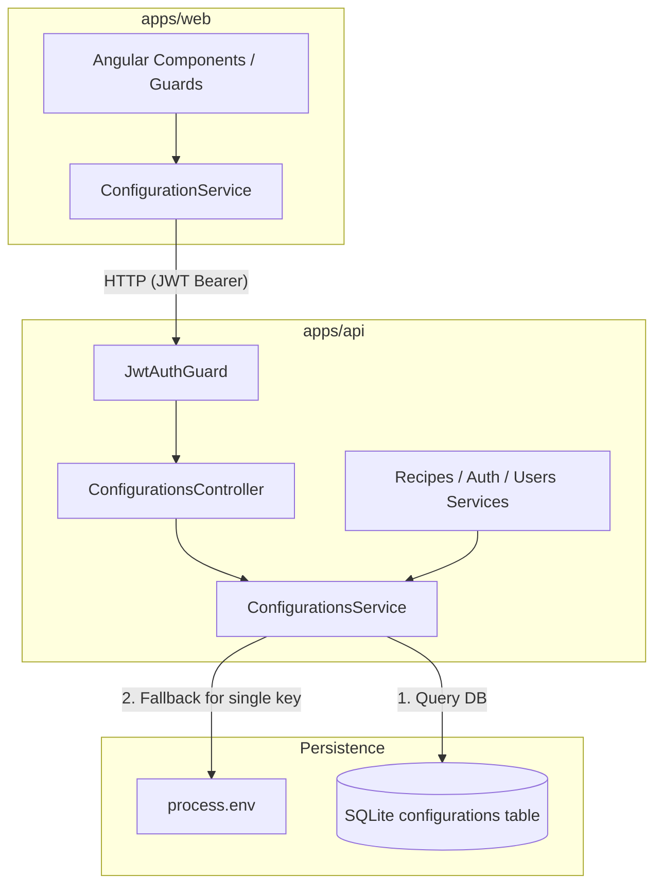

# Requirements

### Overview & Goals
Top Nosh requires a centralized, database-backed configuration management subsystem accessible across both backend (`api`) and frontend (`web`). The configuration system stores key-value pairs where keys adhere to a three-tier naming convention (`domain.group.entity`) and values are arbitrary strings or nulls (supporting JSON payloads without length limitation). The system provides seamless environment variable fallback for single key reads, strict protection against modifying critical infrastructure keys, and batch HTTP endpoints to minimize network overhead.

### Scope
- **In Scope**:
  - Prisma database model `Configuration` and migration creating the `configurations` table in SQLite.
  - Core `ConfigurationsService` in `apps/api` with support for dot-separated keys, three-argument access (`domain`, `group`, `entity`), single-key environment variable fallback (`UPPER_SNAKE_CASE`), protected key guards (`prisma.database.url`, `server.http.port`), and domain/group filtering.
  - `ConfigurationsController` in `apps/api` protected by `JwtAuthGuard`, offering batch retrieval and batch update endpoints.
  - `@Global()` `ConfigurationsModule` imported into `AppModule` making configuration management available across all API features.
  - Angular `ConfigurationService` in `apps/web` enabling frontend features to fetch and update configurations in batches.
  - Comprehensive unit, integration, and E2E test suites for all backend and frontend components.
- **Out of Scope**:
  - Deleting configuration rows from the database (keys cannot be removed once added; values can only be set to `null`).
  - Hierarchical config inheritance or schema validation of specific config payloads (values are strings validated by caller consumers).
  - Merging environment variables into multi-key domain or group queries.

### User Stories
- **As a backend developer**, I want to inject `ConfigurationsService` anywhere in the `api` project to read or update configuration values using either a dot notation key or three separate arguments (`domain`, `group`, `entity`).
- **As a system administrator**, I want single-key lookups to automatically fall back to uppercase snake-case environment variables when a key is absent from the database, allowing environment overrides.
- **As a security auditor**, I want critical settings like `prisma.database.url` and `server.http.port` to be strictly immutable via the configuration service to prevent runtime system hijacking.
- **As a frontend developer**, I want to retrieve and update multiple configuration settings in a single authenticated HTTP request, minimizing round trips.

### Functional Requirements
1. **Data Storage & Model**:
   - Stored in table `configurations` with `id` (UUID), `key` (unique text), `value` (unlimited nullable text), `created_at` (timestamp), and `updated_at` (timestamp).
   - Once inserted, rows are never deleted. Setting a configuration to inactive or empty is performed by setting `value` to `null`.
2. **Key Convention & Overloads**:
   - Each key consists of three non-empty segments separated by dots: `<domain>.<group>.<entity>` (e.g., `files.storage.type`).
   - Service methods accept either a single string (`'files.storage.type'`) or three string arguments (`'files', 'storage', 'type'`).
3. **Environment Variable Fallback**:
   - Single-key read operations: if the key does not exist in the database, convert the key to uppercase snake case (e.g., `files.storage.type` $\rightarrow$ `FILES_STORAGE_TYPE`) and inspect `process.env`. If found, return its value; otherwise return `null`.
   - If a key exists in the database with value `null`, return `null` without falling back to environment variables.
   - List and batch query operations (`getByDomain`, `getByDomainAndGroup`) must ignore environment variables.
4. **Protected Keys**:
   - Mutations (create, update, upsert) targeting `prisma.database.url` or `server.http.port` must immediately throw an error (e.g., `ForbiddenException`).
5. **Domain and Group Queries**:
   - `getByDomain(domain)` returns all keys starting with `${domain}.` having non-null values as a key-value dictionary.
   - `getByDomainAndGroup(domain, group)` returns all keys starting with `${domain}.${group}.` having non-null values as a key-value dictionary.
   - Keys with `null` values are excluded from the returned maps.
6. **Controller API**:
   - All endpoints require valid JWT authentication via `JwtAuthGuard`.
   - Batch retrieve: accepts an array of keys (`keys: string[]`) and returns a JSON map of `{ [key: string]: string | null }`. Non-existent keys map to `null`.
   - Batch modify: accepts a JSON dictionary (`{ [key: string]: string | null }`) and returns the updated key-value map.
7. **JSDoc Documentation**:
   - Full JSDoc documentation on all service and utility methods.

### Non-Functional Requirements
- **Performance**: Batch endpoints resolve keys concurrently; database lookups utilize unique index on `key` and prefix scans.
- **Safety**: Safe handling of missing keys and null values; immutable protection for runtime critical server ports and database credentials.
- **Maintainability**: Global NestJS module pattern avoids repetitive imports in other API feature modules.

# Technical Design

### Current Implementation
- **API Architecture**: NestJS application (`apps/api`) structured with feature modules (`auth`, `recipes`, `shopping-lists`, `users`, `sharing`, `dashboard`, `web-start-up-module`).
- **Database & ORM**: Prisma 7 with SQLite engine via `@prisma/adapter-better-sqlite3`, managed in `libs/data-access` and `prisma/schema.prisma`.
- **Authentication**: `JwtAuthGuard` (`apps/api/src/app/auth/guards/jwt-auth.guard.ts`) verifies JWT bearer tokens for protected routes.
- **Web Client**: Angular standalone architecture (`apps/web`) using `HttpClient` for API requests.

### Key Decisions
1. **Model & Table Naming**: Model name `Configuration` mapped to `@@map("configurations")` with `@unique` on `key`.
   - *Rationale*: Follows existing schema patterns (`User` $\rightarrow$ `users`, `Recipe` $\rightarrow$ `recipes`, `ShoppingList` $\rightarrow$ `shopping_lists`).
2. **Global Module Registration**: Decorate `ConfigurationsModule` with `@Global()` and import it into `AppModule`.
   - *Rationale*: Fulfills the requirement that the service is available to all parts of the `api` project without forcing every module to import `ConfigurationsModule`.
3. **Key Formatting & Env Conversion**:
   - Key format: `domain.group.entity` validated via regex `^[a-zA-Z0-9_-]+(\.[a-zA-Z0-9_-]+){2}$`.
   - Env conversion: `key.replace(/\./g, '_').toUpperCase()`. Matches existing system variables like `PRISMA_DATABASE_URL`, `SERVER_HTTP_PORT`, and the example `FILES_STORAGE_TYPE`.
4. **Batch HTTP Controller Endpoints**:
   - `POST /api/configurations/retrieve` (and `GET /api/configurations?keys=...`): Accepts `{ keys: string[] }` and returns `{ [key: string]: string | null }`.
   - `PUT /api/configurations`: Accepts `{ [key: string]: string | null }` and returns `{ [key: string]: string | null }`.
   - *Rationale*: JSON bodies avoid URL length constraints for large batches; batch operations dramatically reduce HTTP round-trips for the frontend.

### Architecture Diagram


### Data Models & Contracts
#### Prisma Schema (`prisma/schema.prisma`)
```prisma
model Configuration {
  id        String   @id @default(uuid())
  key       String   @unique
  value     String?
  createdAt DateTime @default(now()) @map("created_at")
  updatedAt DateTime @updatedAt @map("updated_at")

  @@map("configurations")
}
```

#### DTOs & Interfaces
```typescript
export class RetrieveConfigurationsDto {
  @IsArray()
  @IsString({ each: true })
  keys!: string[];
}

export type ConfigurationValuesMap = Record<string, string | null>;
```

#### ConfigurationsService Signatures
```typescript
@Injectable()
export class ConfigurationsService {
  /**
   * Retrieves the value of a configuration key.
   * If not found in the database, falls back to the environment variable.
   */
  async get(key: string): Promise<string | null>;
  async get(domain: string, group: string, entity: string): Promise<string | null>;

  /**
   * Creates or updates a configuration key value (upsert).
   * Throws an error if the key is protected (e.g., prisma.database.url, server.http.port).
   */
  async set(key: string, value: string | null): Promise<Configuration>;
  async set(domain: string, group: string, entity: string, value: string | null): Promise<Configuration>;

  /**
   * Creates a new configuration key.
   */
  async create(key: string, value: string | null): Promise<Configuration>;

  /**
   * Updates an existing key or inserts it if it does not exist.
   */
  async update(key: string, value: string | null): Promise<Configuration>;

  /**
   * Batch updates multiple key-value pairs.
   */
  async updateMany(values: Record<string, string | null>): Promise<Record<string, string | null>>;

  /**
   * Batch retrieves values for a list of keys with env fallback.
   */
  async getMany(keys: string[]): Promise<Record<string, string | null>>;

  /**
   * Queries all non-null configuration values under a given domain.
   */
  async getByDomain(domain: string): Promise<Record<string, string>>;

  /**
   * Queries all non-null configuration values under a given domain and group.
   */
  async getByDomainAndGroup(domain: string, group: string): Promise<Record<string, string>>;
}
```

### File Structure Changes
- `prisma/schema.prisma`: Add `Configuration` model.
- `prisma/migrations/<timestamp>_create_configurations_table/migration.sql`: Migration creating `configurations`.
- `apps/api/src/app/configurations/`:
  - `configurations.module.ts`: NestJS global module.
  - `configurations.service.ts`: Core business logic and database/env access.
  - `configurations.controller.ts`: Authenticated HTTP controller.
  - `configurations.constants.ts`: `PROTECTED_KEYS` set definition.
  - `dto/retrieve-configurations.dto.ts`: Batch retrieval request DTO.
  - `dto/update-configurations.dto.ts`: Batch update request DTO.
  - `configurations.service.spec.ts`: Service unit tests.
  - `configurations.controller.spec.ts`: Controller unit tests.
  - `configurations.e2e.spec.ts`: HTTP API integration tests.
- `apps/api/src/app/app.module.ts`: Register `ConfigurationsModule`.
- `apps/web/src/system/services/configuration/`:
  - `configuration.service.ts`: Angular HTTP client service.
  - `configuration.service.spec.ts`: Angular unit tests.
  - `configuration.types.ts`: TypeScript contracts for frontend.

### Risks & Mitigations
- **Risk**: Attempt to modify protected infrastructure settings at runtime.
  - *Mitigation*: Validate keys against `PROTECTED_KEYS` (`prisma.database.url`, `server.http.port`) in both single and batch update paths before executing any database mutation, throwing a `ForbiddenException`.
- **Risk**: Environment variables leaking into domain or group list queries.
  - *Mitigation*: Strictly isolate the environment variable fallback logic to single-key reads; domain and group queries query exclusively from Prisma with `value: { not: null }`.
- **Risk**: Large JSON strings stored in configuration values causing overflow.
  - *Mitigation*: SQLite `TEXT` (Prisma `String`) supports text without arbitrary length restrictions, accommodating large serialized JSON payloads.

# Testing

### Validation Approach
Automated validation via Jest unit tests, NestJS end-to-end supertest specifications, and Angular service tests. All tests will be executed via `nx test` to ensure zero regressions across all workspace libraries and applications.

### Key Scenarios
1. **Single Key Retrieval & Env Fallback**:
   - Key exists in DB with string value $\rightarrow$ returns DB value.
   - Key exists in DB with `null` value $\rightarrow$ returns `null` (no env fallback).
   - Key does not exist in DB, corresponding `UPPER_SNAKE_CASE` env var is defined $\rightarrow$ returns env var value.
   - Key does not exist in DB and env var is undefined $\rightarrow$ returns `null`.
2. **Three-Argument vs Single-String Access**:
   - Calling `get('files.storage.type')` produces identical behavior to `get('files', 'storage', 'type')`.
   - Invalid key structure (fewer or more than 3 segments) throws a validation error.
3. **Protected Key Modification Rejection**:
   - Updating `prisma.database.url` or `server.http.port` via single update throws `ForbiddenException`.
   - Calling batch update containing any protected key throws `ForbiddenException` and cancels the transaction.
4. **Domain and Group Filtering**:
   - `getByDomain('files')` returns only keys starting with `files.` where `value !== null`.
   - `getByDomainAndGroup('files', 'storage')` returns only keys starting with `files.storage.` where `value !== null`.
   - Keys in database with `null` values are excluded from the result dictionary.
   - Environment variables are ignored in domain and group queries.
5. **Controller Batch Endpoints**:
   - `POST /api/configurations/retrieve` with `['files.storage.type', 'missing.key.value']` returns `{ 'files.storage.type': 's3', 'missing.key.value': null }`.
   - `PUT /api/configurations` with key-value map creates non-existent keys and updates existing keys.
   - Unauthenticated requests to `/api/configurations` endpoints return 401 Unauthorized.

### Edge Cases
- Keys containing underscores or hyphens in segment names (e.g. `auth.jwt-token.expiry_time`).
- Empty string values (`""`) vs `null` values: empty strings are treated as valid string values, whereas `null` indicates an unset value.
- Database records updated to `null` prevent falling back to existing environment variables.

# Delivery Steps

### ✓ Step 1: Prisma schema model and database migration
The Prisma schema includes the Configuration model and an applied SQLite migration creates the `configurations` table.

- Add the `Configuration` model to `prisma/schema.prisma` with `id` (UUID primary key), unique `key` string, nullable `value` string, `createdAt`, and `updatedAt`, mapped to `configurations`.
- Generate and apply a new Prisma migration SQL file under `prisma/migrations/` creating the `configurations` table and unique index on `key`.
- Regenerate the Prisma Client (`npx prisma generate`) so that `prisma.configuration` is available to the API project.

### ✓ Step 2: Implement ConfigurationsService and key utilities
The ConfigurationsService is implemented with single/three-argument key resolution, environment variable fallback, protected key enforcement, and query helpers.

- Create `apps/api/src/app/configurations/configurations.service.ts` injecting `PrismaService`.
- Implement key parsing and validation utilities that accept either a full key (`domain.group.entity`) or three separate arguments (`domain`, `group`, `entity`).
- Implement key-to-environment-variable converter (`keyToEnvVar`) that converts dot-separated keys to uppercase snake case (e.g., `files.storage.type` to `FILES_STORAGE_TYPE`).
- Implement single-key retrieval (`get` / `getValue`) with database lookup, falling back to `process.env` when the key does not exist in the database, or returning `null`.
- Implement mutation methods (`set`, `create`, `update`, `setMany`) using Prisma upsert, rejecting updates to protected keys (`prisma.database.url`, `server.http.port`) with an error.
- Implement domain query (`getByDomain`) and domain+group query (`getByDomainAndGroup`) returning key-value dictionaries excluding keys with `null` values and bypassing environment variables.
- Add complete JSDoc documentation to all methods and export the service.

### ✓ Step 3: Implement ConfigurationsController and DTOs
The ConfigurationsController exposes authenticated batch retrieve and modify endpoints for the frontend.

- Create DTOs in `apps/api/src/app/configurations/dto/`: `RetrieveConfigurationsDto` (`keys: string[]`) and `UpdateConfigurationsDto` (`values: Record<string, string | null>`).
- Create `apps/api/src/app/configurations/configurations.controller.ts` secured with `@UseGuards(JwtAuthGuard)` and route prefix `@Controller('configurations')`.
- Implement batch retrieve endpoint (`POST /configurations/retrieve` and `GET /configurations`) accepting an array of keys and returning a JSON dictionary mapping each requested key to its value (or `null`).
- Implement batch modify endpoint (`PUT /configurations`) accepting a JSON object mapping keys to values and returning the updated key-value map.
- Handle protected key errors gracefully with appropriate HTTP error responses (e.g., 403 Forbidden or 400 Bad Request).

### ✓ Step 4: Wire ConfigurationsModule and add frontend client service
ConfigurationsModule is registered in AppModule and a frontend client service is implemented in apps/web.

- Create `apps/api/src/app/configurations/configurations.module.ts` decorated with `@Global()`, providing and exporting `ConfigurationsService`, and registering `ConfigurationsController`.
- Import `ConfigurationsModule` into `apps/api/src/app/app.module.ts`.
- Create `apps/web/src/system/services/configuration/configuration.service.ts` in Angular providing `getConfigurations(keys: string[])` and `updateConfigurations(values: Record<string, string | null>)` via `HttpClient`.
- Export frontend configuration service and types for application-wide consumption.

### ✓ Step 5: Unit and E2E testing for configuration management
All service methods, controller endpoints, guards, and edge cases are validated with automated unit and integration tests.

- Create `apps/api/src/app/configurations/configurations.service.spec.ts` testing DB reads, env fallbacks, three-argument overloads, domain queries omitting nulls, and protected key rejection.
- Create `apps/api/src/app/configurations/configurations.controller.spec.ts` testing batch retrieve, batch update, authentication guard attachment, and error handling.
- Create `apps/api/src/app/configurations/configurations.e2e.spec.ts` testing authenticated HTTP requests, 401 unauthenticated requests, and end-to-end configuration persistence.
- Create `apps/web/src/system/services/configuration/configuration.service.spec.ts` testing frontend HTTP interactions.
- Run the full test suite (`npm test`) and linter (`npm run lint`) to ensure zero regressions across all workspace projects.