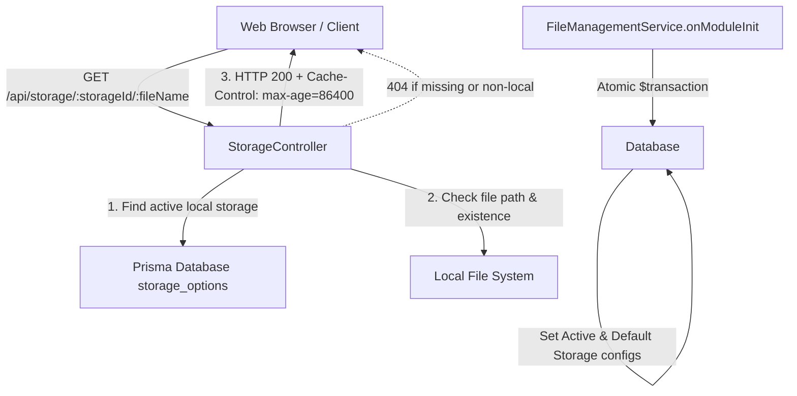

# Requirements

### Overview & Goals
The objective of this task is to implement local file serving for uploaded images and static assets in the `api` application, completing Step 4 of Image Gallery Management.
- Provide a dedicated `StorageController` handling HTTP GET requests to `/api/storage/:storageId/:fileName`.
- Validate that the specified storage option exists in the database and is configured with type `local`; return HTTP 404 if not.
- Serve requested static files directly from local storage with browser cache headers set for 24 hours (`Cache-Control: public, max-age=86400`).
- Update `FileManagementService` so default storage initialization generates URLs conforming to `/api/storage/:storageId/:fileName`, creates default storage with an empty `externalUrl` first, resolves the URL using the generated `storageId`, and wraps all initialization SQL operations in an atomic transaction.

### Scope
- **In Scope**:
  - `StorageController` in `apps/api/src/app/file-management/storage.controller.ts` with route `@Get(':storageId/:fileName')`.
  - Controller registration in `apps/api/src/app/file-management/file-management.module.ts`.
  - Update `STORAGE_URL_PATH` in `apps/api/src/app/file-management/file-management.constants.ts` to `'/api/storage'`.
  - Update `FileManagementService.resolveExternalStorageUrl(storageId: string)` to append `storageId`.
  - Update `FileManagementService.initializeDefaultStorage()` to use `prisma.$transaction`, create with `externalUrl: ''`, call `resolveExternalStorageUrl`, update the record, and persist configurations.
  - Unit tests in `storage.controller.spec.ts` and updated tests in `file-management.service.spec.ts`.
  - E2E tests in `storage.e2e.spec.ts` testing HTTP file serving and cache headers.
- **Out of Scope**:
  - Cloud / remote storage serving (e.g. S3 presigned URLs, CDN redirects) — only `local` file system serving is handled here.
  - Dynamic image resizing or transformation on the fly (handled prior to deployment by `ImageProcessingService`).
  - Modifications to frontend components (frontend already consumes `externalUrl` provided by gallery DTOs).

### User Stories
- **As a client application or web browser**, I want to retrieve uploaded gallery images via `/api/storage/:storageId/:fileName` so that images can be rendered in the UI with standard `` tags.
- **As a client application**, I want static image assets to be cached by the browser for 24 hours so that network bandwidth and latency are minimized on repeated visits.
- **As the system**, I want default storage initialization to be completely atomic so that no incomplete storage records with empty or invalid URLs are left in the database if startup configuration fails.

### Functional Requirements
1. **Storage Controller Endpoint**:
   - Controller route prefix: `/api/storage` (using NestJS `@Controller('storage')` with global prefix `'api'`).
   - Endpoint: `GET /api/storage/:storageId/:fileName`.
   - Access control: Public static endpoint (no `JwtAuthGuard`), allowing browsers to load images without bearer tokens.
2. **Storage Validation**:
   - Query `StorageOption` by `id = storageId` where `deletedAt = null`.
   - If not found, throw `NotFoundException` (HTTP 404).
   - If `storageOption.type !== 'local'`, throw `NotFoundException` (HTTP 404).
3. **File Lookup and Path Traversal Protection**:
   - Resolve target file path relative to `storageOption.url`.
   - Enforce path traversal protection ensuring the resolved path cannot escape `storageOption.url`. If path traversal is detected, return HTTP 404.
   - Verify file existence on disk; if file does not exist or is not a regular file, throw `NotFoundException` (HTTP 404).
4. **Caching & Static Response**:
   - Response header `Cache-Control: public, max-age=86400` must be present on successful file responses.
   - Serve file with correct MIME type inferred from file extension.
5. **FileManagementService Updates**:
   - `resolveExternalStorageUrl(storageId: string)` generates `${domain}/api/storage/${storageId}`.
   - `initializeDefaultStorage()` creates `StorageOption` with `externalUrl: ''`, then calls `resolveExternalStorageUrl(storageOption.id)`, then updates `externalUrl`, wrapped in `prisma.$transaction`.

### Non-Functional Requirements
- **TypeScript Guidelines**: Zero `any` types; strictly typed parameters; `readonly` properties; camelCase constants.
- **Performance**: Stream files via Express `res.sendFile` rather than loading entire files into Node process memory.
- **Security**: Strict path normalization prevents directory traversal vulnerabilities.

# Technical Design

### Current Implementation
- `FileManagementService` (`apps/api/src/app/file-management/file-management.service.ts`):
  - On module init, calls `initializeDefaultStorage()` which checks `prisma.storageOption.count()`.
  - Currently calls `resolveExternalStorageUrl()` with zero arguments, which appends `DEFAULT_LOCAL_STORAGE_CONFIG.STORAGE_URL_PATH` (`'/storage'`).
  - Creates `StorageOption` in a single non-transactional `create` call with `externalUrl: 'http://domain/storage'`.
- `GalleriesService` (`apps/api/src/app/galleries/galleries.service.ts`):
  - Builds image URLs via `buildExternalUrl(storage.externalUrl, locationPath)`.
  - When `storage.externalUrl` becomes `http://domain/api/storage/${storageId}`, `buildExternalUrl` produces `http://domain/api/storage/${storageId}/${locationPath}`.
- Global prefix: `main.ts` configures `app.setGlobalPrefix('api')`.

### Key Decisions
1. **Controller Routing Architecture**:
   - *Decision*: Annotate `StorageController` with `@Controller('storage')`.
   - *Rationale*: With NestJS global prefix `'api'`, `@Controller('storage')` produces `/api/storage/:storageId/:fileName`, matching existing controllers (`/api/configurations`, `/api/galleries`) and adhering to the spec.
2. **File Serving Mechanism**:
   - *Decision*: Use Express `res.sendFile(resolvedPath)` via `@Res() res: Response` from `@nestjs/common` and `express`.
   - *Rationale*: `res.sendFile` provides built-in MIME type resolution from extensions (AVIF, JPEG, PNG, etc.), automated Range header support, efficient kernel-level streaming, and conditional caching headers (ETag, 304 Not Modified).
3. **Cache-Control Specification**:
   - *Decision*: Set `res.setHeader('Cache-Control', 'public, max-age=86400')` (86400 seconds = 24 hours).
   - *Rationale*: Satisfies the requirement that files are static and browsers must cache them for 24 hours.
4. **Two-Phase Atomic Initialization**:
   - *Decision*: Wrap storage option creation, URL resolution with `storageOption.id`, and storage option update inside `prisma.$transaction(async tx => ...)`.
   - *Rationale*: Prevents orphan storage records if `SERVER_HTTP_DOMAIN` is invalid and satisfies the atomic transaction requirement.

### Proposed Changes

#### 1. Constants Update (`apps/api/src/app/file-management/file-management.constants.ts`)
Update `DEFAULT_LOCAL_STORAGE_CONFIG.STORAGE_URL_PATH` from `'/storage'` to `'/api/storage'`.

#### 2. Service Update (`apps/api/src/app/file-management/file-management.service.ts`)
- Update `resolveExternalStorageUrl(storageId: string): string`:
  - Validate that `storageId` is provided.
  - Construct `const fullUrl = `${trimmedDomain}${DEFAULT_LOCAL_STORAGE_CONFIG.STORAGE_URL_PATH}/${storageId}`;`.
  - Validate with `new URL(fullUrl)` and return.
- Update `initializeDefaultStorage(): Promise<void>`:
  - Execute database operations inside `this.prisma.$transaction(async tx => ...)`.
  - `const count = await tx.storageOption.count(); if (count > 0) return;`
  - Create default `StorageOption` with `externalUrl: ''`.
  - Call `this.resolveExternalStorageUrl(storageOption.id)`.
  - Update `tx.storageOption.update({ where: { id: storageOption.id }, data: { externalUrl } })`.
  - Update configuration settings for `ACTIVE_STORAGE` and `DEFAULT_STORAGE`.

#### 3. Controller Implementation (`apps/api/src/app/file-management/storage.controller.ts`)
```typescript
@Controller('storage')
export class StorageController {
  constructor(private readonly prisma: PrismaService) {}

  @Get(':storageId/:fileName')
  async serve(
    @Param('storageId') storageId: string,
    @Param('fileName') fileName: string,
    @Res() res: Response
  ): Promise<void> {
    const storageOption = await this.prisma.storageOption.findFirst({
      where: { id: storageId, deletedAt: null }
    });

    if (!storageOption || storageOption.type !== 'local') {
      throw new NotFoundException(`Storage option not found: ${storageId}`);
    }

    const cleanFileName = fileName.replace(/^[/\\]+/, '');
    const resolvedRoot = path.resolve(storageOption.url);
    const targetPath = path.resolve(resolvedRoot, cleanFileName);
    const rootWithSep = resolvedRoot.endsWith(path.sep) ? resolvedRoot : `${resolvedRoot}${path.sep}`;

    if (targetPath !== resolvedRoot && !targetPath.startsWith(rootWithSep)) {
      throw new NotFoundException(`File not found: ${fileName}`);
    }

    try {
      const stats = await fs.stat(targetPath);
      if (!stats.isFile()) {
        throw new NotFoundException(`File not found: ${fileName}`);
      }
    } catch {
      throw new NotFoundException(`File not found: ${fileName}`);
    }

    res.setHeader('Cache-Control', 'public, max-age=86400');
    res.sendFile(targetPath);
  }
}
```

#### 4. Module Registration (`apps/api/src/app/file-management/file-management.module.ts`)
Add `StorageController` to `controllers: [ StorageController ]`.

### Architecture Diagram


### File Structure
- `apps/api/src/app/file-management/`
  - `file-management.constants.ts` *(modified: update STORAGE_URL_PATH)*
  - `file-management.service.ts` *(modified: update resolveExternalStorageUrl & initializeDefaultStorage)*
  - `file-management.module.ts` *(modified: register StorageController)*
  - `storage.controller.ts` *(new: StorageController implementation)*
  - `storage.controller.spec.ts` *(new: unit tests)*
  - `storage.e2e.spec.ts` *(new: e2e test suite)*
  - `file-management.service.spec.ts` *(modified: update tests for transaction & URL resolution)*

### Risks & Mitigations
- **Path Traversal Vulnerability**: Attackers passing `../` sequences in `:fileName` parameter.
  - *Mitigation*: Strictly resolve paths using `path.resolve` and assert that the target path starts with the normalized storage root directory with trailing path separator.
- **Transaction Deadlocks / Startup Race Conditions**: Multiple instances bootstrapping simultaneously.
  - *Mitigation*: The `count` check and creation run in a single atomic database transaction.
- **Missing Cache-Control Header**:
  - *Mitigation*: Explicitly set `Cache-Control: public, max-age=86400` header before dispatching `res.sendFile`.

# Testing

### Validation Approach
Automated testing using Jest unit tests and Supertest E2E tests against NestJS testing modules.

### Key Scenarios
1. **Serving Valid Local File**:
   - Create a local storage record and place a test image in its directory.
   - Request `GET /api/storage/:storageId/:fileName`.
   - Expect HTTP status 200, matching file content, correct Content-Type, and header `Cache-Control: public, max-age=86400`.
2. **Missing Storage Option**:
   - Request `GET /api/storage/non-existent-uuid/image.avif`.
   - Expect HTTP status 404 with standard NestJS error payload.
3. **Non-Local Storage Option**:
   - Storage option exists with `type: 's3'`.
   - Request `GET /api/storage/:s3StorageId/image.avif`.
   - Expect HTTP status 404.
4. **Missing Physical File**:
   - Storage option exists and is `local`, but file does not exist on disk.
   - Request `GET /api/storage/:storageId/missing-file.jpg`.
   - Expect HTTP status 404.
5. **Path Traversal Guard**:
   - Request `GET /api/storage/:storageId/../../etc/passwd` or encoded traversal sequences.
   - Expect HTTP status 404.
6. **FileManagementService Transactional Startup**:
   - When table is empty, verify `prisma.$transaction` is invoked.
   - Verify `StorageOption.create` is called with `externalUrl: ''`.
   - Verify `StorageOption.update` is called with `${SERVER_HTTP_DOMAIN}/api/storage/${storageId}`.
   - Verify that if `SERVER_HTTP_DOMAIN` is invalid, the entire operation throws and rolls back.

### Edge Cases
- `SERVER_HTTP_DOMAIN` has multiple trailing slashes (e.g. `http://localhost:3000///`): Normalized cleanly without duplicate slashes.
- Storage option is soft-deleted (`deletedAt !== null`): Controller must treat it as not found (HTTP 404).
- Subdirectory files within storage: `locationPath` containing folder segments should be served properly while remaining confined to the storage root.

### Test Changes
- `apps/api/src/app/file-management/storage.controller.spec.ts`: Unit tests mocking `PrismaService` and `Response`.
- `apps/api/src/app/file-management/file-management.service.spec.ts`: Update mock expectations for `$transaction`, two-phase creation, and `resolveExternalStorageUrl(storageId)`.
- `apps/api/src/app/file-management/storage.e2e.spec.ts`: Integration test with temporary filesystem storage and Supertest.

# Delivery Steps

### ✓ Step 1: Update FileManagementService and configuration constants for storage URL resolution and atomic initialization
`DEFAULT_LOCAL_STORAGE_CONFIG.STORAGE_URL_PATH` reflects `/api/storage`, `resolveExternalStorageUrl` accepts `storageId`, and `initializeDefaultStorage` executes atomically via a Prisma transaction with two-step record creation.

- Update `apps/api/src/app/file-management/file-management.constants.ts`:
  - Change `DEFAULT_LOCAL_STORAGE_CONFIG.STORAGE_URL_PATH` from `'/storage'` to `'/api/storage'`.
- Update `apps/api/src/app/file-management/file-management.service.ts`:
  - Modify `resolveExternalStorageUrl(storageId: string): string` to accept `storageId`, construct `${trimmedDomain}${DEFAULT_LOCAL_STORAGE_CONFIG.STORAGE_URL_PATH}/${storageId}`, validate the URL using `new URL()`, and throw descriptive errors for missing `SERVER_HTTP_DOMAIN` or invalid URLs.
  - Update `initializeDefaultStorage()` to execute inside `this.prisma.$transaction(async tx => ...)`:
    - Check if any `StorageOption` records exist; exit early if `count > 0`.
    - Create default `StorageOption` with `externalUrl: ''`.
    - Call `this.resolveExternalStorageUrl(storageOption.id)`.
    - Update the created record with the resolved `externalUrl`.
    - Update configuration keys `fileManagement.storage.active` and `fileManagement.storage.default` with the newly created storage ID.
- Update `apps/api/src/app/file-management/file-management.service.spec.ts`:
  - Update unit tests for `onModuleInit` to assert `$transaction` execution, the initial create call with `externalUrl: ''`, the subsequent update call with the resolved external URL, and rollback behavior if URL resolution fails.
  - Update tests for `resolveExternalStorageUrl` behavior with `storageId`.

### ✓ Step 2: Implement StorageController for local file serving with cache headers
A new `StorageController` handles GET `/api/storage/:storageId/:fileName`, verifies storage options, checks local file existence and directory traversal guards, and serves static files with 24-hour cache headers.

- Create `apps/api/src/app/file-management/storage.controller.ts`:
  - Annotate with `@Controller('storage')` (yielding route prefix `/api/storage` via application global prefix).
  - Inject `PrismaService`.
  - Implement `serve(@Param('storageId') storageId: string, @Param('fileName') fileName: string, @Res() res: Response): Promise<void>`.
  - Fetch `StorageOption` from database where `id === storageId` and `deletedAt === null`.
  - If storage option does not exist or `storageOption.type !== 'local'`, throw `NotFoundException('Storage option not found')` (404).
  - Sanitize and resolve file path using `path.join(storageOption.url, fileName)` with path traversal guard (`path.resolve` check ensuring target stays within storage root directory). Throw `NotFoundException` if path traversal is detected.
  - Check file existence using `fs.promises.stat` / `fs.promises.access`; throw `NotFoundException('File not found')` if file does not exist or is a directory.
  - Set caching header: `res.setHeader('Cache-Control', 'public, max-age=86400')` (24 hours).
  - Serve file using Express `res.sendFile(resolvedPath)` to handle MIME type resolution, range requests, and efficient streaming.
- Update `apps/api/src/app/file-management/file-management.module.ts`:
  - Add `StorageController` to the `controllers` array of `FileManagementModule`.

### ✓ Step 3: Add comprehensive unit and E2E tests for StorageController and file serving
Unit tests and E2E integration test suites validate file serving, 404 error cases, caching headers, path traversal protection, and regression-free operation.

- Create `apps/api/src/app/file-management/storage.controller.spec.ts`:
  - Test successful file serving with 200 OK and `Cache-Control: public, max-age=86400`.
  - Test 404 `NotFoundException` when `storageId` does not exist in database.
  - Test 404 `NotFoundException` when storage option exists but `type` is not `'local'`.
  - Test 404 `NotFoundException` when the file does not exist on disk.
  - Test 404 `NotFoundException` when path traversal attempts are made (e.g., `../../file.txt`).
- Add integration/E2E test in `apps/api/src/app/file-management/storage.e2e.spec.ts`:
  - Bootstraps Nest application with global prefix `api`.
  - Creates a temporary local storage option and writes a sample file.
  - Sends GET `/api/storage/:storageId/:fileName` and validates 200 response, payload equality, and `Cache-Control` header containing `max-age=86400`.
  - Tests 404 response for invalid storage and missing files.
- Run `npx jest apps/api/src/app/file-management/` and `nx test api` to verify all test suites pass without regression.