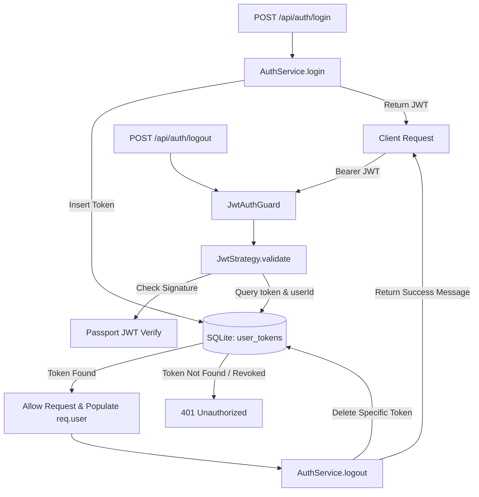

# Requirements

### Overview & Goals
The goal of this task is to implement token control mechanisms for the `api` NestJS application as outlined in `.junie/v0.0.7/specs/token-control.md`. Currently, JWT tokens are stateless: once issued, they cannot be invalidated before expiration, posing security risks upon logout or compromise. This change introduces database-backed token management where active JWT tokens are persisted in SQLite via Prisma, verified against the database on every authenticated request, and selectively revoked upon logout while preserving other concurrent sessions for the same user.

### Scope
#### In Scope
- **Database Schema**: Add a new `UserToken` model in `prisma/schema.prisma` mapped to `user_tokens` table with relations to `User` and cascade delete.
- **Prisma Migration**: Generate and apply a migration for the `user_tokens` table and update generated Prisma client artifacts.
- **Token Persistence on Login**: Update `AuthService.login()` to save newly generated JWT tokens to `user_tokens`.
- **Token Invalidation on Logout**: Add `logout(userId: string, token: string)` method to `AuthService` that deletes the current token from the database without affecting other valid tokens for the user.
- **Logout Endpoint**: Add `POST /api/auth/logout` endpoint in `AuthController` protected by `JwtAuthGuard`.
- **Token Verification in JwtStrategy**: Update `JwtStrategy` to enable `passReqToCallback: true`, extract the raw bearer token, and verify that the token exists in `user_tokens` for the given user ID. Return HTTP 401 Unauthorized if the token is not found in the database.
- **Automated Tests**: Update unit tests in `auth.service.spec.ts` and `auth.controller.spec.ts`, and add a dedicated test suite for `JwtStrategy`.

#### Out of Scope
- Frontend UI modifications (Angular `web` application already contains client-side logout state handling; integration with the new API endpoint can be handled in a follow-up task).
- Token refresh / sliding expiration rotation flows.
- Blacklist/blocklist caching mechanisms (e.g. Redis).

### User Stories
- **As an authenticated user**, I want all my active sessions across multiple devices to remain valid until I log out from a specific session.
- **As an authenticated user**, I want logging out on one device to invalidate only that device's token, ensuring I am not unexpectedly logged out from my other devices.
- **As a system administrator / security auditor**, I want tokens that have been logged out or removed from the database to be immediately rejected with HTTP 401 Unauthorized, even if their cryptographic JWT signature has not expired.

### Functional Requirements
- **Multiple Active Tokens**:
  - A user can have multiple valid JWT tokens in `user_tokens` simultaneously.
  - Logging in repeatedly or from multiple devices adds new tokens without invalidating previous ones.
- **Database-Backed Token Validation**:
  - `JwtStrategy.validate()` extracts the bearer token from the incoming request.
  - Queries `user_tokens` matching both the extracted `token` and `userId` (`payload.sub`).
  - If the token is not found in the database, `validate()` throws `UnauthorizedException` (HTTP 401).
  - If the token is found, `validate()` returns `{ userId: payload.sub, email: payload.email, token }`.
- **Token Persistence on Login**:
  - Upon successful credentials verification in `AuthService.login()`, the newly signed JWT is persisted to `user_tokens` linked to `user.id`.
- **Logout Endpoint (`POST /api/auth/logout`)**:
  - Endpoint path: `/api/auth/logout` (under controller path `'auth'`).
  - Protected with `@UseGuards(JwtAuthGuard)`.
  - HTTP Status: `200 OK`.
  - Deletes only the token supplied in the current request from `user_tokens`.
  - Returns `{ message: 'Logged out successfully' }`.
  - Leaves any other tokens belonging to the user intact in `user_tokens`.

### Non-Functional Requirements
- **Security**: Tokens revoked via logout must be immediately rejected on subsequent requests.
- **Consistency**: Follow existing NestJS patterns in `apps/api` (guards, services, DTOs, dependency injection).
- **Cascade Cleanup**: If a user record is deleted, all associated `user_tokens` are deleted automatically via database cascade constraints.

# Technical Design

### Current Implementation
- `apps/api/src/app/auth/strategies/jwt.strategy.ts`:
  - Extends `PassportStrategy(Strategy)` with `jwtFromRequest: ExtractJwt.fromAuthHeaderAsBearerToken()`.
  - Only verifies the JWT signature and expiration statelessly; does not consult the database.
- `apps/api/src/app/auth/auth.service.ts`:
  - `login()` signs a JWT payload `{ sub: user.id, email: user.email }` and returns `{ token, forcePasswordChange }` without saving the token.
- `apps/api/src/app/auth/auth.controller.ts`:
  - Exposes `onboardingRequired`, `onboardUser`, `login`, and `changePassword`.
  - No `logout` endpoint currently exists.
- `prisma/schema.prisma`:
  - Contains `User` model, recipe models, and shopping list models.
  - No table exists for storing JWT session tokens.

### Key Decisions
- **`UserToken` Model vs In-Memory / Blacklist**:
  - A dedicated `UserToken` table (`user_tokens`) linked to `User` via foreign key with `onDelete: Cascade` provides explicit control over active sessions and fits SQLite persistence.
- **Request Inspection in `JwtStrategy`**:
  - Set `passReqToCallback: true` in `super({...})` options of `JwtStrategy`. This allows `validate(req: Request, payload: JwtPayload)` to extract the raw bearer token using `ExtractJwt.fromAuthHeaderAsBearerToken()(req)` and query `prisma.userToken` for a matching `token` and `userId`.
- **Selective Deletion on Logout**:
  - Use `prisma.userToken.deleteMany({ where: { userId, token } })` to safely remove only the matching token for the authenticated user, preserving other active sessions.

### Proposed Changes

#### 1. Prisma Schema & Migration
Add `UserToken` model in `prisma/schema.prisma`:
```prisma
model User {
  id                  String      @id @default(uuid())
  fullName            String      @map("full_name")
  email               String      @unique
  passwordHash        String      @map("password_hash")
  forcePasswordChange Boolean     @default(false) @map("force_password_change")
  tokens              UserToken[]
  createdAt           DateTime    @default(now()) @map("created_at")
  updatedAt           DateTime    @updatedAt @map("updated_at")

  @@map("users")
}

model UserToken {
  id        String   @id @default(uuid())
  userId    String   @map("user_id")
  token     String   @unique
  user      User     @relation(fields: [userId], references: [id], onDelete: Cascade)
  createdAt DateTime @default(now()) @map("created_at")

  @@index([userId])
  @@map("user_tokens")
}
```
Run `npx prisma migrate dev --name create_user_tokens_table`.

#### 2. DTOs (`apps/api/src/app/auth/dto/logout.dto.ts`)
```ts
export interface LogoutResponse {
  message: string;
}
```

#### 3. Update `AuthService` (`apps/api/src/app/auth/auth.service.ts`)
- In `login()`:
  ```ts
  const token = this.jwtService.sign(payload);
  await this.prisma.userToken.create({
    data: {
      userId: user.id,
      token
    }
  });
  return {
    token,
    forcePasswordChange: user.forcePasswordChange
  };
  ```
- Add `logout()`:
  ```ts
  async logout(userId: string, token: string): Promise<LogoutResponse> {
    await this.prisma.userToken.deleteMany({
      where: {
        userId,
        token
      }
    });
    return { message: 'Logged out successfully' };
  }
  ```

#### 4. Update `JwtStrategy` (`apps/api/src/app/auth/strategies/jwt.strategy.ts`)
- Inject `PrismaService`.
- Pass `passReqToCallback: true` to `super()`.
- Validate token existence against `user_tokens`:
  ```ts
  @Injectable()
  export class JwtStrategy extends PassportStrategy(Strategy) {
    constructor(private readonly prisma: PrismaService) {
      super({
        jwtFromRequest: ExtractJwt.fromAuthHeaderAsBearerToken(),
        ignoreExpiration: false,
        secretOrKey: process.env['SECURITY_JWT_SECRET'] || 'top-nosh-secret-key-change-in-production',
        passReqToCallback: true
      });
    }

    async validate(req: Request, payload: JwtPayload) {
      const token = ExtractJwt.fromAuthHeaderAsBearerToken()(req);
      if (!token) {
        throw new UnauthorizedException('Authentication token is missing');
      }

      const tokenRecord = await this.prisma.userToken.findFirst({
        where: {
          token,
          userId: payload.sub
        }
      });

      if (!tokenRecord) {
        throw new UnauthorizedException('Authentication token is invalid or has been revoked');
      }

      return {
        userId: payload.sub,
        email: payload.email,
        token
      };
    }
  }
  ```

#### 5. Update `AuthController` (`apps/api/src/app/auth/auth.controller.ts`)
Add logout endpoint:
```ts
@UseGuards(JwtAuthGuard)
@Post('logout')
@HttpCode(HttpStatus.OK)
async logout(
  @Req() req: { user: { userId: string; token: string; }; }
): Promise<LogoutResponse> {
  return this.authService.logout(req.user.userId, req.user.token);
}
```

### Architecture Diagram


### File Structure
- `prisma/schema.prisma` (modified: add `UserToken` model and `User.tokens` relation)
- `prisma/migrations/<timestamp>_create_user_tokens_table/migration.sql` (added)
- `apps/api/src/app/auth/dto/logout.dto.ts` (added: `LogoutResponse` interface)
- `apps/api/src/app/auth/auth.service.ts` (modified: persist token on `login`, add `logout`)
- `apps/api/src/app/auth/auth.service.spec.ts` (modified: unit tests for `login` token persistence and `logout`)
- `apps/api/src/app/auth/strategies/jwt.strategy.ts` (modified: validate against `prisma.userToken`)
- `apps/api/src/app/auth/strategies/jwt.strategy.spec.ts` (added: unit test suite for `JwtStrategy`)
- `apps/api/src/app/auth/auth.controller.ts` (modified: add `POST logout`)
- `apps/api/src/app/auth/auth.controller.spec.ts` (modified: unit tests for `logout`)

### Risks & Mitigations
- **Database overhead on authenticated requests**: Every protected request now performs a quick query against `user_tokens`. Since `token` is unique and `userId` is indexed, queries are fast index lookups in SQLite.
- **Idempotent Logout**: Using `deleteMany` prevents throwing 404 or errors if a token was already deleted or expired, ensuring smooth logout UX.

# Testing

### Validation Approach
Verification is performed using Jest unit and integration tests across `apps/api` modules, checking the behavior of `AuthService`, `AuthController`, and `JwtStrategy`.

### Key Scenarios
- **Token Persistence on Login**:
  - Call `authService.login()` with valid user credentials.
  - Verify that `prisma.userToken.create` is invoked with `{ data: { userId: 'user-123', token: 'mocked.jwt.token' } }`.
  - Verify returned response includes the generated token and `forcePasswordChange`.
- **Multiple Active Tokens for User**:
  - User logging in multiple times results in multiple independent records in `user_tokens` sharing the same `userId`.
- **Token Invalidation on Logout**:
  - Call `authService.logout('user-123', 'token-abc')`.
  - Verify that `prisma.userToken.deleteMany` is invoked with `{ where: { userId: 'user-123', token: 'token-abc' } }`.
  - Verify that only the specified token is deleted and other tokens remain.
- **JwtStrategy Acceptance**:
  - Request with a valid JWT and an existing token record in `user_tokens` succeeds and returns `{ userId, email, token }`.
- **JwtStrategy Rejection (Token Revoked or Missing in DB)**:
  - Request with a cryptographically valid JWT signature whose token record is absent from `user_tokens` throws `UnauthorizedException` (HTTP 401).
- **Logout Endpoint (`POST /api/auth/logout`)**:
  - Authenticated request delegates to `authService.logout(req.user.userId, req.user.token)` and returns `{ message: 'Logged out successfully' }`.

### Test Changes
- `apps/api/src/app/auth/auth.service.spec.ts`:
  - Add mock `prismaService.userToken` with `create`, `deleteMany`, `findFirst`.
  - Add assertion in `login` tests for `prismaService.userToken.create`.
  - Add test block for `logout` verifying call to `prismaService.userToken.deleteMany`.
- `apps/api/src/app/auth/auth.controller.spec.ts`:
  - Add mock for `authService.logout`.
  - Add test block for `logout` verifying delegation of `req.user.userId` and `req.user.token`.
- `apps/api/src/app/auth/strategies/jwt.strategy.spec.ts`:
  - Create new spec file testing `JwtStrategy.validate`.
  - Test valid token matching DB record.
  - Test token not found in DB throwing `UnauthorizedException`.
  - Test missing bearer token in request throwing `UnauthorizedException`.

# Delivery Steps

### ✓ Step 1: Define UserToken Prisma model and apply database migration
A new `user_tokens` table is defined in the Prisma schema and the migration is generated and applied to the database.

- Define `UserToken` model in `prisma/schema.prisma` with `id` (UUID), `userId` (foreign key to `User`), `token` (unique string), and `createdAt` timestamp.
- Add `tokens UserToken[]` relation to the `User` model in `prisma/schema.prisma` with `onDelete: Cascade` to ensure automatic cleanup when a user is removed.
- Run Prisma migration (`npx prisma migrate dev --name create_user_tokens_table`) and regenerate the Prisma client to reflect `prisma.userToken`.

### ✓ Step 2: Update AuthService to persist tokens on login and delete on logout
`AuthService` stores generated JWTs in `user_tokens` upon login and deletes specific session tokens on logout.

- Create `LogoutResponse` interface in `apps/api/src/app/auth/dto/logout.dto.ts` with `{ message: string }`.
- Update `AuthService.login()` to create a `UserToken` record in the database linking the signed JWT to `user.id`.
- Implement `AuthService.logout(userId: string, token: string)` to delete the specific token record from `user_tokens` using `deleteMany({ where: { userId, token } })`.
- Update `apps/api/src/app/auth/auth.service.spec.ts` with mock methods for `prisma.userToken` and verify token insertion during login and token deletion during logout.

### ✓ Step 3: Update JwtStrategy with request-based database token validation
`JwtStrategy` validates incoming bearer tokens against the `user_tokens` table, rejecting tokens not present in the database.

- Update `JwtStrategy` constructor in `apps/api/src/app/auth/strategies/jwt.strategy.ts` to inject `PrismaService` and configure `passReqToCallback: true`.
- Update `validate(req: Request, payload: JwtPayload)` to extract the raw token using `ExtractJwt.fromAuthHeaderAsBearerToken()(req)` and query `prisma.userToken.findFirst({ where: { token, userId: payload.sub } })`.
- Throw `UnauthorizedException` if the token is missing or absent from the database.
- Return `{ userId: payload.sub, email: payload.email, token }` so downstream handlers have access to the authenticated user and their current token.
- Add unit test suite `apps/api/src/app/auth/strategies/jwt.strategy.spec.ts` testing valid tokens, revoked/missing tokens, and missing authorization headers.

### ✓ Step 4: Expose logout endpoint in AuthController and verify test suite
`AuthController` exposes `POST /api/auth/logout` protected by `JwtAuthGuard`, and the entire API test suite passes cleanly.

- Add `@Post('logout')` endpoint decorated with `@UseGuards(JwtAuthGuard)` and `@HttpCode(HttpStatus.OK)` in `apps/api/src/app/auth/auth.controller.ts`.
- Extract `userId` and `token` from `req.user` and delegate to `authService.logout(req.user.userId, req.user.token)`.
- Update `apps/api/src/app/auth/auth.controller.spec.ts` to mock `authService.logout` and verify correct delegation and response.
- Execute full test suite (`npx nx test api`) and linting (`npx nx lint api`) to confirm that all tests pass without regressions.