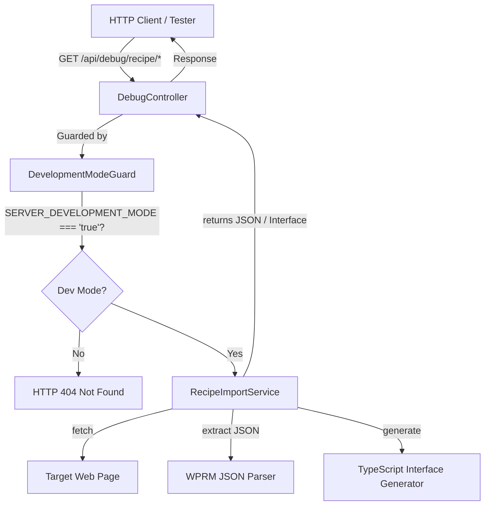

# Requirements

### Overview & Goals
Implement the initial foundation for the Recipe Import feature (Step 1) in the `api` NestJS backend application. This provides:
1. `RecipeImportService` inside `apps/api/src/app/recipes/` to fetch web pages, extract embedded WP Recipe Maker (WPRM) recipe JSON from `window.wprm_recipes` assignments, and generate TypeScript interfaces describing the structure of imported recipes.
2. `DebugController` with path prefix `debug` (mounted at `/api/debug`), enabled exclusively when the `SERVER_DEVELOPMENT_MODE` environment variable is set to `'true'`. If the flag is not `'true'`, all debug endpoints return HTTP 404.
3. Two debug endpoints:
   - `GET /api/debug/recipe/import?recipe-url=<url>` to retrieve and return raw parsed recipe data.
   - `GET /api/debug/recipe/interface?recipe-url=<url>` to dynamically generate and return a TypeScript interface string wrapped in a JSON object.

### Scope
#### In Scope
- **RecipeImportService**:
  - `fetchRecipeAsTextFromUrl(url: string)`: Fetch page HTML, locate `window.wprm_recipes` assignment, extract JSON text, or throw an exception if not found.
  - `fetchRecipeFromUrl(url: string)`: Call `fetchRecipeAsTextFromUrl`, parse the extracted JSON, and return the recipe object typed as `any`.
  - `generateTypeScriptInterface(url: string)`: Call `fetchRecipeFromUrl`, inspect result properties and data types, and format a TypeScript interface definition string.
  - Export and register in `RecipesModule`.
- **Development Mode Guard**:
  - `DevelopmentModeGuard` checking `process.env.SERVER_DEVELOPMENT_MODE === 'true'` and throwing `NotFoundException` (HTTP 404) otherwise.
- **DebugController & DebugModule**:
  - Dedicated controller mounted with prefix `'debug'`.
  - Publicly accessible without JWT authentication.
  - Guarded by `DevelopmentModeGuard`.
  - `GET /api/debug/recipe/import` endpoint with required `recipe-url` query param.
  - `GET /api/debug/recipe/interface` endpoint with required `recipe-url` query param returning `{ interface: string }`.
  - Wire into `AppModule`.
- **Testing**:
  - Unit tests for `RecipeImportService`, `DebugController`, and `DevelopmentModeGuard`.

#### Out of Scope
- Persisting imported recipes to the database (reserved for subsequent recipe import steps).
- Angular frontend UI components or import dialogs.
- Non-WPRM recipe markup extraction (e.g. schema.org microdata or json-ld parsers are not part of Step 1).

### User Stories
- **As a developer or tester**, I want to send a GET request to `/api/debug/recipe/import` with a recipe URL in development mode so that I can inspect the raw parsed WP Recipe Maker recipe data extracted from the target page.
- **As a developer**, I want to send a GET request to `/api/debug/recipe/interface` with a recipe URL so that I can inspect a generated TypeScript interface matching the target recipe structure to help create strongly typed models.
- **As a system administrator / security engineer**, I want all `/api/debug/*` endpoints to return HTTP 404 in production mode (`SERVER_DEVELOPMENT_MODE` not `'true'`) so that internal debug endpoints are never exposed publicly.

### Functional Requirements
- **`fetchRecipeAsTextFromUrl(url: string): Promise<string>`**:
  - Validates `url` argument.
  - Fetches the HTML content from the specified URL using native `fetch`.
  - Searches for `window.wprm_recipes` assignment (e.g., `window.wprm_recipes = { ... }` or `window.wprm_recipes[...] = { ... }`).
  - Extracts the JSON string payload assigned to `window.wprm_recipes`.
  - Throws an exception (e.g. `NotFoundException`) if the assignment is not found in the HTML.
  - Returns the extracted JSON string.
- **`fetchRecipeFromUrl(url: string): Promise<any>`**:
  - Calls `fetchRecipeAsTextFromUrl(url)`.
  - Parses the JSON string into a JavaScript object (`JSON.parse`).
  - Returns the parsed object with return type `any`.
- **`generateTypeScriptInterface(url: string): Promise<string>`**:
  - Calls `fetchRecipeFromUrl(url)`.
  - Iterates over the keys/properties of the recipe object and generates a formatted TypeScript interface string (e.g., `export interface Recipe { ... }`).
  - Handles string, number, boolean, array, object, and null/undefined values.
  - Returns the generated interface string.
- **`GET /api/debug/recipe/import`**:
  - Query parameter: `recipe-url` (required string). Returns HTTP 400 if missing or empty.
  - Calls `RecipeImportService.fetchRecipeFromUrl(recipeUrl)`.
  - Returns HTTP 200 with JSON recipe data.
- **`GET /api/debug/recipe/interface`**:
  - Query parameter: `recipe-url` (required string). Returns HTTP 400 if missing or empty.
  - Calls `RecipeImportService.generateTypeScriptInterface(recipeUrl)`.
  - Returns HTTP 200 with `{ "interface": string }`.
- **Environment Flag & HTTP 404 Response**:
  - If `SERVER_DEVELOPMENT_MODE` is not `'true'`, all requests to `/api/debug/*` must immediately fail with HTTP status code 404 (`NotFoundException`).

### Non-Functional Requirements
- **Coding Conventions**: Follow NestJS dependency injection patterns and the TypeScript skill rules (regular methods in NestJS classes, `readonly` properties, camelCase constants, proper exception handling).
- **Security**: Debug endpoints must be strictly blocked with HTTP 404 when `SERVER_DEVELOPMENT_MODE` is not `'true'`.
- **Resilience**: Handle network timeouts/errors gracefully when fetching remote URLs.

# Technical Design

### Current Implementation
- `apps/api/src/main.ts`: Configures global prefix `'api'` and global `ValidationPipe({ whitelist: true, transform: true })`.
- `apps/api/src/app/recipes/recipes.module.ts`: Currently imports `PrismaModule` and `GalleriesModule`, registers `RecipesController`, and provides/exports `RecipesService`.
- `apps/api/src/app/app.module.ts`: Root module importing domain feature modules (`AuthModule`, `ConfigurationsModule`, `DashboardModule`, `FileManagementModule`, `GalleriesModule`, `RecipesModule`, `SharingModule`, `ShoppingListsModule`, `UsersModule`).
- `apps/api/src/app/cors.config.ts`: Demonstrates checking `process.env.SERVER_DEVELOPMENT_MODE === 'true'`.

### Key Decisions
1. **Module Structure for Debug**:
   - Create a dedicated feature module `DebugModule` under `apps/api/src/app/debug/debug.module.ts` and controller `apps/api/src/app/debug/debug.controller.ts`.
   - `DebugModule` imports `RecipesModule` to consume `RecipeImportService`.
   - `AppModule` imports `DebugModule`. This keeps general debug features cleanly decoupled from the domain-specific `RecipesModule`, while allowing future debug endpoints to be added easily.
2. **Development Mode Guarding**:
   - Implement `DevelopmentModeGuard` implementing `CanActivate`.
   - When `process.env.SERVER_DEVELOPMENT_MODE !== 'true'`, throw `NotFoundException()`.
   - In NestJS, throwing `NotFoundException` in a guard causes the built-in HTTP exception filter to return an HTTP 404 response status code, fulfilling the exact requirement: *"If SERVER_DEVELOPMENT_MODE is not true, all endpoints should return 404 HTTP status code."*
3. **Public Controller Without JWT Auth**:
   - Unlike `RecipesController` which uses `@UseGuards(JwtAuthGuard)`, `DebugController` will only use `@UseGuards(DevelopmentModeGuard)`. It does not apply `JwtAuthGuard`, satisfying the requirement to be publicly accessible.
4. **WPRM JSON Extraction Strategy**:
   - In WordPress pages using WP Recipe Maker, recipe data is typically embedded as:
     `window.wprm_recipes = { ... };` or `window.wprm_recipes[<id>] = { ... };`
   - The service will locate the `window.wprm_recipes` assignment with a regex matching `window\.wprm_recipes(?:\s*\[[^\]]+\])?\s*=`.
   - From the assignment match, locate the start character `{` or `[` and extract the balanced JSON string using brace/bracket depth matching to avoid regex truncation or greediness issues.
   - If no valid assignment is found, throw `NotFoundException('window.wprm_recipes assignment not found in the provided URL')`.
5. **Return Type `any` for `fetchRecipeFromUrl`**:
   - Following the explicit specification: *"Use return type `any` for now - we need to analyze the incoming data to generate a correct interface."*
6. **Interface Generator**:
   - Generates clean TypeScript code:
     ```typescript
     export interface Recipe {
       [key: string]: ...;
     }
     ```
   - Recursively or inductively maps primitives (`string`, `number`, `boolean`), arrays (`string[]`, `number[]`, `any[]`, `Record<string, any>[]`), and nested objects.

### Proposed Changes

#### 1. `RecipeImportService` (`apps/api/src/app/recipes/recipe-import.service.ts`)
```typescript
@Injectable()
export class RecipeImportService {
  async fetchRecipeAsTextFromUrl(url: string): Promise<string>;
  async fetchRecipeFromUrl(url: string): Promise<any>;
  async generateTypeScriptInterface(url: string): Promise<string>;
  private extractWprmJson(html: string): string;
  private buildTypeScriptInterface(data: Record<string, unknown>, interfaceName?: string): string;
}
```

#### 2. Update `RecipesModule` (`apps/api/src/app/recipes/recipes.module.ts`)
- Add `RecipeImportService` to `providers` and `exports`.

#### 3. `DevelopmentModeGuard` (`apps/api/src/app/debug/guards/development-mode.guard.ts`)
```typescript
@Injectable()
export class DevelopmentModeGuard implements CanActivate {
  canActivate(): boolean {
    if (process.env['SERVER_DEVELOPMENT_MODE'] !== 'true') {
      throw new NotFoundException();
    }
    return true;
  }
}
```

#### 4. `DebugController` (`apps/api/src/app/debug/debug.controller.ts`)
```typescript
@Controller('debug')
@UseGuards(DevelopmentModeGuard)
export class DebugController {
  constructor(private readonly recipeImportService: RecipeImportService) {}

  @Get('recipe/import')
  async importRecipe(@Query('recipe-url') recipeUrl: string): Promise<any>;

  @Get('recipe/interface')
  async getRecipeInterface(@Query('recipe-url') recipeUrl: string): Promise<{ interface: string }>;
}
```

#### 5. `DebugModule` (`apps/api/src/app/debug/debug.module.ts`) & `AppModule` (`apps/api/src/app/app.module.ts`)
- `DebugModule` imports `RecipesModule` and declares `DebugController` and `DevelopmentModeGuard`.
- `AppModule` imports `DebugModule`.

### Components
- **`RecipeImportService`**: Core domain logic for fetching web content, parsing JavaScript assignments, and generating interfaces.
- **`DebugController`**: HTTP controller exposing `/api/debug/recipe/import` and `/api/debug/recipe/interface`.
- **`DevelopmentModeGuard`**: Guard enforcing availability only when `SERVER_DEVELOPMENT_MODE === 'true'`.
- **`DebugModule`**: NestJS module orchestrating debug routes and service injection.

### File Structure
- Added:
  - `apps/api/src/app/recipes/recipe-import.service.ts`
  - `apps/api/src/app/recipes/recipe-import.service.spec.ts`
  - `apps/api/src/app/debug/debug.controller.ts`
  - `apps/api/src/app/debug/debug.controller.spec.ts`
  - `apps/api/src/app/debug/debug.module.ts`
  - `apps/api/src/app/debug/guards/development-mode.guard.ts`
  - `apps/api/src/app/debug/guards/development-mode.guard.spec.ts`
- Modified:
  - `apps/api/src/app/recipes/recipes.module.ts` (export `RecipeImportService`)
  - `apps/api/src/app/app.module.ts` (import `DebugModule`)

### Architecture Diagram


### Risks & Mitigations
- **Risk: HTML contains multiple script tags or complex formatting.**
  - *Mitigation*: The extractor locates `window.wprm_recipes` specifically and parses balanced curly braces `{ ... }` accounting for escaped quotes and nested structures.
- **Risk: Remote URL fetch failures or slow requests.**
  - *Mitigation*: Set a reasonable timeout on `fetch` and handle network errors with descriptive exceptions (`BadRequestException` or `BadGatewayException`).
- **Risk: Production exposure of debug routes.**
  - *Mitigation*: The `DevelopmentModeGuard` defaults to throwing `NotFoundException` unless `SERVER_DEVELOPMENT_MODE === 'true'`. Unit tests will explicitly verify that false and undefined states result in 404.

# Testing

### Validation Approach
Automated unit tests using Jest covering the service, controller, and guard logic. Test suites will mock network calls and environment variables to ensure fast, deterministic execution without external dependencies.

### Key Scenarios
1. **Recipe Text Fetching (`fetchRecipeAsTextFromUrl`)**:
   - Given an HTML string containing `window.wprm_recipes = { "id": 1, "name": "Apple Pie" };`, the method extracts and returns the exact JSON string `'{"id":1,"name":"Apple Pie"}'`.
   - Given an HTML string containing `window.wprm_recipes[101] = { "id": 101, "name": "Pasta" };`, the method extracts the object correctly.
2. **Recipe Object Fetching (`fetchRecipeFromUrl`)**:
   - Calls `fetchRecipeAsTextFromUrl` and correctly parses the returned string into a JavaScript object.
3. **TypeScript Interface Generation (`generateTypeScriptInterface`)**:
   - Given a parsed recipe object with various properties (`id`: number, `name`: string, `ingredients`: string[]/object[], `rating`: object), it produces a valid TypeScript interface string including field names and types.
4. **Debug Controller Endpoints**:
   - `GET /api/debug/recipe/import?recipe-url=https://example.com/recipe`: passes URL to `fetchRecipeFromUrl` and returns JSON.
   - `GET /api/debug/recipe/interface?recipe-url=https://example.com/recipe`: passes URL to `generateTypeScriptInterface` and returns `{ interface: string }`.
   - Missing or empty `recipe-url` query param returns HTTP 400 Bad Request.
5. **Development Mode Guard**:
   - With `process.env.SERVER_DEVELOPMENT_MODE = 'true'`, guard allows execution (`canActivate` returns `true`).
   - With `process.env.SERVER_DEVELOPMENT_MODE = 'false'`, guard throws `NotFoundException`.
   - With `SERVER_DEVELOPMENT_MODE` unset/undefined, guard throws `NotFoundException`.

### Edge Cases
- HTML page without `window.wprm_recipes`: Throws `NotFoundException` / exception.
- Remote URL is invalid or returns HTTP 404 / 500: Throws descriptive exception.
- WPRM recipe object contains special characters or spaces in keys: Generator handles quoted property keys properly.
- Empty or malformed JSON in `window.wprm_recipes`: Throws error on parsing.

### Test Changes
- New test files:
  - `apps/api/src/app/recipes/recipe-import.service.spec.ts`
  - `apps/api/src/app/debug/debug.controller.spec.ts`
  - `apps/api/src/app/debug/guards/development-mode.guard.spec.ts`
- Verification commands:
  - `npx nx test api --testPathPatterns="(recipes|debug)"`

# Delivery Steps

### ✓ Step 1: Implement RecipeImportService in Recipes Module
The `RecipeImportService` is implemented in the `recipes` feature and exported for use by other modules.

- Create `apps/api/src/app/recipes/recipe-import.service.ts` implementing `fetchRecipeAsTextFromUrl`, `fetchRecipeFromUrl`, and `generateTypeScriptInterface`.
- Implement robust HTML fetching and JSON extraction from `window.wprm_recipes` assignments (supporting both direct object assignments and indexed assignments with balanced bracket extraction), throwing an exception when not found.
- Implement TypeScript interface generation iterating through recipe properties and producing typed interface declarations.
- Register `RecipeImportService` in `providers` and `exports` within `apps/api/src/app/recipes/recipes.module.ts`.

### ✓ Step 2: Implement DevelopmentModeGuard, DebugController, and DebugModule
The `DebugController` and `DevelopmentModeGuard` are created and exposed under `/api/debug` guarded by `SERVER_DEVELOPMENT_MODE`.

- Create `apps/api/src/app/debug/guards/development-mode.guard.ts` that validates `process.env.SERVER_DEVELOPMENT_MODE === 'true'` and throws `NotFoundException` (HTTP 404) when false or absent.
- Create `apps/api/src/app/debug/debug.controller.ts` with prefix `'debug'`, injecting `RecipeImportService`.
- Implement `GET /api/debug/recipe/import` taking required query parameter `recipe-url` and returning recipe JSON.
- Implement `GET /api/debug/recipe/interface` taking required query parameter `recipe-url` and returning `{ interface: string }`.
- Create `apps/api/src/app/debug/debug.module.ts` importing `RecipesModule` and registering `DebugController` and `DevelopmentModeGuard`.
- Register `DebugModule` in `apps/api/src/app/app.module.ts`.

### ✓ Step 3: Add Comprehensive Unit Tests for Service, Controller, and Guard
Unit tests validate recipe HTML parsing, interface generation, controller routing, query validation, and environment gating.

- Create `apps/api/src/app/recipes/recipe-import.service.spec.ts` testing successful extraction, missing assignment exception handling, JSON parsing, and interface generation for various field types.
- Create `apps/api/src/app/debug/guards/development-mode.guard.spec.ts` testing HTTP 404 behavior when `SERVER_DEVELOPMENT_MODE` is disabled or missing versus passing when enabled.
- Create `apps/api/src/app/debug/debug.controller.spec.ts` verifying parameter validation and service delegations for both import and interface endpoints.
- Run `npx nx test api --testPathPatterns="(recipes|debug)"` to ensure all tests pass.