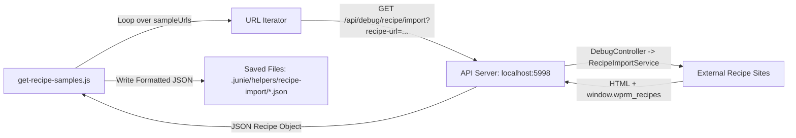

# Requirements

### Overview & Goals
Step 2 of the `Recipe Import` feature gathers real-world sample recipe payloads from the web for subsequent analysis and data model design.
To accomplish this, a standalone Node.js helper script `get-recipe-samples.js` will be created inside `.junie/helpers/recipe-import`. The script will query the `DebugController`'s `importRecipe` endpoint (`/api/debug/recipe/import`) on the locally running API server (`http://localhost:5998/`), fetch parsed WP Recipe Maker (WPRM) recipe data for a predefined set of URLs, and persist each JSON response to disk with a filename containing the target domain name.

### Scope
#### In Scope
- Create `.junie/helpers/recipe-import/get-recipe-samples.js`.
- Define an extensible array of target recipe URLs containing the required initial URLs:
  - `https://rasamalaysia.com/sesame-chicken/`
  - `https://thestayathomechef.com/sheet-pan-sausage-and-veggies/`
  - `https://mykoreankitchen.com/tteokbokki-spicy-rice-cakes/`
- Target the API server running on `http://localhost:5998/` (with optional environment variable override).
- Call `GET /api/debug/recipe/import?recipe-url=<encoded_url>`.
- Automatically ensure the destination directory `.junie/helpers/recipe-import` exists before writing.
- Derive output file names from the URL domain name (e.g. `rasamalaysia.com.json`, `thestayathomechef.com.json`, `mykoreankitchen.com.json`).
- Format saved JSON files with 2-space indentation for human readability.
- Add descriptive terminal logs reporting progress, success, and any fetch or server errors.
- Optional convenience script in `package.json` for running the helper.

#### Out of Scope
- Modifying `apps/api/src/app/debug/debug.controller.ts` or `RecipeImportService` (already implemented and verified in Step 1).
- Parsing or transforming the recipe JSON structure into internal entities or database models (reserved for subsequent steps).
- Frontend UI components or import dialogs.

### User Stories
- **As a developer**, I want to execute a helper script that calls the API's debug import endpoint for sample recipe URLs so that I can automatically obtain and inspect representative recipe data payloads from different domains.
- **As a developer**, I want the sample URLs array in `get-recipe-samples.js` to be easily editable so that I can add more sample recipe URLs whenever new edge cases or structures need to be evaluated.
- **As a developer**, I want sample JSON files to be named using their source domain and saved in `.junie/helpers/recipe-import` so that I can quickly identify and analyze sample outputs from different recipe publishers.

### Functional Requirements
- **FR-1**: The script must be placed at `.junie/helpers/recipe-import/get-recipe-samples.js` and executable with Node.js (`node .junie/helpers/recipe-import/get-recipe-samples.js`).
- **FR-2**: Target sample URLs must be declared in an array of strings at the top level of the script to make future additions straightforward.
- **FR-3**: The script must call the API endpoint `GET /api/debug/recipe/import` with query parameter `recipe-url` URL-encoded.
- **FR-4**: The default API server address must be `http://localhost:5998`, with support for overriding via an environment variable (`API_BASE_URL` or `PORT`).
- **FR-5**: The script must extract the domain name (hostname) from each sample URL using standard URL parsing (e.g. `rasamalaysia.com`).
- **FR-6**: Each response must be saved as a `.json` file in `.junie/helpers/recipe-import/` with a filename containing the domain name (e.g. `${domain}.json`).
- **FR-7**: If the output directory `.junie/helpers/recipe-import` does not exist, the script must create it recursively.
- **FR-8**: If an individual URL fails to fetch or parse, the script must log an informative error message and continue processing remaining URLs.

### Non-Functional Requirements
- **Runtime**: Must run on Node.js 18+ without external third-party runtime dependencies (leveraging native `fetch`, `node:fs/promises`, `node:path`, and `node:url`).
- **Code Style**: Conforms to the repository's `dprint` formatting conventions (single quotes, 2-space indentation, camelCase constants and helper functions).
- **Usability**: Clear console output indicating which URL is being processed, the HTTP status, and where the output file was saved.

# Technical Design

### Current Implementation
- `apps/api/src/app/debug/debug.controller.ts`:
  - Exposes `@Get('recipe/import')` mounted under global prefix `api` -> `GET /api/debug/recipe/import?recipe-url=<url>`.
  - Accepts `@Query('recipe-url') recipeUrl: string`.
  - Guarded by `DevelopmentModeGuard` (requires `SERVER_DEVELOPMENT_MODE === 'true'`).
  - Calls `RecipeImportService.fetchRecipeFromUrl(recipeUrl)` which returns the raw parsed WPRM recipe object.
- `apps/api/src/main.ts`:
  - Configures global prefix `api`.
  - Reads `const port = process.env.SERVER_HTTP_PORT || 3000;`. The specification notes the local development server for this task is running on `http://localhost:5998/`.

### Key Decisions
1. **Script Type & Module System**:
   - Use Node.js CommonJS (`require('node:fs/promises')`, `require('node:path')`, `require('node:url')`) because the root `package.json` does not set `"type": "module"`.
   - Native `fetch` is globally available in modern Node.js versions (Node 18+), avoiding additional npm dependencies.
2. **Output Filename Pattern**:
   - Parse `new URL(sampleUrl).hostname` (stripping leading `www.` if present) to construct the filename: `<domain>.json` (e.g. `rasamalaysia.com.json`, `thestayathomechef.com.json`, `mykoreankitchen.com.json`).
   - If multiple sample URLs share the same domain in the future, the script can append the URL path slug (e.g. `<domain>-<slug>.json`) to prevent collisions while strictly satisfying the requirement that the filename contains the domain name.
3. **Target Directory Resolution**:
   - Resolve the target folder relative to `__dirname` (`path.resolve(__dirname)`), ensuring the script executes identically whether run from the project root or from within the directory itself.
4. **Resilience & Batch Execution**:
   - Process URLs sequentially (or with `Promise.allSettled`) using `try / catch` per URL so that a failure on one target does not abort the entire sample collection process.
   - If the API server is unreachable (e.g. `ECONNREFUSED`), print an explicit notice reminding the developer to ensure the API server is running on `http://localhost:5998/` with `SERVER_DEVELOPMENT_MODE=true`.

### Proposed Changes
1. **Create `.junie/helpers/recipe-import/get-recipe-samples.js`**:
   - Define `SAMPLE_URLS` array:
     ```javascript
     const sampleUrls = [
       'https://rasamalaysia.com/sesame-chicken/',
       'https://thestayathomechef.com/sheet-pan-sausage-and-veggies/',
       'https://mykoreankitchen.com/tteokbokki-spicy-rice-cakes/'
     ];
     ```
   - Define API base URL:
     ```javascript
     const apiBaseUrl = process.env.API_BASE_URL || 'http://localhost:5998';
     ```
   - Implement `sanitizeFilename(url)` helper:
     ```javascript
     function getOutputFileName(urlString) {
       const parsed = new URL(urlString);
       const domain = parsed.hostname.replace(/^www\./, '');
       return `${domain}.json`;
     }
     ```
   - Main execution function `fetchAndSaveSamples()`:
     - Ensure directory exists: `await fs.mkdir(outputDir, { recursive: true })`.
     - For each URL:
       - Construct endpoint: `${apiBaseUrl}/api/debug/recipe/import?recipe-url=${encodeURIComponent(url)}`.
       - Fetch with `fetch(endpoint)`.
       - If response is not ok, log error with HTTP status and response text.
       - Parse JSON response, serialize with `JSON.stringify(data, null, 2) + '\n'`.
       - Write to `path.join(outputDir, filename)`.
       - Log success message.
2. **Update `package.json`**:
   - Add script entry `"samples:recipe-import": "node .junie/helpers/recipe-import/get-recipe-samples.js"` for team convenience.

### Architecture Diagram


### File Structure
- `.junie/helpers/recipe-import/get-recipe-samples.js` (added)
- `package.json` (modified: npm script added)
- `.junie/helpers/recipe-import/rasamalaysia.com.json` (generated upon script execution)
- `.junie/helpers/recipe-import/thestayathomechef.com.json` (generated upon script execution)
- `.junie/helpers/recipe-import/mykoreankitchen.com.json` (generated upon script execution)

### Risks & Mitigations
- **Risk**: API server not running on port 5998 when script is executed.
  - *Mitigation*: Catch `ECONNREFUSED` / network errors and log a clear instruction: `Error: Unable to connect to http://localhost:5998/. Ensure the API server is running with SERVER_DEVELOPMENT_MODE=true.`
- **Risk**: Target website rate limits or blocks API fetch request.
  - *Mitigation*: The script logs the error from the API response and continues to the next URL, preventing entire batch failure.
- **Risk**: Multiple sample URLs from the same domain overwriting each other.
  - *Mitigation*: Include domain in the filename as required, and use either `<domain>.json` or `<domain>-<slug>.json` if collisions exist.

# Testing

### Validation Approach
Verification of the helper script involves checking code quality, verifying directory and file creation, and executing the script against the running backend to validate that all three expected JSON files are generated with valid recipe payloads.

### Key Scenarios
1. **Array of Sample URLs**:
   - Confirm all three URLs from the specification are defined in `sampleUrls`:
     - `https://rasamalaysia.com/sesame-chicken/`
     - `https://thestayathomechef.com/sheet-pan-sausage-and-veggies/`
     - `https://mykoreankitchen.com/tteokbokki-spicy-rice-cakes/`
   - Confirm new URLs can be appended to the array without changing other code.
2. **Endpoint Construction & Execution**:
   - Run the script with `node .junie/helpers/recipe-import/get-recipe-samples.js` (or `npm run samples:recipe-import`).
   - Confirm request targets `http://localhost:5998/api/debug/recipe/import?recipe-url=<encoded_url>`.
   - Verify terminal prints status messages for each URL.
3. **File Output & Domain Naming**:
   - Verify files are saved in `.junie/helpers/recipe-import/`.
   - Verify filenames contain the domain name of the sample URL:
     - `rasamalaysia.com.json`
     - `thestayathomechef.com.json`
     - `mykoreankitchen.com.json`
   - Verify each file contains valid, indented JSON representing the WPRM recipe object.

### Edge Cases
1. **API Server Not Running**:
   - Execute script when `http://localhost:5998` is stopped.
   - Verify script does not crash with an unhandled rejection, but outputs an actionable error message.
2. **HTTP 404 / Dev Mode Disabled**:
   - If `SERVER_DEVELOPMENT_MODE` is disabled on the server, endpoint returns HTTP 404.
   - Verify script logs the 404 status and continues gracefully.
3. **Output Directory Missing**:
   - Delete `.junie/helpers/recipe-import` and run the script.
   - Verify directory is automatically created (`mkdir -p` behavior).

### Test Changes
- Run `npm run format:check` to ensure `get-recipe-samples.js` passes repository formatting checks.
- Execute `node .junie/helpers/recipe-import/get-recipe-samples.js` and verify output files.

# Delivery Steps

### ✓ Step 1: Implement the recipe samples helper script
The Node.js helper script is implemented to iterate over configured recipe URLs, query the debug API, and save formatted JSON files named by domain.

- Create `.junie/helpers/recipe-import/get-recipe-samples.js` using Node.js built-ins (`node:fs/promises`, `node:path`, `node:url`).
- Define the array of target sample recipe URLs (`https://rasamalaysia.com/sesame-chicken/`, `https://thestayathomechef.com/sheet-pan-sausage-and-veggies/`, `https://mykoreankitchen.com/tteokbokki-spicy-rice-cakes/`).
- Support an API base URL (defaulting to `http://localhost:5998`) with support for environment override (`API_BASE_URL` or `SERVER_HTTP_PORT`).
- Implement domain name extraction using `new URL(sampleUrl).hostname` to generate filenames (e.g. `rasamalaysia.com.json`).
- Ensure target output directory `.junie/helpers/recipe-import` is created if it does not already exist via `fs.mkdir(..., { recursive: true })`.
- Fetch each recipe from `/api/debug/recipe/import?recipe-url=${encodeURIComponent(url)}`, format the JSON payload with 2-space indentation, and write each response to disk.
- Include structured console logging for request status, file saving confirmation, and descriptive error diagnostics if the API server or network call fails.

### ✓ Step 2: Add npm script entry and validate execution
The helper script is registered in package.json and validated against code quality and execution requirements.

- Add a convenience script command in `package.json` (e.g. `"samples:recipe-import": "node .junie/helpers/recipe-import/get-recipe-samples.js"`).
- Run code formatter check (`npm run format:check`) and format the script to conform to project `dprint` standards.
- Validate script execution against a running instance of the API server (or verified endpoint) to ensure all 3 JSON sample files are created with valid parsed recipe data in `.junie/helpers/recipe-import`.