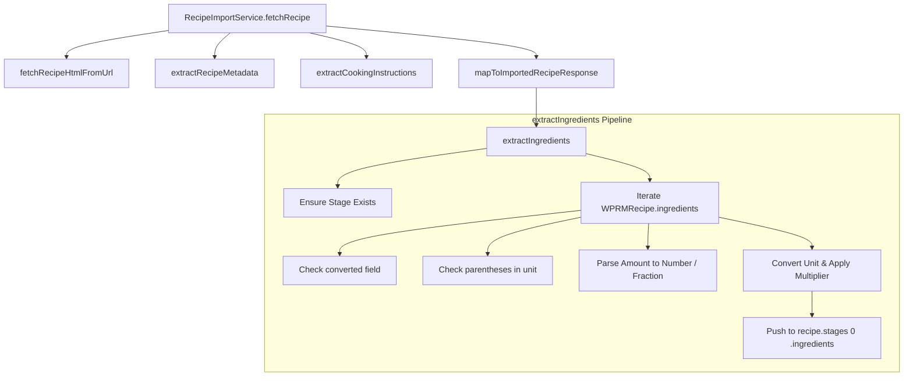

# Requirements

### Overview & Goals
This is the fifth step of the Recipe Import feature. It extends `RecipeImportService` to extract ingredient information from WP Recipe Maker (`WPRMRecipe`) metadata and populate `ImportedRecipeResponse.stages[0].ingredients` with typed `ImportedRecipeIngredient` objects. It resolves third-party unit variations and conversions to align with the application's `IngredientUnit` enum (`GRAMS`, `TBSP`, `TSP`, `ITEM_COUNT`), including handling parenthesized unit conversions, pre-converted values, and unit weight conversions.

### Scope
- **In Scope:**
  - Adding `extractIngredients(metadata: WPRMRecipe, recipe: ImportedRecipeResponse): void` to `RecipeImportService`.
  - Adding fallback stage creation: if `recipe.stages` is empty, initialize a stage with `name: null`, `steps: []`, and `ingredients: []`.
  - Populating the first stage (`stages[0].ingredients`) with mapped `ImportedRecipeIngredient` objects.
  - Mapping and normalizing fields:
    - `name`: mapped from `WPRMRecipeIngredient.name` (trimmed string, defaulting to `""` if missing).
    - `quantity`: parsed numeric value from `WPRMRecipeIngredient.amount`, supporting integers, decimals, fractions (`1/2`), and mixed fractions (`1 1/2`), defaulting to `0` when empty or non-numeric.
    - `unit`: normalized to lowercase and mapped to `IngredientUnit` (`GRAMS`, `TBSP`, `TSP`, `ITEM_COUNT`).
  - Unit conversion and resolution rules:
    - `g`, `gram`, `grams`, `ml` -> `IngredientUnit.GRAMS`
    - `tbsp`, `tablespoon`, `tablespoons` -> `IngredientUnit.TBSP`
    - `tsp`, `teaspoon`, `teaspoons` -> `IngredientUnit.TSP`
    - `cup`, `cups` -> `IngredientUnit.GRAMS` (1 cup = 237 grams)
    - `pound`, `pounds`, `lb`, `lbs`, `lbs.` -> `IngredientUnit.GRAMS` (1 pound = 454 grams)
    - `oz`, `oz.`, `ounce`, `ounces` -> `IngredientUnit.GRAMS` (1 ounce = 28.35 grams)
    - Parenthesized unit strings (e.g. `oz. (230g)`) -> extract parenthesized amount and unit if describing a known unit.
    - `converted` field in `WPRMRecipeIngredient` -> use converted amount and unit if it contains a supported unit that does not require conversion (e.g. `g`, `ml`, `tbsp`, `tsp`).
    - All unknown, unrecognized, or empty units -> `IngredientUnit.ITEM_COUNT`.
  - Updating `mapToImportedRecipeResponse` in `RecipeImportService` to call `extractIngredients` after other recipe attributes are mapped.
  - Adding unit tests in `apps/api/src/app/recipes/recipe-import.service.spec.ts` covering all mapping paths, conversions, edge cases, and full-response data samples.
- **Out of Scope:**
  - Database schema changes (the existing `IngredientUnit` enum and Prisma schema already support `GRAMS`, `ITEM_COUNT`, `TSP`, `TBSP`).
  - Recipe image importing and downloading (handled in future steps).
  - Persistence to the database (handled in future steps).
  - Frontend UI components for recipe import (handled in future steps).

### User Stories
- As an API developer / system user, I want imported recipe responses to include structured, normalized ingredients so that imported recipes have standardized quantities and units ready for cooking and shopping lists.
- As a user importing recipes from diverse food blogs, I want units like cups, ounces, and pounds automatically converted to metric grams, and compound units like `oz. (230g)` accurately parsed, so that my recipe measurements are consistent and easy to follow.

### Functional Requirements
- **FR-1 (Method Signature & Contract):**
  - `RecipeImportService` must define `extractIngredients(metadata: WPRMRecipe, recipe: ImportedRecipeResponse): void`.
  - It accepts `metadata` as `WPRMRecipe` and `recipe` as `ImportedRecipeResponse`.
- **FR-2 (Stage Initialization):**
  - If `recipe.stages` is empty or undefined, `extractIngredients` must create a new stage `{ name: null, steps: [], ingredients: [] }`.
  - Extracted ingredients must be added to the first stage (`recipe.stages[0].ingredients`).
- **FR-3 (Field Mapping & Defensive Parsing):**
  - `name`: string from `WPRMRecipeIngredient.name`, trimmed; falls back to `""` if missing/malformed.
  - `quantity`: numeric value from parsed amount, adjusted by unit conversion factors; falls back to `0` if amount is missing or unparseable.
  - `unit`: `IngredientUnit` enum value.
- **FR-4 (Converted Field Resolution):**
  - If `WPRMRecipeIngredient.converted` is present and contains an entry whose unit does not require conversion (i.e. already maps directly to `GRAMS`, `TBSP`, or `TSP`), use that converted entry's amount and unit instead of the base unit.
- **FR-5 (Parenthesized Unit Resolution):**
  - If the unit string includes a parenthesized measurement (e.g. `oz. (230g)`), extract the numeric value and unit within the parentheses. If that unit is a known unit, use it instead.
- **FR-6 (Unit Normalization & Conversion):**
  - Unit strings must be trimmed and converted to lowercase before matching.
  - `g`, `gram`, `grams` -> `GRAMS` (factor 1).
  - `ml` -> `GRAMS` (factor 1).
  - `tbsp`, `tablespoon`, `tablespoons` -> `TBSP` (factor 1).
  - `tsp`, `teaspoon`, `teaspoons` -> `TSP` (factor 1).
  - `cup`, `cups` -> `GRAMS` (quantity * 237).
  - `pound`, `pounds`, `lb`, `lbs`, `lbs.` -> `GRAMS` (quantity * 454).
  - `oz`, `oz.`, `ounce`, `ounces` -> `GRAMS` (quantity * 28.35).
  - Any unknown unit or empty string -> `ITEM_COUNT`.
- **FR-7 (Pipeline Integration):**
  - `mapToImportedRecipeResponse` must call `extractIngredients` before returning the `ImportedRecipeResponse`.

### Non-Functional Requirements
- **Type Safety:** Strict TypeScript typing throughout; no use of `any`.
- **Robustness:** Third-party data may contain missing fields, unexpected casing, unicode characters, or malformed strings; parsing must not throw unhandled exceptions.
- **Code Standards:** Follow NestJS class method conventions, maintain immutable class properties, and keep internal helpers `private`.

# Technical Design

### Current Implementation
- `RecipeImportService` (`apps/api/src/app/recipes/recipe-import.service.ts`):
  - Fetches recipe HTML via `fetchRecipeHtmlFromUrl`.
  - Extracts metadata via `extractRecipeMetadata(html): WPRMRecipe`.
  - Extracts cooking instructions via `extractCookingInstructions(html): RecipeInstructionGroup[]`.
  - Assembles the response via `mapToImportedRecipeResponse`, currently returning `stages` with empty `ingredients: []`.
- `wprm.types.ts` (`apps/api/src/app/recipes/recipe-import/wprm.types.ts`):
  - Defines `WPRMRecipe`, `WPRMRecipeIngredient`, `WPRMRecipeUnitConversion`, and related types.
- `recipe-response.dto.ts` (`apps/api/src/app/recipes/dto/recipe-response.dto.ts`):
  - Defines `ImportedRecipeResponse`, `ImportedRecipeStage`, and `ImportedRecipeIngredient` (`{ name: string; quantity: number; unit: IngredientUnit }`).
- `prisma/schema.prisma`:
  - `enum IngredientUnit`: `GRAMS`, `ITEM_COUNT`, `TSP`, `TBSP`.

### Key Decisions
1. **Public `extractIngredients` method on `RecipeImportService`:**
   - *Rationale:* The specification explicitly specifies `extractIngredients(metadata: WPRMRecipe, recipe: ImportedRecipeResponse)` as a requirement on `RecipeImportService`. Keeping it public allows direct unit testing and potential invocation from debug or controller workflows, consistent with `extractRecipeMetadata` and `extractCookingInstructions`.
2. **Prioritization order for unit and quantity extraction:**
   - *Rationale:*
     1. Check `ingredient.converted` dictionary for an entry with an already-converted unit that needs no conversion (e.g. `g`, `ml`, `tbsp`, `tsp`). If found, use its amount and unit.
     2. Otherwise, check if the raw unit contains parenthesized details with a known unit (e.g. `oz. (230g)` -> amount `230`, unit `g`).
     3. Otherwise, use the base `ingredient.amount` and `ingredient.unit`.
   - This order directly satisfies the specification requirements and matches actual WP Recipe Maker data structures observed in `.junie/helpers/full-responses`.
3. **Fraction parsing support for amounts:**
   - *Rationale:* Recipe amounts frequently appear as fractions (e.g. `"1/2"`) or mixed fractions (e.g. `"1 1/2"` in `tsahc-01.json`). Supporting fractional string parsing ensures accurate numeric conversion without returning `NaN`.
4. **Rounding converted quantities:**
   - *Rationale:* Multipliers like `28.35` (ounces to grams) can produce floating-point precision artifacts (e.g. `56.70000000000001`). Rounding to two decimal places (`Math.round(val * 100) / 100`) produces clean values while preserving precision.

### Proposed Changes

#### 1. `apps/api/src/app/recipes/recipe-import.service.ts`
- Import `IngredientUnit` from `@prisma/client`.
- Add public method:
  ```typescript
  extractIngredients(metadata: WPRMRecipe, recipe: ImportedRecipeResponse): void {
    if (!recipe.stages || recipe.stages.length === 0) {
      recipe.stages = [{
        name: null,
        steps: [],
        ingredients: []
      }];
    }

    const firstStage = recipe.stages[0];
    if (!firstStage.ingredients) {
      firstStage.ingredients = [];
    }

    if (!metadata || !Array.isArray(metadata.ingredients)) {
      return;
    }

    for (const ingredient of metadata.ingredients) {
      const parsed = this.parseWprmIngredient(ingredient);
      if (parsed) {
        firstStage.ingredients.push(parsed);
      }
    }
  }
  ```
- Add private helper methods:
  - `parseWprmIngredient(ingredient: WPRMRecipeIngredient): ImportedRecipeIngredient`
  - `parseAmount(amountStr: string | null | undefined): number`
  - `resolveUnitAndQuantity(ingredient: WPRMRecipeIngredient): { quantity: number; unit: IngredientUnit }`
  - `convertUnit(rawUnit: string, rawQuantity: number): { quantity: number; unit: IngredientUnit }`
  - `isDirectUnit(rawUnit: string): boolean`
- Update `mapToImportedRecipeResponse`:
  ```typescript
  const recipe: ImportedRecipeResponse = {
    name,
    cuisine: null,
    category: null,
    description: null,
    servings,
    source: sourceUrl,
    stages
  };

  this.extractIngredients(metadata, recipe);

  return recipe;
  ```

#### 2. `apps/api/src/app/recipes/recipe-import.service.spec.ts`
- Add unit tests for `extractIngredients`:
  - When `recipe.stages` is empty, creates a stage with `name: null`, `steps: []`, and populates `ingredients`.
  - When `recipe.stages` already has stages, populates the first stage and leaves subsequent stages intact.
  - Direct unit conversions (`g`, `gram`, `grams`, `ml` -> `GRAMS`; `tbsp`, `tablespoon`, `tablespoons` -> `TBSP`; `tsp`, `teaspoon`, `teaspoons` -> `TSP`).
  - Unit conversions with multipliers (`cup`/`cups` * 237 -> `GRAMS`; `pound`/`pounds`/`lb`/`lbs` * 454 -> `GRAMS`; `oz`/`oz.`/`ounce`/`ounces` * 28.35 -> `GRAMS`).
  - Parentheses parsing in unit (e.g. `"oz. (230g)"` -> `230 GRAMS`).
  - `converted` field bypass when unit does not require conversion (e.g. `converted: { "2": { amount: "680", unit: "g" } }`).
  - Fraction parsing (`"1/2"` -> 0.5, `"1 1/2"` -> 1.5).
  - Unknown units and empty unit strings defaulting to `ITEM_COUNT`.
  - Missing/empty amount strings defaulting to `0`.
  - Integration with `fetchRecipe` returning populated ingredients.

### Architecture Diagram



### Risks & Mitigations
- **Risk:** Variations in third-party fraction and range formats (e.g. `1 1/2`, `1-2`).
  - *Mitigation:* The amount parser checks for mixed fractions and splits by slash and space, and falls back to `0` or initial number on invalid format.
- **Risk:** Parenthesized strings containing non-unit text (e.g. `can (drained)`).
  - *Mitigation:* Parenthesis parser extracts candidate numbers and unit labels, but only adopts them if the extracted label matches a known unit; otherwise, it falls back to the original unit.

# Delivery Steps

### ✓ Step 1: Implement ingredient amount parsing and unit conversion logic
Unit conversion and numeric amount parsing rules are implemented with full support for fractions, unit normalization, known unit multipliers (cups, pounds, ounces, ml), and parenthesized unit extraction.

- Add helper methods in `RecipeImportService` to parse amount strings, handling whole numbers, decimals, fractions (e.g. `1/2`), mixed fractions (e.g. `1 1/2`), and safely defaulting missing or non-numeric strings to `0`.
- Add unit normalization and conversion logic to map raw strings to `IngredientUnit` (`GRAMS`, `TBSP`, `TSP`, `ITEM_COUNT`).
- Implement extraction of parenthesized values within unit strings (e.g. `oz. (230g)`) to adopt the parenthesized quantity and unit when it matches a known unit.
- Implement weight/volume conversion factors: 1 cup = 237g, 1 pound = 454g, 1 ounce = 28.35g, 1 ml = 1g, rounding converted quantities to two decimal places.
- Add unit tests validating amount parsing and unit conversions across standard units, edge cases, and parenthesized formats.

### ✓ Step 2: Implement extractIngredients and integrate into RecipeImportService
`RecipeImportService` extracts ingredients from WPRM metadata, resolves converted fields and parenthesized units, ensures stage initialization, and populates the first stage of `ImportedRecipeResponse`.

- Implement `extractIngredients(metadata: WPRMRecipe, recipe: ImportedRecipeResponse): void` on `RecipeImportService`.
- Ensure `recipe.stages` contains at least one stage; if empty, initialize a default stage with `name: null`, `steps: []`, and `ingredients: []`.
- Implement extraction from `metadata.ingredients`, checking `converted` field entries for units that do not require conversion before falling back to parenthesized or base units.
- Update `mapToImportedRecipeResponse` to invoke `this.extractIngredients(metadata, recipe)` after processing recipe metadata and instruction groups.
- Add comprehensive unit tests in `apps/api/src/app/recipes/recipe-import.service.spec.ts` covering empty stages, missing metadata, converted field prioritization, real data samples from `.junie/helpers/full-responses`, and full end-to-end `fetchRecipe` execution.
