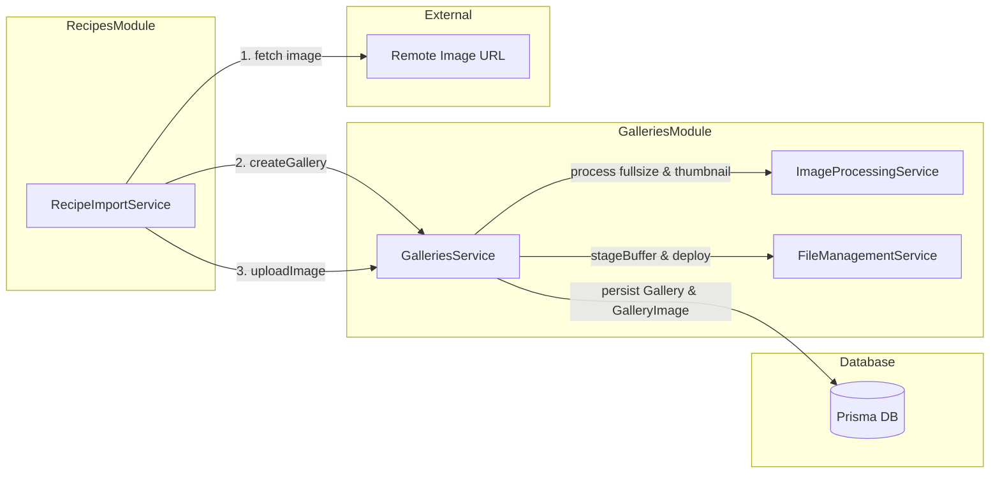

# Requirements

### Overview & Goals
This is the sixth step of the Recipe Import feature. Its purpose is to update `RecipeImportService` to import recipe hero images into an image gallery and link the resulting gallery ID to the `ImportedRecipeResponse` DTO (`galleryId`).

To support uploading images programmatically outside of standard HTTP multipart file uploads, `GalleriesService.uploadImage` is decoupled from the full `Express.Multer.File` interface to require only the properties actually accessed during image processing and persistence.

### Scope
- **In Scope:**
  - Adding `galleryId: string | null` to `ImportedRecipeResponse` DTO in `apps/api/src/app/recipes/dto/recipe-response.dto.ts`.
  - Decoupling `GalleriesService.uploadImage` in `apps/api/src/app/galleries/galleries.service.ts` by defining a lightweight `GalleryUploadFile` interface (`buffer`, `mimetype`, optional `size`) compatible with `Express.Multer.File`.
  - Injecting `GalleriesService` into `RecipeImportService`.
  - Implementing `fetchRecipeImage(imageUrl: string): Promise<string | null>` in `RecipeImportService`:
    - Fetching the image over HTTP/HTTPS.
    - Creating a new gallery via `GalleriesService.createGallery`.
    - Uploading the image buffer via `GalleriesService.uploadImage`.
    - Catching all errors and returning `null` on failure.
  - Updating `fetchRecipe` in `RecipeImportService`:
    - Checking if `WPRMRecipe.image_url` is a valid URL.
    - If valid, calling `fetchRecipeImage` and populating `ImportedRecipeResponse.galleryId`.
    - If invalid or missing, setting `ImportedRecipeResponse.galleryId` to `null`.
    - Ignoring all other thumbnail/image URLs present in `WPRMRecipe`.
  - Updating and expanding unit tests in `apps/api/src/app/recipes/recipe-import.service.spec.ts`, `apps/api/src/app/galleries/galleries.service.spec.ts`, and `apps/api/src/app/debug/debug.controller.spec.ts`.
- **Out of Scope:**
  - Persisting recipes to the database (addressed in separate recipe creation / import completion steps).
  - Processing or downloading thumbnail URLs from `WPRMRecipe` (`GalleriesService.uploadImage` generates thumbnails automatically).
  - Modifying the frontend UI components.

### User Stories
- As a user importing a recipe from an external website, I want the recipe's main photo to be automatically downloaded and stored in a new image gallery so that my imported recipe has high-quality visuals and automatically generated thumbnails without manual uploads.
- As an API developer, I want `GalleriesService.uploadImage` to accept memory buffers and plain objects so that background jobs, scrapers, and external integrations can upload gallery images without mocking HTTP request structures.

### Functional Requirements
- **FR-1 (DTO Extension):**
  - `ImportedRecipeResponse` must include a required field `galleryId: string | null`.
- **FR-2 (Decoupled File Interface):**
  - `GalleriesService.uploadImage` must type its `file` parameter with an interface that requires only `buffer: Buffer`, `mimetype: string`, and optional `size?: number`.
  - The interface must remain fully compatible with `Express.Multer.File` so existing controller endpoints function without alteration.
- **FR-3 (URL Validation):**
  - `RecipeImportService` must validate `WPRMRecipe.image_url`. A URL is valid if it is a non-empty string that parses into an HTTP or HTTPS URL (`http:` or `https:` protocol).
  - If `image_url` is not a valid URL (e.g. empty, malformed, non-HTTP/HTTPS, or missing), no image import is attempted and `galleryId` is set to `null`.
- **FR-4 (Image Fetching & Gallery Creation):**
  - `RecipeImportService` must expose `fetchRecipeImage(imageUrl: string): Promise<string | null>`.
  - It fetches the remote image buffer using global `fetch`.
  - It creates a gallery by invoking `GalleriesService.createGallery({ name: imageUrl })`.
  - It uploads the fetched image using `GalleriesService.uploadImage(gallery.id, { buffer, mimetype, size: buffer.length })`.
  - It returns the created gallery ID on success.
- **FR-5 (Defensive Error Handling):**
  - If any error occurs during `fetchRecipeImage` (such as a network error, non-200 HTTP response, unsupported image format, upload failure, or database error), the method must catch the error and return `null`.
  - Errors in image import must not fail the overall recipe import operation.
- **FR-6 (Pipeline Integration):**
  - In `RecipeImportService.fetchRecipe(url: string)`, after parsing metadata and instructions, if `metadata.image_url` is valid, `fetchRecipeImage` is called and its result assigned to `ImportedRecipeResponse.galleryId`.
  - If `metadata.image_url` is invalid or absent, `ImportedRecipeResponse.galleryId` is set to `null`.
  - Other image fields in `WPRMRecipe` (such as thumbnails or collection images) are ignored.

### Non-Functional Requirements
- **Type Safety:** No use of `any`; all parameters and return types must be strictly typed.
- **Resilience:** Remote image fetching is inherently prone to timeouts and 404s; failures must be handled gracefully without crashing or throwing exceptions from `fetchRecipe`.
- **Code Standards:** Adhere to NestJS service patterns, dependency injection conventions, and private internal helpers.

# Technical Design

### Current Implementation
- `ImportedRecipeResponse` (`apps/api/src/app/recipes/dto/recipe-response.dto.ts`):
  - Currently contains `name`, `cuisine`, `category`, `description`, `servings`, `source`, and `stages`. Does not have `galleryId`.
- `GalleriesService` (`apps/api/src/app/galleries/galleries.service.ts`):
  - `uploadImage(galleryId: string, file?: Express.Multer.File): Promise<GalleryImageDto>` currently takes `Express.Multer.File`.
  - Inside `uploadImage`, the only properties accessed are `file.buffer`, `file.mimetype`, and `file.size` (falling back to `file.buffer.length`).
- `RecipeImportService` (`apps/api/src/app/recipes/recipe-import.service.ts`):
  - Has no constructor dependencies currently.
  - Implements `fetchRecipe(url: string)` orchestrating HTML fetch, metadata extraction, instruction extraction, and ingredient parsing.
- `RecipesModule` (`apps/api/src/app/recipes/recipes.module.ts`):
  - Already imports `GalleriesModule`, which exports `GalleriesService`.

### Key Decisions
1. **Define `GalleryUploadFile` in `galleries.service.ts`:**
   - *Rationale:* Specifying `buffer: Buffer`, `mimetype: string`, and `size?: number` provides complete type compatibility with `Express.Multer.File` while enabling programmatic in-memory uploads without artificial mocking.
2. **Defensive try-catch in `fetchRecipeImage` returning `null`:**
   - *Rationale:* Recipe image downloads depend on third-party CDNs and arbitrary remote web servers. Catching all exceptions ensures that image download or sharp conversion issues never abort recipe parsing, satisfying the requirement to return `null` on any error.
3. **Use `new URL()` with protocol validation for `isValidUrl`:**
   - *Rationale:* Standard URL parsing combined with protocol checks (`http:` and `https:`) accurately distinguishes real remote web assets from relative paths, data URIs, or arbitrary strings.
4. **Use `imageUrl` as the gallery name in `createGallery`:**
   - *Rationale:* `CreateGalleryDto` requires a non-empty `name`. Using the image URL directly documents the origin and requires no additional parameters on `fetchRecipeImage(imageUrl: string)`.

### Proposed Changes

#### 1. `apps/api/src/app/recipes/dto/recipe-response.dto.ts`
- Add `galleryId: string | null;` to `ImportedRecipeResponse`.

#### 2. `apps/api/src/app/galleries/galleries.service.ts`
- Export interface `GalleryUploadFile`:
  ```typescript
  export interface GalleryUploadFile {
    buffer: Buffer;
    mimetype: string;
    size?: number;
  }
  ```
- Change `uploadImage` signature:
  ```typescript
  async uploadImage(galleryId: string, file?: GalleryUploadFile): Promise<GalleryImageDto>
  ```

#### 3. `apps/api/src/app/recipes/recipe-import.service.ts`
- Inject `GalleriesService`:
  ```typescript
  constructor(private readonly galleriesService: GalleriesService) {}
  ```
- Add helper method `isValidUrl`:
  ```typescript
  private isValidUrl(url?: unknown): boolean {
    if (typeof url !== 'string' || url.trim().length === 0) {
      return false;
    }
    try {
      const parsed = new URL(url.trim());
      return parsed.protocol === 'http:' || parsed.protocol === 'https:';
    } catch {
      return false;
    }
  }
  ```
- Add `fetchRecipeImage(imageUrl: string): Promise<string | null>`:
  ```typescript
  async fetchRecipeImage(imageUrl: string): Promise<string | null> {
    if (!this.isValidUrl(imageUrl)) {
      return null;
    }
    try {
      const response = await fetch(imageUrl);
      if (!response.ok) {
        return null;
      }
      const arrayBuffer = await response.arrayBuffer();
      const buffer = Buffer.from(arrayBuffer);
      const rawContentType = response.headers.get('content-type');
      const mimetype = rawContentType ? rawContentType.split(';')[0].trim() : 'image/jpeg';

      const gallery = await this.galleriesService.createGallery({
        name: imageUrl
      });

      await this.galleriesService.uploadImage(gallery.id, {
        buffer,
        mimetype,
        size: buffer.length
      });

      return gallery.id;
    } catch {
      return null;
    }
  }
  ```
- Update `fetchRecipe(url: string)`:
  - Check `this.isValidUrl(metadata?.image_url)`.
  - If valid, `await this.fetchRecipeImage(metadata.image_url)`.
  - Pass or assign `galleryId` to `ImportedRecipeResponse`.

#### 4. Update Existing Unit Tests
- `apps/api/src/app/debug/debug.controller.spec.ts`: update `mockResponse` with `galleryId: null`.
- `apps/api/src/app/recipes/recipe-import.service.spec.ts`:
  - Update `TestingModule` to provide mock `GalleriesService`.
  - Update `createRecipeWithIngredient` test helper with `galleryId: null`.

### Architecture Diagram


### Risks & Mitigations
- **Remote Host Availability & Slowness:** Image download might hang or fail.
  - *Mitigation:* `fetchRecipeImage` returns `null` immediately on any error or non-200 status, preserving the recipe text and ingredients.
- **MIME Type Detection:** Remote servers may send `content-type` with parameters (e.g. `image/jpeg; charset=utf-8`) or omit it.
  - *Mitigation:* Split on `;` and strip whitespace, defaulting to `'image/jpeg'`. `ImageProcessingService` validates actual binary buffers with Sharp regardless of headers.
- **Breaking Existing Multer Controllers:**
  - *Mitigation:* `GalleryUploadFile` is structurally a subset of `Express.Multer.File`, ensuring TypeScript full backwards compatibility with zero changes needed in controllers.

# Testing

### Validation Approach
Automated verification will be conducted using Jest unit tests against `RecipeImportService` and `GalleriesService`. Because image downloading and gallery uploading involve network calls and database mutations, all external dependencies (`fetch`, `GalleriesService`, `PrismaService`, `ImageProcessingService`, `FileManagementService`) will be mocked in unit test suites.

### Key Scenarios
1. **Valid Image URL Flow:**
   - `fetchRecipe` receives HTML containing a valid `image_url` in `WPRMRecipe`.
   - Global `fetch` returns image buffer with status 200 and image MIME type.
   - `GalleriesService.createGallery` is called with the image URL.
   - `GalleriesService.uploadImage` is called with the image buffer and gallery ID.
   - `ImportedRecipeResponse.galleryId` matches the ID returned by `createGallery`.

2. **Invalid or Missing Image URL Flow:**
   - `WPRMRecipe` has `image_url: null`, `image_url: ""`, `image_url: "not-a-url"`, or missing field.
   - `fetchRecipeImage` is not invoked.
   - `createGallery` and `uploadImage` are not called.
   - `ImportedRecipeResponse.galleryId` is `null`.

3. **Image Fetch Failure Graceful Degradation:**
   - `image_url` is valid, but `fetch(imageUrl)` rejects (network error) or returns HTTP 404 / 500.
   - `fetchRecipeImage` returns `null`.
   - `fetchRecipe` completes successfully with `galleryId: null`, retaining all parsed recipe metadata and ingredients.

4. **Gallery Upload Failure Graceful Degradation:**
   - Image fetch succeeds, but `GalleriesService.uploadImage` throws (e.g. unsupported image format or payload too large).
   - `fetchRecipeImage` catches the exception and returns `null`.
   - `ImportedRecipeResponse.galleryId` is `null`.

5. **Ignoring Thumbnail URLs:**
   - `WPRMRecipe` contains collection image or thumbnail URLs in other fields.
   - Only `image_url` is processed.

6. **Decoupled Upload File Support:**
   - `GalleriesService.uploadImage` is called with a simple object `{ buffer, mimetype, size }` (not an `Express.Multer.File`).
   - The method processes, stages, deploys, and persists the image successfully.

### Test Changes
- `apps/api/src/app/recipes/recipe-import.service.spec.ts`:
  - Configure `GalleriesService` mock in `beforeEach`.
  - Add describe block for `fetchRecipeImage` testing success, network failure, non-200 responses, and service exceptions.
  - Add describe block for `fetchRecipe` testing valid image URL, invalid image URL, missing image URL, and failure fallback.
  - Update all static test fixtures defining `ImportedRecipeResponse` to include `galleryId: null`.
- `apps/api/src/app/galleries/galleries.service.spec.ts`:
  - Add test verifying `uploadImage` accepts a plain `GalleryUploadFile` object.
- `apps/api/src/app/debug/debug.controller.spec.ts`:
  - Update `mockResponse` fixture to include `galleryId: null`.

# Delivery Steps

### ✓ Step 1: Update DTOs and Interfaces in Recipe and Gallery Services
`ImportedRecipeResponse` includes `galleryId: string | null`, and `GalleriesService.uploadImage` accepts a decoupled file interface compatible with `Express.Multer.File`.

- Add `galleryId: string | null` to `ImportedRecipeResponse` in `apps/api/src/app/recipes/dto/recipe-response.dto.ts`.
- Define and export `GalleryUploadFile` in `apps/api/src/app/galleries/galleries.service.ts` specifying only the required properties (`buffer: Buffer`, `mimetype: string`, and optional `size?: number`).
- Update `GalleriesService.uploadImage` signature in `apps/api/src/app/galleries/galleries.service.ts` to accept `file?: GalleryUploadFile`.
- Update existing test mock objects in `apps/api/src/app/debug/debug.controller.spec.ts` and `apps/api/src/app/recipes/recipe-import.service.spec.ts` with `galleryId: null` to maintain strict TypeScript compliance.

### ✓ Step 2: Implement Image Fetching and Gallery Upload Logic in RecipeImportService
`RecipeImportService` can download remote recipe images and upload them into newly created galleries via `GalleriesService`.

- Inject `GalleriesService` into `RecipeImportService` constructor in `apps/api/src/app/recipes/recipe-import.service.ts`.
- Implement private helper `isValidUrl(url?: unknown): boolean` to validate URLs and require `http:` or `https:` protocols.
- Implement public method `fetchRecipeImage(imageUrl: string): Promise<string | null>` in `apps/api/src/app/recipes/recipe-import.service.ts`:
  - Validate `imageUrl` using `isValidUrl`, returning `null` immediately if invalid.
  - Fetch the image via global `fetch(imageUrl)` and extract binary buffer and MIME type (defaulting to `image/jpeg`).
  - Create a new gallery by calling `GalleriesService.createGallery({ name: imageUrl })`.
  - Upload image buffer by calling `GalleriesService.uploadImage(gallery.id, { buffer, mimetype, size: buffer.length })`.
  - Return `gallery.id` on success, catching any fetch, parsing, or upload errors and returning `null`.

### ✓ Step 3: Wire Image Import into fetchRecipe Workflow and Add Comprehensive Tests
`fetchRecipe` coordinates image extraction and gallery creation when valid image URLs exist, supported by thorough unit test coverage.

- Update `fetchRecipe(url: string)` in `apps/api/src/app/recipes/recipe-import.service.ts` to inspect `metadata.image_url`, call `fetchRecipeImage` if valid, and assign the returned gallery ID (or `null`) to `ImportedRecipeResponse.galleryId`.
- Update `mapToImportedRecipeResponse` in `RecipeImportService` to accept `galleryId: string | null` (defaulting to `null`) and map it to the response object.
- Update `RecipeImportService` unit test module setup in `apps/api/src/app/recipes/recipe-import.service.spec.ts` to provide a mocked `GalleriesService`.
- Add test suites in `apps/api/src/app/recipes/recipe-import.service.spec.ts` covering:
  - `fetchRecipeImage`: successful fetch, gallery creation, and image upload returning gallery ID.
  - `fetchRecipeImage`: network error, non-200 HTTP response, or upload failure returning `null`.
  - `fetchRecipe`: valid `image_url` triggering `fetchRecipeImage` and populating `galleryId`.
  - `fetchRecipe`: invalid, empty, or missing `image_url` setting `galleryId` to `null` without invoking `fetchRecipeImage`.
  - `fetchRecipe`: ensuring secondary thumbnail URLs in `WPRMRecipe` are ignored.
- Add test cases in `apps/api/src/app/galleries/galleries.service.spec.ts` verifying that `uploadImage` accepts plain `GalleryUploadFile` objects without full `Express.Multer.File` properties.