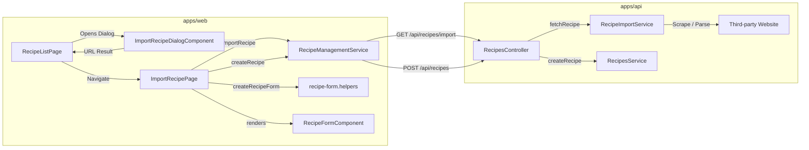

# Requirements

### Overview & Goals
Step 7 completes the Recipe Import feature for Top Nosh. It bridges the existing recipe scraping backend service (`RecipeImportService`) with the frontend user experience by introducing a dedicated `ImportRecipePage`. Users who provide a recipe URL via the import dialog will be navigated to this page where the recipe data is fetched, previewed, and pre-populated into the recipe editor for user review, adjustments, and final creation.

### Scope
#### In Scope
- **API Endpoint**: GET `api/recipes/import` on `RecipesController` accepting a required `recipe-url` query parameter, validating the URL with `URL.canParse`, and delegating to `RecipeImportService.fetchRecipe`.
- **Form Helpers Refactoring**: Extraction of `createStepGroup`, `createIngredientGroup`, `createStageGroup`, and `createRecipeForm` from `recipe-form.component.ts` to `recipe-form.helpers.ts`, replacing `FormBuilder` dependencies with direct `FormGroup`, `FormControl`, and `FormArray` instantiation, and supporting both `RecipeDetails` and `ImportedRecipeResponse`.
- **Payload Extraction**: Implementation of `formToCreateRecipeDto` helper in `recipe-form.helpers.ts` and refactoring `CreateRecipePage.onSubmit` to use it.
- **Service Method**: Adding `importRecipe(recipeUrl: string): Observable<ImportedRecipeResponse>` to `RecipeManagementService`.
- **Import Recipe Page**: Creating `ImportRecipePage` with `url` required route input, fetch loader, error fallback, pre-populated `RecipeFormComponent`, and recipe creation submission flow.
- **Routing & Navigation**: Adding `import/:url` route in `recipes.routes.ts` and wiring `RecipeListPage.onImportRecipe` dialog completion to navigate to the new page.
- **Translations & Tests**: Adding i18n keys for `ImportRecipePage` and writing comprehensive unit tests for all new and modified units.

#### Out of Scope
- Modifying scraping algorithms or HTML parsers in `RecipeImportService`.
- Adding new custom form validation rules for scraped content (existing recipe form validators apply).
- Changes to user authentication or recipe sharing permissions.

### User Stories
- **As a user**, I want to provide a URL from a recipe website so that Top Nosh automatically parses its details, stages, steps, and ingredients.
- **As a user**, I want to review and edit the parsed recipe in a familiar form before saving, ensuring names, quantities, and instructions are accurate.
- **As a user**, I want to see clear loading indicators while the recipe is being scraped, and informative error messages if scraping fails or the URL is invalid.

### Functional Requirements
1. **API Validation & Fetching**:
   - `GET /api/recipes/import?recipe-url=<url>` requires a non-empty `recipe-url`.
   - Returns HTTP 400 (`BadRequestException`) if `recipe-url` is missing or invalid according to `URL.canParse`.
   - On success, returns `ImportedRecipeResponse` containing scraped metadata and stages.
   - On scraping error, throws `BadRequestException` describing the failure.
2. **Form Helpers Refactor**:
   - Functions `createStepGroup`, `createIngredientGroup`, `createStageGroup`, and `createRecipeForm` must reside in `recipe-form.helpers.ts` without `FormBuilder` parameters.
   - `createRecipeForm` must accept `RecipeDetails | ImportedRecipeResponse | null | undefined`.
   - `formToCreateRecipeDto(formValue: unknown): CreateRecipeDto` must convert form values to valid DTOs, trimming text fields and parsing numerical values.
3. **Frontend Import Flow**:
   - `RecipeListPage` opens `ImportRecipeDialogComponent`; upon dialog submit, user is navigated to `/recipes/import/<encodedUrl>`.
   - `ImportRecipePage` reads `url: string` via `input.required<string>()`.
   - Page displays header with title `Import New Recipe` and description indicating the origin URL.
   - Shows spinner loader during fetch; shows error card with retry/back actions if fetch fails.
   - Populates form via `createRecipeForm(importedRecipe)` and presents `RecipeFormComponent`.
   - On submission, calls `RecipeManagementService.createRecipe(payload)`, shows success snackbar, and redirects to `/recipes`. On submission error, displays error snackbar.

# Technical Design

### Current Implementation
- `RecipeImportService` in `apps/api/src/app/recipe-import/` contains full scraping logic (`fetchRecipe`, `fetchRecipeHtmlFromUrl`, schema parsers), currently only exposed via a debug endpoint in `apps/api/src/app/debug/debug.controller.ts`.
- `RecipesController` manages CRUD operations for recipes but lacks an `import` endpoint.
- `apps/web/src/recipes/components/recipe-form/recipe-form.component.ts` houses `createRecipeForm` and group factory functions tightly coupled to `FormBuilder`.
- `CreateRecipePage` manually transforms raw form values to `CreateRecipeDto` inside `onSubmit`.
- `RecipeListPage` has an `Import Recipe` button opening `ImportRecipeDialogComponent`, but the dialog result currently hits a `// TODO` comment.

### Key Decisions
1. **Direct FormGroup/FormControl Instantiation**:
   - *Decision*: Replace `FormBuilder` parameters with direct constructors (`new FormGroup`, `new FormControl`, `new FormArray`) in all form helpers.
   - *Rationale*: Eliminates unnecessary Angular service dependencies from pure helper functions, simplifying testing and usage across components.
2. **Flexible Input Model in `createRecipeForm`**:
   - *Decision*: Type the recipe argument as `RecipeDetails | ImportedRecipeResponse | null | undefined`.
   - *Rationale*: Scraped recipes omit database identifiers (`id`, `createdAt`, `updatedAt`, `recipeId`, `stageId`) and certain properties might be optional. Group builders will handle optional fields gracefully with sensible defaults.
3. **Route Input Binding with Encoded URL**:
   - *Decision*: Register route `{ path: 'import/:url', component: ImportRecipePage, title: 'Import New Recipe' }` before `:id` route, using Angular 19 component input binding (`url = input.required<string>()`).
   - *Rationale*: Prevents `:id` wildcard route collision and leverages Angular's modern signal-based route input bindings.
4. **Lifecycle Execution for Scrape Request**:
   - *Decision*: Execute the import fetch during initialization via `loadRecipe(this.url())` (using an `effect` in the constructor or `ngOnInit` / reactive signal triggers).
   - *Rationale*: Ensures `this.url()` is bound and accessible without throwing `NG0950: Input is required but no value is available yet`, while fulfilling the requirement to trigger the fetch from the page constructor/setup.

### Proposed Changes
#### 1. Backend (`apps/api`)
- In `apps/api/src/app/recipes/recipes.controller.ts`:
  - Inject `RecipeImportService`.
  - Add `@Get('import')` method with `@Query('recipe-url') recipeUrl?: string`.
  - Validate with `URL.canParse(recipeUrl)`.
  - Delegate to `recipeImportService.fetchRecipe(recipeUrl)`.
  - Handle errors and return `ImportedRecipeResponse`.
- In `apps/api/src/app/recipes/recipes.module.ts`:
  - Import `RecipeImportModule` into `RecipesModule` so `RecipeImportService` is available for injection.

#### 2. Web Models & Form Helpers (`apps/web`)
- In `apps/web/src/recipes/models/imported-recipe.types.ts`:
  - Define `ImportedRecipeResponse`, `ImportedRecipeStageResponse`, `ImportedCookingStepResponse`, `ImportedIngredientResponse`.
- In `apps/web/src/recipes/components/recipe-form/recipe-form.helpers.ts`:
  - Implement `createStepGroup`, `createIngredientGroup`, `createStageGroup`, and `createRecipeForm` without `FormBuilder`.
  - Implement `formToCreateRecipeDto(formValue: unknown): CreateRecipeDto`.
- Update references in `RecipeFormComponent`, `CreateRecipePage`, `EditRecipePage`, and specs.

#### 3. Web Service & Routing (`apps/web`)
- In `apps/web/src/recipes/services/recipe-management/recipe-management.service.ts`:
  - Add `readonly importRecipe = (recipeUrl: string): Observable<ImportedRecipeResponse>`.
- In `apps/web/src/recipes/recipes.routes.ts`:
  - Add `{ path: 'import/:url', component: ImportRecipePage, title: 'Import New Recipe' }`.
- In `apps/web/src/recipes/pages/recipe-list/recipe-list.page.ts`:
  - In `onImportRecipe`, navigate to `[ '/recipes/import', encodeURIComponent(result) ]`.

#### 4. Import Recipe Page (`apps/web`)
- Create `apps/web/src/recipes/pages/import-recipe/`:
  - `import-recipe.page.ts`: Component with `url = input.required<string>()`, signals for `isLoading`, `hasError`, `isSubmitting`, and form submission handler.
  - `import-recipe.page.html`: Page header showing origin URL, spinner when loading, error card on failure, and form when loaded.
  - `import-recipe.page.scss`: Styling mirroring `create-recipe.page.scss` and `edit-recipe.page.scss`.
- Add i18n keys under `web.ImportRecipePage` in `apps/web/public/assets/i18n/en.json` and `ru.json`.

### Architecture Diagram

### File Structure
- `apps/api/src/app/recipes/recipes.controller.ts` (modified)
- `apps/api/src/app/recipes/recipes.module.ts` (modified)
- `apps/api/src/app/recipes/recipes.controller.spec.ts` (modified)
- `apps/web/src/recipes/models/imported-recipe.types.ts` (new)
- `apps/web/src/recipes/components/recipe-form/recipe-form.helpers.ts` (new)
- `apps/web/src/recipes/components/recipe-form/recipe-form.helpers.spec.ts` (new)
- `apps/web/src/recipes/components/recipe-form/recipe-form.component.ts` (modified)
- `apps/web/src/recipes/components/recipe-form/recipe-form.component.spec.ts` (modified)
- `apps/web/src/recipes/services/recipe-management/recipe-management.service.ts` (modified)
- `apps/web/src/recipes/services/recipe-management/recipe-management.service.spec.ts` (modified)
- `apps/web/src/recipes/pages/create-recipe/create-recipe.page.ts` (modified)
- `apps/web/src/recipes/pages/create-recipe/create-recipe.page.spec.ts` (modified)
- `apps/web/src/recipes/pages/edit-recipe/edit-recipe.page.ts` (modified)
- `apps/web/src/recipes/pages/edit-recipe/edit-recipe.page.spec.ts` (modified)
- `apps/web/src/recipes/pages/recipe-list/recipe-list.page.ts` (modified)
- `apps/web/src/recipes/pages/import-recipe/import-recipe.page.ts` (new)
- `apps/web/src/recipes/pages/import-recipe/import-recipe.page.html` (new)
- `apps/web/src/recipes/pages/import-recipe/import-recipe.page.scss` (new)
- `apps/web/src/recipes/pages/import-recipe/import-recipe.page.spec.ts` (new)
- `apps/web/src/recipes/recipes.routes.ts` (modified)
- `apps/web/public/assets/i18n/en.json` (modified)
- `apps/web/public/assets/i18n/ru.json` (modified)

# Testing

### Validation Approach
Automated testing using Jest for both NestJS backend controller endpoints and Angular frontend components, services, and helpers. All tests will run under the project's Nx test runner.

### Key Scenarios
1. **API Endpoint (`RecipesController`)**:
   - Successfully calls `RecipeImportService.fetchRecipe` when given a valid URL and returns `ImportedRecipeResponse`.
   - Throws `BadRequestException` when `recipe-url` query param is missing, empty, or invalid according to `URL.canParse`.
   - Throws `BadRequestException` when `RecipeImportService` throws an error during retrieval.
2. **Form Helpers (`recipe-form.helpers`)**:
   - `createRecipeForm` creates valid `FormGroup` structure without `FormBuilder`.
   - `createRecipeForm` correctly populates values when passed `RecipeDetails`.
   - `createRecipeForm` correctly populates values when passed `ImportedRecipeResponse` with partial / optional data.
   - `formToCreateRecipeDto` correctly maps form raw value into a sanitized `CreateRecipeDto` with trimmed strings, numbers, and orders.
3. **RecipeManagementService**:
   - `importRecipe(url)` performs GET request to `/recipes/import` with `recipe-url` parameter and emits response.
4. **ImportRecipePage**:
   - Renders loading spinner while fetching recipe.
   - Displays error card with navigation options if import request fails.
   - Populates recipe form and displays `RecipeFormComponent` when import succeeds.
   - Submits recipe creation payload via `createRecipe`, triggers success snackbar, and navigates to `/recipes`.
   - Displays failure snackbar if creation fails.

### Edge Cases
- Invalid or malformed URL strings passed in path parameter or query parameter.
- Scraped recipes with missing stages, missing steps, or missing ingredient units (defaulting safely to 'GRAMS' and empty arrays).
- Network errors or scraping rejections from third-party sites handled gracefully with error UI rather than blank screens.
- Form submitted while already submitting (prevent duplicate submissions).

# Delivery Steps

### ✓ Step 1: Implement importRecipe API endpoint in RecipesController
The backend API exposes a validated GET `/api/recipes/import` endpoint that delegates recipe scraping to `RecipeImportService`.

- Inject `RecipeImportService` into `RecipesController`.
- Implement `GET import` endpoint accepting `recipe-url` query parameter.
- Validate that the URL is non-empty and passes `URL.canParse()`, throwing `BadRequestException` on invalid or missing URL.
- Delegate fetching to `RecipeImportService.fetchRecipe(recipeUrl)` and return `ImportedRecipeResponse`.
- Catch any retrieval/parsing failures and throw descriptive `BadRequestException`.
- Add unit tests in `recipes.controller.spec.ts` covering success, invalid URLs, and service error propagation.

### ✓ Step 2: Refactor recipe form helper functions and extract payload mapping
Recipe form creation and payload transformation logic are decoupled from Angular form builder and extracted into reusable helpers.

- Create `apps/web/src/recipes/components/recipe-form/recipe-form.helpers.ts`.
- Extract `createStepGroup`, `createIngredientGroup`, `createStageGroup`, and `createRecipeForm`, replacing `FormBuilder` with `FormGroup`, `FormControl`, and `FormArray` constructors.
- Support `ImportedRecipeResponse` alongside `RecipeDetails` in `createRecipeForm` and group builders.
- Implement `formToCreateRecipeDto` in `recipe-form.helpers.ts` to convert recipe form values into `CreateRecipeDto`.
- Refactor `CreateRecipePage`, `EditRecipePage`, `RecipeFormComponent`, and their respective test suites to import and use the new helper functions.
- Create unit tests in `recipe-form.helpers.spec.ts` verifying group creation, form population from both `RecipeDetails` and `ImportedRecipeResponse`, and DTO conversion.

### ✓ Step 3: Add importRecipe method to RecipeManagementService
RecipeManagementService provides a reactive client method to fetch imported recipes from the backend.

- Define `ImportedRecipeResponse` interface and sub-interfaces in `apps/web/src/recipes/models/imported-recipe.types.ts` (or `create-recipe.types.ts`).
- Add `readonly importRecipe = (recipeUrl: string): Observable<ImportedRecipeResponse>` to `RecipeManagementService` using `HttpClient.get` with `recipe-url` query parameter.
- Add unit tests in `recipe-management.service.spec.ts` asserting request URL, query parameters, HTTP method, and response propagation.

### ✓ Step 4: Implement ImportRecipePage and integrate import flow
Users can import recipes via URL, review pre-populated recipe form data, adjust details, and save the imported recipe.

- Create `apps/web/src/recipes/pages/import-recipe/import-recipe.page.ts`, `html`, `scss`, and `spec.ts`.
- Bind `url: string` path parameter with `input.required<string>()` and configure route `import/:url` in `recipes.routes.ts`.
- Update `RecipeListPage.onImportRecipe` to navigate to `/recipes/import/:url` when a valid URL is submitted in `ImportRecipeDialogComponent`.
- Trigger `RecipeManagementService.importRecipe(url)` on initialization; display loading spinner while fetching, and error state if fetching fails.
- On fetch success, initialize form using `createRecipeForm(recipe)` and render `RecipeFormComponent`.
- Handle form submission with `formToCreateRecipeDto`, saving via `RecipeManagementService.createRecipe` and redirecting to `/recipes` with success snackbar notification.
- Add Transloco translation entries for `web.ImportRecipePage` in `en.json` and `ru.json`.
- Add comprehensive unit tests in `import-recipe.page.spec.ts` verifying loading, error, pre-population, and submission flows.