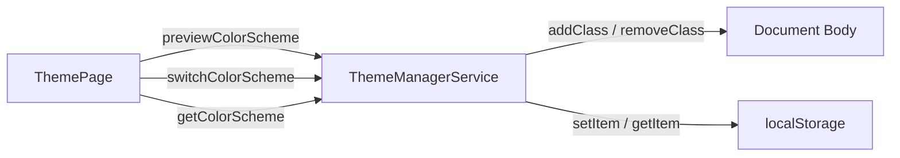

# Requirements

### Overview & Goals
Implement Step 1 of UI Theming for Top Nosh focusing on color scheme preferences (`light-dark`, `light`, and `dark`). This enables users to choose between system default, explicit light, or explicit dark mode on the Theme Settings page, preview their choice in real time, and persist their selection in `localStorage`.

### Scope
- **In Scope:**
  - SCSS styling updates in `libs/ui/src/styles/theming.scss` for `body.light` and `body.dark`.
  - Color scheme management in `ThemeManagerService` using Angular's `DOCUMENT` injection token, RxJS `BehaviorSubject`, and `localStorage`.
  - Live color scheme previewing on the `ThemePage` via `FormControl.valueChanges`.
  - Persisting the selected color scheme on `ThemePage.onSubmit()`.
  - Unit tests for `ThemeManagerService` and `ThemePage`.
- **Out of Scope:**
  - Custom palette theming (Step 2+).
  - Backend user preference synchronization.

### User Stories
- As a user, I want to select between System (`light-dark`), Light, and Dark color schemes so that the UI matches my visual preference.
- As a user, I want to preview color scheme changes immediately upon selection before deciding to save.
- As a user, I want my saved color scheme choice to persist across browser reloads.

### Functional Requirements
1. **SCSS Body Classes:**
   - Base `body` maintains `color-scheme: light dark;`.
   - `body.light` sets `color-scheme: light;`.
   - `body.dark` sets `color-scheme: dark;`.
2. **ThemeManagerService:**
   - Injects `DOCUMENT` to toggle body CSS classes safely across platforms.
   - Holds the current scheme in a `BehaviorSubject<ColorScheme>`.
   - Reads previously saved scheme from `localStorage` on service initialization (defaults to `'light-dark'`).
   - `switchColorScheme(scheme: ColorScheme)` toggles body classes, updates the subject, and persists to `localStorage`.
   - `previewColorScheme(scheme: ColorScheme)` toggles body classes only (no subject update, no storage write).
   - `resetPreview()` restores the body classes to the current subject value.
   - `getColorScheme()` exposes an `Observable<ColorScheme>`.
3. **ThemePage Integration:**
   - Initializes `colorScheme` FormControl with the value from `ThemeManagerService`.
   - Previews the scheme on `colorScheme.valueChanges`.
   - Persists the scheme via `ThemeManagerService.switchColorScheme()` on form submission.
   - Resets any unsaved preview on component destruction.

# Technical Design

### Current Implementation
- `libs/ui/src/styles/theming.scss`: Defines the Angular Material M3 theme and base `body` styles with `color-scheme: light dark;`.
- `apps/web/src/settings/services/theme-manager/theme-manager.types.ts`: Defines `allColorSchemes = ['light-dark', 'light', 'dark'] as const` and `ColorScheme` type.
- `apps/web/src/settings/services/theme-manager/theme-manager.service.ts`: Empty stub service with `@Injectable({ providedIn: 'root' })`.
- `apps/web/src/settings/pages/theme/theme.page.ts`: Reactive form with `colorScheme` control defaulting to `'light-dark'`; `onSubmit` currently only navigates to `/settings`.

### Key Decisions
- **`DOCUMENT` Token:** Use `@angular/common` `DOCUMENT` token rather than global `window.document` to follow Angular best practices.
- **Body Class Management:** Remove any existing scheme classes (`'light'`, `'dark'`) and apply the new class if `scheme === 'light'` or `scheme === 'dark'`.
- **Reactive State & Persistence:** Use `BehaviorSubject<ColorScheme>` for the active theme state, writing to `localStorage` when switching themes.
- **Preview Lifecycle:** Reset preview on component destroy to ensure leaving without saving does not leave a dirty preview applied.

### Data Models / Contracts
```typescript
export const THEME_COLOR_SCHEME_STORAGE_KEY = 'top-nosh-color-scheme';

export interface IThemeManagerService {
  getColorScheme(): Observable<ColorScheme>;
  switchColorScheme(scheme: ColorScheme): void;
  previewColorScheme(scheme: ColorScheme): void;
  resetPreview(): void;
}
```

### Architecture Diagram


### Proposed Changes

#### 1. `libs/ui/src/styles/theming.scss`
Add body modifier classes:
```scss
body {
  color-scheme: light dark;
  background-color: var(--mat-sys-surface);
  color: var(--mat-sys-on-surface);
  font: var(--mat-sys-body-medium);

  &.light {
    color-scheme: light;
  }

  &.dark {
    color-scheme: dark;
  }
}
```

#### 2. `apps/web/src/settings/services/theme-manager/theme-manager.service.ts`
Implement `ThemeManagerService`:
- Inject `DOCUMENT`.
- Methods: `getColorScheme()`, `switchColorScheme()`, `previewColorScheme()`, `resetPreview()`.
- Helper `applyBodyClass(scheme: ColorScheme)` toggling `body.classList`.
- On service creation, read stored scheme and apply to `body`.

#### 3. `apps/web/src/settings/pages/theme/theme.page.ts`
- Inject `ThemeManagerService` and `DestroyRef`.
- Sync initial form value from `themeManager.getColorScheme()`.
- Subscribe to `colorScheme.valueChanges` with `takeUntilDestroyed` -> `themeManager.previewColorScheme(value)`.
- Update `onSubmit` -> `themeManager.switchColorScheme(this.colorScheme.value); this.router.navigate(['/settings']);`.
- On destroy, `themeManager.resetPreview()`.

### File Structure
- `libs/ui/src/styles/theming.scss` *(modified)*
- `apps/web/src/settings/services/theme-manager/theme-manager.service.ts` *(modified)*
- `apps/web/src/settings/services/theme-manager/theme-manager.service.spec.ts` *(modified)*
- `apps/web/src/settings/pages/theme/theme.page.ts` *(modified)*
- `apps/web/src/settings/pages/theme/theme.page.spec.ts` *(modified)*

# Testing

### Validation Approach
Verify functionality through Angular unit tests using Vitest/Jest and TestBed.

### Key Scenarios
1. **Initial Scheme Loading & Application:**
   - When no scheme is saved in `localStorage`, default to `'light-dark'` and remove any scheme body classes.
   - When `'dark'` (or `'light'`) is stored in `localStorage`, service initializes with `'dark'` and adds `dark` class to `document.body`.
2. **Switching Color Scheme:**
   - Calling `switchColorScheme('dark')` updates `getColorScheme()` emission, adds `dark` class to body, and sets `localStorage`.
   - Calling `switchColorScheme('light-dark')` clears `light`/`dark` body classes and updates storage.
3. **Previewing Color Scheme:**
   - Calling `previewColorScheme('light')` adds `light` class to body.
   - Does NOT change `getColorScheme()` emission and does NOT modify `localStorage`.
4. **Resetting Preview:**
   - Calling `resetPreview()` restores body classes according to the current value of `getColorScheme()`.
5. **ThemePage Integration:**
   - Form initializes with the current scheme from `ThemeManagerService`.
   - Changing the `colorScheme` dropdown calls `previewColorScheme`.
   - Submitting the form calls `switchColorScheme` with the selected value and navigates to `/settings`.
   - Destroying the component resets preview.

# Delivery Steps

### ✓ Step 1: Update SCSS theming for light and dark color schemes
Update `libs/ui/src/styles/theming.scss` to support `light` and `dark` color scheme classes on the `body` selector.

- Add `&.light` selector under `body` with `color-scheme: light;`.
- Add `&.dark` selector under `body` with `color-scheme: dark;`.
- Ensure base `body` retains default `color-scheme: light dark;`.

### ✓ Step 2: Implement ThemeManagerService with persistence and preview support
Implement `ThemeManagerService` to manage, preview, apply, and persist colour scheme preferences.

- Inject Angular's `DOCUMENT` token to manipulate body classes.
- Define a storage key constant for local storage persistence (`top-nosh-color-scheme`).
- Implement private `BehaviorSubject<ColorScheme>` initialized from `localStorage` (defaulting to `'light-dark'`).
- Implement method to apply body classes (`light`, `dark`, or none for `light-dark`).
- Implement `switchColorScheme(scheme: ColorScheme): void` to update the subject, persist to `localStorage`, and update body classes.
- Implement `previewColorScheme(scheme: ColorScheme): void` to update body classes without mutating the subject or saving to `localStorage`.
- Implement `resetPreview(): void` to restore the active subject scheme to the body element.
- Implement `getColorScheme(): Observable<ColorScheme>` to expose the current scheme as an `Observable`.
- Add unit tests in `theme-manager.service.spec.ts` verifying startup loading, switching, previewing, resetting, and observable emission.

### ✓ Step 3: Integrate ThemePage with ThemeManagerService and add component tests
Connect `ThemePage` form controls and submit handler to `ThemeManagerService`.

- Inject `ThemeManagerService` and `DestroyRef` into `ThemePage`.
- Initialize `colorScheme` FormControl with the currently selected scheme from `ThemeManagerService`.
- Subscribe to `colorScheme.valueChanges` using `takeUntilDestroyed` to call `themeManager.previewColorScheme(...)` on selection change.
- In `onSubmit()`, call `themeManager.switchColorScheme(...)` with the chosen color scheme before navigating back to `/settings`.
- Reset preview on component destruction if changes were not saved.
- Update `ThemePage` unit tests in `theme.page.spec.ts` covering initial value binding, previewing on valueChanges, and persisting on submit.