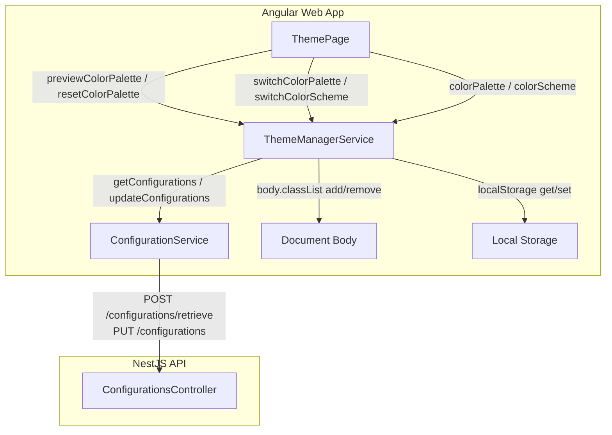

# Requirements

### Overview & Goals
Implement Step 2 of the UI theming feature, adding support for user-selectable Material 3 color palettes. When the app loads, `ThemeManagerService` retrieves the active palette from the backend Configurations API and applies it to the app. Users can visit the Theme Settings page to preview any of the 12 available color palettes in real time and persist their choice to the API for all users.

### Scope
- **In Scope:**
  - Register configuration key `ui.theme.palette` in `libs/config/src/config-meta/repository.ts`.
  - SCSS styling updates in `libs/ui/src/styles/theming.scss` defining Material 3 themes for all 12 palettes on `body`.
  - Palette state management, previewing, and API persistence in `ThemeManagerService` using `ConfigurationService`.
  - Palette dropdown binding, live previewing on `valueChanges`, and API persistence on submit in `ThemePage`.
  - Unit tests for configuration repository, `ThemeManagerService`, and `ThemePage`.
- **Out of Scope:**
  - Custom user-uploaded palettes or arbitrary hex color pickers.
  - Per-user palette storage (palettes are system-wide configurations stored via API; per-user preference is for color schemes only).

### User Stories
- As an administrator/user, I want to view the currently configured color palette on the Theme Settings page so that I know which palette is currently active.
- As a user, I want to preview different color palettes in real time as I select them in the dropdown before saving.
- As a user, I want my palette preview to reset if I navigate away without saving.
- As an administrator, I want to save the selected color palette so that it is persisted via the API and applied across the application.

### Functional Requirements
1. **Configuration Key:**
   - Key: `ui.theme.palette`
   - Type: `string`
   - Translation key: `uiThemePalette`
2. **Palette Styles in SCSS:**
   - Define styles for all 12 palettes (`chartreuse`, `red`, `green`, `blue`, `yellow`, `cyan`, `magenta`, `orange`, `spring-green`, `azure`, `violet`, `rose`) via `@include mat.theme((color: ...))` applied when the corresponding class is on `body`.
3. **ThemeManagerService:**
   - Stores current palette in `colorPalette$` (`BehaviorSubject<Palette>`, default `'chartreuse'`).
   - On initialization, loads `ui.theme.palette` via `ConfigurationService.getConfigurations(['ui.theme.palette'])` and applies it.
   - `colorPalette()` exposes `Observable<Palette>`.
   - `previewColorPalette(palette: Palette)` applies the palette class to `document.body` without changing `colorPalette$` or sending an API request.
   - `resetColorPalette()` restores `document.body` classes to the active `colorPalette$` value.
   - `switchColorPalette(palette: Palette)` saves the palette via `ConfigurationService.updateConfigurations({ 'ui.theme.palette': palette })`, updates `colorPalette$`, and applies the class.
4. **ThemePage Integration:**
   - Initializes `palette` FormControl from `ThemeManagerService.colorPalette()`.
   - Subscribes to `palette.valueChanges` to trigger `previewColorPalette()`.
   - In `onSubmit()`, saves both color scheme and color palette, manages `isSubmitting` / `hasError` states, and navigates to `/settings`.
   - Resets uncommitted palette and color scheme previews on destroy.

# Technical Design

### Current Implementation
- `libs/config/src/config-meta/repository.ts`: Lists known configuration entries. `ui.theme.palette` is not yet registered.
- `libs/ui/src/styles/theming.scss`: Defines the default `html` Material 3 theme (`mat.$chartreuse-palette`) and body classes for `.light` and `.dark`.
- `apps/web/src/settings/services/theme-manager/theme-manager.types.ts`: Defines `allPalettes`, `Palette`, and `availablePalettes()`.
- `apps/web/src/settings/services/theme-manager/theme-manager.service.ts`: Handles `colorScheme` with `BehaviorSubject`, `localStorage`, and `DOCUMENT` body classes. Does not yet manage palettes or communicate with `ConfigurationService`.
- `apps/web/src/system/services/configuration/configuration.service.ts`: Angular service providing `getConfigurations(keys)` and `updateConfigurations(values)` against `/configurations/retrieve` and `/configurations`.
- `apps/web/src/settings/pages/theme/theme.page.ts`: Has `palette` FormControl and template dropdown, but lacks palette binding, preview, and save handling.

### Key Decisions
- **Reuse `ConfigurationService`:** Utilize the existing `ConfigurationService` in `apps/web/src/system/services/configuration/configuration.service.ts` to interact with `ConfigurationsController` endpoints (`/configurations/retrieve` and `/configurations`).
- **Body Class Palette Switching:** Apply palette class names directly to `document.body.classList` (e.g. `body.red`, `body.blue`, etc.), mirroring the pattern used for color schemes (`body.light`, `body.dark`).
- **Fallback to Default:** If the API returns no value or an unrecognized palette string, default gracefully to `'chartreuse'`.
- **Atomic Preview & Reset Lifecycle:** Keep preview independent of state subjects, and cleanly reset both color scheme and palette previews on component destroy.

### Architecture Diagram


### Data Models / Contracts
```typescript
export const UI_THEME_PALETTE_CONFIG_KEY = 'ui.theme.palette';
```

### Proposed Changes

#### 1. Configuration Metadata
- **`libs/config/src/config-meta/repository.ts`**:
  - Add `{ key: 'ui.theme.palette', translationKey: 'uiThemePalette', type: 'string' }`.
- **`libs/config/src/config-meta/repository.spec.ts`**:
  - Update tests to expect 10 entries and include `ui.theme.palette`.

#### 2. SCSS Theming
- **`libs/ui/src/styles/theming.scss`**:
  - Define a map of all Angular Material palettes:
    ```scss
    $palettes: (
      'chartreuse': mat.$chartreuse-palette,
      'red': mat.$red-palette,
      'green': mat.$green-palette,
      'blue': mat.$blue-palette,
      'yellow': mat.$yellow-palette,
      'cyan': mat.$cyan-palette,
      'magenta': mat.$magenta-palette,
      'orange': mat.$orange-palette,
      'spring-green': mat.$spring-green-palette,
      'azure': mat.$azure-palette,
      'violet': mat.$violet-palette,
      'rose': mat.$rose-palette,
    );

    @each $name, $palette in $palettes {
      body.#{$name} {
        @include mat.theme((
          color: $palette,
        ));
      }
    }
    ```

#### 3. ThemeManagerService
- **`apps/web/src/settings/services/theme-manager/theme-manager.service.ts`**:
  - Inject `ConfigurationService`.
  - Add `private readonly colorPalette$ = new BehaviorSubject<Palette>('chartreuse')`.
  - In constructor / initialization, call `this.configurationService.getConfigurations(['ui.theme.palette'])` and update `colorPalette$` if valid.
  - Implement `colorPalette(): Observable<Palette>`.
  - Implement `applyColorPalette(palette: Palette): void` removing any previous palette class and adding the new one.
  - Implement `previewColorPalette(palette: Palette): void` applying the class to `document.body`.
  - Implement `resetColorPalette(): void` restoring the class from `colorPalette$`.
  - Implement `switchColorPalette(palette: Palette): Observable<ConfigurationValuesMap>` calling `updateConfigurations({ 'ui.theme.palette': palette })`, emitting the new palette on `colorPalette$`, and applying it.

#### 4. ThemePage
- **`apps/web/src/settings/pages/theme/theme.page.ts`**:
  - In constructor, subscribe to `themeManager.colorPalette()` to set `palette` FormControl initial value without emitting events.
  - Subscribe to `palette.valueChanges` with `takeUntilDestroyed()` to call `themeManager.previewColorPalette(value)`.
  - Update `destroyRef.onDestroy()` to call both `resetColorScheme()` and `resetColorPalette()`.
  - In `onSubmit()`, update `isSubmitting` signal, save `colorScheme`, call `switchColorPalette()`, and navigate on success or set `hasError` on failure.

### File Structure
- `libs/config/src/config-meta/repository.ts` *(modified)*
- `libs/config/src/config-meta/repository.spec.ts` *(modified)*
- `libs/ui/src/styles/theming.scss` *(modified)*
- `apps/web/src/settings/services/theme-manager/theme-manager.service.ts` *(modified)*
- `apps/web/src/settings/services/theme-manager/theme-manager.service.spec.ts` *(modified)*
- `apps/web/src/settings/pages/theme/theme.page.ts` *(modified)*
- `apps/web/src/settings/pages/theme/theme.page.spec.ts` *(modified)*

### Risks & Mitigations
- **Network Latency or Failure on Startup:** If the configuration API call fails or times out when fetching the palette, `ThemeManagerService` falls back gracefully to `'chartreuse'`, ensuring the application remains styled and functional.
- **Form Submission Error Handling:** If saving the palette to the API fails during `onSubmit`, the UI reflects the error via `hasError` signal and resets `isSubmitting` so the user can retry.

# Testing

### Validation Approach
Verification will be performed using Jest unit tests for the configuration metadata, `ThemeManagerService`, and `ThemePage` components.

### Key Scenarios
1. **Configuration Key Registration (`repository.spec.ts`):**
   - Verify `configEntriesRepository()` returns all 10 entries including `ui.theme.palette`.
   - Verify unique keys and valid metadata types (`string`).
2. **Palette Initial Loading (`theme-manager.service.spec.ts`):**
   - Verify service requests `ui.theme.palette` from `ConfigurationService` on init.
   - Verify valid palette response (e.g. `'cyan'`) updates `colorPalette$` emission and adds `cyan` class to `document.body`.
   - Verify null/invalid response falls back to `'chartreuse'` and adds `chartreuse` class.
3. **Palette Switching & Persistence (`theme-manager.service.spec.ts`):**
   - Verify `switchColorPalette('rose')` calls `ConfigurationService.updateConfigurations({ 'ui.theme.palette': 'rose' })`.
   - Verify body class updates to `rose` and old palette classes are removed.
   - Verify `colorPalette()` emits `'rose'`.
4. **Palette Preview & Reset (`theme-manager.service.spec.ts`):**
   - Verify `previewColorPalette('violet')` updates body class without mutating `colorPalette$` or calling `updateConfigurations`.
   - Verify `resetColorPalette()` restores body class to the current active `colorPalette$` value.
5. **ThemePage Integration (`theme.page.spec.ts`):**
   - Verify `palette` form control initializes with current palette from `ThemeManagerService`.
   - Verify changing `palette` select triggers `previewColorPalette`.
   - Verify submitting form triggers `switchColorScheme` and `switchColorPalette`, and navigates to `/settings`.
   - Verify destroying `ThemePage` calls `resetColorPalette` and `resetColorScheme`.

# Delivery Steps

### ✓ Step 1: Register configuration key and define SCSS palette styles
Configure the backend/shared metadata for the new palette configuration and define SCSS theme rules for all supported palettes.

- Add `{ key: 'ui.theme.palette', translationKey: 'uiThemePalette', type: 'string' }` to `configEntriesRepository()` in `libs/config/src/config-meta/repository.ts`.
- Update unit tests in `libs/config/src/config-meta/repository.spec.ts` to expect 10 configuration entries including `ui.theme.palette`.
- Update `libs/ui/src/styles/theming.scss` with a palette map and `@each` loop to generate `@include mat.theme((color: ...))` for each palette class on `body` (e.g., `body.red`, `body.blue`, etc.).

### ✓ Step 2: Implement palette management and API persistence in ThemeManagerService
Implement API-backed palette management, previewing, and application logic within `ThemeManagerService`.

- Inject `ConfigurationService` into `ThemeManagerService` to fetch and update `ui.theme.palette` from the configurations API endpoints (`/configurations/retrieve` and `/configurations`).
- Add a private `colorPalette$` BehaviorSubject defaulting to `'chartreuse'`.
- Implement `colorPalette(): Observable<Palette>` to expose the current active palette.
- Implement `applyColorPalette(palette: Palette): void` to toggle palette class names on `document.body.classList`.
- Implement initial loading of `ui.theme.palette` via `ConfigurationService.getConfigurations(['ui.theme.palette'])` on service startup.
- Implement `previewColorPalette(palette: Palette): void` to update body classes without mutating state or making API requests.
- Implement `resetColorPalette(): void` to restore body classes back to the active `colorPalette$` value.
- Implement `switchColorPalette(palette: Palette): Observable<ConfigurationValuesMap>` to save the palette through `ConfigurationService.updateConfigurations`, update `colorPalette$`, and apply the new palette.
- Add unit tests in `apps/web/src/settings/services/theme-manager/theme-manager.service.spec.ts` testing palette loading, previewing, resetting, saving, and body class manipulation.

### ✓ Step 3: Integrate palette selection and submission into ThemePage
Connect the palette selection form control, live preview, and form submission in `ThemePage`.

- In `ThemePage` (`apps/web/src/settings/pages/theme/theme.page.ts`), subscribe to `themeManager.colorPalette()` with `take(1)` to initialize the `palette` form control.
- Subscribe to `palette.valueChanges` with `takeUntilDestroyed()` to call `themeManager.previewColorPalette(...)` whenever the user picks a palette.
- In `destroyRef.onDestroy()`, call `themeManager.resetColorPalette()` alongside `resetColorScheme()` to ensure uncommitted previews are reverted when leaving the page.
- Update `onSubmit()` to handle both `switchColorScheme` and `switchColorPalette`, managing `isSubmitting` and `hasError` signals and navigating back to `/settings` upon success.
- Update `ThemePage` unit tests in `apps/web/src/settings/pages/theme/theme.page.spec.ts` covering initial form binding, value change previewing, form submission saving, and reset on component destroy.